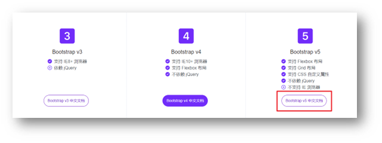

# Bootstrap

+ Twitter开发
+ CSS样式库

中文官网: <https://www.bootcss.com/> 

## 使用步骤

### 下载

下载：Bootstrap V5中文文档 → 进入中文文档 → 下载 →下载 Bootstrap 生产文件



### 使用步骤

1. 引入 Bootstrap CSS 文件

```html
<link rel="stylesheet" href="./Bootstrap/css/bootstrap.min.css">
```

2. 调用类名： container 响应式布局版心类

```html
<div class="container">测试</div>
```

### 栅格系统

作用：响应式布局

栅格化是指将整个网页的宽度分成12等份，每个盒子占用的对应的份数

例如：一行排4个盒子，则每个盒子占 3份 即可（12 / 4 = 3）


+ row 类：行，可以让内容在一行排（flex布局）

示例：

```html
<div class="container">
  <div class="row">
    <div class="col-lg-3 col-md-6 col-sm-12">1</div>
    <div class="col-lg-3 col-md-6 col-sm-12">2</div>
    <div class="col-lg-3 col-md-6 col-sm-12">3</div>
    <div class="col-lg-3 col-md-6 col-sm-12">4</div>
  </div>
</div>
```

### 全局样式

#### 按钮


类名

* btn：默认样式
* btn-success：成功
* btn-warning：警告
* ……
* 按钮尺寸：btn-lg / btn-sm

示例：

```html
<button class="btn btn-success btn-sm">按钮1</button>
<button class="btn btn-warning btn-lg">按钮2</button>
```


#### 表格


表格类：

* table：默认样式
* table-striped：隔行变色
* table-success：表格颜色
* ……

示例：

```html
<table class="table table-striped table-hover">
  <tr class="table-success">
    <th>姓名</th>
    <th>年龄</th>
    <th>性别</th>
  </tr>
  <tr>
    <td>张三</td>
    <td>18</td>
    <td>男</td>
  </tr>
  <tr>
    <td>李四</td>
    <td>20</td>
    <td>女</td>
  </tr>
  <tr>
    <td>王五</td>
    <td>18</td>
    <td>男</td>
  </tr>
  <tr>
    <td>赵六</td>
    <td>20</td>
    <td>女</td>
  </tr>
</table>
```

### 组件

1.引入样式表

2.引入 js 文件

3.复制结构，修改内容

示例：

```html
<!-- 导航 -->
<nav class="navbar navbar-expand-lg bg-body-tertiary">
  <div class="container-fluid">
    <a class="navbar-brand" href="#">Navbar</a>
    <button
            class="navbar-toggler"
            type="button"
            data-bs-toggle="collapse"
            data-bs-target="#navbarNav"
            aria-controls="navbarNav"
            aria-expanded="false"
            aria-label="Toggle navigation"
            >
      <span class="navbar-toggler-icon"></span>
    </button>
    <div class="collapse navbar-collapse" id="navbarNav">
      <ul class="navbar-nav">
        <li class="nav-item">
          <a class="nav-link active" aria-current="page" href="#">首页</a>
        </li>
        <li class="nav-item">
          <a class="nav-link" href="#">课程</a>
        </li>
        <li class="nav-item">
          <a class="nav-link" href="#">课程资料</a>
        </li>
      </ul>
    </div>
  </div>
</nav>

<!-- 轮播图 -->
<div id="carouselExampleIndicators" class="carousel slide">
  <div class="carousel-indicators">
    <button
            type="button"
            data-bs-target="#carouselExampleIndicators"
            data-bs-slide-to="0"
            class="active"
            aria-current="true"
            aria-label="Slide 1"
            ></button>
    <button
            type="button"
            data-bs-target="#carouselExampleIndicators"
            data-bs-slide-to="1"
            aria-label="Slide 2"
            ></button>
    <button
            type="button"
            data-bs-target="#carouselExampleIndicators"
            data-bs-slide-to="2"
            aria-label="Slide 3"
            ></button>
    <button
            type="button"
            data-bs-target="#carouselExampleIndicators"
            data-bs-slide-to="3"
            aria-label="Slide 4"
            ></button>
  </div>
  <div class="carousel-inner">
    <div class="carousel-item active">
      
    </div>
    <div class="carousel-item">
      
    </div>
    <div class="carousel-item">
      
    </div>
    <div class="carousel-item">
      
    </div>
  </div>
  <button
          class="carousel-control-prev"
          type="button"
          data-bs-target="#carouselExampleIndicators"
          data-bs-slide="prev"
          >
    <span class="carousel-control-prev-icon" aria-hidden="true"></span>
    <span class="visually-hidden">Previous</span>
  </button>
  <button
          class="carousel-control-next"
          type="button"
          data-bs-target="#carouselExampleIndicators"
          data-bs-slide="next"
          >
    <span class="carousel-control-next-icon" aria-hidden="true"></span>
    <span class="visually-hidden">Next</span>
  </button>
</div>
<script src="./Bootstrap/js/bootstrap.min.js"></script>
```

### 字体图标

#### 下载

导航 / Extend：图标库 → 安装 → 下载安装包 → [bootstrap-icons-1.X.X.zip](https://github.com/twbs/icons/releases/download/v1.10.3/bootstrap-icons-1.10.3.zip)

#### 使用

1. 复制 fonts 文件夹到项目目录
2. 网页引入 bootstrap-icons.css 文件
3. 调用 CSS 类名（图标对应的类名）

示例：

```html
<head>    
  <link rel="stylesheet" href="./Bootstrap/font/bootstrap-icons.css" />
  <style>
    .bi-android2 {
      font-size: 100px;
      color: green;
    }
  </style>
</head>
<body>
  <span class="bi-android2"></span>
</body>
```

