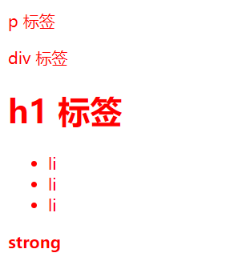
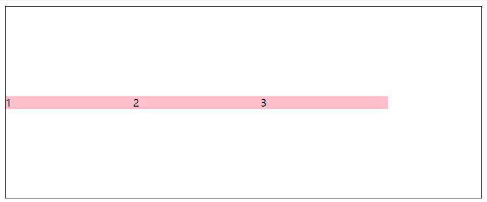
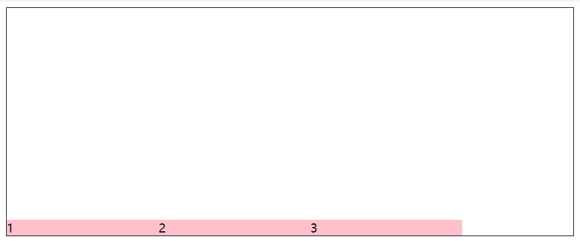
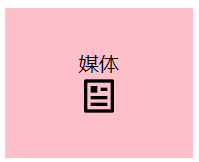
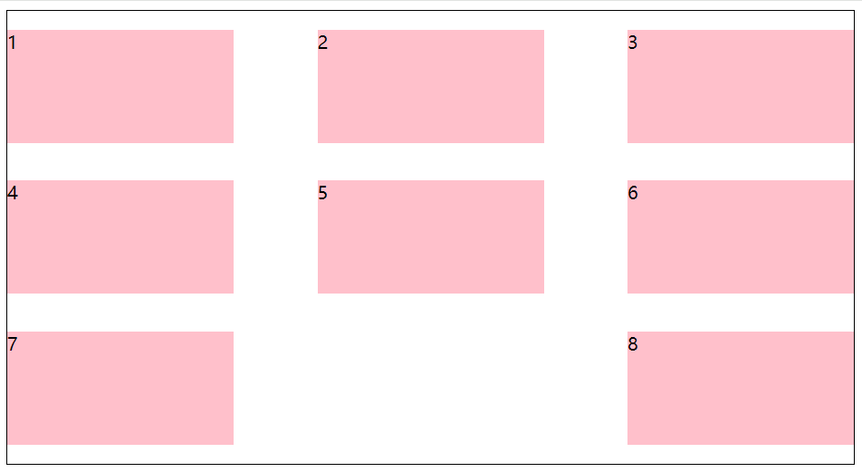

# CSS

## 一、引入方式

### 内部样式表

CSS代码写在 style 标签里面

### 外部样式表

1. CSS代码写在单独的CSS文件里面 `.css` 
2. 在HTML使用 `link` 标签引入

```html
<link rel="stylesheet" href="./my.css">
```

### 行内样式

CSS写在标签的style属性值里

```html
<div style="color: red; font-size=20px;">
  这是 div 标签
</div>
```

## 二、选择器

### 基础选择器

+ 标签选择器
+ 类选择器
+ id 选择器
+ 通配符选择器

### 标签选择器

使用标签名作为选择器

```html
<head>
  <style>
    p {
      color: red;
    }
  </style>
</head>
<body>
  <h3>三级标题</h3>
  <p>标签选择器</p>
  <p>111</p>
  <p>222</p>
</body>
```


### 类选择器

一般用 `.类名` 

```html
<head>
  <style>
    .red {
      color: red;
    }
    .size {
      font-size: 50px;
    }
  </style>
</head>
<body>
  <p class="red">类名red</p>
  <p>111</p>
  <div class="red size">div标签</div>
</body>
```


### id选择器

一般配合JavaScript使用，很少用来设置CSS样式

一般是用 `#id` 

```html
<head>
  <style>
    #red {
      color: red;
    }
  </style>
</head>
<body>
  <div id="red">
    div 标签
  </div>
</body>
```


### 通配符选择器

将页面所有标签设置相同样式

```html
<head>
  <style>
    * {
      color: red;
    }
  </style>
</head>
<body>
  <p>p 标签</p>
  <div>div 标签</div>
  <h1>h1 标签</h1>
  <ul>
    <li>li</li>
    <li>li</li>
    <li>li</li>
  </ul>
  <strong>strong</strong>
</body>
```



::: info 小提示

可以用通配符选择器清除标签的默认样式。

```html
* {
	margin: 0;
	padding: 0;
}
```

:::

## 三、文字控制属性

+ 字体大小：`font-size` 
+ 字体粗细：`font-weight` 
+ 字体倾斜：`font-style` 
+ 行高：`line-height`
+ 字体族：`font-family` 
+ 字体复合属性：`font` 
+ 文本缩进：`text-indent` 
+ 文本对齐：`text-align` 
+ 修饰线：`text-decoration` 

```html
<body>
  <style>
    .size {
      font-size: 30px;
    }
    .weight {
      font-weight: 900;
    }
    .fontStyle {
      font-style: italic;
    }
    .lineHeight {
      line-height: 30px;
      color: white;
      background-color: blue;
    }
    .family {
      font-family: 楷体;
    }
    .font {
      /* font: 是否倾斜  是否加粗  字号/行高  字体; */
      font: italic 700 30px/2 楷体;
    }
    .indent {
      text-indent: 2em;
    }
    .align {
      background-color: blue;
      color: white;
    }
    .left {
      text-align: left;
    }
    .center {
      text-align: center;
    }
    .right {
      text-align: right;
    }
    .underline {
      text-decoration: underline;
    }
    .lineThrough {
      text-decoration: line-through;
    }
    .overline {
      text-decoration: overline;
    }
    .keyWord {
      color: burlywood;
    }
    .rgb {
      color: rgb(173, 43, 78);
    }
    .rgba {
      color: rgba(133, 159, 124, 0.6);
    }
    .hex {
      color: #778899;
    }
  </style>
</body>
<body>
  <div class="size">字体大小</div>
  <div class="weight">字体粗细</div>
  <div class="fontStyle">字体倾斜</div>
  <div class="lineHeight">行高</div>
  <div class="family">字体族</div>
  <div class="font">font属性</div>
  <div class="indent">文本缩进</div>
  <div class="align">
    <div class="left">文本对齐居左</div>
    <div class="center">文本对齐居中</div>
    <div class="right">文本对齐居右</div>
  </div>
  <div class="decoration">
    <div class="none">文字</div>
    <div class="underline">文字</div>
    <div class="lineThrough">文字</div>
    <div class="overline">文字</div>
  </div>
  <div class="fontColor">
    <div class="keyWord">关键字</div>
    <div class="rgb">RGB</div>
    <div class="rgba">RGBA</div>
    <div class="hex">16进制</div>
  </div>
</body>
```


## 四、复合选择器

由两个或多个基础选择器，通过不同方式组合而成。

### 后代选择器

选中某个元素后代的元素

**语法：**

```html
父选择器 子选择器 {
	CSS 属性
}
```

**示例：**

```html
<head>
  <style>
    div span {
      color: red;
    }
  </style>
</head>
<body>
  <span>span 标签</span>
	<div>
    <span>这是div的儿子</span>
    <p>
      <span>孙子span</span>
    </p>
  </div>
</body>
```


### 子代选择器

选中某元素的子代元素

**语法：**

```html
父选择器 > 子选择器 {
	CSS 属性
}
```

**示例：**

```html
<head>
  <style>
    div > span {
      color: red;
    }
  </style>
</head>
<body>
  <div>
    <span>儿子 span</span>
    <p>
      <span>孙子 span</span>
    </p>
  </div>
</body>
```


### 并集选择器

选中多组标签设置相同的样式

**语法：**

```html
选择器1, 选择器2, ..., 选择器N {
	CSS 属性
}
```

**示例：**

```html
<head>
  <style>
  	div,
    p,
    spaan {
      color: red;
    }
  </style>
</head>
<body>
  <div>div 标签</div>
  <p>p 标签</p>
  <span>span 标签</span>
</body>
```


### 交集选择器

选中同时满足多个条件的元素

**语法：**

```html
选择器1选择器2 {
	CSS 属性
}
```

**示例：**

```html
<head>
  <style>
    p.box {
      color: red;
    }
  </style>
</head>
<body>
  <p class="box">p 标签，使用了类选择器 box</p>
  <p>p 标签</p>
  <div class="box">div 标签，使用了类选择器</div>
</body>
```


### 伪类选择器

伪类表示元素状态，选中元素的某个状态设置样式

**语法：**

```html
选择器:伪类 {
	CSS 属性
}
```

**示例：**

```html
<head>
  <style>
    a:hover {
      color: red;
    }
    .box:hover {
      color: green;
    }
  </style>
</head>
<body>
  <a href="#">a 标签，超链接</a>
  <div class="box">div 标签</div>
</body>
```


伪类超链接有四个状态

| 选择器   | 作用         |
| -------- | ------------ |
| :link    | 访问前       |
| :visited | 访问后       |
| :hover   | 鼠标悬停     |
| :active  | 点击时(激活) |

如果要给超链接设置以上四个状态，需要按照 **LVHA** 的顺序书写

**示例：**

```html
<head>
  <style>
    .link:link {
      color: red;
    }

    .visited:visited {
      color: green;
    }

    .hover:hover {
      color: blue;
    }

    .active:active {
      color: orange;
    }
  </style>
</head>
<body>
  <a href="#" class="link">a 标签，测试伪类</a>
  <br />
  <a href="#" class="visited">a 标签，测试伪类</a>
  <br />
  <a href="#" class="hover">a 标签，测试伪类</a>
  <br />
  <a href="#" class="active">a 标签，测试伪类</a>
</body>
```


## 五、CSS特性

有三种特性：

+ 继承性
+ 层叠行
+ 优先级

### 继承性

子级默认继承父级的文字控制属性，如果标签有默认文字样式则会继承失败。

**示例：**

```html
<head>
  <style>
    body {
      font-size: 30px;
      color: red;
      font-weight: 700;
    }
  </style>
</head>
<body>
    <div>div 标签</div>
    <p>p 标签</p>
    <span>span 标签</span>

    <!-- 如果标签自己有样式则生效自己的样式，不继承 -->
    <a href="#">a 标签</a>
    <h1>h1 标签</h1>
</body>
```


### 层叠性

+ 相同的属性会覆盖：后面的CSS属性覆盖前面的CSS属性
+ 不同的属性会叠加：不同的CSS属性都生效

**示例：**

```html
<head>
  <style>
    div {
      color: green;
      font-size: 30px;
    }
    div {
      color: red;
      font-weight: 700;
    }
  </style>
</head>
<body>
  <div>
    div 标签
  </div>
</body>
```


### 优先级

权重，当一个标签使用了多种选择，基于不同种类的选择器的匹配规则

选择器优先级高的样式生效

**公式：** (选中标签的范围越大，优先级越低)

通配符选择器 < 标签选择器 < 类选择器 < id选择器 <  行内样式 < !important(慎用)

**示例：**

```html
<head>
  <style>
    /* 技巧：选择器选中标签的范围越大，优先级/权重 越低 */
    div {
      color: green;
    }

    /* !important 提权功能，提高权重/优先级到 最高，慎用 */
    * {
      color: red !important;
    }

    .box {
      color: blue;
    }

    #test {
      color: orange;
    }
  </style>
</head>
<body>
  <div class="box" id="test" style="color: purple;">div 标签</div>
</body>
```


::: info 叠加计算规则

假设现在有这样一个样式

```css
.box div {
  color: red;
}
.box {
  color: green;
}
```

此时就是复合选择器了，这个时候就需要对权重进行叠加计算了

**公式：**

行内样式+id选择器个数+类选择器个数+标签选择器个数

:::

## 六、背景属性

| 描述           | 属性                  |
| -------------- | --------------------- |
| 背景色         | background-color      |
| 背景图         | background-image      |
| 背景图平铺方式 | background-repeat     |
| 背景图位置     | background-position   |
| 背景图固定     | background-attachment |
| 背景复合属性   | background            |

### 背景图平铺方式

**属性名：** `background-repeat` 

**属性值：**

| 属性值    | 效果         |
| --------- | ------------ |
| no-repeat | 不平铺       |
| repeat    | 平铺（默认） |
| repeat-x  | 水平方向平铺 |
| repeat-y  | 垂直方向平铺 |

**示例：**

```html
<head>
  <style>
    .default {
      width: 400px;
      height: 400px;
      background-image: url('./images/1.png');
      margin: 10px;
    }
    .repeat {
      width: 400px;
      height: 400px;
      background-image: url('./images/1.png');
      margin: 10px;
      background-repeat: no-repeat;
    }
  </style>
</head>
<body>
  <div>
    默认样式
    <div class="default"></div>
  </div>
  <div>
    平铺方式
    <div class="repeat"></div>
  </div>
</body>
```


### 背景图位置

**属性名：** `background-position` 

**属性值：**

+ 关键字

| 关键字 | 位置 |
| ------ | ---- |
| left   | 左侧 |
| right  | 右侧 |
| center | 剧中 |
| top    | 顶部 |
| bottom | 底部 |

+ 坐标

水平：正数向右；负数向左

垂直：正数向下；负数向上

**示例：**

```html
<head>
  <style>
    .pos {
      width: 400px;
      height: 400px;
      background-color: pink;
      background-image: url('./images/1.png');
      margin: 10px;
      background-repeat: no-repeat;

      /* background-position: center bottom;
      background-position: 50px -100px; */
      background-position: 50px center;
  </style>
</head>
<body>
  <div>
    位置
    <div class="pos"></div>
  </div>
</body>
```


### 背景图缩放

**属性名：** `background-size`

**常用属性值：**

+ 关键字：cover、contain
+ 百分比：根据盒子尺寸计算图片大小

**示例：**

```css
div {
  width: 500px;
  height: 300px;
  background-color: pink;

  background-image: url(./images/1.png);
  background-repeat: no-repeat;

  /* contain：如果图的宽高跟盒子尺寸相等停止缩放，可能导致盒子有露白 */
  /* background-size: contain; */

  /* cover：图片完全覆盖盒子，可能导致图片显示不全 */
  /* background-size: cover; */

  /* 100% 图片的宽度跟盒子宽度一样，图片的高度按照图片比例等比缩放 */
  background-size: 100%;
}
```


### 背景图固定

**属性名：** `background-attachment`

**属性值：** `fixed`

**示例：**

```css
body {
  background-image: url(./images/bg.jpg);
  background-repeat: no-repeat;
  background-position: center top;

  background-attachment: fixed;
}
```

### 背景复合属性

**属性名：** `background`

**示例：**

```css
div {
  width: 400px;
  height: 400px;

  background: pink url(./images/1.png) no-repeat center bottom/contain;
}
```

## 七、显示模式

有三种显示模式

+ 块级元素(block)：独占一行；宽度默认是父级的100%；加宽高生效 
+ 行内块元素(inline-block)：一行显示多个；尺寸由内容撑开；加宽高生效
+ 行内元素(inline)：一行显示多个；默认尺寸由内容撑开；加宽高 不 生效

**示例：**

```html
<head>
  <style>
    /* 块级：独占一行；宽度默认是父级的100%；加宽高生效 */
    div {
      width: 100px;
      height: 100px;

      /* display: inline-block; */

      display: inline;
    }

    .div1 {
      background-color: brown;
    }

    .div2 {
      background-color: orange;
    }

    /* 行内：一行共存多个；尺寸由内容撑开；加宽高 不 生效 */
    span {
      width: 200px;
      height: 200px;

      /* display: block; */
      display: inline-block;
    }

    .span1 {
      background-color: brown;
    }

    .span2 {
      background-color: orange;
    }

    /* 行内块：一行共存多个；默认尺寸由内容撑开；加宽高生效 */
    img {
      width: 100px;
      height: 100px;

      display: block;
    }
  </style>
</head>
<body>
  <!-- 块元素 -->
  <div class="div1">div 标签1</div>
  <div class="div2">div 标签2</div>

  <!-- 行内元素 -->
  <span class="span1">span11111111</span>
  <span class="span2">span1</span>

  <!-- 行内块元素 -->
  
  
  
</body>
```


## 八、选择器

根据元素结构关系查找元素

### 结构伪类选择器

+ `E:first-child` ：查找第一个E元素
+ `E:last-child` ：查找最后一个E元素
+ `E:nth-child(N)`：查找第N个E元素

**示例：**

```html
<head>
  <style>
    li:first-child {
      background-color: green;
    }
    li:last-child {
      background-color: orange;
    }
    li:nth-child(4) {
      background-color: blue;
    }
  </style>
</head>
<body>
  <ul>
    <li>li 1</li>
    <li>li 2</li>
    <li>li 3</li>
    <li>li 4</li>
    <li>li 5</li>
    <li>li 6</li>
    <li>li 7</li>
    <li>li 8</li>
  </ul>
</body>
```


#### :nth-child(公式)

根据元素的结构关系查找多个元素

| 功能                | 公式           |
| ------------------- | -------------- |
| 偶数标签            | 2n             |
| 奇数标签            | 2n + 1; 2n - 1 |
| 找到5的倍数的标签   | 5n             |
| 找到第5个以后的标签 | n + 5          |
| 找到第5个以前的标签 | -n + 5         |

**示例：**

```html
<head>
  <style>
    li:nth-child(2n) {
      background-color: red;
    }
  </style>
</head>
<body>
  <ul>
    <li>li 1</li>
    <li>li 2</li>
    <li>li 3</li>
    <li>li 4</li>
    <li>li 5</li>
    <li>li 6</li>
    <li>li 7</li>
    <li>li 8</li>
    <li>li 9</li>
    <li>li 10</li>
  </ul>
</body>
```


### 伪元素选择器

创建虚拟元素（伪元素），用来摆放装饰性的内容

| 选择器    | 说明                            |
| --------- | ------------------------------- |
| E::before | 在E元素里面最前面添加一个伪元素 |
| E::after  | 在E元素里面最后面添加一个伪元素 |

**示例：**

```html
<head>
  <style>
    div {
      width: 200px;
      height: 300px;
      background-color: pink;
    }
    div::before {
      content: '老鼠';
    }
    div::after {
      content: '大米';
    }
  </style>
</head>
<body>
  <div>爱</div>
</body>
```


## 九、盒子模型

盒子模型重要组成部分

+ 内容区域 - width & height
+ 内边距 - padding（出现在内容与盒子边缘之间）
+ 边框线 - border
+ 外边距 - margin（出现在盒子外面）

### 边框线

**属性名：** border

**常用线条样式：**

+ solid：实线
+ dashed：虚线
+ dotted：点线

除此以外，还可以单独设置边框

**示例：**

```html
<head>
  <style>
    .solid {
      width: 200px;
      height: 200px;
      background-color: pink;
      margin: 10px;

      border: 4px solid green;
    }
    .dashed {
      width: 200px;
      height: 200px;
      background-color: pink;
      margin: 10px;

      border: 2px dashed blue;
    }
    .dotted {
      width: 200px;
      height: 200px;
      background-color: pink;
      margin: 10px;

      border: 3px dotted orange;
    }
    .border {
      width: 200px;
      height: 200px;
      background-color: pink;
      margin: 10px;

      border-left: 2px solid red;
      border-right: 3px dashed green;
      border-bottom: 4px dotted blue;
      border-top: 5px solid orange;
    }
  </style>
</head>
<body>
  <div class="solid">实线边框</div>
  <div class="dashed">虚线边框</div>
  <div class="dotted">点线边框</div>
  <div class="border">单边框</div>
</body>
```


### 内边距

设置内容与盒子边缘之间的距离

如果是多值写法，则是从上开始顺时针赋值。分别是：上-右-下-左

```html
<head>
  <style>
    .padding {
      width: 100px;
      height: 100px;
      background-color: pink;

      padding-top: 5px;
      padding-right: 10px;
      padding-bottom: 20px;
      padding-top: 30px;
      margin: 10px;
    }
    .mul {
      width: 100px;
      height: 100px;
      background-color: pink;

      padding: 10px;
    }
  </style>
</head>
<body>
  <div class="padding">div标签</div>
  <div class="mul">多值写法</div>
</body>
```


但其实，盒子的尺寸=内容尺寸+border尺寸+内边距尺寸

因此，给盒子加border/padding会撑大盒子，有两种解决办法

+ 手动做减法，减掉border或padding的尺寸
+ 内减模式：`box-sizing: border-box`

### 外边距

拉开两个盒子之间的距离

**属性名：** margin

::: info 小技巧

版心居中：左右margin值为auto

```html
<head>
  <style>
    div {
      width: 1000px;
      height: 400px;
      background-color: pink;

      margin: 0 auto;
    }
  </style>
</head>
<body>
  <div>版心居中</div>
</body>
```


:::

### 清除默认样式

```css
/* 清除默认内外边框 */
* {
  margin: 0;
  padding: 0;
  box-sizing: border-box;
}

/* 清除列表项目符号 */
li {
  list-style: none;
}
```

### 元素溢出

控制溢出元素的内容的显示方式

**属性名：** overflow

**属性值：**

+ hidden：溢出隐藏
+ scroll：无论是否溢出，都显示滚动条位置
+ atuo：溢出才显示滚动条位置

**示例：**

```html
<head>
  <style>
    div {
      width: 200px;
      height: 200px;
      background-color: pink;

      /* overflow: hidden; */

      overflow: scroll;

      /* overflow: auto; */
    }
  </style>
</head>
<body>
  <div>文字内容测试</div>
</body>
```


### 外边距合并现象

垂直排列的兄弟元素，上下margin会合并

**解决：**取两个 margin 中的较大值生效

```html
<head>
  <style>
    .one {
      width: 100px;
      height: 100px;
      background-color: brown;
      margin-bottom: 80px;
    }

    .two {
      width: 100px;
      height: 100px;
      background-color: orange;
      margin-top: 50px;
    }
  </style>
</head>
<body>
  <div class="one">one</div>
  <div class="two">two</div>
</body>
```


### 外边距问题 - 塌陷问题

父子级的标签，子级添加上外边距，会产生塌陷问题

**解决办法：**

+ 取消子级margin，父级设置 `padding` 以及 `box-sizing` 
+ 父级设置 `overflow: hidden`
+ 父级设置 `border-top`

**示例：**

```html
<head>
  <style>
    .father {
      width: 300px;
      height: 300px;
      background-color: pink;
      /* padding-top: 50px;
      box-sizing: border-box; */

      /* 溢出隐藏 */
      overflow: hidden;

      /* border-top: 1px solid #000; */
    }

    .son {
      width: 100px;
      height: 100px;
      background-color: orange;

      margin-top: 50px;
    }
  </style>
</head>
<body>
  <div class="father">
    <div class="son">son</div>
  </div>
</body>
```


### 行内元素 - 内外边距问题

行内元素添加 `margin` 和 `padding` ，无法改变元素垂直位置

**解决方法：**给行内元素添加 `line-height` 可以改变垂直位置

**示例：**

```html
<head>
  <style>
    span {
      margin: 50px;
      padding: 20px;
      line-height: 100px;
      background-color: pink;
    }
  </style>
</head>
<body>
  <span>span标签</span>
  <span>span标签</span>
</body>
```


### 盒子模型 - 圆角

**属性名：** `border-radius`

**技巧：** 多值属性赋值是从 `左上 - 右上 - 右下 - 左小` 进行的

#### 特殊场景

+ 正圆形状：给正方形盒子设置圆角属性值为 `宽高的一半/50%`

+ 胶囊形状：给长方形盒子设置圆角属性值为 `盒子高度的一半`

```html
<head>
  <style>
    img {
      width: 200px;
      height: 200px;

      /* border-radius: 100px; */

      /* 最大值是50%。超过50%没有效果 */
      border-radius: 50%;
    }

    div {
      width: 200px;
      height: 80px;
      background-color: orange;

      border-radius: 40px;
    }
  </style>
</head>
<body>
  <!-- 正圆形 -- 头像 -->
  

  <!-- 胶囊状 -->
  <div></div>
</body>
```


### 盒子模型 - 阴影

给元素设置阴影效果

**属性名：** box-shadow

**示例：**

```css
div {
  margin: 50px auto;
  width: 200px;
  height: 80px;
  background-color: orange;

  box-shadow: 2px 5px 10px 1px rgba(0,0,0,0.5) inset;
}
```


## 十、标准流

也叫文档流，指的是标签在页面中默认的排布规则。

如：块元素独占一行，行内元素可以一行显示多个。

## 十一、浮动

让块元素水平排列

**属性名：**float

**属性值：**

+ left：左对齐
+ right：右对齐

**特点：**

+ 浮动后的盒子顶对齐
+ 浮动后的盒子具备行内块特点
+ 浮动后的盒子脱标，不占用标准流的位置

**本质：**

浮动的本质作用是实现图文混排效果

**示例：**

```html
<head>
  <style>
    .one {
      background-color: brown;
      width: 50px;
      height: 50px;
      float: left;
    }
    .two {
      background-color: orange;
      width: 100px;
      height: 100px;
      float: right;
    }
  </style>
</head>
<body>
  <div class="one">one</div>
  <div class="two">two</div>
</body>
```


### 产品区域布局

```html
<head>
  <style>
    * {
      margin: 0;
      padding: 0;
    }
    li {
      list-style: none;
    }
    .product {
      margin: 50px auto;
      width: 1226px;
      height: 628px;
      background-color: pink;
    }
    .left {
      background-color: skyblue;
      width: 234px;
      height: 628px;

      float: left;
    }
    .right {
      background-color: brown;
      width: 978px;
      height: 628px;
      float: right;
    }
    .right li {
      background-color: orange;
      width: 234px;
      height: 300px;
      margin-bottom: 14px;
      margin-right: 14px;
      float: left;
    }
    .right li:nth-child(4n) {
      margin-right: 0;
    }
  </style>
</head>
<body>
  <div class="product">
    <div class="left"></div>
    <div class="right">
      <ul>
        <li>1</li>
        <li>2</li>
        <li></li>
        <li></li>
        <li></li>
        <li></li>
        <li></li>
        <li></li>
      </ul>
    </div>
  </div>
</body>
```


### 清除浮动

现在有这么一个样式


当我把粉红色的高去掉了以后，它就会变成这样

::: details


```html
<head>
  <style>
    .title {
      background-color: pink;
      width: 1200px;
      /* height: 300px; */
      margin: 10px auto;
    }
    .left {
      background-color: skyblue;
      width: 200px;
      height: 300px;
      float: left;
    }
    .right {
      background-color: orange;
      width: 950px;
      height: 300px;
      float: right;
    }
    .bottom {
      background-color: brown;
      height: 100px;
    }
    .clearfix {
      clear: both;
    }
  </style>
</head>
<body>
  <div class="title">
    <div class="left"></div>
    <div class="right"></div>
    <div class="clearfix"></div>
  </div>
  <div class="bottom"></div>
</body>
```

:::

仔细观察，因为蓝色与橙色开启了浮动，导致如果粉色没了高度以后，下面的综合就会顶上了了。

想要解决，有四种方法：

1. 额外标签法
2. 单伪元素法
3. 双伪元素法（:heavy_check_mark:）
4. overflow

#### 额外标签法

在父元素内容的最后添加一个块级元素，设置CSS属性 `clear:both`

```html
<head>
  <style>
  	...
    .clearfix {
      clear: both;
    }
  </style>
</head>
<body>
  <div class="title">
    ...
    <div class="clearfix"></div>
  </div>
</body>
```


#### 单伪元素法

```html
<head>
  <style>
  	...
    .clearfix::after {
      content: '';
      display: block;
      clear: both;
    }
  </style>
</head>
<body>
  <div class="titlle clearfix">
    ...
  </div>
</body>
```

#### 双伪元素法

```html
<head>
  <style>
  	...
    .clearfix::before,
    .clearfix::after {
      content: '';
      display: block;
    }
    .clearfix::after {
      clear: both;
    }
  </style>
</head>
<body>
  <div class="titlle clearfix">
    ...
  </div>
</body>
```

#### overflow

```css
.title {
  ...
  overflow: hidden;
}
```

## 十二、Flex布局

也叫弹性布局，不会有浮动布局中脱标现象，布局网页更加简单、灵活。

**设置方法：**

给父元素设置 `display: flex` ，子元素就可以自动挤压或伸缩了。

**示例：**

```html
<head>
  <style>
    .box {
      border: 1px solid #000;
      display: flex;
      justify-content: space-between;
    }
    .box div {
      width: 200px;
      height: 100px;
      background-color: pink;
    }
  </style>
</head>
<body>
  <div class="box">
    <div>1</div>
    <div>2</div>
    <div>3</div>
  </div>
</body>
```


### justify-content (主轴对齐方式)

#### 属性值：

::: tabs

@tab flex-start

默认，弹性盒子从起点开始依次排列


@tab flex-end

弹性盒子从终点开始依次排列


@tab center

弹性盒子沿主轴居中排列


@tab space-between

弹性盒子沿主轴均匀排列，空白间距均分在弹性盒子之间


@tab space-around

弹性盒子沿主轴均匀排列，空白间距均分在弹性盒子两侧


@tab space-evenly

弹性盒子沿主轴均匀排列，弹性盒子与容器之间间距相等


:::

### align-items/align-self 侧轴对齐方式

**属性名：**

+ `align-items`：给弹性容器设置
+ `align-self`：给弹性盒子设置

#### align-items

::: tabs

@tab stretch 

弹性盒子沿着侧轴先被拉伸至铺满容器（弹性盒子没有设置侧轴方向尺寸则默认拉伸）

```css {6}
.box {
  display: flex;
  height: 300px;
  border: 1px solid #000;
  
  align-items: stretch;
}
.box div {
  width: 200px;
  /* height: 100px; */
  background-color: pink;
}
```


@tab center

弹性盒子沿侧轴居中排列

```css {3}
.box {
  ...
  align-items: center;
}
```



@tab flex-start

弹性盒子从起点开始依次排列

```css {3}
.box {
  ...
  align-items: flex-start;
}
```


@tab flex-end

弹性盒子从终点开始依次排列

```css {3}
.box {
  ...
  align-items: flex-end;
}
```



:::

#### align-self

```css
.box div:nth-child(2) {
  align-self: center;
}
```


### flex-direction 修改主轴方向

**属性名：** flex-direction

**属性值：**

::: tabs

@tab row

水平方向，从左向右（默认）

```css {6}
.box {
  display: flex;
  justify-content: center;
  align-items: center;
  ...
  flex-direction: row;
}
```


@tab:active column

垂直方向，从上向下

```css {3}
.box {
  ...
  flex-direction: column;
}
```


@tab row-reverse

水平方向，从右向左

```css {3}
.box {
  ...
  flex-direction: row-reverse;
}
```


@tab column-reverse

垂直方向，从下向上

```css
.box {
  ...
  flex-direction: column-reverse;
}
```



:::

### flex 弹性伸缩比

控制弹性盒子的主轴方向的尺寸

**属性名：** flex

**属性值：** 整数数字，表示占用父级剩余尺寸的份数

**示例：**

```html
<head>
  <style>
    /* 默认情况下，主轴方向尺寸是靠内容撑开；侧轴默认拉伸 */
    .box {
      display: flex;
      flex-direction: column;

      height: 300px;
      border: 1px solid #000;
    }

    .box div {
      /* height: 100px; */
      background-color: pink;
    }

    .box div:nth-child(1) {
      width: 200px;
      border: 1px solid #000;
    }

    .box div:nth-child(2) {
      flex: 1;
      border: 1px solid #000;
    }

    .box div:nth-child(3) {
      flex: 2;
      border: 1px solid #000;
    }
  </style>
</head>
<body>
  <div class="box">
    <div>1</div>
    <div>2</div>
    <div>3</div>
  </div>
</body>
```


### flex-wrap 弹性盒子换行

弹性盒子可以自动挤压或拉伸，默认情况下，所有弹性盒子都在一行显示

**属性名：** flex-wrap

**属性值：**

+ wrap：换行
+ nowrap：不换行（默认）

**示例：**

::: tabs

@tab wrap

```css {3}
.box {
  ...
  flex-wrap: wrap;
}
```


@tab nowrap（默认）

```css {3}
.box {
  ...
  flex-wrap: nowrap;
}
```


:::

### align-content 行对齐方式

**属性名：** align-content

**属性值：**

::: tabs

@tab flex-start

默认值，弹性盒子从起点开始依次排列

```css {3}
.box {
  ...
  align-content: flex-start
}
```


@tab flex-end

弹性盒子从终点开始依次排列

```css {3}
.box {
  ...
  align-content: flex-end;
}
```


@tab center

弹性盒子沿主轴居中排列

```css {3}
.box {
  ...
  align-content: center;
}
```


@tab space-between

弹性盒子沿主轴均匀排列，空白间距均分在弹性盒子之间

```css {3}
.box {
  ...
  align-content: space-between;
}
```


@tab space-around

弹性盒子沿主轴均匀排列，空白间距均分在弹性盒子两侧

```css
.box {
  ...
  align-content: space-around;
}
```



@tab space-evenly

弹性盒子沿主轴均匀排列，弹性盒子与容器之间间距相等

```css {3}
.box {
  ...
  align-content: space-evenly;
}
```


:::

## 十三、定位

灵活的改变盒子在网页中的位置

### relative 相对定位

**特点：**

+ 不脱标，占用自己原来位置
+ 显示模式特点保持不变
+ 设置边偏移则相对自己原来位置移动

**示例：**

```css
div {
  position: relative;
  top: 100px;
  left: 200px;
}
```


### absolute 绝对定位

子级绝对定位，父级相对定位（子绝父相）

**特点：**

+ 脱标，不占位
+ 显示模式具备行内块特点
+ 设置边偏移则相对最近的已经定位的祖先元素改变位置
+ 如果祖先元素都未定位，则相对浏览器可视区改变位置

**示例：**

```css
.news {
  position: relative;
  ...
}
.news span {
  position: absolute;
}
```


### 定位居中

#### 实现步骤

1. 绝对定位
2. 水平、垂直边偏移为50%
3. 子级向左、上移动自身尺寸的一半
   + transform: translate(-50%, -50%)

**示例：**

```css
img {
  position: absolute;
  left: 50%;
  top: 50%;
  transform: translate(-50%, -50%);
}
```


### fixed 固定定位

元素的位置在网页滚动时不会改变

**特点：**

+ 脱标，不占位
+ 显示模式具备行内块特点
+ 设置边偏移相对浏览器窗口改变位置

**示例：**

```css
div {
  position: fixed;
  ...
}
```


### z-index 堆叠层级

设置定位元素的层级顺序，改变定位元素的显示顺序，后来者居上

**属性值：** 整数数字（默认值为0，取值越大，层级越高）

**示例：**

```css
.box1 {
  z-index: 1;
}
.box2 {
  z-index: 2;
}
```


### 总结

| 定位模式 | 属性值   | 是否脱标 | 显示模式             | 参照物                            |
| -------- | -------- | -------- | -------------------- | --------------------------------- |
| 相对定位 | relative | 否       | 保持标签原有显示模式 | 自己原来位置                      |
| 绝对定位 | absolute | 是       | 行内块特点           | 已经定位的祖先元素 / 浏览器可视区 |
| 固定定位 | fixed    | 是       | 行内块特点           | 浏览器窗口                        |

## 十四、CSS高级技巧

### 精灵图

把网页中需要用到的背景图片整合到一张图片文件中，然后再通过 `background-position` 精确的定位出背景图片的位置。

这样做可以减少服务器被请求的次数少，减轻服务器的压力

#### 实现步骤：

1. 创建盒子，盒子尺寸与小图尺寸相同
2. 设置盒子背景图为精灵图
3. 添加 background-position 属性，改变背景图位置
   1. 使用工具测量图片左上角坐标
   2. 取负数坐标为 `background-position` 属性值（向左上移动图片位置）

#### 案例

```html
<head>
  <style>
    * {
      margin: 0;
      padding: 0;
      box-sizing: border-box;
    }
    li {
      list-style: none;
    }
    .service {
      margin: 100px auto;
      width: 1190px;
      height: 42px;
    }
    .service ul {
      display: flex;
    }
    .service li {
      display: flex;
      padding-left: 40px;
      width: 297px;
      height: 42px;
    }
    .service li h5 {
      margin-right: 10px;
      width: 36px;
      height: 42px;
      background: url('../images/sprite.png') 0 -192px;
    }
    .service li:nth-child(2) h5 {
      background-position: -41px -192px;
    }
    .service li:nth-child(3) h5 {
      background-position: -82px -192px;
    }
    .service li:nth-child(4) h5 {
      background-position: -123px -192px;
    }
    .service li p {
      font-size: 18px;
      color: #444;
      font-weight: 700;
      line-height: 42px;
    }
  </style>
</head>
<body>
  <div class="service">
    <ul>
      <li>
        <h5></h5>
        <p>品牌齐全，轻松购物</p>
      </li>
      <li>
        <h5></h5>
        <p>多仓首发，快速配送</p>
      </li>
      <li>
        <h5></h5>
        <p>正品行货，精致服务</p>
      </li>
      <li>
        <h5></h5>
        <p>天天低价，畅选无忧</p>
      </li>
    </ul>
  </div>
</body>
```


### 字体图标

展示的是图片，本质上是字体

**优点：**灵活性、轻量级、兼容性、使用方便

#### 使用字体步骤

1. 引入字体样式表
2. 使用字体图标类名

## 十五、修饰属性

### vertical-align 垂直对齐方式

**属性值：**

::: tabs

@tab baseline 

基线对齐（默认）


@tab top

顶部对齐


@tab middle

居中对齐


@tab bottom

底部对齐


:::

:::warning

`vertical-align` 只有行内元素(inline)和行内块级元素(inline-block)属性才能生效

:::

### transition 过度

可以为一个元素在不同状态之间切换的时候添加过渡效果，相当于平滑动画

**属性值：** 过渡的属性  花费时间

**示例：**

```css
img {
  width: 200px;
  height: 150px;
  transition: all 1s;
}

img:hover {
  width: 500px;
  height: 400px;
}
```

### opacity 透明度

设置整个元素的透明度

**属性值：**

+ 0：完全透明
+ 1：不透明
+ 0-1：半透明

**示例：**

```css
div {
  width: 500px;
  height: 500px;
  background-color: orange;

  opacity: 0.5;
}
```


### 光标类型

鼠标悬停在元素上时指针显示样式

**属性值：**

::: tabs

@tab default

默认值，通常是箭头

@tab:active pointer 

小手效果，提示用户可以点击

@tab text

工字型，提示用户可以选择问题

@tab move

十字光标，提示用户可以移动

:::