# 作业

## 选择题

### 一

1. 以下选项对类名以及类选择器描述正确的是（C）

   A. 只有部分标签才可以设置类名

   B. 设置类名使用name属性

   C. 类名选择器用.符号开头

   D. 类名选择器用#符号开头


2. 阅读以下代码，哪个是正确的文字加粗设置（D）

   A. `font-size: bold;`

   A. `font-style: bold;`

   A. `font-family: bold;`

   A. `font-weight: bold;`

3. 以下描述，关于字体属性效果正确的是（C）

   A. font-size控制文字的粗细

   B. font-weight控制文字的大小

   C. font-family控制文字的字体库

   D. font-style控制文字的繁简体


4. a标签本身自带下划线，如何清除（D）

   A. text-decoration: overline;

   B. text-decoration: underline;

   C. text-decoration: line-through;

   D. text-decoration: none;


5. 以下哪个属性可以设置文本水平居中（D）

   A. algin

   B. align

   C. textalign

   D. text-align


6. 针对行高的组成，以下描述哪个是正确的（C）

   A. 行高由文字大小与上边距组成

   B. 行高由文字大小与下边距组成

   C. 行高由文字大小与上下边距组成

   D. 行高由上边距与下边距组成


7. 针对行高的作用，下面哪个选项是正确的（D）

   A. 行高是为了让文字水平居中

   B. 行高可以控制文字的大小

   C. 行高可以控制文字的对齐方式

   D. 行高可以控制文字在盒子中的垂直位置


8. 阅读以下代码片段，哪些选项可以不正确的赋值颜色（C）

   A. color: red;

   B. color: rgb(255, 0, 0);

   C. color: rgb(100%, 0, 0);

   D. color: #f00;


9. 针对不同css引入方式，以下描述中不正确的是（A）

   A. 行内式的工作中最常用的方式，影响范围最广

   B. 内嵌式使用的频率不高，可以影响到当前一个页面的元素

   C. 外联式是工作中最常用的方法

   D. 行内式使用频率较低，只能影响到当前元素


10. 以下选项对id名以及id选择器描述不正确的是（B）

    A. 任何标签都可以设置id名

    B. id名可以重复使用

    C. id选择器以#符号开头

    D. 一个标签只能有一个id名

### 二

1. 下列不属于后代选择器特点的有（D）

   A. 选择器名之间用空格隔开

   B. 最终效果作用在最后一个选择器名身上

   C. 后面的元素是前面的后代

   D. 所有的选择器名对应的元素都有效果


2. 子代选择器选择器名之间使用什么符号连接（A）

   A. >

   B. <

   C. -

   D. ~


3. 当鼠标悬停在div上时修改div的样式，可以用以下的哪个方式（C）

   A. div:link {}

   B. div:visited {}

   C. div:hover {}

   D. div:active {}


4. 以下哪个属性，可以设置背景图片（B）

   A. backgroung-img

   B. background-image

   C. Image

   D. back-image


5. 实现背景平铺效果，对应的CSS为（A）

   A. 

   ```css
   div {backgroud-image:url(images/bg.gif);}
   ```

   B. 

   ```css
   div {backgroud-image:url(images/bg.gif) repeat-x;}
   ```

   C. 

   ```css
   div {backgroud-image:url(images/bg.gif) repeat-y;}
   ```

   D. 

   ```css
   div {backgroud-image:url(images/bg.gif) no-repeat;}
   ```


6. 关于background属性联写描述错误的是（D）

   A. background-color该属性可以设置背景颜色

   B. background-image 该属性是用来设置背景图片

   C. background-repeat 该属性是用来设置背景图片是否平铺

   D. background属性连写中 background-repeat和background- image先后顺序不可以调换


7. 以下针对块级元素说法不正确的是（C）

   A. 块级元素默认宽度是父级的100%

   B. 块级元素独占一行

   C. 块级元素不可以设置宽高

   D. 块级元素可以通过`display`属性修改成其他显示模式


8. 下面哪个标签默认情况下不能在同一行显示(A)

   A. p

   B. span

   C. a

   D. img

   

9. 以下选项说法正确的是（B）

   A. 元素的显示模式是固定的无法修改

   B. 元素的显示模式可以通过display属性修改

   C. 块级元素无法修改为行内元素

   D. 元素的显示模式可以通过content属性修改


10. 以下选项描述不正确的有哪些（B）

    A. 块级元素独自占据一行，可以设置宽高

    B. 块级元素独自占据一行，不能设置宽高

    C. 行内元素一行显示多个，设置宽高无效

    D. 行内块元素一行显示多个，可以设置宽高

### 三

1. 阅读以下代码片段，描述正确的代码效果选项是（B）

   ```html
   <style>
     #nav {
       color: blue;
     }
     .nav {
       color: yellow;
     }
     .item {
       font-size: 30px;
     }
     #item {
       font-size: 50px;
     }
   </style>
   <div class="nav" id="item">
     黑马程序员
   </div>
   ```

   A. 蓝色文字，字体大小30px;

   B. 黄色文字，字体大小50px;

   C. 黄色文字，字体大小30px;

   D. 蓝色文字，字体大小50px;


2. 以下描述中，优先级顺序正确的是（B）

   A. 继承性 < 类名 < id < 通配符 < 标签 < 行内式 < !important

   B. 继承性 < 通配符 < 标签 < 类名 < id < 行内式 < !important

   C. 继承性 < 类名 < 通配符 < 标签 < id < 行内式 < !important

   D. 继承性 < 通配符 < 标签 < id < 行内式 < 类名 < !important


3. 给一个div设置边框，上边不要边框，正确的是（A）

   A. 

   ```css
   div { border: 1px solid #000; border-top:none; }
   ```

   B. 

   ```css
   div { border: 1px solid #000; border-right:none; }
   ```

   C. 

   ```css
   div { border: 1px solid #000; border-bottom:none; }
   ```

   D. 

   ```css
   div { border: 1px solid #000; border-left:none; }
   ```


4. 需要控制盒子中内容与边框的距离，可以用哪个属性（C）

   A. content

   B. border

   C. padding

   D. margin


5. 下列选项中正确设置CSS3盒模型并且实际宽度是200px的div是(C)

   A. 

   ```css
   div { box-sizing:content-box;width:200px; height:100px; padding:20px; }
   ```

   B. 

   ```css
   div { box-sizing:content-box; height:100px; border:3px solid #f40; padding:20px; }
   ```

   C. 

   ```css
   div { box-sizing:border-box;width:200px; height:100px; border:3px solid #f40; padding:10px; }
   ```

   D. 

   ```css
   div{ width:200px; height:100px; border:3px solid #f40; padding:20px; }
   ```


6. 以下选项中，哪个属性是控制盒子之间的距离的（C）

   A. border

   B. content

   C. margin

   D. padding


7. 阅读以下代码片段，以下正确的描述是（A）

   ```html
   <style>
     div {
       width: 200px ;
       height: 200px;
       background-color: red ;
     }
     .top {
     	margin- bottom: 100px;
     }
     . bottom{
     	margin-top: 40px;
     }
   </style>
   <div class="top"></div>
   <div class="bottom></div>
   ```

   A. 盒子之间距离为100px；

   B. 盒子之间距离为40px；

   C. 盒子之间距离为140px；

   D. 盒子之间距离为60px；


8. 如果发生了包含塌陷，那么以下哪种方式不可以解决（C）

   A. 给父盒子添加顶部border

   B. 给父盒子添加顶部margin

   C. 给父盒子添加顶部padding

   D. 给父盒子设置overflow：hidden


9. 阅读以下代码，div盒子其实的真实宽高是多少（C）

   ```css
   div {
     width: 200px; 
     height: 200px ;
     border: 25px solid red;
     padding-left: 25px;
   }
   ```

   A. 宽200 高200

   B. 宽275 高250

   C. 宽250 高250

   D. 宽275 高200

### 四

1. 关于结构伪类下列说法错误的是(D)

   A. first-child可以选取父元素里面的首个子元素

   B. last-child 可以选取父元素里面的最后一个子元素

   C. nth-child(n) 匹配属于其父元素的第 N 个子元素

   D. nth-child(n) 中n是负数或零也有效果

2. 结构如下图所示 让h5变红色，下列代码正确的是(A)

   ```html
   <ul>
     <li>h5</li>
     <li>java</li>
     <li>php</li> 
     <li>ui</li>
   </ul>
   ```

   A. `li:first-child{color: red;}`

   B. `li:last-child{ color: red; }`

   C. `li:nth-child {color: red;}`

   D. `li:first-childen{color: red; }`

3. 下列关于伪元素说法正确的是?(A)

   A. 伪元素before和after使用时必须写content属性

   B. 伪元素和伪类没有区别

   C. 伪元素是在当前标签外部添加

   D. before和after伪元素默认创建的是块级元素


4. 下列伪元素中可以在元素内前面和后面添加内容的伪元素是?(C)

   A. `:first-letter` 和 `:first-line`

   B. `first-line`

   C. `::before `和 `::after`

   D. `:hover `和 `:link`


5. 关于flex布局主轴描述错误的是(D)

   A： flex布局默认的主轴是X轴

   B： `flex-direction`取值为row，可以将主轴设置为X轴

   C： `flex-direction`取值为column，可以将主轴设置为Y轴

   D： `flex-direction`默认取值是column


6. 如何将flex布局的主轴设置为Y轴(A)

   A： `flex-direction: column;`

   B： `flex-direction: row;`

   C： ` flex-direction: row-reverse;`

   D： `flex-direction: column-reverse;`


7. align-content如何实现侧轴方向子元素平分剩余空间排列(C)

   A： `align-content: center;`

   B： `align-content: flex-start;`

   C： `align-content: space-around;`

   D： `align-content: flex-end;`


8. 下列有关flex布局的相关属性描述错误的是(D)

   A： `flex-direction`属性可以控制弹性盒子中子元素的布局方向

   B： `justify-content`属性可以控制主轴对齐方式

   C： `align-self`属性可以控制单个子元素侧轴对齐方式

   D： `align-items`属性可以控制多行侧轴对齐方式


9. 父元素设置为 flex布局时，子元素的宽度和高度会(C)

   A： 宽度和高度不变

   B： 宽度变为100% ，高度由内容撑开

   C： 宽度由内容撑开，高度变为 100%

   D： 宽度和高度都变为 100%

### 五

1. 关于绝对定位、固定定位、相对定位和静态定位，下列说法错误的是(A)

   A. 固定定位的元素会跟随浏览器滚动条进行滚动

   B. 绝对定位的元素会参考设置了定位(非静态)的父元素或者祖级元素进行定位对齐

   C. 静态定位是元素的默认定位方式，不需要设置

   D. 相对定位的元素保留自身在标准流中的位置，并且为绝对定位的子元素提供参考


2. 关于绝对定位、固定定位、相对定位和静态定位，下列说法正确的是(B)

   A. 固定定位会参考设置了定位的父元素进行对齐

   B. 相对定位会参考元素本身在标准流以前的位置进行定位

   C. 静态定位可以设置 top 、left、right、 bottom值

   D. 绝对定位只会根据浏览器可视区域定位


3. 下列关于定位属性及特点说法正确的是 (A)

   A. 绝对定位的元素会参考设置了相对定位的父元素进行定位

   B. 固定定位会参考设置了定位的父元素进行定位

   C. 相对定位是指元素相对浏览器的可视区进行定位

   D. 设置了绝对定位的行内元素不能设置高度和垂直方向的内外边距


4. 以下选项，哪个是相对定位属性(B)

   A. position: static;

   B. position: relative;

   C. position: absolute;

   D. position: fixed;


5. 以下关于相对定位的描述，合理的是(D)

   A. 相对定位在布局中经常单独使用

   B. 相对定位一般与固定定位配合使用

   C. 项目布局中，基本不会使用相对定位

   D. 相对定位大多数使用与绝对定位配合，组成子绝父相


6. 以下选项，针对绝对定位描述错误的是(C)

   A. 绝对定位元素脱离标准流

   B. 绝对定位元素实现模式转换

   C. 绝对定位元素会固定在页面某个位置, 不随着滚动条的滚动而滚动

   D. 绝对定位的元素可以使用边偏移属性


7. 固定定位元素的位移参照物是(B)

   A. 自身原本的位置

   B. 参照浏览器的可视区域

   C. 参照父元素的位置

   D. 参照带有定位的元素位移


8. 下列设置中元素层级有效并且最高的是(A)

   A. 

   ```css
   div { position:absolute; z-index:99 }
   ```

   B. 

   ```css
   div { position:absolute;}
   ```

   C. 

   ```css
   div { z-index:99 }
   ```

   D. 

   ```css
   div { position:absolute; z-index:2 }
   ```


9. 文字与图片之间有一个垂直对齐规则，默认是(B)

   A. 中线对齐

   B. 基线对齐

   C. 顶线对齐

   D. 底线对齐


10.把一个div 变成圆形下列正确的是(A)

A. 

```css
div {
width: 200px;
height: 200px;
border: 10px solid black;
border-radius: 50%;
}
```

B. 

```css
div {
width: 200px;
height: 100px;
border: 10px solid black;
border-radius: 50%;
}
```

C. 

```css
div {
width: 200px;
height: 100px;
border: 10px solid black;
border-radius: 50px;
}
```

D. 

```css
div {
width: 200px;
height: 200px;
border: 10px solid black;
border-radius: 50px;
}
```

## 案例题

### 1. 新闻网页案例

```html
<body>
  <h1>《自然》评选改变科学的10个计算机代码项目</h1>
  <p class="subtitle">
    2077年01月28日14:58 <strong>新浪科技</strong> <a href="#">收藏本文</a>
  </p>
  <hr />
  <div class="content">
    <p>
      2019年，事件视界望远镜团队让世界首次看到了黑洞的样子。不过，研究人员公布的这张发光环形物体的图像并不是传统的图片，而是经过计算获得的。利用位于美国、墨西哥、智利、西班牙和南极地区的射电望远镜所得到的数据，研究人员进行了数学转换，最终合成了这张标志性的图片。研究团队还发布了实现这一壮举所用的编程代码，并撰文记录这一发现，其他研究者也可以在此基础上进一步加以分析。
    </p>
    <p>
      这种模式正变得越来越普遍。从天文学到动物学，在现代每一项重大科学发现的背后，都有计算机的参与。美国斯坦福大学的计算生物学家迈克尔·莱维特因“为复杂化学系统创造了多尺度模型”与另两位研究者分享了2013年诺贝尔化学奖，他指出，今天的笔记本电脑内存和时钟速度是他在1967年开始获奖工作时实验室制造的计算机的1万倍。“我们今天确实拥有相当可观的计算能力，”他说，“问题在于，我们仍然需要思考。”
    </p>
    <p>
      如果没有能够解决研究问题的软件，以及知道如何编写并使用软件的研究人员，一台计算机无论再强大，也是毫无用处的。如今的科学研究从根本上已经与计算机软件联系在一起，后者已经渗透到研究工作的各个方面。近日，《自然》（Nature）杂志将目光投向了幕后，着眼于过去几十年来改变科学研究的关键计算机代码，并列出了其中10个关键的计算机项目。
    </p>
    <p>
      最初的现代计算机并不容易操作。当时的编程实际上是手工将电线连接成一排排电路来实现的。后来出现了机器语言和汇编语言，允许用户用代码为计算机编程，但这两种语言都需要对计算机的架构有深入的了解，使得许多科学家难以掌握。20世纪50年代，随着符号语言的发展，特别是由约翰·巴克斯及其团队在加州圣何塞的IBM开发的“公式翻译”语言Fortran，这种情况发生了变化。利用Fortran，用户可以用人类可读的指令来编程，例如x
      = 3 + 5。然后由编译器将这些指令转换成快速、高效的机器代码。
    </p>
  </div>
</body>
```

```css
body {
  width: 800px;
}
h1 {
  text-align: center;
}
.subtitle {
  text-align: center;
  color: grey;
}
strong {
  color: skyblue;
}
a {
  text-decoration: none;
}
.content {
  text-indent: 2em;
}
```

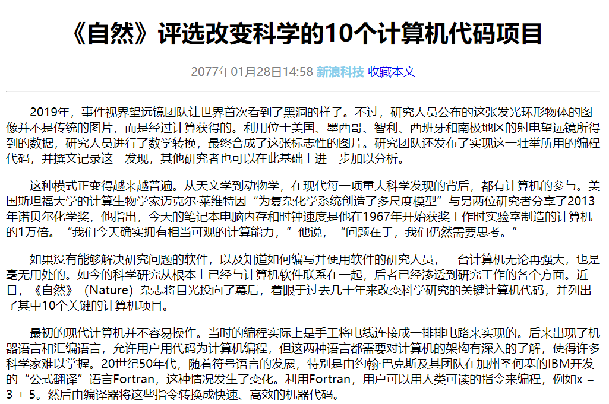

### 2. 卡片居中案例

```html
<body>
  <div class="box">
    
    <div class="product">九号平衡车</div>
    <div class="info">成年人的玩具</div>
    <div class="price">1999元</div>
  </div>
</body>
```

```css
body {
  background-color: #f5f5f5;
}
.box {
  width: 234px;
  height: 300px;
  background-color: #fff;
  text-align: center;
}
img {
  width: 160px;
}
.product {
  height: 25px;
  font-size: 14px;
}
.info {
  height: 30px;
  font-size: 12px;
  color: #ccc;
}
.price {
  color: #ffa500;
  font-size: 14px;
}
```

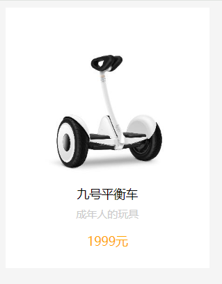

### 3. 百度搜索结果

```html
<body>
  <div class="box">
    <div class="title">
      <a href="#">
        零基础开始学 <span>Web 前端</span>开发，有什么建议吗? - 知乎
      </a>
    </div>
    <div class="info">
      <span>Web 前端</span>开发技术主要包括三个要素：HTML、CSS 和
      JavaScript，它要求前端开发工程师不仅要掌握基本的 <span>Web前端</span>
      开发技术，网站性能优化，SEO 和服务器端的基础...
    </div>
    <div class="footer">
      <a href="#">https://www.zhihu.com/question...</a>
      
      <span>百度快照</span>
    </div>

    <div class="title">
      <a href="#">
        <span>Web 前端</span>技术论坛所有讨论帖 - ITeye论坛频道
      </a>
    </div>
    <div class="info">
      <span>Web 前端</span>
      技术版面讨论，JavaScript编程、AJAX开发、UI界面设计、CSS 分类: JavaScript
      AJAX EXT JQuery prototype CSS 界面设计...
    </div>
    <div class="footer">
      <a href="#">www.iteye.com/forums/b...</a>
      
      <span>百度快照</span>
    </div>
  </div>
</body>
```

```css
.box {
  margin: 50px auto;
  font-size: 13px;
}
.title {
  margin-bottom: 15px;
}
span {
  color: #c00;
}
.title a {
  color: #2440b3;
  font-size: 18px;
}
.info {
  color: #333;
  margin-bottom: 15px;
}
.footer {
  margin-bottom: 25px;
}
.footer a {
  color: #080;
  text-decoration: none;
}
.footer span {
  color: #666;
  cursor: po;
}
```

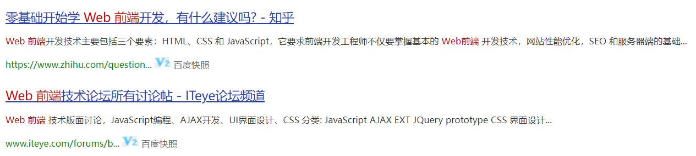

### 4. 百度首页

```html
<body>
  <div class="title">
    
  </div>
  <div class="link">
    <a href="#">新 闻</a>
    <a href="#">新 闻</a>
    <a href="#">新 闻</a>
    <a href="#">新 闻</a>
    <a href="#">新 闻</a>
    <a href="#">新 闻</a>
    <a href="#">新 闻</a>
  </div>
  <div class="search">
    <input type="text" />
    <button>百度一下</button>
  </div>
  <div class="more">
    <a href="#">百科</a>
    <a href="#">文库</a>
    <a href="#">hao123</a> |
    <a href="#">更多</a>
  </div>
  <div class="map">
    
    <a href="#">百度地图带你吃喝玩乐，全心全意为人民服务</a>
  </div>
  <div class="footer">
    <a href="#">把百度设为主页 安装百度卫士</a>
    <br />
    <a href="#">加入百度推广</a> | <a href="#">搜索风云榜</a> |
    <a href="#">关于百度</a> |
    <a href="#">About Baidu</a>
    <p>©2021 Baidu 使用百度前必读 京ICP证030173号</p>
  </div>
</body>
```

```css
body {
  margin: 20px auto;
  text-align: center;
}
.link {
  height: 56px;
}
.link a:nth-child(2) {
  color: black;
  font-weight: 700;
  text-decoration: none;
}
.search {
  height: 54px;
}
.search input {
  width: 425px;
  height: 30px;
}
.search button {
  width: 100px;
  height: 30px;
}
.more {
  height: 52px;
}
.map {
  height: 62px;
}
```

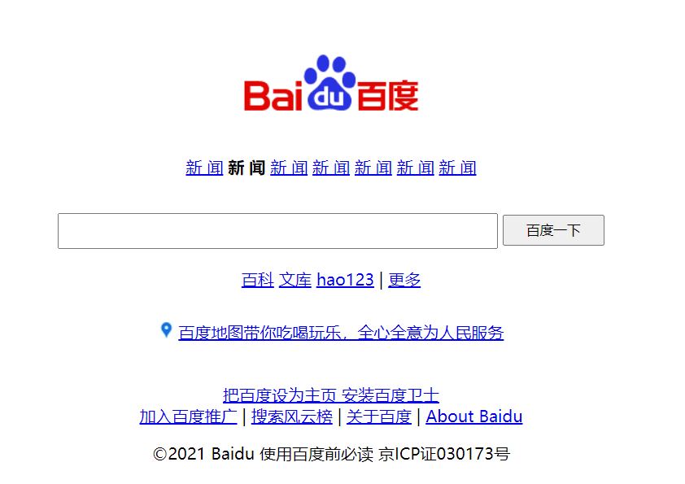

### 5. 领券中心

```html
<body>
  <div class="box">
    
    <h3>领券中心</h3>
    <p>发现更多超值优惠券</p>
  </div>
</body>
```

```css
* {
  margin: 0;
  padding: 0;
  box-sizing: border-box;
}
.box {
  width: 380px;
  height: 506px;
  background-color: #f5f5f5;
  text-align: center;
}
.box img {
  height: 375px;
}
.box h3 {
  height: 80px;
  line-height: 80px;
  font-size: 26px;
  color: #333;
}
.box p {
  font-size: 20px;
  color: #999;
}
```


### 6. 水产品卡片

```html
<body>
  <div class="box">
    <div class="pic">
      
    </div>
    <p class="title">三都港 冷冻无公害黄花鱼</p>
    <p class="info">700g 2条 袋装</p>
    <p class="cate">海鲜水产</p>
    <p class="price">￥<span>899</span></p>
  </div>
</body>
```

```css
* {
  margin: 0;
  padding: 0;
  box-sizing: border-box;
}
body {
  background-color: #f5f5f5;
}
.box {
  width: 305px;
  height: 382px;
  background-color: #fff;
}
.box .pic {
  text-align: center;
}
.box .pic img {
  width: 215px;
}
p {
  height: 25px;
  color: #333;
  font-size: 18px;
}
.price {
  height: 60px;
  line-height: 60px;
  font-size: 22px;
  color: #9a3884;
}
```

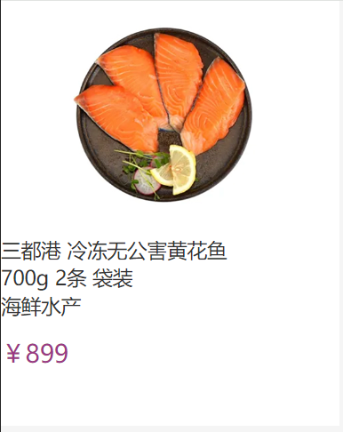

### 7. 普通导航

```html
<body>
  <a href="#">导航1</a>
  <a href="#">导航2</a>
  <a href="#">导航3</a>
  <a href="#">导航4</a>
  <a href="#">导航5</a>
</body>
```

```css
a {
  display: inline-block;
  width: 80px;
  height: 50px;
  background-color: #ff0000;
  text-align: center;
  line-height: 50px;
  color: #fff;
  text-decoration: none;
}
a:hover {
  background-color: #ffa500;
}
```

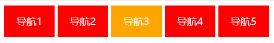

### 8. 五彩导航

```html
<body>
  <a href="#">五彩导航</a>
  <a href="#">五彩导航</a>
  <a href="#">五彩导航</a>
  <a href="#">五彩导航</a>
</body>
```

```css
a {
  display: inline-block;
  width: 120px;
  height: 58px;

  color: #fff;
  text-align: center;
  line-height: 50px;
  text-decoration: none;
}
a:nth-child(1) {
  background-image: url('./images/bg1.png');
}
a:nth-child(1):hover {
  background-image: url('./images/bg5.png');
}
a:nth-child(2) {
  background-image: url('./images/bg2.png');
}
a:nth-child(2):hover {
  background-image: url('./images/bg6.png');
}
a:nth-child(3) {
  background-image: url('./images/bg3.png');
}
a:nth-child(3):hover {
  background-image: url('./images/bg7.png');
}
a:nth-child(4) {
  background-image: url('./images/bg4.png');
}
a:nth-child(4):hover {
  background-image: url('./images/bg8.png');
}
```


### 9. 侧边栏

```html
<body>
  <div class="box">
    <a href="#">手机 电话卡</a>
    <a href="#">电视 盒子</a>
    <a href="#">笔记本 显示器</a>
    <a href="#">家电 插线板</a>
    <a href="#">出行 穿戴</a>
    <a href="#">智能 路由器</a>
    <a href="#">电源 配件</a>
    <a href="#">健康 儿童</a>
    <a href="#">耳机 音箱</a>
    <a href="#">生活 箱包</a>
  </div>
</body>
```

```css
.box {
  width: 234px;
  height: 420px;
  background-color: #2c505f;
}
a {
  display: block;
  height: 42px;
  color: #fff;
  text-decoration: none;
  font-size: 14px;
  text-indent: 30px;
  line-height: 42px;
}
a:hover {
  background-color: red;
}
```

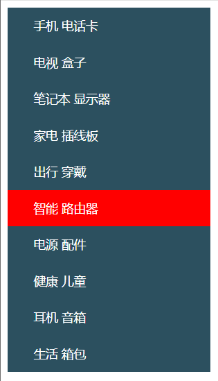

### 10. 导航栏

```html
<body>
  <div class="nav">
    <a href="#">小米网</a> | <a href="#">MIUI</a> | <a href="#">米聊</a> |
    <a href="#">游戏</a> | <a href="#">多看阅读</a> | <a href="#">云服务</a> |
    <a href="#">小米网移动版</a> | <a href="#">问题反馈</a> |
    <a href="#">Select Region </a>
  </div>
</body>
```

```css
.nav {
  height: 40px;
  background-color: #333;
  text-indent: 2em;
  font-size: 12px;
  color: #b0b0b0;
}
a {
  color: #b0b0b0;
  font-size: 12px;
  text-decoration: none;
  line-height: 40px;
}
a:hover {
  color: #fff;
}
```

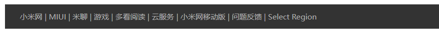

### 11. 新浪导航栏

```html
<body>
  <div class="nav">
    <ul>
      <li><a href="#">新浪导航</a></li>
      <li><a href="#">新浪导航</a></li>
      <li><a href="#">新浪导航</a></li>
      <li><a href="#">新浪导航</a></li>
    </ul>
  </div>
</body>
```

```css
* {
  margin: 0;
  padding: 0;
}
.nav {
  height: 40px;
  border-top: 3px solid #ff8500;
  border-bottom: 1px solid #edeef0;
}
ul {
  display: flex;
}

li {
  list-style: none;
  width: 80px;
  height: 40px;
  text-align: center;
  line-height: 36px;
}
li:hover {
  background-color: rgb(237, 238, 240);
}
a {
  text-decoration: none;
  color: #4c4c4c;
  font-size: 12px;
}
a:hover {
  color: #ff8500;
}
```

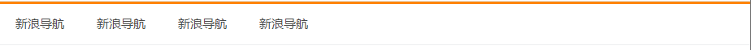

### 12. 网页新闻列表

```html
<body>
  <div class="box">
    <h2>最新文章/New Articles</h2>
    <ul>
      <li><a href="#">北京招聘网页设计，平面设计，php</a></li>
      <li><a href="#">体验javascript的魅力</a></li>
      <li><a href="#">jquery世界来临</a></li>
      <li><a href="#">网页设计师的梦想</a></li>
      <li><a href="#">jquery中的链式编程是什么</a></li>
    </ul>
  </div>
</body>
```

```css
* {
  margin: 0;
  padding: 0;
}
body {
  /* 去除行高带来的默认间隙，完成精准布局 */
  line-height: 1;
}
.box {
  width: 500px;
  height: 400px;
  border: 1px solid #ccc;
  padding: 41px 30px 0;
}
h2 {
  height: 41px;
  border-bottom: 1px solid #ccc;
  font-size: 30px;
  box-sizing: border-box;
}
ul {
  list-style: none;
}
ul li {
  height: 50px;
  padding-left: 30px;
  border-bottom: 1px dashed #ccc;
  line-height: 50px;
}
ul li a {
  text-decoration: none;
  font-size: 18px;
  color: #666;
}
```

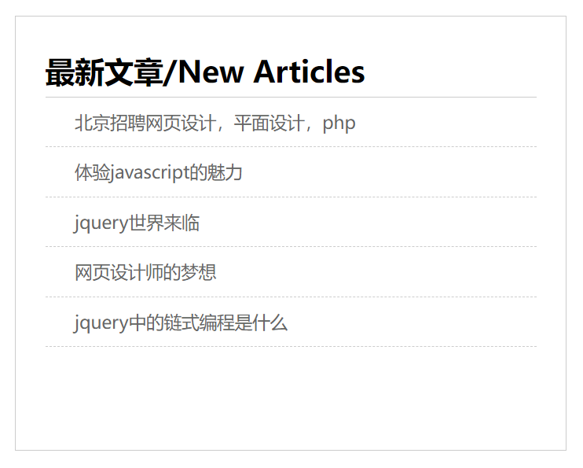

### 13. 布局案例

```html
<body>
  <div class="box">
    <div class="left"></div>
    <div class="right">
      <div class="item"></div>
      <div class="item"></div>
      <div class="item"></div>
      <div class="item"></div>
      <div class="item"></div>
      <div class="item"></div>
      <div class="item"></div>
      <div class="item"></div>
    </div>
  </div>
</body>
```

```css
* {
  padding: 0;
  margin: 0;
}
.box {
  margin: 40px auto;
  width: 1226px;
  height: 615px;
}
.left {
  float: left;
  width: 234px;
  height: 615px;
  background-color: #800080;
}
.right {
  float: right;
  width: 978px;
  height: 614px;
}
.item {
  float: left;
  width: 234px;
  height: 300px;
  background-color: #87ceeb;
  margin-right: 14px;
  margin-bottom: 14px;
}
.item:nth-child(4n) {
  margin-right: 0;
}
.item:nth-child(n + 5) {
  margin-bottom: 0;
}
```

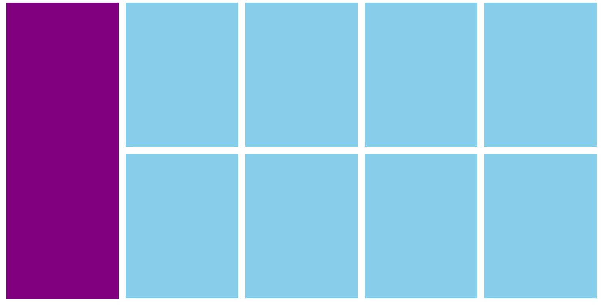

### 14. 网页导航案例

```html
<div class="nav">
  <ul>
    <li><a href="#">新闻1</a></li>
    <li><a href="#">新闻2</a></li>
    <li><a href="#">新闻3</a></li>
    <li><a href="#">新闻4</a></li>
    <li><a href="#">新闻5</a></li>
    <li><a href="#">新闻6</a></li>
    <li><a href="#">新闻7</a></li>
    <li><a href="#">新闻8</a></li>
  </ul>
</div>
```

```css
* {
  margin: 0;
  padding: 0;
}
body {
  line-height: 1;
}
.nav {
  margin: 10px auto;
  width: 640px;
  height: 50px;
  background-color: #ffc0cb;
}
ul {
  display: flex;
  list-style: none;
}
li {
  width: 80px;
  height: 50px;
  text-align: center;
  line-height: 50px;
}
ul li a {
  text-decoration: none;
  color: #fff;
  font-size: 16;
}
ul li:hover {
  background-color: #008000;
}
```

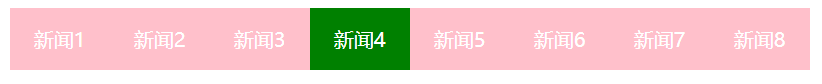

### 15. 微金所导航

```html
<div class="nav">
  <ul>
    <li><a href="#">我要投资</a></li>
    <li><a href="#">平台介绍</a></li>
    <li><a href="#">新手专区</a></li>
    <li><a href="#">手机微金所</a></li>
    <li><a href="#">个人中心</a></li>
  </ul>
</div>
```

```css
* {
  margin: 0;
  padding: 0;
}
.nav {
  height: 40px;
  border-bottom: 1px solid #ccc;
}
ul {
  display: flex;
  list-style: none;
  width: 1200px;
  margin: 0 auto;
}
li {
  text-align: center;
  height: 40px;
  width: 20%;
  line-height: 40px;
  border-right: 1px solid #ccc;
  box-sizing: border-box;
}
a {
  display: block;
  height: 40px;
  text-decoration: none;
  color: #000;
}
ul li:last-child {
  border-right: 0;
}
```

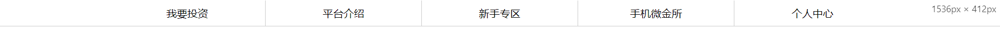

### 16. 抖音开放API

```html
<div class="box">
  <ul>
    <li>
      
      <h4>账号授权</h4>
      <p>包含抖音账号授权等于授权绑定的能力</p>
    </li>
    <li>
      
      <h4>用户管理</h4>
      <p>包含用户的基础信息记忆关系链相关数据的获取</p>
    </li>
    <li>
      
      <h4>视频管理</h4>
      <p>包含抖音、西瓜、头条视频的发布以及相关数据的获取能力</p>
    </li>
    <li>
      
      <h4>互动管理</h4>
      <p>包含抖音、西瓜、头条视频的发布以及相关数据的获取能力</p>
    </li>
    <li>
      
      <h4>搜索管理</h4>
      <p>包含通过关键词获取抖音视频及该视频下评论，并进行回复的能力</p>
    </li>
    <li>
      
      <h4>数据开放服务</h4>
      <p>包含用户授权后的公开用户数据，视频数据等能力</p>
    </li>
    <li>
      
      <h4>企业号开放能力</h4>
      <p>包含企业号意向用户、企业消息卡片、团购活动等的管理能力</p>
    </li>
    <li>
      
      <h4>生活服务开放能力</h4>
      <p>包含商铺/商品库/交易系统等能力的开放接</p>
    </li>
  </ul>
</div>
```

```css
* {
  margin: 0;
  padding: 0;
  box-sizing: border-box;
}

ul {
  list-style: none;
}

body {
  background-color: rgb(240, 240, 240);
}

.box {
  margin: 100px auto;
  width: 1076px;
}

.box ul {
  display: flex;
  flex-wrap: wrap;
  justify-content: space-between;
  align-content: space-between;
}

.box ul li {
  margin-bottom: 20px;
  padding: 0 45px;
  width: 254px;
  height: 260px;
  background-color: #fff;
  text-align: center;
  border-radius: 20px;
}

.box ul li img {
  margin-top: 45px;
  width: 58px;
}

.box ul li h4 {
  margin-top: 20px;
  margin-bottom: 5px;
  font-weight: 600;
}

.box ul li p {
  font-size: 14px;
  color: #999;
}
```

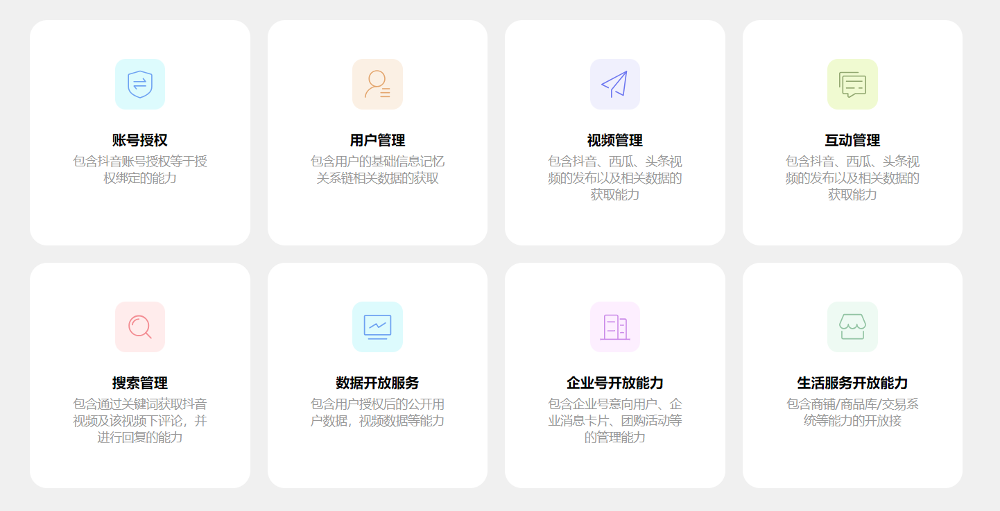

### 17. 尚合项目

```html
<div class="header">
  <div class="wrapper">
    <div class="logo">
      <h1><a href="#">尚合</a></h1>
    </div>
    <div class="search">
      
    </div>
  </div>
</div>

<div class="nav">
  <div class="wrapper">
    <ul>
      <li><a href="#">首页</a></li>
      <li><a href="#">智能手机</a></li>
      <li><a href="#">平板电脑</a></li>
      <li><a href="#">配件</a></li>
      <li><a href="#">服务支持</a></li>
      <li><a href="#">关于尚合</a></li>
    </ul>
  </div>
</div>

<div class="banner wrapper">
  
</div>

<div class="notice wrapper">
  <div class="left">
    <p>
      最新公告：
      <span>尚合Aone智能手机入网证已经获工信部门审批下发。尚合官方</span>
    </p>
  </div>
  <div class="right">
    
  </div>
</div>

<div class="product wrapper">
  <div class="item">
    <div class="item-t">
      <span>新品发布</span>
    </div>
    <div class="item-b">
      
    </div>
  </div>
  <div class="item">
    <div class="item-t">
      <span>新闻中心</span>
      <a href="#" class="more">更多</a>
    </div>
    <div class="item-list">
      <ul>
        <li><a href="#" class="active">致歉公告</a></li>
        <li><a href="#">首批尚合Aonet已全部告罄</a></li>
        <li>
          <a href="#">【媒体报道】国产高性价比 尚合Aonet四核手机评测</a>
        </li>
        <li><a href="#">我司产品已经通过了国家强制性产品3C认证</a></li>
        <li>
          <a href="#">尚合Aone智能手机入网证已经获工信部门审批下发</a>
        </li>
        <li><a href="#">我司通过ISO9001:2008国际质量管理体系认证</a></li>
      </ul>
    </div>
  </div>
  <div class="item">
    <div class="item-t">
      <span>技术与支持</span>
    </div>
    <div class="item-service">
      <ul>
        <li><a href="#">售后服务</a></li>
        <li><a href="#">投诉与简易</a></li>
        <li><a href="#">联保网点</a></li>
        <li><a href="#">常见问题FAQ？</a></li>
      </ul>
      <br />
      <p>深圳市汇聚众合科技发展有限公司</p>
      <p>服务热线：400-633-7922</p>
    </div>
  </div>
</div>

<div class="footer">
  <div class="help">
    <div class="wrapper">
      <dl>
        <dt><a href="#">尚合首页</a></dt>
        <dd><a href="#">返回首页</a></dd>
      </dl>
      <dl>
        <dt><a href="#">智能手机</a></dt>
        <dd><a href="#">Anone-T</a></dd>
        <dd><a href="#">Aone</a></dd>
      </dl>
      <dl>
        <dt><a href="#">平板电脑</a></dt>
        <dd><a href="#">尚PAD S200</a></dd>
        <dd><a href="#">尚PAD S100</a></dd>
        <dd><a href="#">尚PAD SH-Q7</a></dd>
        <dd><a href="#">尚PAD SH-Q5</a></dd>
      </dl>
      <dl>
        <dt><a href="#">配件中心</a></dt>
        <dd><a href="#">Aone 智能手机</a></dd>
      </dl>
      <dl>
        <dt><a href="#">服务与支持</a></dt>
        <dd><a href="#">售后服务</a></dd>
        <dd><a href="#">投诉与建议</a></dd>
        <dd><a href="#">联保网点</a></dd>
        <dd><a href="#">常见问题FAQ</a></dd>
        <dd><a href="#">订单查询</a></dd>
        <dd><a href="#">下载专区</a></dd>
      </dl>
      <dl>
        <dt><a href="#">关于我们</a></dt>
        <dd><a href="#">公司介绍</a></dd>
        <dd><a href="#">企业文化</a></dd>
        <dd><a href="#">工作机会</a></dd>
        <dd><a href="#">法律声明</a></dd>
        <dd><a href="#">联系我们</a></dd>
      </dl>
      <dl>
        <dt><a href="#">新闻中心</a></dt>
        <dd><a href="#">公司新闻</a></dd>
        <dd><a href="#">媒体报道</a></dd>
        <dd><a href="#">行业动态</a></dd>
      </dl>
      <dl>
        <dt><a href="#">常用链接</a></dt>
        <dd><a href="#">百度</a></dd>
        <dd><a href="#">Google</a></dd>
        <dd><a href="#">新浪微博</a></dd>
      </dl>
    </div>
  </div>

  <div class="copyright">
    <div class="wrapper">
      <p>
        ©2011-2012版权所有 深圳市汇聚众合科技发展有限公司
        （品牌：尚合-SAMHAVE） 服务热线：400-633-7922
      </p>
      <p>经营许可证编号：粤ICP备11077821号-1</p>
      
    </div>
  </div>
</div>
```

```css
.wrapper {
  margin: 0 auto;
  width: 980px;
}

.header {
  height: 62px;
  margin-top: 19px;
  border-bottom: 2px solid #e1e1e1;
}

.logo {
  width: 180px;
  height: 24px;
}

.logo a {
  display: block;
  width: 180px;
  height: 24px;
  background-image: url('../images/logo.png');
  font-size: 0;
}

.header .wrapper {
  display: flex;
  justify-content: space-between;
}

.search {
  display: flex;
  width: 198px;
  height: 30px;
}

.nav {
  height: 55px;
  background: linear-gradient(to top, #b9b9b9, #fefefe);
}

.nav ul {
  display: flex;
  line-height: 55px;
}

.nav li a {
  display: block;
  width: 130px;
  text-align: center;
  font-weight: bold;
  font-size: 14px;
  border-right: 1px solid #c2c2c2;
}

.nav li:last-child a {
  border-right: 0;
}

.footer {
  color: #fff;
  height: 307px;
  background-color: #2d2d2d;
}

.footer .help {
  border-bottom: 2px dashed #414141;
}

.footer .help .wrapper {
  display: flex;
  justify-content: space-between;
  padding-top: 16px;
  height: 221px;
}

.footer .help .wrapper dt a {
  margin-bottom: 22px;
  font-size: 12px;
  color: #c7c7c7;
  font-weight: 900;
}

.footer .help .wrapper dd a {
  margin-bottom: 9px;
  font-size: 11px;
  color: #707070;
  font-weight: 400;
}

.copyright {
  text-align: center;
}

.copyright .wrapper {
  margin-top: 11px;
  color: #000;
  font-size: 11px;
}

.copyright .wrapper p {
  margin-bottom: 19px;
}

.copyright .wrapper:last-child p {
  margin-bottom: 0;
}

.copyright .wrapper img {
  margin-top: 10px;
  width: 42px;
  height: 20px;
}

.notice {
  display: flex;
  justify-content: space-between;
  height: 30px;
}

.notice .left p {
  font-size: 11px;
  font-weight: 600;
}

.notice .left p span {
  margin-left: 28px;
  font-weight: 400;
}

.notice .right img {
  width: 86px;
  height: 16px;
}

.brand {
  display: flex;
  padding-top: 15px;
}

.brand .box_left {
  width: 312px;
  height: 225px;
  background-color: pink;
}

.brand .box_middle {
  width: 373px;
  height: 225px;
  margin: 0 12px;
  background-color: pink;
}

.brand .box_right {
  width: 271px;
  height: 225px;
  background-color: pink;
}

.brand .title {
  padding-left: 6px;
  padding-top: 14px;
}

.brand .title .left {
  display: flex;
}

.brand .title .left img {
  width: 14px;
  height: 14px;
}

.brand .title .left h3 {
  margin-left: 8px;
  font-size: 12px;
  color: #7ab800;
}

.product {
  margin-top: 15px;
  height: 293px;
}
.item {
  height: 224px;
  float: left;
  border: 1px solid #ccc;
  margin-right: 11px;
}
.product .item:nth-child(1) {
  width: 310px;
}
.product .item:nth-child(2) {
  width: 373px;
}
.product .item:nth-child(3) {
  width: 268px;
  margin-right: 0;
}
.product .item-t {
  height: 35px;
  height: 35px;
  font-weight: bold;
  line-height: 35px;
  font-size: 14px;
}
.product .item-t span {
  display: block;
  background: url(../images/product-icon.png) 6px center no-repeat;
  color: #7ab800;
  float: left;
  text-indent: 27px;
}

.product .item .more {
  float: right;
  margin-right: 10px;
}
.item-list ul {
  padding: 0 20px;
}
.item-list ul li {
  height: 27px;
  line-height: 27px;
  border-bottom: 1px dashed #ccc;
  font-size: 14px;
}
.active {
  color: red;
  font-weight: bold;
}
.item-service ul {
  padding-left: 28px;
}
.item-service ul li {
  text-indent: 5px;
  font-size: 14px;
  border-left: 3px solid #98cb00;
  margin-bottom: 9px;
  line-height: 1;
}
.item-service p {
  font-size: 12px;
  line-height: 2;
  text-indent: 29px;
}
```

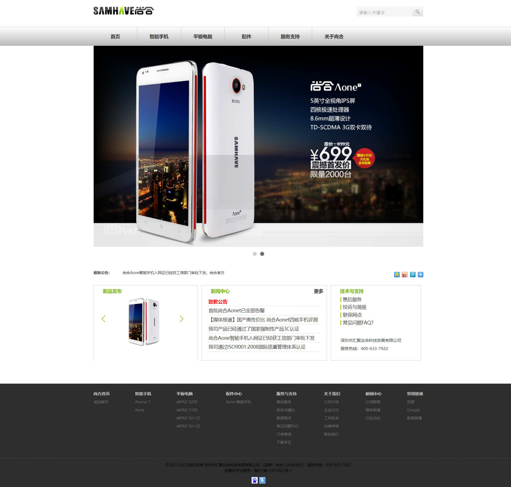

###   18. 腾讯云项目

```html
<div class="header">
  <div class="wrapper">
    <div class="logo">
      <a href="#">
        <h1>腾讯云</h1>
      </a>
    </div>
    <div class="right">
      <ul>
        <li><a href="#">最新产品</a></li>
        <li><a href="#">产品</a></li>
        <li><a href="#">解决方案</a></li>
        <li><a href="#">定价</a></li>
        <li><a href="#">文档</a></li>
        <li><a href="#">企业中心</a></li>
        <li><a href="#">云市场</a></li>
        <li><a href="#">开发者支持</a></li>
        <li><a href="#">合作与生态</a></li>
        <li><a href="#">客户</a></li>
      </ul>
    </div>
  </div>
</div>

<div class="banner">
  <div class="wrapper">
    <div class="subnav">
      <ul>
        <li>
          <a href="#">云服务器</a>
          <span class="iconfont icon-arrow-right-bold"></span>
        </li>
        <li>
          <a href="#">轻量应用服务器</a>
          <span class="iconfont icon-arrow-right-bold"></span>
        </li>
        <li>
          <a href="#">域名注册</a>
          <span class="iconfont icon-arrow-right-bold"></span>
        </li>
        <li>
          <a href="#">网站备案</a>
          <span class="iconfont icon-arrow-right-bold"></span>
        </li>
        <li>
          <a href="#">对象存储</a>
          <span class="iconfont icon-arrow-right-bold"></span>
        </li>
        <li>
          <a href="#">云硬盘</a>
          <span class="iconfont icon-arrow-right-bold"></span>
        </li>
        <li>
          <a href="#">云数据库</a>
          <span class="iconfont icon-arrow-right-bold"></span>
        </li>
        <li>
          <a href="#">云数据库</a>
          <span class="iconfont icon-arrow-right-bold"></span>
        </li>
        <li>
          <a href="#">批量计算</a>
          <span class="iconfont icon-arrow-right-bold"></span>
        </li>
        <li>
          <a href="#">云服务器</a>
          <span class="iconfont icon-arrow-right-bold"></span>
        </li>
      </ul>
    </div>
  </div>
</div>

<div class="content">
  <div class="wrapper">
    <div class="box_t">
      <h4>云从业者培训及认证</h4>
      <p>好好学习，天天向上</p>
    </div>
    <div class="box_b">
      <div class="left">
        <h4>在线课程</h4>
        <div class="desc">
          本课程专为云计算初学者、学生、个人开发者打造，购买云+校园任意套餐可免费观看课程视频本课程专为云计算初学者、学生、个人开发者打造，购买云+校园任意套餐可免费观看课程视频本课程专为云计算初学者、学生、个人开发者打造，购买云+校园任意套餐可免费观看课程视频本课程专为云计算初学者、学生、个人开发者打造，购买云+校园任意套餐可免费观看课程视频本课程专为云计算初学者、学生、个人开发者打造，购买云+校园任意套餐可免费观看课程视频
        </div class="desc">
        <a href="#">开始学习</a>
      </div>
      <div class="right">
        
      </div>
    </div>
  </div>
</div>

<div class="footer">
  <div class="wrapper">
    <div class="left">
      <dl>
        <dt>腾讯云计算</dt>
        <dd><a href="#">产品</a></dd>
        <dd><a href="#">云市场</a></dd>
        <dd><a href="#">客户案例</a></dd>
        <dd><a href="#">产品发布台</a></dd>
        <dd><a href="#">网站备案</a></dd>
        <dd><a href="#">认证信息</a></dd>
        <dd><a href="#">许可证说明</a></dd>
        <dd><a href="#">隐私声明</a></dd>
        <dd><a href="#">关于我们</a></dd>
      </dl>
      <dl>
        <dt>解决方案</dt>
        <dd><a href="#">视频</a></dd>
        <dd><a href="#">游戏</a></dd>
        <dd><a href="#">金融</a></dd>
        <dd><a href="#">电商</a></dd>
        <dd><a href="#">网站</a></dd>
        <dd><a href="#">大数据</a></dd>
        <dd><a href="#">人脸核身</a></dd>
        <dd><a href="#">在线教育</a></dd>
        <dd><a href="#">微信小程序</a></dd>
        <dd><a href="#">微信小程序音视频</a></dd>
      </dl>
      <dl>
        <dt>资源与社区</dt>
        <dd><a href="#">免费套餐</a></dd>
        <dd><a href="#">入门中心</a></dd>
        <dd><a href="#">定价中心</a></dd>
        <dd><a href="#">资源中心</a></dd>
        <dd><a href="#">腾讯云大学</a></dd>
        <dd><a href="#">云+社区</a></dd>
        <dd><a href="#">专栏</a></dd>
        <dd><a href="#">问答</a></dd>
        <dd><a href="#">沙龙</a></dd>
      </dl>
      <dl>
        <dt>合作与生态</dt>
        <dd><a href="#">合作伙伴</a></dd>
        <dd><a href="#">合作伙伴学院</a></dd>
        <dd><a href="#">推广奖励</a></dd>
        <dd><a href="#">云+公益</a></dd>
        <dd><a href="#">云+校园</a></dd>
        <dd><a href="#">云+创业</a></dd>
        <dd><a href="#">Techo 开发者大会</a></dd>
        <dd><a href="#">腾讯数字生态大会</a></dd>
        <dd><a href="#">云启产业计划</a></dd>
        <dd><a href="#">腾讯云启创新基地</a></dd>
      </dl>
      <dl>
        <dt>管理与支持</dt>
        <dd><a href="#">公告</a></dd>
        <dd><a href="#">控制台</a></dd>
        <dd><a href="#">续费管理</a></dd>
        <dd><a href="#">访问管理</a></dd>
        <dd><a href="#">安全中心</a></dd>
        <dd><a href="#">举报平台</a></dd>
        <dd><a href="#">工单管理</a></dd>
        <dd><a href="#">联系我们</a></dd>
      </dl>
    </div>
    <div class="right">
      <div class="txt">
        <p>Copyright © 2013 - 2020</p>
        <p>Tencent Cloud. All Rights Reserved.</p>
        <p>腾讯云 版权所有</p>
      </div>
      <div class="button">
        <a href="#">购买咨询</a>
      </div>
    </div>
  </div>
</div>
```

```css
.wrapper {
  margin: 0 auto;
  width: 1200px;
}

.header {
  height: 40px;
  background-color: #2b303b;
}

.logo {
  width: 78px;
  height: 40px;
}

.logo a {
  display: block;
  width: 78px;
  height: 40px;
  background: url('../images/logo.png') center no-repeat;
  font-size: 0;
}

.header .wrapper {
  display: flex;
  justify-content: space-between;
  height: 40px;
}

.header .wrapper .right ul {
  display: flex;
  line-height: 40px;
}

.header .wrapper .right ul li a {
  padding: 0 8px;
  border-right: 2px solid #fff;
  font-size: 12px;
  color: #fff;
}

.header .wrapper .right ul li:last-child a {
  border-right: 0;
}

.header .wrapper .right ul li a:hover {
  color: #5eb69c;
}

.footer {
  padding-top: 35px;
  height: 400px;
  background-color: #2e3033;
}

.footer .wrapper {
  display: flex;
}

.footer .left {
  display: flex;
}

.footer .left dl {
  width: 200px;
  color: #fff;
  font-size: 12px;
}

.footer .left dl dt {
  margin-bottom: 16px;
  font-weight: bold;
}

.footer .left dl dd a {
  color: #fff;
}

.footer .right {
  width: 190px;
  height: 130px;
}

.footer .txt {
  color: #fff;
  font-size: 12px;
}

.footer .button {
  margin-top: 24px;
  width: 190px;
  height: 35px;
  background-color: #00a4ff;
  text-align: center;
}

.footer .button a {
  height: 35px;
  width: 190px;
  line-height: 35px;
  color: #fff;
  font-size: 12px;
}

.banner {
  height: 480px;
  background-color: #181c28;
}

.banner .wrapper {
  height: 480px;
  background: url('../images/banner.png') center no-repeat;
}

.banner .subnav {
  width: 250px;
  height: 480px;
  background-color: #1a2b3f;
  padding-top: 37px;
  /* padding-left: 20px; */
}

.banner .subnav li {
  display: flex;
  justify-content: space-between;
  padding-left: 20px;
  padding-right: 20px;
  color: #fff;
  height: 40px;
  line-height: 40px;
  cursor: pointer;
}

.banner .subnav li a {
  font-size: 14px;
  color: #fff;
}

.banner .subnav li .iconfont {
  font-size: 14px;
}

.content {
  height: 740px;
}

.content .box_t {
  height: 140px;
  text-align: center;
}

.content .box_t h4 {
  margin-top: 45px;
  margin-bottom: 27px;
  font-size: 22px;
}

.content .box_t p {
  margin-bottom: 30px;
  font-size: 14px;
}

.content .box_b {
  display: flex;
  height: 460px;
  border: 1px solid #ccc;
  border-radius: 20px;
  justify-content: space-between;
  padding: 48px 50px 72px;
}

.content .box_b .left {
  width: 515px;
  height: 295px;
  padding-right: 70px;
}

.content .box_b .left h4 {
  font-size: 26px;
  width: 110px;
  height: 50px;
  border-bottom: 1px solid #ccc;
}

.content .box_b .left .desc {
  color: #666;
  font-size: 12px;
  margin-top: 21px;
  margin-bottom: 30px;
  line-height: 26px;
}

.content .box_b .left a {
  display: block;
  width: 160px;
  height: 48px;
  text-align: center;
  line-height: 42px;
  border: 2px solid #ffa500;
}
```

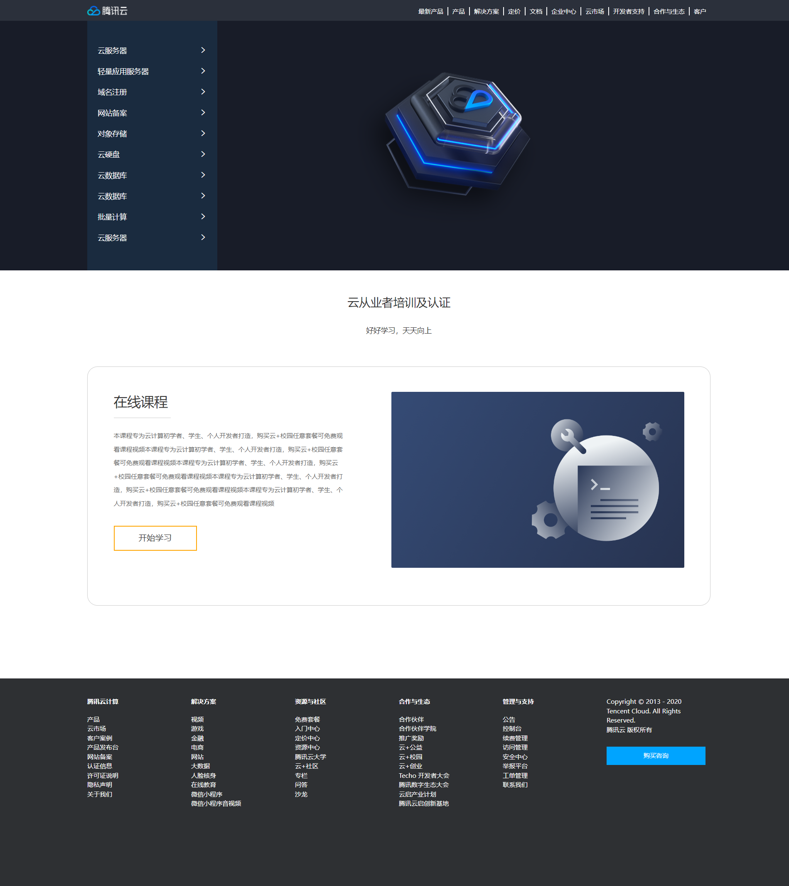

### 19. 卡片模块hot图片

```html
<div class="box">
  
  
  <h3>Android网络图片加载框架详解</h3>
  <p><span>高级</span> • 1125人在学习</p>
</div>
```

```css
* {
  margin: 0;
  padding: 0;
}

body {
  background-color: #f4f5f9;
}

.box {
  position: relative;
  width: 228px;
  height: 270px;
  background-color: #fff;
  margin: 50px auto;
}

.box .product {
  width: 100%;
}

.box h3 {
  height: 52px;
  padding-left: 24px;
  padding-right: 20px;
  margin-top: 25px;
  font-size: 14px;
  font-weight: 400;
}

.box p {
  margin-left: 24px;
  font-size: 12px;
  color: #929292;
}

.box p span {
  color: #f77321;
}

.box .hot {
  position: absolute;
  top: 4px;
  right: -4px;
}
```


### 20. 导航二维码显示隐藏功能

```html
<div class="nav">
  <ul>
    <li><a href="#">我要投资</a></li>
    <li><a href="#">平台介绍</a></li>
    <li><a href="#">新手专区</a></li>
    <li>
      <a href="#" class="app">
        下拉
        
      </a>
    </li>
    <li><a href="#">个人中心</a></li>
  </ul>
</div>
```

```css
* {
  margin: 0;
  padding: 0;
}

.nav {
  height: 40px;
  border-bottom: 1px solid #ccc;
}

ul {
  list-style: none;
  width: 1200px;
  margin: 0 auto;
}

ul li {
  float: left;
  width: 20%;
  height: 40px;
  border-right: 1px solid #ccc;
  box-sizing: border-box;
  text-align: center;
  line-height: 40px;
}

ul li:last-child {
  border-right: 0;
}

ul li a {
  display: block;
  height: 40px;
  text-decoration: none;
  color: #000;
}

ul li .app {
  position: relative;
}

ul li .app .code {
  display: none;
  position: absolute;
  left: 50%;
  transform: translateX(-50%);
  top: 40px;
  border: 1px solid #ccc;
}

ul li .app:hover .code {
  display: block;
}
```

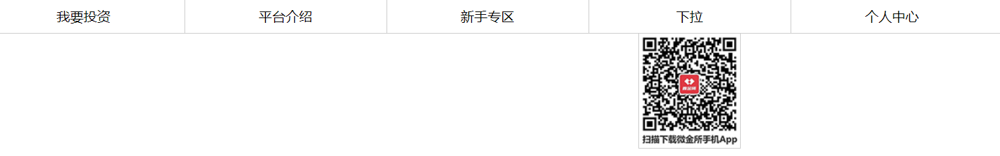