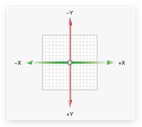
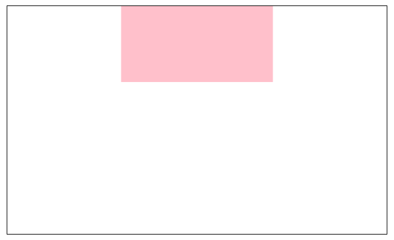
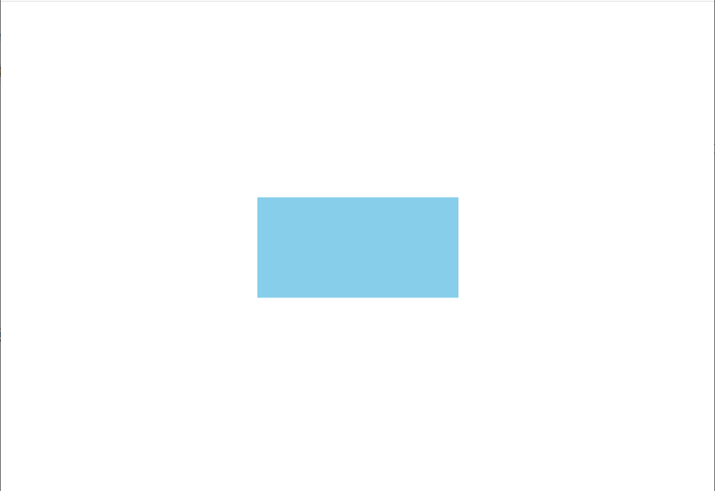
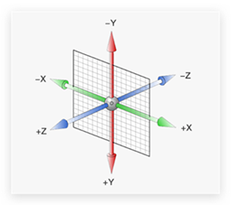

# 动画

## 平面转换

作用：为元素添加动态效果，一般与过渡配合使用

概念：改变盒子在平面内的形态（位移、旋转、缩放、倾斜）



### 平移

```css
transform: translate(X轴移动距离, Y轴移动距离);
```

* 取值
  * 像素单位数值
  * 百分比（参照**盒子自身尺寸**计算结果）
  * **正负**均可
* 技巧
  * translate() **只写一个值**，表示沿着 **X** 轴移动
  * 单独设置 X 或 Y 轴移动距离：translateX() 或 translateY()

示例：

```css {11,20}
.father {
  width: 500px;
  height: 300px;
  margin: 100px auto;
  border: 1px solid #000;
}
.son {
  width: 200px;
  height: 100px;
  background-color: pink;
  transition: all 0.5s;
}

.father:hover .son {
  /* transform: translate(200px, 100px); */
  /* transform: translate(250px); */
  /* transform: translate(50%); */
  
  /* 水平居中 */
  transform: translate(150px);
}
```



### 绝对定位的元素居中

1. 使用margin

```css {10,11}
.box{
  width: 200px;
  height: 100px;
  background-color: skyblue;

  position: absolute;
  left: 50%;
  top: 50%;

  margin-left: -100px;
  margin-top: -50px;
}
```

2. 平移 ➡ 百分比参照盒子自身尺寸计算结果

```css {10}
.box {
  width: 200px;
  height: 100px;
  background-color: skyblue;

  position: absolute;
  left: 50%;
  top: 50%;

  transform: translate(-50%, -50%);
}
```



### 旋转

```css
transform: rotate(旋转角度 deg);
```

+ 技巧
  + 取值正负均可
  + 取值为正，顺时针旋转
  + 取值为负，逆时针旋转

+ 示例

```css {3,6}
img {
	width: 200px;
	transition: all 2.5s;
}

img:hover {
	transform: rotate(360deg);
}
```

### 改变转换原点

```css
transform-origin: 水平远点位置 垂直远点位置;
```

+ 取值：
  + **方位名词**（left、top、right、bottom、center）
  + 像素单位数值
  + 百分比
+ 注意：
  + 默认情况下，以盒子中心点为原点

+ 示例：

```css {7}
img {
  width: 200px;
  border: 1px solid #000;

  transition: all 1s;
  /* transform-origin: 75% 2%; */
  transform-origin: right bottom;
}
img:hover {
  transform: rotate(360deg);
}
```

### 多重转换

```css
transform: translate() retate();
```

+ 技巧
  + 先平移再旋转
+ 多重转换原理：以第一种转换方式坐标轴为准转换形态
  + 旋转会改变网页元素的坐标轴向
  + 先写旋转，则后面的转换效果的轴向以旋转后的轴向为准，会影响转换结果

+ 示例：

```css {8,12}
.box {
  width: 800px;
  height: 200px;
  border: 1px solid #000;
}
img {
  width: 200px;
  transition: all 2s;
}

.box:hover img {
  transform: translate(600px) rotate(360deg);
}
```

### 缩放

```css
transform: scale(缩放倍数);
transform: scale(X轴缩放倍数, Y轴缩放倍数);
```

+ 技巧
  + 通常，只为 scale() 设置一个值，表示 X 轴和 Y 轴等比例缩放
  + 取值大于1表示**放大**，取值小于1表示**缩小**，取值等于1表示**不变**

+ 示例

```css {16-18}
.box {
  width: 300px;
  height: 210px;
  margin: 100px auto;
}
.box img {
  width: 100%;

  transition: all 0.5s;
}

.box:hover img {
  /* width: 500px;
  height: 400px; */

  transform: scale(2);
  transform: scale(0.5);
  transform: scale(1);
}
```

### 倾斜

```css
transform: skew();
```

+ 注意：
  + 角度度数 **deg**
  + 正数逆时针倾斜，负数顺时针倾斜

+ 示例：

```css {11,12}
.box {
  width: 200px;
  height: 400px;
  background-color: bisque;
  margin: 100px auto;

  transition: all 0.5s;
}

.box:hover {
  transform: skew(30deg);
  transform: skew(-30deg);
}
```

### 渐变

有线性渐变和径向渐变两种。

#### 线性渐变

```css
background-image: linear-gradient(
  渐变方向,
  颜色1 终点位置,
  颜色2 终点位置,
  ......
);
```

* 渐变方向：可选
  * to 方位名词
  * 角度度数
* 终点位置：可选
  * 百分比

+ 示例：

```css {4-6}
.box {
  width: 200px;
  height: 200px;
  background-image: linear-gradient(to right, #cc2b5e, #753a88);
  background-image: linear-gradient(to right, #00467f, #a5cc82);
  background-image: linear-gradient(45deg, #bbd2c5, #536976);
}
```

#### 径向渐变

```css
background-image: radial-gradient(
  半径 at 圆心位置,
  颜色1 终点位置,
  颜色2 终点位置,
  ......
);
```

+ 取值：
  + 半径可以是2条，则为椭圆
  + 圆心位置取值：像素单位数值 / 百分比 / 方位名词

+ 示例：

```css {5-15}
.box {
  width: 100px;
  height: 100px;
  border-radius: 50%;
  background-image: radial-gradient(
    50px at center center,
    #2b5876,
    #4e4376
  );
  background-image: radial-gradient(
    50px 20px at center center,
    #e65c00,
    #f9d423
  );
  background-image: radial-gradient(50px at 50px 30px, #e65c00, #f9d423);
}
```

## 空间转换

###  空间转换简介

* 空间：是从坐标轴角度定义的 X 、Y 和 Z 三条坐标轴构成了一个立体空间，Z 轴位置与视线方向相同。
* 空间转换也叫 3D转换
* 属性：transform



### 平移

 ```css
transform: translate3d(x, y, z);
transform: translateX();
transform: translateY();
transform: translateZ();
 ```

+ 注意
  + 取值与平面转换相同
  + 默认情况下，Z 轴平移没有效果，原因：电脑屏幕默认是平面，无法显示 Z 轴平移效果

+ 示例

```css {8-10}
.box:hover {
  /* 电脑是平面，默认无法观察 Z 轴平移效果 */
  /* transform: translate3d(100px, 200px, 300px); */

  /* 3d 小括号里面必须逗号隔开三个数 */
  /* transform: translate3d(100px, 200px); */

  transform: translateX(100px);
  transform: translateY(-100%);
  transform: translateZ(300px);
}
```

### 视距

作用：给子元素规定了Z轴的放大或缩小方位，然后给父元素设置视距以后即可设置放大或缩小的动画效果，取决于子元素是否缩小还是放大。

透视效果：近大远小、近实远虚

属性：(添加给父级)

```css
perspective: 视距;
```


示例：

```css {2-4}
.father {
  perspective: 1000px;
  /* perspective: 1000px;
  perspective: 100px; */
}

.son {
  width: 200px;
  height: 200px;
  margin: 100px auto;
  background-color: pink;
  transition: all 0.5s;
}

.son:hover{
  transform: translateZ(-300px);
  transform: translateZ(300px);
}
```

### 旋转

+ Z轴：rotateZ()
+ X轴：rotateX()
+ Y轴：rotateY()

示例：

```css {11-13}
.box {
  width: 300px;
  margin: 100px auto;
  perspective: 1000px;
}
img {
  width: 300px;
  transition: all 0.5s;
}
img:hover {
  transform: rotateY(60deg);
  transform: rotateX(60deg);
  transform: rotateZ(60deg);
}
```

### rotate3d-了解

* rotate3d(x, y, z, 角度度数) ：用来设置自定义旋转轴的位置及旋转的角度
* x，y，z 取值为0-1之间的数字

### 立体呈现

作用：设置元素的子元素是位于 3D 空间中还是平面中

属性名：transform-style

属性值：

* flat：子级处于平面中
* preserve-3d：子级处于 3D 空间

示例：

```css {8,9,12,20,24,27}
.cube {
  width: 200px;
  height: 200px;
  margin: 100px auto;
  transition: all 2s;
  background-color: pink;

  transform-style: preserve-3d;
  position: relative;
}
.cube div {
  position: absolute;
  top: 0;
  left: 0;
  width: 200px;
  height: 200px;
}
.front {
  background-color: orange;
  transform: translateZ(100px);
}
.back {
  background-color: green;
  transform: translateZ(-100px);
}
.cube:hover {
  transform: rotateY(90deg);
}
```

### 缩放

```css
transform: scale3d(x, y, z);
transform: scaleX();
transform: scaleY();
transform: scaleZ();
```

示例：

```css {20-23}
ul {
  margin: 0;
  padding: 0;
  list-style: none;
}
.nav {
  width: 300px;
  height: 40px;
  margin: 50px auto;
}
.nav li {
  position: relative;
  float: left;
  width: 100px;
  height: 40px;
  line-height: 40px;
  transition: all 0.5s;
  transform-style: preserve-3d;

  /* transform: scaleX(0.5); */
  /* transform: scaleY(2); */
  /* transform: scaleZ(3); */
  transform: scale(0.5, 2);
}
.nav li a {
  position: absolute;
  top: 0;
  left: 0;
  width: 100%;
  height: 100%;
  text-align: center;
  text-decoration: none;
  color: #fff;
}
.nav li a:first-child {
  background-color: green;
  transform: translateZ(20px);
}
.nav li a:last-child {
  background-color: orange;
  transform: rotateX(90deg) translateZ(20px);
}
.nav li:hover {
  transform: rotateX(-90deg);
}
```

## 动画

* 过渡：实现两个状态间的变化过程
* 动画：实现多个状态间的变化过程，动画过程可控（重复播放、最终画面、是否暂停）

### 动画实现步骤

1. 定义动画

```css
@kerframes 动画名称 {
  from {}
  to {}
}
```

```css
@keyframes 动画名称 {
  0% {}
  10% {}
  ...
  100%{}
}
```

2. 使用动画

```css
animation: 动画名称 动画花费时长;
```

#### 动画的属性

```css
animation: 动画名称 动画市场 速度曲线 延迟时间 重复次数 动画方向 执行完毕时状态;
```

::: info 提示：

* 动画名称和动画时长必须赋值
* 取值不分先后顺序
* 如果有两个时间值，第一个时间表示动画时长，第二个时间表示延迟时间

:::

示例：

```css
.box {
  width: 200px;
  height: 200px;
  background-color: pink;

  animation: change 1s infinite alternate;
}
@keyframes change {
  0% {
    transform: translate(0);
  }
  100% {
    transform: translate(600px);
  }
}
```

#### animation 拆分写法

| 属性                      | 作用               | 取值                                              |
| ------------------------- | ------------------ | ------------------------------------------------- |
| animation-name            | 动画名称           |                                                   |
| animation-duration        | 动画时长           |                                                   |
| animation-delay           | 延迟时间           |                                                   |
| animation-fill-mode       | 动画执行完毕时状态 | forwards: 最后一帧状态<br />backwards: 第一帧状态 |
| animation-timing-function | 速度曲线           | steps(数字): 逐帧动画                             |
| animation-iteration-count | 重复次数           | infinite为无线循环                                |
| animation-direction       | 动画执行方向       | alternate为反向                                   |
| animation-play-state      | 暂停动画           | paused为暂停，通常配合:hover使用                  |

### 精灵动画

| 属性                      | 作用     | 取值                  |
| ------------------------- | -------- | --------------------- |
| animation-timing-function | 速度曲线 | steps(数字): 逐帧动画 |

#### 制作步骤

1. 准备显示区域

   盒子尺寸与一张精灵小图尺寸相同

2. 定义动画

   移动背景图（移动距离 = 精灵图宽度）

3. 使用动画

   steps(N)，N 与精灵小图个数相同 

示例：

```css
div {
  width: 140px;
  height: 140px;
  border: 1px solid #000;
  background-image: url('./images/bg.png');
  animation: run 1s steps(12) infinite;
}
@keyframes run {
  from {
    background-position: 0 0;
  }
  to {
    background-position: -1680px 0;
  }
}
```

### 多组动画

```css
animation:
	动画1,
	动画2,
	动画N
;
```

示例：

```css
div {
  width: 140px;
  height: 140px;
  background-image: url('./images/bg.png');
  animation: run 1s steps(12) infinite, move 3s forwards;
}
@keyframes run {
  to {
    background-position: -1680px 0;
  }
}
@keyframes move {
  100% {
    transform: translate(800px);
  }
}
```

