# 学成在线

## 前期准备

### 项目目录

```txt
code
├── images
├── uploads
├── css
│   ├── base.css
│   └── index.css
└── index.html
```

+ `images`：存放固定使用的图片素材，例如：logo、样式修饰图等等
+ `uploads`：存放非固定使用的图片素材，例如：商品图、宣传图需要上传的图片
+ `css/base.css`：基础公共样式，例如：清除默认样式、设置网页基本样式
+ `css/index.css`：首页CSS样式
+ `index.html`：首页HTML文件

### 清除默认样式 & 设置通用样式

```css
/* css/base.css */

* {
  margin: 0;
  padding: 0;
  box-sizing: border-box;
}
li {
  list-style: none;
}

body {
  font: 14px/1.5 "Microsoft Yahei", "Hiragino Sans GB", "Heiti SC", "WenQuanYi Micro Hei", sans-serif;
  color: #333;
}
a {
  text-decoration: none;
  color: #333;
}
```

### 版心准备

```css
/* css/index.css */
.wrapper {
  margin: 0 auto;
  width: 1200px;
}
```

## 制作思路

1. 布局思路

   先整体再局部，从外到内，从上到下，从左到右

2. CSS实现思路

   1. 画盒子，调整盒子范围 -> 宽高背景色
   2. 调整盒子位置 -> flex布局、内外编剧
   3. 控制图片、文字内容样式

## header 区域

1. 设置背景色

```css
/* index.css */

body {
  background-color: #f3f5f7;
}
```

2. 搭建框架

```html
<body>
  <!-- 头部 -->
  <div class="header">
    <div class="wrapper">
      <div class="logo">logo</div>
      <div class="nav">nav</div>
      <div class="search">search</div>
      <div class="user">user</div>
    </div>
  </div>
</body>
```

```css
.header {
  height: 100px;
  background-color: #fff;
}
.header .wrapper {
  display: flex;
  padding-top: 29px;
}
```

### logo

#### 功能

+ 单击跳转到首页
+ 搜索引擎优化：提升网站百度搜索排名

#### 实现方法

+ 标签结构：h1 > a > 网站名称（搜索关键字）

#### 代码

```html
<div class="logo">
  <h1>
    <a href="#">学成在线</a>
  </h1>
</div>
```

```css
.logo a {
  display: block;
  width: 195px;
  height: 41px;
  background-image: url('../images/logo.png');
  font-size: 0;
}
```

::: info tips

在a标签里面加文字可以提升网页搜索的SEO

:::


### nav 导航栏

#### 功能

单击跳转页面

#### 实现方法

+ 标签结构：ul > li * 3 > a
+ 优势：避免堆砌a标签，网站搜索排名降级

#### 布局思路

`li` 可以设置右侧 margin

`a` 可以设置左右 padding

#### 代码

```html
<div class="nav">
  <ul>
    <li><a href="#" class="active">首页</a></li>
    <li><a href="#">课程</a></li>
    <li><a href="#">职业规划</a></li>
  </ul>
</div>
```

```css
.nav{
  margin-left: 102px;
}
.nav ul {
  display: flex;
}
.nav ul li{
  margin-right: 24px;
}
.nav ul li a {
  display: block;
  padding: 6px 8px;
  line-height: 27px;
  font-size: 19px;
}
.nav li .active,
.nav li a:hover {
  border-bottom: 2px solid #00a4ff;
}
```

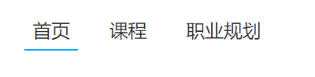

### search 搜索区域

#### 实现方法

标签结构：.search > input + a / button

#### 布局思路

`div.search` 标签 flex 布局，侧轴居中

input 标签 flex：1

#### 代码

```html
<div class="search">
  <input type="text" placeholder="请输入关键词" />
  <a href="#"></a>
</div>
```

```css
.search{
  display: flex;
  margin-left: 64px;
  padding-left: 19px;
  padding-right: 12px;
  width: 412px;
  height: 40px;
  background-color: #f3f5f7;
  border-radius: 20px;
}
.search input {
  flex: 1;
  border: 0;
  background-color: transparent;
  outline: none;
}
.search input::placeholder{
  font-size: 14px;
  color: #999;
}
.search a{
  width: 16px;
  height: 16px;
  background-image: url('../images/search.png');
  align-self: center;
}
```

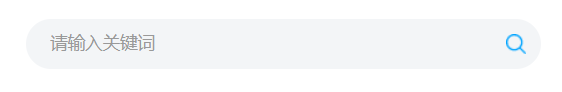

### user 用户区域

#### 实现方法

标签结构：.user > a > img + span

#### 布局技巧

图片、文字垂直方向居中

#### 代码

```html
<div class="user">
  <a href="#">
    
    <span>张三</span>
  </a>
</div>
```

```css
.user {
  margin-left: 32px;
  margin-top: 4px;
}
.user img {
  vertical-align: middle;
  margin-right: 7px;
}
.user span{
  font-size: 16px;
  color: #666;
}
```

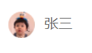

## banner 区域

标签结构：通栏banner > 版心 > .left + .right

```html
<div class="banner">
  <div class="wrapper">
    <div class="left">1</div>
    <div class="right">2</div>
  </div>
</div>
```

```css
.banner {
  height: 420px;
  background-color: #0092cb;
}

.banner .wrapper {
  height: 420px;
  justify-content: space-between;
  background-image: url('../uploads/banner.png');
  display: flex;
}
```

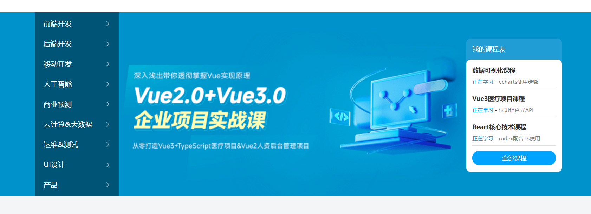

### left 左侧导航

#### 实现方法

标签结构：.left > ul > li * 9 > a

#### 布局思路

a 默认状态：背景图为白色右箭头

a 鼠标悬停状态：背景图为蓝色右箭头

#### 代码

```html
<div class="left">
  <ul>
    <li><a href="#">前端开发</a></li>
    <li><a href="#">后端开发</a></li>
    <li><a href="#">移动开发</a></li>
    <li><a href="#">人工智能</a></li>
    <li><a href="#">商业预测</a></li>
    <li><a href="#">云计算&大数据</a></li>
    <li><a href="#">运维&测试</a></li>
    <li><a href="#">UI设计</a></li>
    <li><a href="#">产品</a></li>
  </ul>
</div>
```

```css
.banner .left {
  padding: 3px 20px;
  width: 191px;
  height: 420px;
  background-color: rgba(0, 0, 0, 0.42);
}
.banner .left a {
  display: block;
  height: 46px;
  background: url('../images/right.png') no-repeat right center;
  line-height: 46px;
  font-size: 16px;
  color: #fff;
}
.banner .left a:hover {
  background-image: url('../images/right-hover.png');
  color: #00a4ff;
}
```

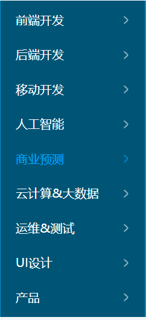

### right 右侧课程表

#### 实现方法

标签结构：.right > h3 + .content

#### 代码

```html
<div class="right">
  <h3>我的课程表</h3>
  <div class="content">
    <dl>
      <dt>数据可视化课程</dt>
      <dd>
        <span>正在学习</span>
        -
        <strong>echarts使用步骤</strong>
      </dd>
    </dl>
    <dl>
      <dt>Vue3医疗项目课程</dt>
      <dd>
        <span>正在学习</span>
        -
        <strong>认识组合式API</strong>
      </dd>
    </dl>
    <dl>
      <dt>React核心技术课程</dt>
      <dd>
        <span>正在学习</span>
        -
        <strong>rudex配合TS使用</strong>
      </dd>
    </dl>
    <a href="#">全部课程</a>
  </div>
</div>
```

```css
.banner .right {
  margin-top: 60px;
  width: 218px;
  height: 305px;
  background-color: #209dd5;
  border-radius: 10px;
}
.banner .right h3 {
  margin-left: 14px;
  height: 48px;
  line-height: 48px;
  font-size: 15px;
  color: #fff;
  font-weight: 400;
}
.banner .right .content{
  padding: 14px;
  height: 257px;
  background-color: #fff;
  border-radius: 10px;
}
.banner .right dl {
  margin-bottom: 12px;
  border-bottom: 1px solid #e0e0e0;
}
.banner .right dl dt{
  margin-bottom: 8px;
  font-size: 14px;
  line-height: 20px;
  font-weight: 700;
}
.banner .right dl dd {
  margin-bottom: 8px;
  font-size: 12px;
  line-height: 16px;
}
.banner .right dl dd span {
  color: #00a4ff;
}
.banner .right dl dd strong {
  color: #7d7d7d;
  font-weight: 400;
}
.banner .right a {
  display: block;
  height: 32px;
  background-color: #00a4ff;
  text-align: center;
  line-height: 32px;
  font-size: 14px;
  color: #fff;
  border-radius: 15px;
}
```

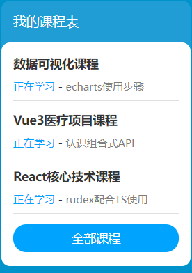

## recommend 精品推荐

#### 实现方法

标签结构：.recommend > h3 +ul +a.modify

#### 布局思路

flex 布局

#### 代码

```html
<div class="recommend wrapper">
  <h3>精品推荐</h3>
  <ul>
    <li><a href="#">HTML</a></li>
    <li><a href="#">CSS</a></li>
    <li><a href="#">JavaScript</a></li>
    <li><a href="#">Node.js</a></li>
    <li><a href="#">Ajax</a></li>
    <li><a href="#">Vue2.0</a></li>
    <li><a href="#">Vue3.0</a></li>
    <li><a href="#">TypeScript</a></li>
    <li><a href="#">React</a></li>
  </ul>
  <a href="#" class="modify">修改兴趣</a>
</div>
```

```css
.recommend {
  display: flex;
  margin-top: 11px;
  padding: 0 20px;
  height: 60px;
  background-color: #fff;
  box-shadow: 0px 1px 2px 0px rgba(211, 211, 211, 0.5);
  line-height: 60px;
}
.recommend h3 {
  font-size: 18px;
  color: #00a4ff;
  font-weight: 400;
}
.recommend ul {
  flex: 1;
  display: flex;
}
.recommend ul li a{
  padding: 0 24px;
  border-right: 1px solid #e0e0e0;
  font-size: 18px;
}
.recommend ul li:last-child a {
  border-right: 0;
}
.recommend .modify {
  font-size: 16px;
  color: #00a4ff;
}
```

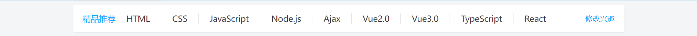

## course 精品课程

#### 实现方法

标签结构：.hd + .bd

#### 布局思路

盒子模型

### 标题区域

#### 思路

“标题”与“查看全部”各个区域样式复用

标签结构：.hd > h3 + a.more

#### 代码

```html
<div class="course wrapper">
  <div class="hd">
    <h3>精品推荐</h3>
    <a href="#" class="more">查看全部</a>
  </div>
  <div class="bd">bd</div>
</div>
```

```css
.course {
  margin-top: 15px;
}
.hd {
  display: flex;
  justify-content: space-between;
  height: 60px;
  line-height: 60px;
}
.hd h3{
  font-size: 21px;
  font-weight: 400;
}
.hd .more {
  padding-right: 20px;
  background: url('../images/more.png') no-repeat right center;
  font-size: 14px;
  color: #999;
}
```

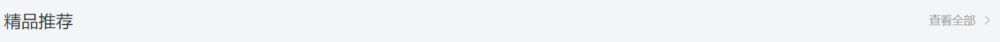

### 内容区域

#### 思路

“课程卡片”各个区域样式复用

标签结构：.bd > ul > li > a

#### 代码

```html
<div class="course wrapper">
  <div class="hd">...</div>
  <div class="bd">
    <ul>
      <li>
        <a href="#">
          <div class="pic">
            
          </div>
          <div class="text">
            <h4>JavaScript数据看板项目实战</h4>
            <p>
              <span>高级</span>
              -
              <i>1125</i>
              人在学习
            </p>
          </div>
        </a>
      </li>
      <li>
        <a href="#">
          <div class="pic">
            
          </div>
          <div class="text">
            <h4>Vue.js实战——面试全端项目</h4>
            <p>
              <span>高级</span>
              -
              <i>2726</i>
              人在学习
            </p>
          </div>
        </a>
      </li>
      <li>
        <a href="#">
          <div class="pic">
            
          </div>
          <div class="text">
            <h4>玩转Vue全家桶，iHRM人力资源项目</h4>
            <p>
              <span>高级</span>
              -
              <i>9456</i>
              人在学习
            </p>
          </div>
        </a>
      </li>
      <li>
        <a href="#">
          <div class="pic">
            
          </div>
          <div class="text">
            <h4>Vue.js实战医疗项目——优医问诊</h4>
            <p>
              <span>高级</span>
              -
              <i>7192</i>
              人在学习
            </p>
          </div>
        </a>
      </li>
      <li>
        <a href="#">
          <div class="pic">
            
          </div>
          <div class="text">
            <h4>小程序实战：小兔鲜电商小程序项目</h4>
            <p>
              <span>高级</span>
              -
              <i>2703</i>
              人在学习
            </p>
          </div>
        </a>
      </li>
      <li>
        <a href="#">
          <div class="pic">
            
          </div>
          <div class="text">
            <h4>前端框架Flutter开发实战</h4>
            <p>
              <span>高级</span>
              -
              <i>2841</i>
              人在学习
            </p>
          </div>
        </a>
      </li>
      <li>
        <a href="#">
          <div class="pic">
            
          </div>
          <div class="text">
            <h4>熟练使用React.js——极客园H5项目</h4>
            <p>
              <span>高级</span>
              -
              <i>95682</i>
              人在学习
            </p>
          </div>
        </a>
      </li>
      <li>
        <a href="#">
          <div class="pic">
            
          </div>
          <div class="text">
            <h4>熟练使用React.js——极客园PC端项目</h4>
            <p>
              <span>高级</span>
              -
              <i>904</i>
              人在学习
            </p>
          </div>
        </a>
      </li>
      <li>
        <a href="#">
          <div class="pic">
            
          </div>
          <div class="text">
            <h4>前端实用技术，Fetch API实战</h4>
            <p>
              <span>高级</span>
              -
              <i>1516</i>
              人在学习
            </p>
          </div>
        </a>
      </li>
      <li>
        <a href="#">
          <div class="pic">
            
          </div>
          <div class="text">
            <h4>前端高级Node.js零基础入门教程</h4>
            <p>
              <span>高级</span>
              -
              <i>2766</i>
              人在学习
            </p>
          </div>
        </a>
      </li>
    </ul>
  </div>
</div>
```

```css
.bd ul {
  display: flex;
  flex-wrap: wrap;
  justify-content: space-between;
}
.bd li {
  margin-bottom: 14px;
  width: 228px;
  height: 271px;
  background-color: pink;
}
.bd li .pic{
  height: 156px;
}
.bd li .text {
  padding: 20px;
  height: 115px;
  background-color: #fff;
}
.bd li .text h4 {
  margin-bottom: 13px;
  height: 40px;
  font-size: 14px;
  line-height: 20px;
  font-weight: 400;
}
.bd li .text p{
  font-size: 14px;
  line-height: 20px;
  color: #999;
}
.bd li .text p span {
  color: #fa6400;
}
.bd li .text p i{
  font-style: normal;
}
```

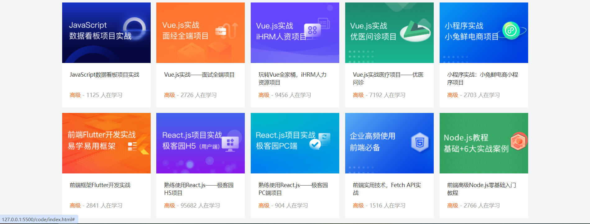

## 学科课程

标签结构：.hd（复用样式）+.bd

### 标题

标签结构：h3 + ul + a.more

tab栏/选型卡：菜单个数与内容个数相同

### 内容

标签结构：.left + .right > .top + .bottom

### 代码

```html
<div class="wrapper">
  <div class="hd">
    <h3>前端开发工程师</h3>
    <ul>
      <li><a href="#" class="active">热门</a></li>
      <li><a href="#">初级</a></li>
      <li><a href="#">中级</a></li>
      <li><a href="#">高级</a></li>
    </ul>
    <a href="#" class="more">查看全部</a>
  </div>
  <div class="bd">
    <div class="left">
      
    </div>
    <div class="right">
      <div class="top">
        
      </div>
      <div class="bottom">
        <ul>
          <li>
            <a href="#">
              <div class="pic">
                
              </div>
              <div class="text">
                <h4>JS高级JavaScript进阶面向对象</h4>
                <p>
                  <span>高级</span>
                  -
                  <i>101937</i>
                  人在学习
                </p>
              </div>
            </a>
          </li>
          <li>
            <a href="#">
              <div class="pic">
                
              </div>
              <div class="text">
                <h4>零基础玩转微信小程序</h4>
                <p>
                  <span>高级</span>
                  -
                  <i>133781</i>
                  人在学习
                </p>
              </div>
            </a>
          </li>
          <li>
            <a href="#">
              <div class="pic">
                
              </div>
              <div class="text">
                <h4>JavaScript基础——语法解析+项目实战</h4>
                <p>
                  <span>高级</span>
                  -
                  <i>8927</i>
                  人在学习
                </p>
              </div>
            </a>
          </li>
          <li>
            <a href="#">
              <div class="pic">
                
              </div>
              <div class="text">
                <h4>前端框架Vue2+Vue3全套视频</h4>
                <p>
                  <span>高级</span>
                  -
                  <i>26022</i>
                  人在学习
                </p>
              </div>
            </a>
          </li>
        </ul>
      </div>
    </div>
  </div>
</div>
```

```css
.hd ul {
  display: flex;
}
.hd li {
  margin-right: 60px;
  font-size: 16px;
}
.hd li .active {
  color: #00a4ff;
}
.bd {
  display: flex;
  justify-content: space-between;
}
.bd .left {
  width: 228px;
}
.bd .right {
  width: 957px;
}
.bd .right .top {
  margin-bottom: 15px;
  height: 100px;
}
```

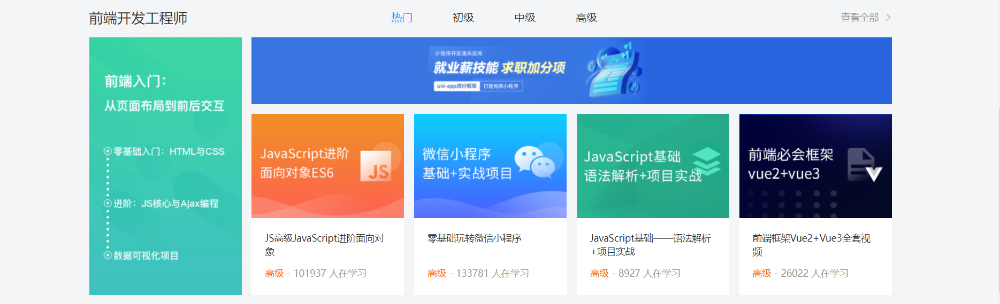

## footer 版权区域

标签结构：通栏 > 版心 > .left + .right > dl

#### 代码

```html
<div class="footer">
  <div class="wrapper">
    <div class="left">
      <a href="#"></a>
      <p>
        学成在线致力于普及中国最好的教育它与中国一流大学和机构合作提供在线课程。
        © 2017年XTCG Inc.保留所有权利。-沪ICP备15025210号
      </p>
      <a href="#" class="download">下载APP</a>
    </div>
    <div class="right">
      <dl>
        <dt>关于学成网</dt>
        <dd><a href="#">关于</a></dd>
        <dd><a href="#">管理团队</a></dd>
        <dd><a href="#">工作机会</a></dd>
        <dd><a href="#">客户服务</a></dd>
        <dd><a href="#">帮助</a></dd>
      </dl>
      <dl>
        <dt>新手指南</dt>
        <dd><a href="#">如何注册</a></dd>
        <dd><a href="#">如何选课</a></dd>
        <dd><a href="#">如何拿到毕业证</a></dd>
        <dd><a href="#">学分是什么</a></dd>
        <dd><a href="#">考试未通过怎么办</a></dd>
      </dl>
      <dl>
        <dt>合作伙伴</dt>
        <dd><a href="#">合作机构</a></dd>
        <dd><a href="#">合作导师</a></dd>
      </dl>
    </div>
  </div>
</div>
```

```css
.footer{
  margin-top: 60px;
  padding-top: 60px;
  height: 273px;
  background-color: #fff;
}
.footer .wrapper {
  display: flex;
  justify-content: space-between;
}
.footer .left {
  width: 440px;
}
.footer .left p {
  margin-top: 24px;
  margin-bottom: 14px;
  font-size: 12px;
  line-height: 17px;
  color: #666;
}
.footer .left .download {
  display: block;
  width: 120px;
  height: 36px;
  border: 1px solid #00a4ff;
  text-align: center;
  line-height: 34px;
  font-size: 16px;
  color: #00a4ff;
}
.footer .right{
  display: flex;
}
.footer .right dl {
  margin-left: 130px;
}
.footer .right dl dt {
  margin-bottom: 12px;
  font-size: 16px;
  line-height: 23px;
}
.footer .right dl dd a{
  font-size: 14px;
  color: #666;
  line-height: 24px;
}
```

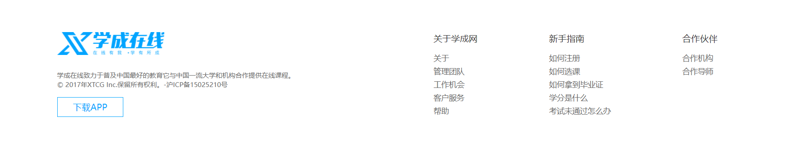