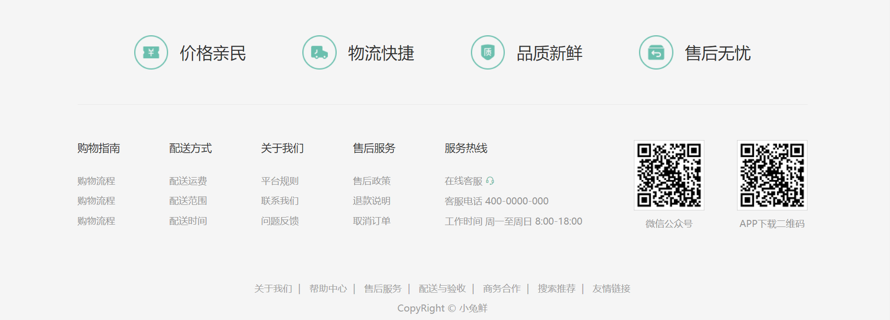
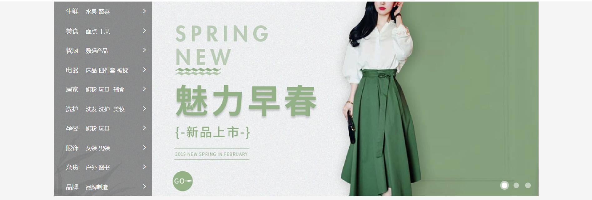
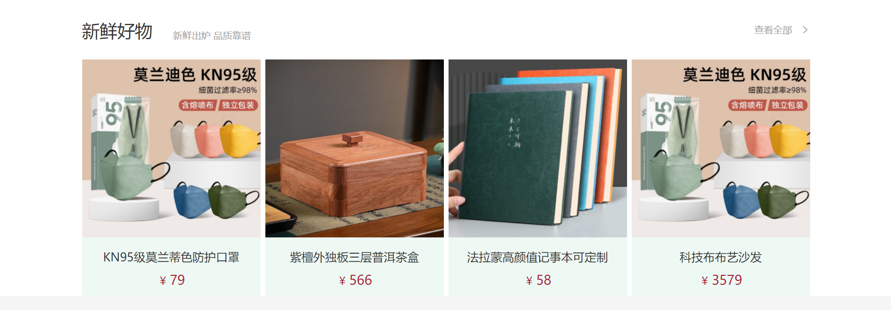
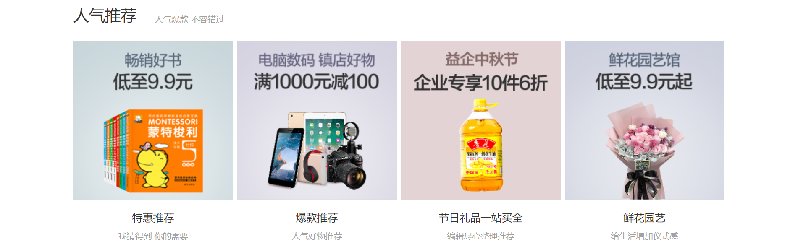
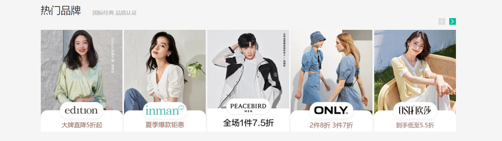
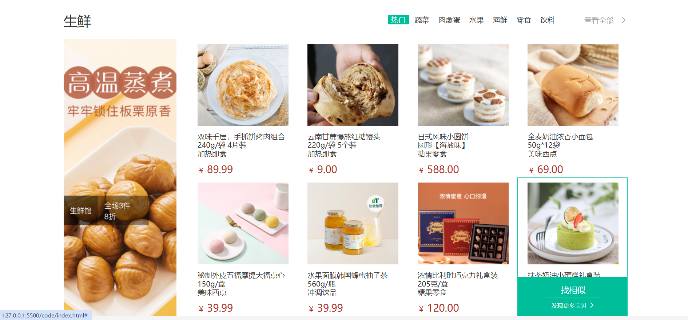
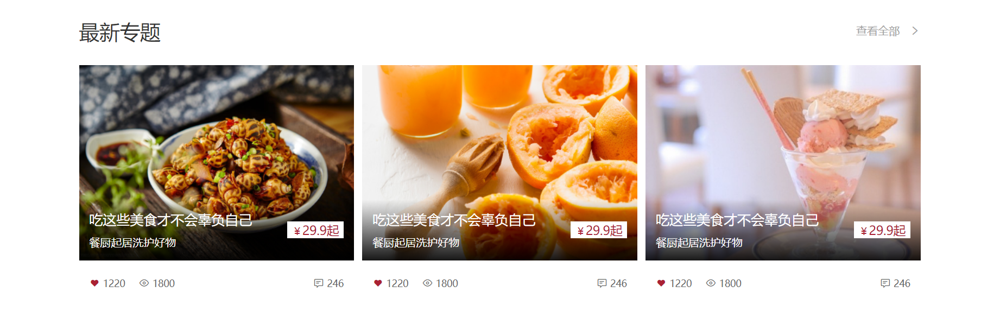

# 小兔鲜

## 项目目录

```txt
code
├── images
├── uploads
├── iconfont
├── css
│   ├── base.css
│   ├── common.css
│   └── index.css
├── favicon.ico
└── index.html
```

+ `iconfont`：字体图标素材
+ `css/common.css`：各个网页相同模块的重复样式，例如：头部、底部
+ `favicon.ico`：网页图标，出现在浏览器标题栏

## 版心

wrapper 版心宽度：1240px

```css
/* common.css */

.wrapper {
  margin: 0 auto;
  width: 1240px;
}
```

## 快捷导航（shortcut）

结构：通栏>版心>导航 ul

布局：flex-end

```html
<div class="shortcut">
  <div class="wrapper">
    <ul>
      <li><a href="#" class="login">请先登录</a></li>
      <li><a href="#">免费注册</a></li>
      <li><a href="#">我的订单</a></li>
      <li><a href="#">会员中心</a></li>
      <li><a href="#">帮助中心</a></li>
      <li><a href="#">在线客服</a></li>
      <li>
        <a href="#">
          <span class="iconfont icon-mobile-phone"></span>
          手机版
        </a>
      </li>
    </ul>
  </div>
</div>
```

```css
/* common.css */

.shortcut {
  height: 52px;
  background-color: #333;
}

.shortcut .wrapper {
  display: flex;
  justify-content: flex-end;
  height: 52px;
}

.shortcut ul {
  display: flex;
  line-height: 52px;
}

.shortcut li a{
  padding: 0 15px;
  border-right: 1px solid #999;
  font-size: 14px;
  color: #fff;
}

.shortcut li:last-child a {
  border-right: 0;
}

.shortcut li .iconfont {
  margin-right: 4px;
  vertical-align: middle;
}

.shortcut li .login {
  color: #5eb69c;
}
```


## 头部（header）

结构：.header > logo + 导航（nav）+搜索（search）+购物车（cart）

```html
<div class="header wrapper">
  <div class="logo">
    <h1><a href="#">小兔鲜儿</a></h1>
  </div>
  <div class="nav">
    <ul>
      <li><a href="#">首页</a></li>
      <li><a href="#">生鲜</a></li>
      <li><a href="#">美食</a></li>
      <li><a href="#">餐厨</a></li>
      <li><a href="#">电器</a></li>
      <li><a href="#">居家</a></li>
      <li><a href="#">洗护</a></li>
      <li><a href="#">孕婴</a></li>
      <li><a href="#">服装</a></li>
    </ul>
  </div>
  <div class="search">
    <span class="iconfont icon-search"></span>
    <input type="text" placeholder="搜一搜" />
  </div>
  <div class="cart">
    <span class="iconfont icon-cart-full"></span>
    <i>2</i>
  </div>
</div>
```

```css
/* common.css */

.header {
  display: flex;
  margin-top: 22px;
  margin-bottom: 22px;
  height: 88px;
}

.logo {
  margin-right: 40px;
  width: 200px;
  height: 88px;
}

.logo a {
  display: block;
  width: 200px;
  height: 88px;
  background-image: url('../images/logo.png');
  font-size: 0;
}

.nav {
  margin-top: 33px;
  margin-right: 28px;
}

.nav ul {
  display: flex;
}

.nav li {
  margin-right: 47px;
}

.nav li a{
  padding-bottom: 10px;
}

.nav li a:hover{
  border-bottom: 2px solid #5eb69c;
  color: #5eb69c;
}

.search {
  display: flex;
  margin-top: 33px;
  margin-right: 45px;
  width: 170px;
  height: 34px;
  border-bottom: 2px solid #f4f4f4;
}

.search .iconfont {
  margin-right: 8px;
  font-size: 18px;
  color: #ccc;
}

.search input {
  flex: 1;
  width: 0;
}

.search input::placeholder{
  font-size: 16px;
  color: #ccc;
}

.cart {
  position: relative;
  margin-top: 32px;
}

.cart .iconfont {
  font-size: 24px;
}

.cart i {
  position: absolute;
  top: 1px;
  left: 15px;
  padding: 0 6px;
  height: 15px;
  background-color: #E26237;
  border-radius: 8px;
  font-size: 14px;
  color: #fefefe;
  line-height: 15px;
}
```


## 底部（footer）

结构：通栏 > 版心 > 服务（service）+帮助中心（help）+版权（copyright）

```html
<div class="footer">
  <div class="wrapper">
    <div class="service">
      <ul>
        <li>
          <h5></h5>
          <p>价格亲民</p>
        </li>
        <li>
          <h5></h5>
          <p>物流快捷</p>
        </li>
        <li>
          <h5></h5>
          <p>品质新鲜</p>
        </li>
        <li>
          <h5></h5>
          <p>售后无忧</p>
        </li>
      </ul>
    </div>
    <div class="help">
      <div class="left">
        <dl>
          <dt>购物指南</dt>
          <dd><a href="#">购物流程</a></dd>
          <dd><a href="#">购物流程</a></dd>
          <dd><a href="#">购物流程</a></dd>
        </dl>
        <dl>
          <dt>配送方式</dt>
          <dd><a href="#">配送运费</a></dd>
          <dd><a href="#">配送范围</a></dd>
          <dd><a href="#">配送时间</a></dd>
        </dl>
        <dl>
          <dt>关于我们</dt>
          <dd><a href="#">平台规则</a></dd>
          <dd><a href="#">联系我们</a></dd>
          <dd><a href="#">问题反馈</a></dd>
        </dl>
        <dl>
          <dt>售后服务</dt>
          <dd><a href="#">售后政策</a></dd>
          <dd><a href="#">退款说明</a></dd>
          <dd><a href="#">取消订单</a></dd>
        </dl>
        <dl>
          <dt>服务热线</dt>
          <dd>
            <a href="#">
              在线客服
              <span class="iconfont icon-customer-service"></span>
            </a>
          </dd>
          <dd><a href="#">客服电话 400-0000-000</a></dd>
          <dd><a href="#">工作时间 周一至周日 8:00-18:00</a></dd>
        </dl>
      </div>
      <div class="right">
        <ul>
          <li>
            <div class="pic">
              
            </div>
            <p>微信公众号</p>
          </li>
          <li>
            <div class="pic">
              
            </div>
            <p>APP下载二维码</p>
          </li>
        </ul>
      </div>
    </div>
    <div class="copyright">
      <p>
        <a href="#">关于我们</a>| <a href="#">帮助中心</a>|
        <a href="#">售后服务</a>| <a href="#">配送与验收</a>|
        <a href="#">商务合作</a>| <a href="#">搜索推荐</a>|
        <a href="#">友情链接</a>
      </p>
      <p>CopyRight © 小兔鲜</p>
    </div>
  </div>
</div>
```

```css
.footer {
  height: 580px;
  background-color: #f5f5f5;
}

.service {
  padding: 60px 0;
  height: 178px;
  border-bottom: 1px solid #e8e8e8;
}

.service ul {
  display: flex;
  justify-content: space-evenly;
}

.service li {
  display: flex;
  width: 190px;
  height: 58px;
}

.service li h5 {
  margin-right: 20px;
  width: 58px;
  height: 58px;
  background-image: url('../images/sprite.png');
}

.service li p {
  font-size: 28px;
  line-height: 58px;
}

.service li:nth-child(2) h5 {
  background-position: 0 -58px;
}
.service li:nth-child(3) h5 {
  background-position: 0 -116px;
}
.service li:nth-child(4) h5 {
  background-position: 0 -174px;
}

.help {
  display: flex;
  justify-content: space-between;
  padding-top: 60px;
  height: 300px;
}

.help .left {
  display: flex;
}

.help .left dl {
  margin-right: 84px;
}

.help .left dl:last-child {
  margin-right: 0;
}

.help .left dt {
  margin-bottom: 30px;
  font-size: 18px;
}

.help .left dd {
  margin-bottom: 10px;
}

.help .left a {
  color: #969696;
}

.help .left .iconfont {
  color: #5eb69c;
}

.help .right ul {
  display: flex;
}

.help .right li:first-child {
  margin-right: 55px;
}

.help .right .pic {
  margin-bottom: 10px;
  width: 120px;
  height: 120px;
}

.help .right p {
  color: #969696;
  text-align: center;
}

.copyright {
  text-align: center;
}

.copyright p {
  margin-bottom: 10px;
  color: #a1a1a1;
}

.copyright p a {
  margin: 0 10px;
  color: #a1a1a1;
}
```



## banner

结构：通栏 > 版心 > 轮播图(ul.pic) + 侧导航(subnav > ul) + 圆点指示器(ol)

布局：定位（子绝父相）

```html
<div class="banner">
  <div class="wrapper">
    <ul class="pic">
      <li>
        <a href="#"></a>
      </li>
      <li>
        <a href="#"></a>
      </li>
      <li>
        <a href="#"></a>
      </li>
    </ul>
    <div class="subnav">
      <ul>
        <li>
          <div>
            <a href="#" class="classify">生鲜</a>
            <a href="#">水果</a><a href="#">蔬菜</a>
          </div>
          <span class="iconfont icon-arrow-right-bold"></span>
        </li>
        <li>
          <div>
            <a href="#" class="classify">美食</a>
            <a href="#">面点</a><a href="#">干果</a>
          </div>
          <span class="iconfont icon-arrow-right-bold"></span>
        </li>
        <li>
          <div>
            <a href="#" class="classify">餐厨</a>
            <a href="#">数码产品</a>
          </div>
          <span class="iconfont icon-arrow-right-bold"></span>
        </li>
        <li>
          <div>
            <a href="#" class="classify">电器</a>
            <a href="#">床品</a><a href="#">四件套</a><a href="#">被枕</a>
          </div>
          <span class="iconfont icon-arrow-right-bold"></span>
        </li>
        <li>
          <div>
            <a href="#" class="classify">居家</a>
            <a href="#">奶粉</a><a href="#">玩具</a>
            <a href="#">辅食</a>
          </div>
          <span class="iconfont icon-arrow-right-bold"></span>
        </li>
        <li>
          <div>
            <a href="#" class="classify">洗护</a>
            <a href="#">洗发</a><a href="#">洗护</a>
            <a href="#">美妆</a>
          </div>
          <span class="iconfont icon-arrow-right-bold"></span>
        </li>
        <li>
          <div>
            <a href="#" class="classify">孕婴</a>
            <a href="#">奶粉</a><a href="#">玩具</a>
          </div>
          <span class="iconfont icon-arrow-right-bold"></span>
        </li>
        <li>
          <div>
            <a href="#" class="classify">服饰</a>
            <a href="#">女装</a><a href="#">男装</a>
          </div>
          <span class="iconfont icon-arrow-right-bold"></span>
        </li>
        <li>
          <div>
            <a href="#" class="classify">杂货</a>
            <a href="#">户外</a><a href="#">图书</a>
          </div>
          <span class="iconfont icon-arrow-right-bold"></span>
        </li>
        <li>
          <div>
            <a href="#" class="classify">品牌</a>
            <a href="#">品牌制造</a>
          </div>
          <span class="iconfont icon-arrow-right-bold"></span>
        </li>
      </ul>
    </div>
    <ol>
      <li class="current"><i></i></li>
      <li><i></i></li>
      <li><i></i></li>
    </ol>
  </div>
</div>
```

```css
/* index.css */

.banner {
  height: 500px;
  background-color: #f5f5f5;
}

.banner .wrapper {
  position: relative;
  height: 500px;
  overflow: hidden;

  background-color: pink;
}

.banner .pic {
  display: flex;
  width: 3720px;
}

.subnav {
  position: absolute;
  left: 0;
  top: 0;
  width: 250px;
  height: 500px;
  background-color: rgba(0, 0, 0, 0.42);
}

.subnav li {
  display: flex;
  justify-content: space-between;
  padding-left: 30px;
  padding-right: 12px;
  height: 50px;
  line-height: 50px;
  color: #fff;
  cursor: pointer;
}

.subnav li a {
  margin-right: 5px;
  font-size: 14px;
  color: #fff;
}

.subnav li .classify {
  margin-right: 14px;
  font-size: 16px;
}

.subnav li .iconfont {
  font-size: 14px;
}

.subnav li:hover {
  background-color: #00be9a;
}

.banner ol {
  position: absolute;
  bottom: 17px;
  right: 16px;
  display: flex;
}

.banner ol li {
  margin-left: 8px;
  width: 22px;
  height: 22px;
  border-radius: 50%;
  cursor: pointer;
}

.banner ol i {
  display: block;
  margin: 4px;
  width: 14px;
  height: 14px;
  background-color: rgba(255, 255, 255, 0.5);
  border-radius: 50%;
}

.banner ol .current {
  background-color: rgba(255, 255, 255, 0.5);
}

.banner ol .current i {
  background-color: #fff;
}
```



## 新鲜好物（goods）

结构：标题(title) + 内容(bd)

多区域样式共用

```html
<div class="goods wrapper">
  <div class="title">
    <div class="left">
      <h3>新鲜好物</h3>
      <p>新鲜出炉 品质靠谱</p>
    </div>
    <div class="right">
      <a href="#" class="more">
        查看全部
        <span class="iconfont icon-arrow-right-bold"></span>
      </a>
    </div>
  </div>
  <div class="bd">
    <ul>
      <li>
        <a href="#">
          <div class="pic"></div>
          <div class="txt">
            <h4>KN95级莫兰蒂色防护口罩</h4>
            <p>￥<span>79</span></p>
          </div>
        </a>
      </li>
      <li>
        <a href="#">
          <div class="pic"></div>
          <div class="txt">
            <h4>紫檀外独板三层普洱茶盒</h4>
            <p>￥<span>566</span></p>
          </div>
        </a>
      </li>
      <li>
        <a href="#">
          <div class="pic"></div>
          <div class="txt">
            <h4>法拉蒙高颜值记事本可定制</h4>
            <p>￥<span>58</span></p>
          </div>
        </a>
      </li>
      <li>
        <a href="#">
          <div class="pic"></div>
          <div class="txt">
            <h4>科技布布艺沙发</h4>
            <p>￥<span>3579</span></p>
          </div>
        </a>
      </li>
    </ul>
  </div>
</div>
```

```css
/* index.css */

.title {
  display: flex;
  justify-content: space-between;
  margin-top: 40px;
  margin-bottom: 30px;
  height: 42px;
}

.title .left {
  display: flex;
}

.title .left h3 {
  margin-right: 35px;
  font-size: 30px;
}

.title .left p {
  align-self: flex-end;
  color: #a1a1a1;
}

.title .right .more {
  line-height: 42px;
  color: #a1a1a1;
}

.title .right .more .iconfont {
  margin-left: 10px;
}

.bd ul {
  display: flex;
  justify-content: space-between;
}

.bd li {
  width: 304px;
  height: 404px;
  background-color: #eef9f4;
}

.bd li .pic {
  width: 304px;
  height: 304px;
}

.bd li .txt {
  text-align: center;
}

.bd li h4 {
  margin-top: 18px;
  margin-bottom: 8px;
  font-size: 20px;
}

.goods .bd p {
  font-size: 18px;
  color: #aa2133;
}

.goods .bd p span {
  margin-left: 3px;
  font-size: 22px;
}
```



## 人气推荐

```html
<div class="recommend wrapper">
  <div class="title">
    <div class="left">
      <h3>人气推荐</h3>
      <p>人气爆款 不容错过</p>
    </div>
  </div>
  <div class="bd">
    <ul>
      <li>
        <a href="#">
          <div class="pic">
            
          </div>
          <div class="txt">
            <h4>特惠推荐</h4>
            <p>我猜得到 你的需要</p>
          </div>
        </a>
      </li>
      <li>
        <a href="#">
          <div class="pic">
            
          </div>
          <div class="txt">
            <h4>爆款推荐</h4>
            <p>人气好物推荐</p>
          </div>
        </a>
      </li>
      <li>
        <a href="#">
          <div class="pic">
            
          </div>
          <div class="txt">
            <h4>节日礼品一站买全</h4>
            <p>编辑尽心整理推荐</p>
          </div>
        </a>
      </li>
      <li>
        <a href="#">
          <div class="pic">
            
          </div>
          <div class="txt">
            <h4>鲜花园艺</h4>
            <p>给生活增加仪式感</p>
          </div>
        </a>
      </li>
    </ul>
  </div>
</div>
```

```css
/* index.css */

.recommend .bd li {
  background-color: #fff;
}

.recommend .bd p {
  color: #a1a1a1;
}
```



## 热门品牌（brand）

标题结构：左侧(left) + 右侧箭头(显示在标题外部：定位)

```html
<div class="brand">
  <div class="wrapper">
    <div class="title">
      <div class="left">
        <h3>热门品牌</h3>
        <p>国际经典 品质认证</p>
      </div>
      <div class="button">
        <a href="#" class="prev">
          <i class="iconfont icon-arrow-left-bold"></i>
        </a>
        <a href="#" class="next">
          <i class="iconfont icon-arrow-right-bold"></i>
        </a>
      </div>
    </div>
    <div class="bd">
      <ul>
        <li>
          <a href="#"></a>
        </li>
        <li>
          <a href="#"></a>
        </li>
        <li>
          <a href="#"></a>
        </li>
        <li>
          <a href="#"></a>
        </li>
        <li>
          <a href="#"></a>
        </li>
      </ul>
    </div>
  </div>
</div>
```

```css
.brand {
  margin-top: 60px;
  height: 468px;
  background-color: #f5f5f5;
}

.brand .wrapper {
  overflow: hidden;
  height: 488px;
}

.brand .title {
  position: relative;
  margin-bottom: 40px;
}

.brand .button {
  position: absolute;
  right: 0;
  bottom: -25px;
  display: flex;
}

.brand .button a {
  margin-left: 12px;
  width: 20px;
  height: 20px;
  text-align: center;
  line-height: 20px;
  color: #fff;
}

.brand .button .prev {
  background-color: #ddd;
}

.brand .button .next {
  background-color: #00be9a;
}

.brand .bd li {
  width: 244px;
  height: 306px;
}
```



## 生鲜（fresh）

标题结构：右侧(right) > 菜单(ul) + 查看全部

内容(content)：.left + .right > 商品(ul)

```html
<div class="fresh wrapper">
  <div class="title">
    <div class="left">
      <h3>生鲜</h3>
    </div>
    <div class="right">
      <ul>
        <li><a href="#" class="active">热门</a></li>
        <li><a href="#">蔬菜</a></li>
        <li><a href="#">肉禽蛋</a></li>
        <li><a href="#">水果</a></li>
        <li><a href="#">海鲜</a></li>
        <li><a href="#">零食</a></li>
        <li><a href="#">饮料</a></li>
      </ul>
      <a href="#" class="more">
        查看全部
        <span class="iconfont icon-arrow-right-bold"></span>
      </a>
    </div>
  </div>
  <div class="content">
    <div class="left">
      <a href="#"></a>
    </div>
    <div class="right">
      <ul>
        <li>
          <a href="#">
            <div class="pic"></div>
            <div class="txt">
              <div class="info">
                <h4>双味千层，手抓饼烤肉组合</h4>
                <p>240g/袋 4片装</p>
                <p>加热即食</p>
              </div>
              <p class="price">￥<span>89.99</span></p>
            </div>
          </a>
          <div class="cover">
            <p>找相似</p>
            <p></p>
            <p>
              发现更多宝贝
              <span class="iconfont icon-arrow-right-bold"></span>
            </p>
          </div>
        </li>
        <li>
          <a href="#">
            <div class="pic"></div>
            <div class="txt">
              <div class="info">
                <h4>云南甘蔗慢熬红糖馒头</h4>
                <p>220g/袋 5个装</p>
                <p>加热即食</p>
              </div>
              <p class="price">￥<span>9.00</span></p>
            </div>
          </a>
          <div class="cover">
            <p>找相似</p>
            <p></p>
            <p>
              发现更多宝贝
              <span class="iconfont icon-arrow-right-bold"></span>
            </p>
          </div>
        </li>
        <li>
          <a href="#">
            <div class="pic"></div>
            <div class="txt">
              <div class="info">
                <h4>日式风味小圆饼</h4>
                <p>圆形【海盐味】</p>
                <p>糖果零食</p>
              </div>
              <p class="price">￥<span>588.00</span></p>
            </div>
          </a>
          <div class="cover">
            <p>找相似</p>
            <p></p>
            <p>
              发现更多宝贝
              <span class="iconfont icon-arrow-right-bold"></span>
            </p>
          </div>
        </li>
        <li>
          <a href="#">
            <div class="pic"></div>
            <div class="txt">
              <div class="info">
                <h4>全麦奶油浓香小面包</h4>
                <p>50g*12袋</p>
                <p>美味西点</p>
              </div>
              <p class="price">￥<span>69.00</span></p>
            </div>
          </a>
          <div class="cover">
            <p>找相似</p>
            <p></p>
            <p>
              发现更多宝贝
              <span class="iconfont icon-arrow-right-bold"></span>
            </p>
          </div>
        </li>
        <li>
          <a href="#">
            <div class="pic"></div>
            <div class="txt">
              <div class="info">
                <h4>秘制外皮五福摩提大福点心</h4>
                <p>150g/盒</p>
                <p>美味西点</p>
              </div>
              <p class="price">￥<span>39.99</span></p>
            </div>
          </a>
          <div class="cover">
            <p>找相似</p>
            <p></p>
            <p>
              发现更多宝贝
              <span class="iconfont icon-arrow-right-bold"></span>
            </p>
          </div>
        </li>
        <li>
          <a href="#">
            <div class="pic"></div>
            <div class="txt">
              <div class="info">
                <h4>水果面膜韩国蜂蜜柚子茶</h4>
                <p>560g/瓶</p>
                <p>冲调饮品</p>
              </div>
              <p class="price">￥<span>39.99</span></p>
            </div>
          </a>
          <div class="cover">
            <p>找相似</p>
            <p></p>
            <p>
              发现更多宝贝
              <span class="iconfont icon-arrow-right-bold"></span>
            </p>
          </div>
        </li>
        <li>
          <a href="#">
            <div class="pic"></div>
            <div class="txt">
              <div class="info">
                <h4>浓情比利时巧克力礼盒装</h4>
                <p>205克/盒</p>
                <p>糖果零食</p>
              </div>
              <p class="price">￥<span>120.00</span></p>
            </div>
          </a>
          <div class="cover">
            <p>找相似</p>
            <p></p>
            <p>
              发现更多宝贝
              <span class="iconfont icon-arrow-right-bold"></span>
            </p>
          </div>
        </li>
        <li>
          <a href="#">
            <div class="pic"></div>
            <div class="txt">
              <div class="info">
                <h4>抹茶奶油小蛋糕礼盒装</h4>
                <p>220克/盒</p>
                <p>美味西点</p>
              </div>
              <p class="price">￥<span>60.00</span></p>
            </div>
          </a>
          <div class="cover">
            <p>找相似</p>
            <p></p>
            <p>
              发现更多宝贝
              <span class="iconfont icon-arrow-right-bold"></span>
            </p>
          </div>
        </li>
      </ul>
    </div>
  </div>
</div>
```

```css
.fresh .title {
  margin-top: 60px;
  margin-bottom: 20px;
}

.title .right {
  display: flex;
}

.title .right ul {
  display: flex;
  margin-top: 10px;
  margin-right: 58px;
}

.title .right ul a {
  display: block;
  margin-left: 6px;
  padding: 0 7px;
  height: 20px;
  line-height: 20px;
}

.title .right ul .active {
  background-color: #00be9a;
  color: #fff;
}

.content {
  display: flex;
  justify-content: space-between;
}

.content .left {
  width: 248px;
  height: 610px;
}

.content .right {
  width: 968px;
  height: 610px;
}

.content .right ul {
  display: flex;
  flex-wrap: wrap;
}

.content .right li {
  position: relative;
  padding: 10px 21px 0;
  width: 242px;
  height: 305px;
  border: 2px solid #fff;
  overflow: hidden;
}

.content .pic {
  width: 200px;
  height: 180px;
}

.content .info {
  margin-top: 14px;
  margin-bottom: 5px;
  height: 60px;
  line-height: 19px;
}

.content .price {
  color: #af2f22;
}

.content .price span {
  margin-left: 5px;
  font-size: 22px;
}

.content li .cover {
  position: absolute;
  left: 0;
  bottom: -86px;
  padding-top: 15px;
  width: 242px;
  height: 84px;
  background-color: #00be9a;
  text-align: center;
  color: #fff;
  transition: all 0.5s;
}

.content .cover p:first-child {
  font-size: 18px;
}

.content .cover p:nth-child(2) {
  margin: 3px auto 6px;
  width: 120px;
  height: 1px;
  background-color: rgba(255, 255, 255, 0.11);
}

.content .cover p:nth-child(3) {
  font-size: 13px;
}

.content .cover p:nth-child(3) .iconfont {
  font-size: 14px;
}

.content .right li:hover .cover {
  bottom: 0;
}

.content .right li:hover {
  border: 2px solid #00be9a;
}
```



## 最新专题（topic）

```html
<div class="topic wrapper">
  <div class="title">
    <div class="left">
      <h3>最新专题</h3>
    </div>
    <div class="right">
      <a href="#" class="more">
        查看全部
        <span class="iconfont icon-arrow-right-bold"></span>
      </a>
    </div>
  </div>
  <div class="topic_bd">
    <ul>
      <li>
        <a href="#">
          <div class="pic">
            
            <div class="cover">
              <div class="left">
                <h4>吃这些美食才不会辜负自己</h4>
                <p>餐厨起居洗护好物</p>
              </div>
              <div class="right">￥<span>29.9</span><span>起</span></div>
            </div>
          </div>
          <div class="txt">
            <div class="left">
              <p>
                <i class="iconfont icon-favorites-fill"></i>
                <span>1220</span>
              </p>
              <p>
                <i class="iconfont icon-browse"></i>
                <span>1800</span>
              </p>
            </div>
            <div class="right">
              <p>
                <i class="iconfont icon-comment"></i>
                <span>246</span>
              </p>
            </div>
          </div>
        </a>
      </li>
      <li>
        <a href="#">
          <div class="pic">
            
            <div class="cover">
              <div class="left">
                <h4>吃这些美食才不会辜负自己</h4>
                <p>餐厨起居洗护好物</p>
              </div>
              <div class="right">￥<span>29.9</span><span>起</span></div>
            </div>
          </div>
          <div class="txt">
            <div class="left">
              <p>
                <i class="iconfont icon-favorites-fill"></i>
                <span>1220</span>
              </p>
              <p>
                <i class="iconfont icon-browse"></i>
                <span>1800</span>
              </p>
            </div>
            <div class="right">
              <p>
                <i class="iconfont icon-comment"></i>
                <span>246</span>
              </p>
            </div>
          </div>
        </a>
      </li>
      <li>
        <a href="#">
          <div class="pic">
            
            <div class="cover">
              <div class="left">
                <h4>吃这些美食才不会辜负自己</h4>
                <p>餐厨起居洗护好物</p>
              </div>
              <div class="right">￥<span>29.9</span><span>起</span></div>
            </div>
          </div>
          <div class="txt">
            <div class="left">
              <p>
                <i class="iconfont icon-favorites-fill"></i>
                <span>1220</span>
              </p>
              <p>
                <i class="iconfont icon-browse"></i>
                <span>1800</span>
              </p>
            </div>
            <div class="right">
              <p>
                <i class="iconfont icon-comment"></i>
                <span>246</span>
              </p>
            </div>
          </div>
        </a>
      </li>
    </ul>
  </div>
</div>
```

```css
.topic {
  margin-bottom: 40px;
}

.topic .title {
  margin-top: 100px;
}

.topic_bd ul {
  display: flex;
  justify-content: space-between;
}

.topic_bd li {
  width: 405px;
  height: 355px;
}

.topic_bd .pic {
  position: relative;
  width: 405px;
  height: 288px;
}

.topic_bd .txt {
  display: flex;
  justify-content: space-between;
  align-items: center;
  padding: 0 15px;
  width: 405px;
  height: 67px;
  font-size: 14px;
  color: #666;
}

.topic_bd .txt .left {
  display: flex;
}

.topic_bd .txt .left p {
  margin-right: 20px;
}

.topic_bd .txt .left p:first-child i {
  color: #aa2133;
}

.topic_bd .cover {
  position: absolute;
  left: 0;
  bottom: 0;
  display: flex;
  justify-content: space-between;
  align-items: center;
  padding: 0 15px;
  width: 405px;
  height: 90px;
  background-image: linear-gradient(
    180deg,
    rgba(137, 137, 137, 0) 0%,
    rgba(0, 0, 0, 0.9) 100%
  );
}

.topic_bd .cover .left {
  color: #fff;
}

.topic_bd .cover .left h4 {
  margin-bottom: 6px;
  font-size: 20px;
}

.topic_bd .cover .right {
  padding: 0 7px;
  height: 25px;
  background-color: #fff;
  color: #aa2133;
  font-size: 15px;
}

.topic_bd .cover .right span {
  font-size: 18px;
}
```

