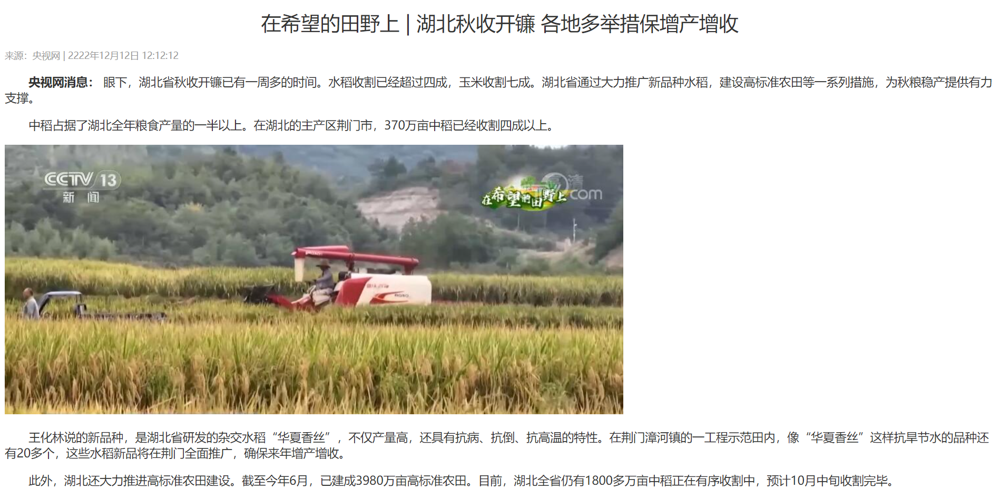
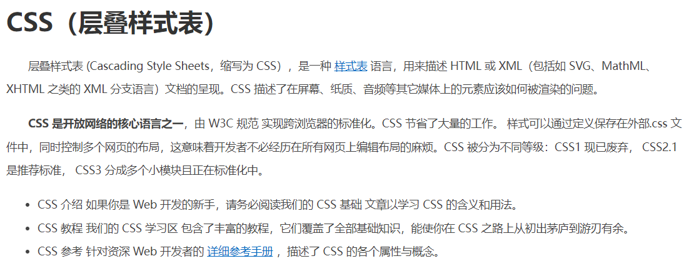
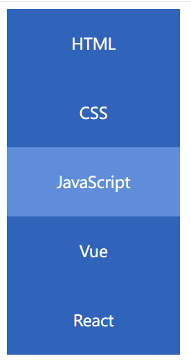
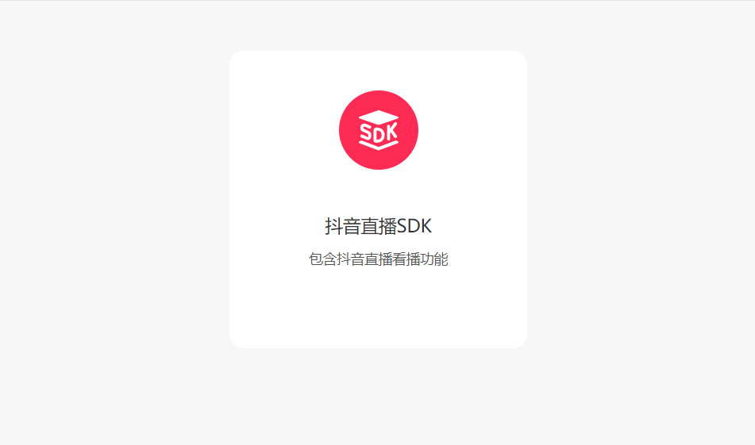
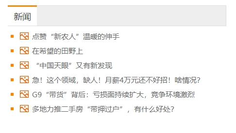
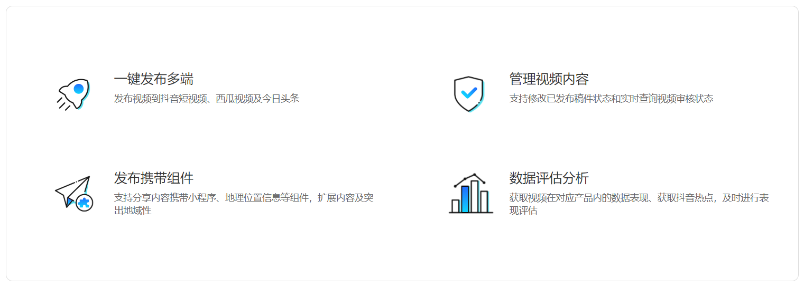
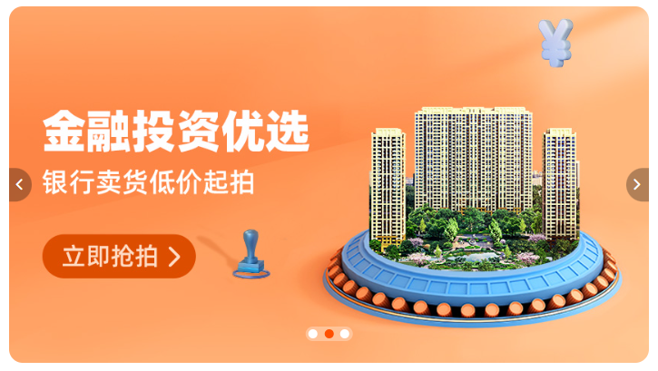

# 综合案例

## 综合案例一 - 新闻详情

```html
<head>
  <style>
    h1 {
      color: #333;
      text-align: center;
      font-size: 30px;
      font-weight: 400;
    }
    div {
      color: #999;
      font-size: 14px;
    }
    p {
      font-size: 18px;
      color: #333;
      text-indent: 2em;
    }
  </style>
</head>
<body>
  <h1>在希望的田野上 | 湖北秋收开镰 各地多举措保增产增收</h1>
  <div>来源：央视网 | 2222年12月12日 12:12:12</div>
  <p>
    <strong>央视网消息：</strong>
    眼下，湖北省秋收开镰已有一周多的时间。水稻收割已经超过四成，玉米收割七成。湖北省通过大力推广新品种水稻，建设高标准农田等一系列措施，为秋粮稳产提供有力支撑。
  </p>
  <p>
    中稻占据了湖北全年粮食产量的一半以上。在湖北的主产区荆门市，370万亩中稻已经收割四成以上。
  </p>
  <div>
    
  </div>
  <p>
    王化林说的新品种，是湖北省研发的杂交水稻“华夏香丝”，不仅产量高，还具有抗病、抗倒、抗高温的特性。在荆门漳河镇的一工程示范田内，像“华夏香丝”这样抗旱节水的品种还有20多个，这些水稻新品将在荆门全面推广，确保来年增产增收。
  </p>
  <p>
    此外，湖北还大力推进高标准农田建设。截至今年6月，已建成3980万亩高标准农田。目前，湖北全省仍有1800多万亩中稻正在有序收割中，预计10月中旬收割完毕。
  </p>
</body>
```



## 综合案例二 - CSS简介

```html
<head>
  <style>
    h1 {
      color: #333;
    }
    .content {
      color: #444;
      font-size: 14px;
      line-height: 30px;
    }
    p {
      text-indent: 2em;
    }
    a {
      color: #0069c2;
    }
  </style>
</head>
<body>
  <h1>CSS（层叠样式表）</h1>
  <div class="content">
    <p>
      层叠样式表 (Cascading Style Sheets，缩写为 CSS），是一种
      <a href="#">样式表</a> 语言，用来描述 HTML 或 XML（包括如
      SVG、MathML、XHTML 之类的 XML 分支语言）文档的呈现。CSS
      描述了在屏幕、纸质、音频等其它媒体上的元素应该如何被渲染的问题。
    </p>
    <p>
      <strong>CSS 是开放网络的核心语言之一</strong>，由 W3C 规范
      实现跨浏览器的标准化。CSS 节省了大量的工作。
      样式可以通过定义保存在外部.css
      文件中，同时控制多个网页的布局，这意味着开发者不必经历在所有网页上编辑布局的麻烦。CSS
      被分为不同等级：CSS1 现已废弃， CSS2.1 是推荐标准， CSS3
      分成多个小模块且正在标准化中。
    </p>
    <ul>
      <li>
        CSS 介绍 如果你是 Web 开发的新手，请务必阅读我们的 CSS 基础 文章以学习
        CSS 的含义和用法。
      </li>
      <li>
        CSS 教程 我们的 CSS 学习区
        包含了丰富的教程，它们覆盖了全部基础知识，能使你在 CSS
        之路上从初出茅庐到游刃有余。
      </li>
      <li>
        CSS 参考 针对资深 Web 开发者的 <a href="#">详细参考手册</a> ，描述了
        CSS 的各个属性与概念。
      </li>
    </ul>
  </div>
</body>
```



## 综合案例三 - 热词

```html
<head>
  <style>
    a {
      display: block;
      width: 200px;
      height: 80px;
      background-color: #3064bb;
      color: #fff;
      text-align: center;
      text-decoration: none;
      line-height: 80px;
      font-size: 18px;
    }
    a:hover {
      background-color: #608dd9;
    }
  </style>
</head>
<body>
  <a href="#">HTML</a>
  <a href="#">CSS</a>
  <a href="#">JavaScript</a>
  <a href="#">Vue</a>
  <a href="#">React</a>
</body>
```



## 综合案例四 - banner效果

```html
<head>
  <style>
    .banner {
      height: 500px;
      background-image: url('./images/bk.png');
      background-repeat: no-repeat;
      background-color: #f3f3f4;
      background-position: left bottom;
      text-align: right;
      color: #333;
    }
    .banner h2 {
      /* text-align: right; */
      /* color: #333; */
      line-height: 100px;
      font-size: 36px;
    }
    .banner p {
      /* text-align: right; */
      /* color: #333; */
      font-size: 20px;
    }
    .banner a {
      width: 125px;
      height: 40px;
      background-color: #f06b1f;
      color: #fff;
      text-decoration: none;
      font-size: 20px;
      line-height: 40px;
      display: inline-block;
      background-position: center;
      text-align: center;
      background-position: right;
    }
  </style>
</head>

<body>
  <div class="banner">
    <h2>让创造产生价值</h2>
    <p>
      我们希望小游戏平台可以提供无限的可能性，让每一个创作者都可以将他们的才华和创意传递给用户。
    </p>
    <a href="#">我要报名</a>
  </div>
</body>
```

## 综合案例五 - 产品卡片

```html
<head>
  <style>
    * {
      margin: 0;
      padding: 0;
      box-sizing: border-box;
    }
    body {
      background-color: #f7f7f7;
    }
    .product {
      margin: 50px auto;
      padding-top: 40px;
      width: 300px;
      height: 300px;
      border-radius: 5%;
      text-align: center;
      background-color: #fff;
    }
    .product h4 {
      margin-top: 40px;
      margin-bottom: 12px;
      font-size: 18px;
      font-weight: 400;
      color: #333;
    }
    .product p {
      font-size: 14px;
      color: #555;
    }
  </style>
</head>
<body>
  <div class="product">
    
    <h4>抖音直播SDK</h4>
    <p>包含抖音直播看播功能</p>
  </div>
</body>
```



## 综合案例六 - 新闻列表

```html
<head>
  <style>
    * {
      margin: 0;
      padding: 0;
      box-sizing: border-box;
    }
    li {
      list-style: none;
    }
    a {
      text-decoration: none;
    }
    .news {
      margin: 100px auto;
      width: 360px;
      height: 200px;
    }
    .news .title {
      height: 34px;
      background-color: #eee;
      border: 1px solid #dbdee1;
      border-left: 0;
    }
    .news .title a {
      width: 48px;
      height: 34px;
      margin-top: -1px;
      display: block;
      border-top: 3px solid #ff8400;
      background-color: #fff;
      text-align: center;
      line-height: 32px;
      font-size: 14px;
      color: #333;
    }
    .news .content {
      padding: 5px;
    }
    .news .content li {
      padding-left: 15px;
      background-image: url('./images/square.png');
      background-repeat: no-repeat;
      background-position: 0 center;
    }
    .news .content li a {
      padding-left: 20px;
      background: url('./images/img.gif') no-repeat 0 center;
      font-size: 12px;
      color: #666;
      line-height: 24px;
    }
    .news .content li a:hover {
      color: #ff8400;
    }
  </style> 
</head>
<body>
  <div class="news">
    <div class="title">
      <a href="#">新闻</a>
    </div>
    <div class="content">
      <ul>
        <li><a href="#">点赞“新农人”温暖的伸手</a></li>
        <li><a href="#">在希望的田野上</a></li>
        <li><a href="#">“中国天眼”又有新发现</a></li>
        <li>
          <a href="#">急！这个领域，缺人！月薪4万元还不好招！啥情况？</a>
        </li>
        <li><a href="#">G9“带货”背后：亏损面持续扩大，竞争环境激烈</a></li>
        <li><a href="#">多地力推二手房“带押过户”，有什么好处？</a></li>
      </ul>
    </div>
  </div>
</body>
```



## 综合案例七 - 抖音解决方案

```html
<head>
  <style>
    * {
      margin: 0;
      padding: 0;
      box-sizing: border-box;
    }

    li {
      list-style: none;
    }

    .box {
      margin: 50px auto;
      width: 1200px;
      height: 418px;
      border: 1px solid #ddd;
      border-radius: 10px;
    }

    .box ul {
      display: flex;
      /* 弹性盒子换行 */
      flex-wrap: wrap;
      /* 调整主轴对齐方式 */
      justify-content: space-between;

      /* 调整 行对齐方式 */
      align-content: space-between;

      padding: 90px 40px 90px 60px;
      height: 418px;
    }

    .box li {
      display: flex;
      width: 500px;
      height: 88px;
    }

    .box .pic {
      margin-right: 15px;
    }

    .box .text h4 {
      line-height: 40px;
      font-size: 20px;
      font-weight: 400;
      color: #333;
    }

    .box .text p {
      font-size: 14px;
      color: #666;
    }
  </style>
</head>
<body>
  <div class="box">
    <ul>
      <li>
        <div class="pic">
          
        </div>
        <div class="text">
          <h4>一键发布多端</h4>
          <p>发布视频到抖音短视频、西瓜视频及今日头条</p>
        </div>
      </li>
      <li>
        <div class="pic">
          
        </div>
        <div class="text">
          <h4>管理视频内容</h4>
          <p>支持修改已发布稿件状态和实时查询视频审核状态</p>
        </div>
      </li>
      <li>
        <div class="pic">
          
        </div>
        <div class="text">
          <h4>发布携带组件</h4>
          <p>支持分享内容携带小程序、地理位置信息等组件，扩展内容及突出地域性</p>
        </div>
      </li>
      <li>
        <div class="pic">
          
        </div>
        <div class="text">
          <h4>数据评估分析</h4>
          <p>获取视频在对应产品内的数据表现、获取抖音热点，及时进行表现评估</p>
        </div>
      </li>
    </ul>
  </div>
</body>
```



## 综合案例八 - 轮播图

```html
<head>
  <link rel="stylesheet" href="index.css" />
  <link rel="stylesheet" href="./iconfont/iconfont.css" />
  <title>轮播图</title>
</head>
<body>
  <div class="banner">
    <ul>
      <li>
        <a href="#"></a>
      </li>
      <li>
        <a href="#"></a>
      </li>
      <li>
        <a href="#"></a>
      </li>
    </ul>
    <a href="#" class="prev">
      <i class="iconfont icon-zuoce"></i>
    </a>
    <a href="#" class="next">
      <i class="iconfont icon-youce"></i>
    </a>
    <ol>
      <li></li>
      <li class="active"></li>
      <li></li>
    </ol>
  </div>
</body>
```

```css
* {
  margin: 0;
  padding: 0;
  box-sizing: border-box;
}
li {
  list-style: none;
}
a{
  text-decoration: none;
}

.banner {
  position: relative;
  margin: 100px auto;
  width: 564px;
  height: 315px;
  overflow: hidden;
}
.banner ul {
  display: flex;
}
.banner img {
  width: 564px;
  border-radius: 12px;
  vertical-align: middle;
}
.banner .prev,
.banner .next {
  display: none;
  position: absolute;
  top: 50%;
  transform: translateY(-50%);
  width: 20px;
  height: 30px;
  background-color: rgba(0, 0, 0, 0.3);
  color: #fff;
  line-height: 30px;
}

.banner:hover .prev,
.banner:hover .next{
  display: block;
}

.banner .prev {
  left: 0;
  border-radius: 0px 15px 15px 0px;
}
.banner .next {
  right: 0;
  border-radius: 15px 0px 0px 15px;
  text-align: center;
}

.banner ol {
  position: absolute;
  bottom: 20px;
  left: 50%;
  transform: translateX(-50%);
  height: 13px;
  background-color: rgba(255, 255, 255, 0.3);
  display: flex;
  border-radius: 10px;
}
.banner ol li {
  margin: 3px;
  width: 8px;
  height: 8px;
  background-color: #fff;
  border-radius: 50%;
  cursor: pointer;
}
.banner ol .active {
  background-color: #ff5000;
}
```

