# Git 基础

## 有什么用

一个免费开源，分布式的代码版本控制系统，帮助开发团队维护代码

## 安装

去官网下载.exe，默认下一步即可

### 检测是否安装成功

1. 打开 bash 终端
2. 命令：`git -v` （查看版本号）

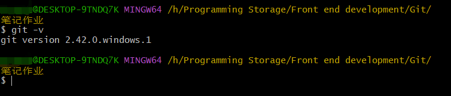

## 配置用户信息

用于每次提交代码版本时表明自己身份

```bash
git config --global user.name '你的名字'
git config --global user.email '你的邮箱'
```

## Git 仓库

用于记录文件状态内容的地方，存储着修改的历史记录

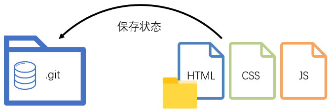

有两种创建方式：

1. 把本地文件夹转换成 Git 仓库：

```bash
git init
```

2. 从其他服务器上克隆 Git 仓库

```bash
git clone 别人的仓库地址
```

## Git 的三个区域

工作区：实际开发时操作的文件夹

暂存区：保存之前的准备区域（暂存改动过的文件）

版本库：提交并保存暂存区中的内容，产生一个版本快照

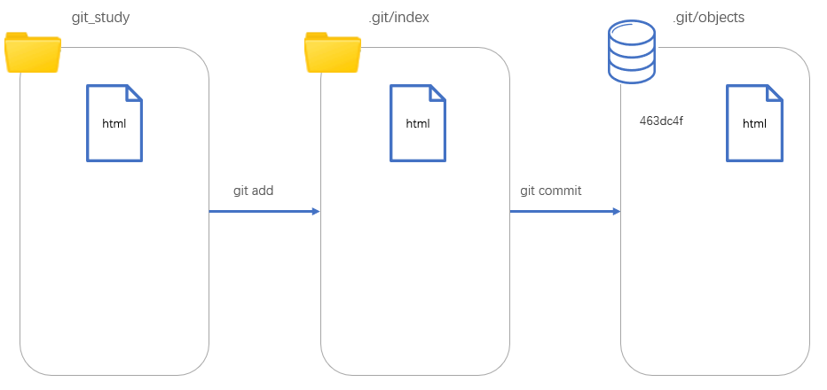

### 命令

+ 暂存指定文件

```bash
git add 文件名
```

+ 暂存所有改动的文件

```bash
git add .
```

+ 提交并保存，产生版本快照

```bash
git commit -m '注释说明'
```

+ 查看暂存区里面记录了哪些文件

```bash
git ls-files
```

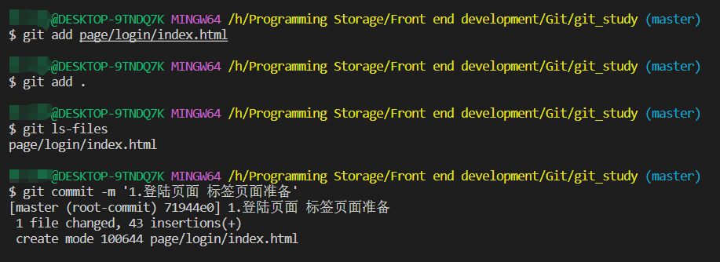

## Git 文件状态

Git 文件一般有两种状态：

+ 未跟踪：新文件，从未被 Git 管理过
+ 已跟踪：GIt 已经知道和管理的文件

|  文件状态  |       概念        |         场景         |
| :--------: | :---------------: | :------------------: |
| 未跟踪(U)  | 从未被 Git 管理过 |        新文件        |
| 新添加(A)  | 第一次被 Git 暂存 | 之前版本记录无此文件 |
| 未修改('') |   三个区域统一    |      提交保存后      |
| 已修改(M)  |  工作区内容变化   |    修改了内容产生    |

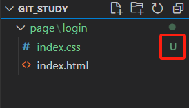

+ 查看文件状态

```bash
git status -s
```

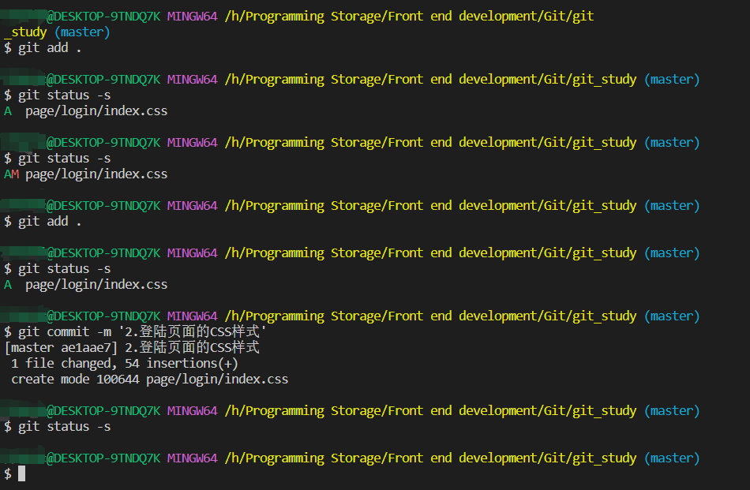

## Git 暂存区

暂时存储，可以临时恢复代码的内容，与版本库解耦

有一天，你写的代码出现bug了，需要回退到上一个版本，这个时候就可以从暂存区把文件拿回来覆盖你现在的文档。

```bash
git restore 目标文件
```

不过，要注意，这个操作是覆盖操作，所以一定要三思而后行哦

当然，也可以从暂存区移除文件

```bash
git rm --cached 目标文件
```

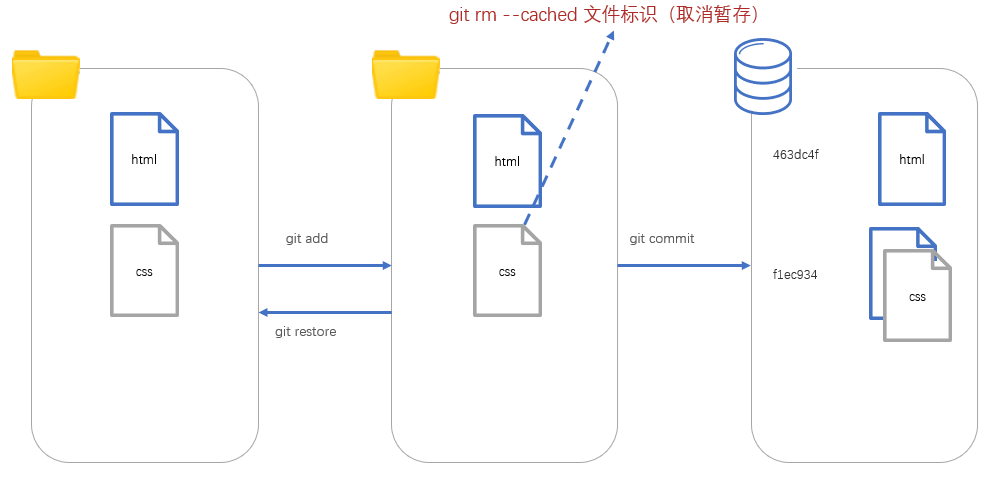

## Git 回退版本

+ 查看提交历史

```bash
git log --oneline
```

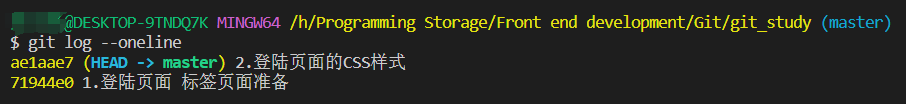

把版本库某个版本对应的内容快照，恢复到工作区/暂存区

```bash
# 工作区和暂存区的文件还会保留
git reset --soft 版本号

# 工作区和暂存区的文件会不见
git reset --hard 版本号

# 工作区的文件还保留，暂存区的文件会消失，与 git reset 等价
git reset --mixed 版本号
```

## 删除文件

### 步骤

1. 手动删除工作区文件
2. 使用 `git add .` 提交变更
3. 使用 `git commit -m '版本说明'` 提交到版本库

## 忽略文件

可以在 `.gitignore` 文件指定忽略跟踪文件，这样能够让 git 仓库更小更快。

例如：

```txt
# 忽略 npm 下载的第三方包
node_moudules
# 忽略分发文件夹
dist
# 忽略 VSCode 配置文件
.vscode
# 忽略秘钥文件
*.pem
*.cer
# 忽略日志文件
*.log
```

## 分支

本质上是指向提交节点的可变指针，默认名字是 master。但是现在 Github 因为某些原因，在 Github 上面的默认名字是 main。

默认情况下都是指向最后一次的提交

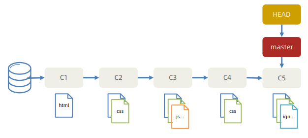

### 具体应用场景

就好比如多人协同开发，或者修复Bug，就可以开多个分支对代码进行修改，修改完成以后再对原先代码进行合并就行了。

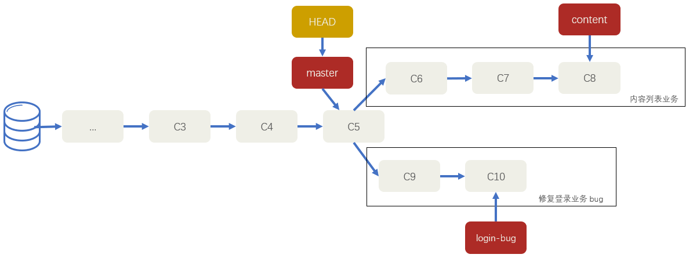

### 命令

1. 创建分支命令

```bash 
git branch 分支名
```

2. 切换分支命令

```bash
git checkout 分支名
```

::: tip 注意

1. 如果想要查看分支可以用这个命令

```bash
git branch
```

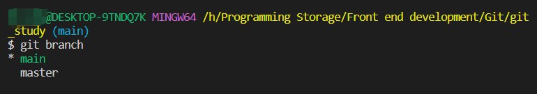

2. 当你在main分支下把文件上传到了版本库后，再切换master分支，工作区的那个文件夹是会没有的

:::

### 合并与删除

分支是弄了，但是分支以后要合并应该怎么弄呢？

#### 步骤

1. 切回要合入的分支上

```bash
git checkout master
```

2. 合并其他分支过来

```bash
git merge 分支名字
```

3. 删除合并后的分支指针

```bash
git branch -d 分支名字
```

这样子操作以后，它会自动产生依次新的提交。

### 合并冲突

当然，这样搞也不是不会产生的问题

比如，

1. 基于 master 新建 publish 分支，完成发布文章业务，然后修改内容页面的 html 文件的 title 标签，并提交一次；
2. 切换到 master，也在修改内容页面的 html 文件的 title 标签，并提交一次

这样操作，Git会无法干净的合并，从而产生合并冲突。

也不是没有办法解决

#### 解决办法

1. 打开 VSCode 找到冲突文件并手动解决
2. 解决后需要提交一次记录

#### 避免方法

1. 按页面划分不同分支开发
2. 公共代码在统一文件夹维护
3. Node等软件版本统一，npm 包统一下载

## Git 远程仓库

存放在网络的版本库

### 步骤

1. 注册第三方托管平台网站账号
2. 新建仓库得到远程仓库 Git 地址
3. 本地 Git 仓库添加远程仓库地址

```bash
git remote add 远程仓库别名 远程仓库地址

# 示例
git remote add origin https://github.com/Arrow-Magician/Blog.git
```

地址有两种，一种是https的，另外一种是ssh的。ssh是需要配置公钥和密钥才行。

4. 本地 Git 仓库推送版本记录到远程仓库

```bash
git push -u 远程仓库别名 本地和远程分支名

# 示例
git push -u origin master
# 完整写法
git push --set-upstream origin master:master
```

其中，`-u` 是 `--set-upstream` 的简写；`master:master` 的意思是从本地的哪个分支推送到远程的哪个分支，因此这两个的名字不一定得非是一样的。

### 克隆

拷贝一个 Git 仓库到本地进行使用

```bash
git clone 远程仓库地址
# 示例
git clone https://githubfast.com/Arrow-Magician/Blog.git
```

### 远程合并

```bash
git pull origin master
# 等价于以下两个命令的结合

# 获取远程分支记录到本地，未合并
git fetch origin master:master
# 把远程分支记录合并到所在分支下
git merge origin/master
```
