# HTML

## 1. HTML基本骨架

```html
<html>
  <head>
    <title>网页标题</title>
  </head>
  <body>
    网页主体内容
  </body>
</html>
```

## 2. 注释

VS Code 中，快捷键： `Ctrl + /` 

```html
<!-- 注释内容 -->
```

## 3. 标题标签

**标签名：** `h1~h6`

```html
<body>
  <h1>一级标题</h1>
  <h2>二级标题</h2>
  <h3>三级标题</h3>
  <h4>四级标题</h4>
  <h5>五级标题</h5>
  <h6>六级标题</h6>
</body>
```

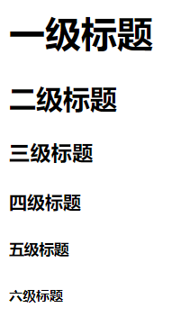

::: info 经验分享

+ h1 标签在一个网页中只能用一次，一般用于新闻标题或网页logo
+ h2 - h6 没有使用次数的限制

:::

## 4. 段落标签

**标签名：** `p`

```html
<body>
  <p>
    Lorem ipsum dolor sit amet consectetur adipisicing elit. Exercitationem
    nobis molestias ipsa distinctio adipisci minima, repellendus inventore
    explicabo omnis fuga officia praesentium maxime vitae animi cum architecto
    totam recusandae dolores?
    </p>
</body>
```

## 5. 换行与水平线标签

**换行：** `<br>`

**水平线：** `<hr>`

```html
<body>
  <!-- 换行 -->
  第一行内容
  <br />
  第二行内容
  <br />
  <!-- 水平线 -->
  水平线第一行
  <hr />
  水平线第二行
</body>
```

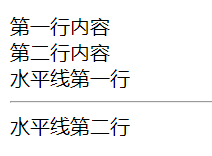

## 6. 文本格式化标签

常见文本格式化标签：

+ 加粗：strong, b
+ 倾斜：em, i
+ 下划线：ins, u
+ 删除线：del, s

```html
<body>
  <strong>strong 加粗</strong>
  <b>b 加粗</b>
  <br />
  <em>em 倾斜</em>
  <i>i 倾斜</i>
  <br />
  <ins>ins 下划线</ins>
  <u>u 下划线</u>
  <br />
  <del>del 删除线</del>
  <s>s 删除线</s>
</body>
```

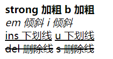

## 7. 图像标签

```html
<body>
  
</body> 
```

| 属性   | 作用     | 说明                           |
| ------ | -------- | ------------------------------ |
| alt    | 替换文本 | 图片无法显示的时候显示文字     |
| title  | 提示文本 | 鼠标悬停在图片上的时候显示文字 |
| width  | 图片宽度 | 值为数字，没有单位             |
| height | 图片高度 | 值为数字，没有单位             |

## 8. 文件路径

+ `/` 表示进入某个文件夹里面
+ `.` 表示当前文件所在文件夹
+ `..` 表示当前文件的上一级文件夹

## 9. 超链接

**标签名：** href

```html
<body>
  <a href="https://www.baidu.com/">跳转到百度</a>
  <a href="./01-标签的写法.html" target="_blank">跳转到01-标签的写法</a>
  <a href="#">空链接</a>
</body>
```

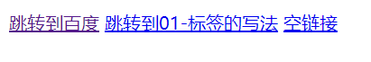

::: info 小贴士

+ target="_blank" 新窗口跳转到新页面
+ 开发初期，不知道超链接的跳转地址可以在href写#，表示空连接且不会跳转

:::

## 10. 音频标签

**标签名：** audio

```html
<body>
  <audio src="./media/music.mp3" controls loop autoplay></audio>
</body>
```

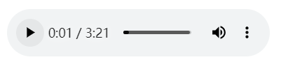

| 属性        | 作用             | 特殊说明                                   |
| ----------- | ---------------- | ------------------------------------------ |
| src（必须） | 音频URL          | 支持 MP3、Ogg、Wav                         |
| controls    | 显示音频控制面板 |                                            |
| loop        | 循环播放         |                                            |
| autoplay    | 自动播放         | 为了提升用户体验，浏览器一般会禁用自动播放 |

## 11. 视频标签

**标签名：** video

```html
<body>
  <video src="./media/vue.mp4" controls loop muted autoplay></video>
</body>
```


| 属性        | 作用             | 特殊说明                                   |
| ----------- | ---------------- | ------------------------------------------ |
| src（必须） | 音频URL          | 支持 MP3、Ogg、Wav                         |
| controls    | 显示音频控制面板 |                                            |
| loop        | 循环播放         |                                            |
| muted       | 静音播放         |                                            |
| autoplay    | 自动播放         | 为了提升用户体验，浏览器一般会禁用自动播放 |

## 12. 列表

列表分类：

+ 无序列表
+ 有序列表
+ 定义列表

### 无序列表

**标签名：** `ul` 嵌套 `li` ，`ul` 是无序列表，`li` 是列表条目

```html
<body>
  <ul>
    <li>列表条目1</li>
    <li>列表条目2</li>
    <li>列表条目3</li>
  </ul>
</body>
```

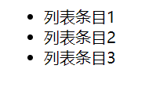

### 有序列表

**标签：** `ol` 嵌套 `li` ，`ol` 是有序列表，`li` 是列表条目

```html
<body>
  <ol>
    <li>步骤1</li>
    <li>步骤2</li>
    <li>步骤3</li>
  </ol>
</body>
```

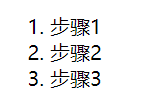

### 定义列表

**标签：** `dl` 嵌套 `dt` 和 `dd` ，`dl` 是定义列表，`dt` 是定义列表的标题，`dd` 是顶i列表的描述/详情

```html
<body>
  <dl>
    <dt>服务中心</dt>
    <dd>申请售后</dd>
    <dd>售后政策</dd>
  </dl>
</body>
```


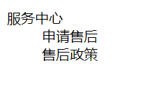

## 13. 表格

格式：

```html
<body>
  <!-- 表头 -->
  <table>
    <thead>
    	<tr>
      	<th>...</th>
        <th>...</th>
      </tr>
    </thead>
    <!-- 表体 -->
    <tbody>
    	<tr>
      	<td>...</td>
        <td>...</td>
      </tr>
    </tbody>
  </table>
</body>
```

示例：

```html
<body>
  <table border="1">
    <thead>
      <tr>
        <th>姓名</th>
        <th>语文</th>
        <th>数学</th>
        <th>总分</th>
      </tr>
    </thead>
    <tbody>
      <tr>
        <td>张三</td>
        <td>99</td>
        <td>100</td>
        <td>199</td>
      </tr>
      <tr>
        <td>李四</td>
        <td>98</td>
        <td>100</td>
        <td>198</td>
      </tr>
      <tr>
        <td>总结</td>
        <td>全市第一</td>
        <td>全市第一</td>
        <td>全市第一</td>
      </tr>
    </tbody>
  </table>
</body>
```

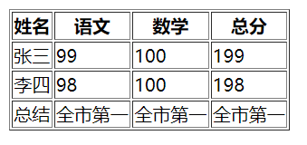

除此以外，还可以跨行合并(`<td rowspan></td>`)与跨列合并(`<td colspan></td>`)

```html
<body>
  <table border="1">
    <thead>
      <tr>
        <th>姓名</th>
        <th>语文</th>
        <th>数学</th>
        <th>总分</th>
      </tr>
    </thead>
    <tbody>
      <tr>
        <td>张三</td>
        <td>99</td>
        <td rowspan="2">100</td>
        <td>199</td>
      </tr>
      <tr>
        <td>李四</td>
        <td>98</td>
        <td>198</td>
      </tr>
      <tr>
        <td>总结</td>
        <td>全市第一</td>
        <td>全市第一</td>
        <td>全市第一</td>
      </tr>
    </tbody>
  </table>
</body>
```

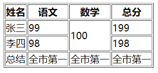

## 14. 表单

主要用于收集用户信息

```html
<input type="...">
```

| type属性值 | 说明                     |
| ---------- | ------------------------ |
| text       | 文本框，用于输入单行文本 |
| password   | 密码框                   |
| radio      | 单选框                   |
| checkbox   | 多选框                   |
| file       | 上传文件                 |

示例：

```html
<body>
  文本框：<input type="text" placeholder="文本框" />
  <br />
  <br />
  密码框：<input type="password" placeholder="密码框" />
  <br />
  <br />
  单选框：
  <input type="radio" name="gender" checked />男
  <input type="radio" name="gender" />女
  <br />
  <br />
  上传文件：<input type="file" multiple />
  <br />
  <br />
  多选框：
  <input type="checkbox" checked />1 <input type="checkbox" />2
  <input type="checkbox" />3 <input type="checkbox" />4
  <br />
  <br />
  下拉菜单：
  <select>
    <option selected>北京</option>
    <option>上海</option>
    <option>广州</option>
    <option>深圳</option>
  </select>
  <br />
  <br />
  文本域：<textarea>提示文字</textarea>
</body>
```

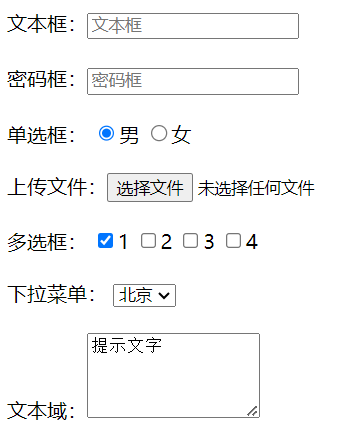

### label标签

主要是可以增大点击范围，比如以前只能点击里面的圆圈才能选中，现在点击文字也能选中了

```html
<body>
  性别：
  <input type="radio" name="gender" id="man"> <label for="man">男</label>
  <label><input type="radio" name="gender"> 女</label>
</body>
```

### button

```html
<button type="...">
  按钮
</button>
```

| type属性值 | 说明                                           |
| ---------- | ---------------------------------------------- |
| submit     | 提交按钮，点击后可以提交数据到后台（默认功能） |
| reset      | 重置按钮，点击后将表单控件恢复默认值           |
| button     | 普通按钮，默认没有功能，一般配合JavaScript使用 |

## 15. 语义化

用于布局网页

| 标签名  | 语义       |
| ------- | ---------- |
| header  | 网页头部   |
| nav     | 网页导航   |
| footer  | 网页底部   |
| aside   | 网页侧边栏 |
| section | 网页区块   |
| article | 网页文章   |

