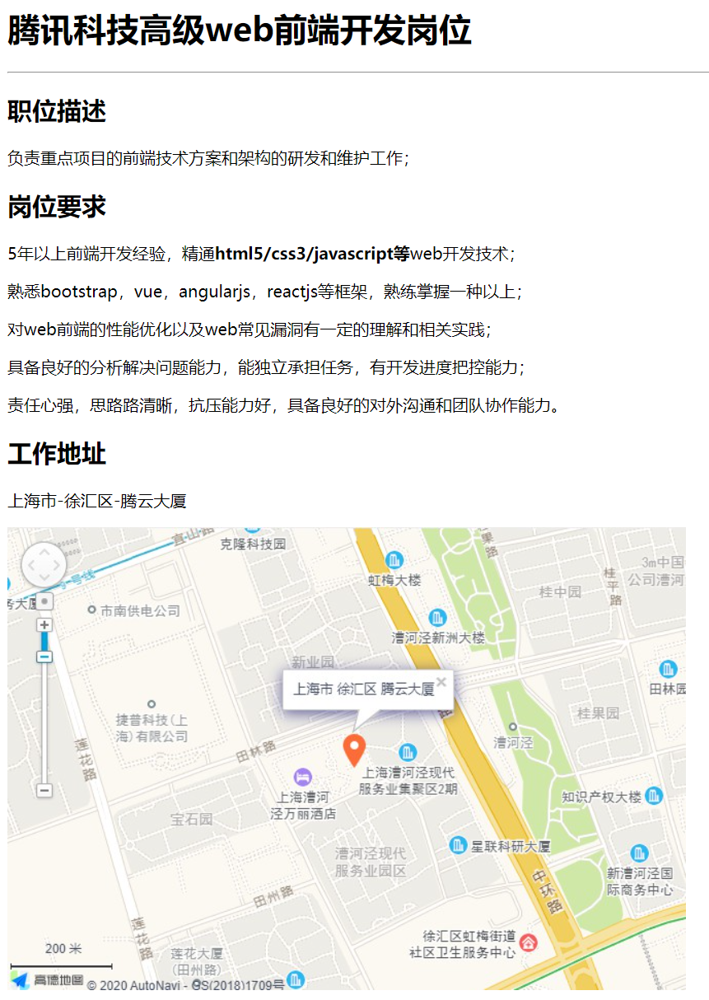
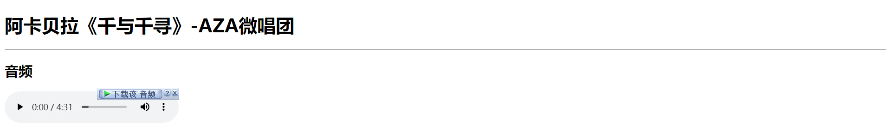
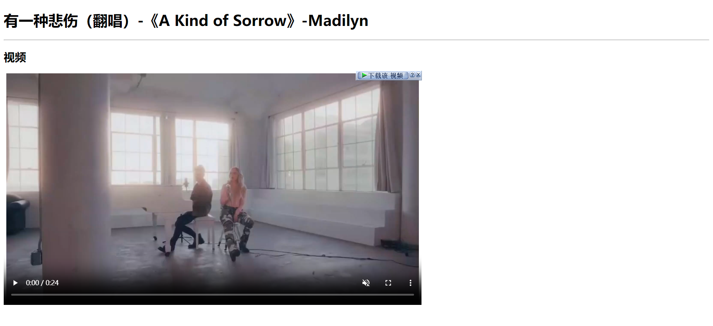
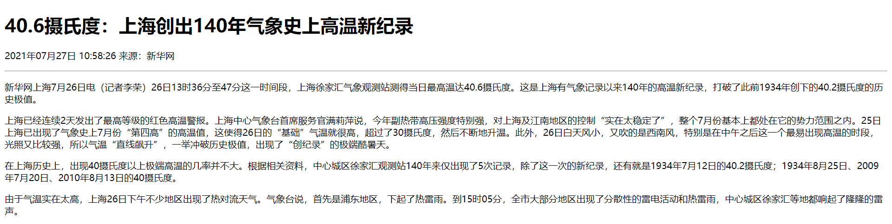
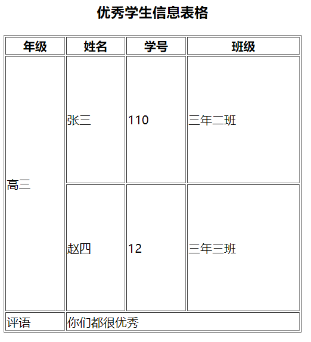
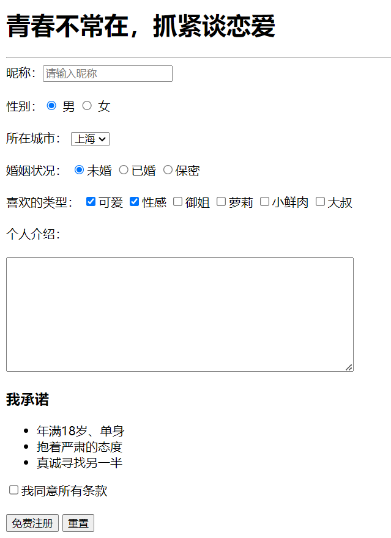
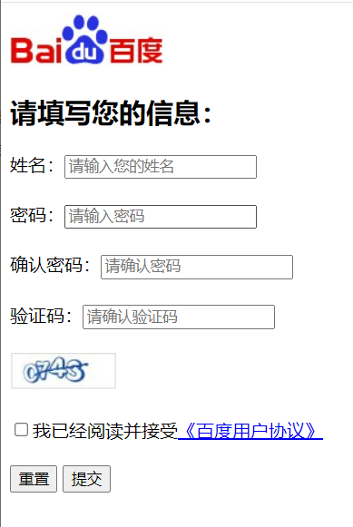

# 作业

## 一、选择题

1. 在前端项目开发中，如果需要修改页面结构，应该修改一下哪个文件（B）

   A. css文件

   B. html文件

   C. scss文件

   D. js文件

   

2. 一个HTML页面，最基本的结构正确的是（C）

   A 

   ```
   <html><head><title></title><body></body></head></html>
   ```

   B 

   ```
   <html><head></head><body><title></title></body></html>
   ```

   C 

   ```
   <html><head><title></title></head><body></body></html>
   ```

   D 

   ```
   <body><html><title></title><head></head></html></body>
   ```


3. 下列选项中，不属于双标签的是(A)

   A. br

   B. p

   C. h1

   D. b


4. 下列关于html标签的关系描述正确的是（D）

   A .`<div> <span></span> </div>` 此时 div 和 span 属于并列关系

   B .`<div> <br /> </div>` 此时 div 和 br 属于并列关系

   C .`<div> <span></div></span>` 此时 div 和 span 属于并列关系

   D. `<div> <p></p> </div>` 此时 div 和 p 属于嵌套关系


5. 下列选项中，说法不正确的是(C)

   A. 标题标签都会让文字加粗

   B. 标题标签是从h1 - h6

   C. 标题标签一行可以显示很多个

   D. 随着标题标签的数字增大(h1-h6)，字体大小会逐级减小

   

6. 在使用``标签插入图像时，说法正确的是 （C）

   A. 标签只能设置 src 属性

   B. 标签只有 src 属性和 title 属性

   C. 标签必须设置 src 属性

   D. 以上说法都错误


7. 下列选项中，说法不正确的是（A）

   A. 相对路径在开发中使用频率不高

   B. 同级目录的写法为 ./

   C.上一级目录的写法为 ../

   D. 绝对路径分成从本地硬盘根目录出发和从互联网中获取相关资源的网络地址两种写法


8. 下列选项中，说法不正确的是（D）

   A.`a` 标签是超链接标签

   B. 超链接可以实现页面之间的跳转效果

   C. 添加 `target="_blank"`属性可以实现在新标签页打开页面的效果

   D. `href`属性可以省略不写

   

9. 下列选项中，说法不正确的是(B)

   A. 表格的主要作用是展示大量数据

   B. 列表分成三种：无序列表、有序列表和乱序列表

   C. 自定义列表中，dl和dt是父子关系

   D. 自定义列表中，dl和dd是父子关系


10. 关于列表下列说法不正确的是 (D)

    A. 列表分为有序列表，无序列表，定义列表

    B. 工作中写页面结构时，经常使用无序列表

    C. li标签可以当做容器，里边可以放其他标签

    D. ul中可以放li标签，也可以放其他标签


11. 关于列表下列说法正确的是(C)

    A. 列表只有序列表和无序列表

    B. 有序列表会按照一定的顺序排列，所以工作中经常使用

    C. li标签里边可以放a标签，也可以放ul标签

    D. ul中可以放li标签，也可以放a标签


12. 下面选项中能够完成下面图片所示内容的是 (B)


​	A. 

```
<ul><li>咖啡</li><li>牛奶</li><li>茶</li></ul>
```

​	B. 

```
<ol><li>咖啡</li><li>牛奶</li><li>茶</li></ol>
```

​	C. 

```
<dl> <dt>咖啡</dt> <dd>牛奶</dd><dd>茶</dd></dl>
```

​	D. 以上都正确


13. 下列选项中，说法不正确的是(C)

      A. 当列表中有列表标题时，我们可以使用自定义列表

      B. 无序列表经常在导航结构中应用

      C. 无序列表中li代表列表项目，一个ul里面只能放一个li标签

      D. 有序列表标签为ol标签


14. 以下选项对表格标签描述正确的是(A)

    A. table代表表格，tr代表行，td代表单元格

    B. tr代表表格，table代表行，td代表单元格

    C. table代表表格，tr代表单元格，td代表行
    
    D. table代表单元格，tr代表表格，td代表行


15. 在网页中，想要收集用户信息，应该使用哪类标签(A)

    A. 表单标签
    
    B. 列表标签
    
    C. 表格标签
    
    D. 段落标签


16. 下列选项中哪那个不是input的type值为 (D)

   A. 

   ```
   <input type="text" />
   ```

   B. 

   ```
   <input type="file" />
   ```

   C. 

   ```
   <input type="radio" />
   ```

   D. 

   ```
   <input type="img" />
   ```


17. 下列选项中，说法正确的是(A)

    A. input中不同的type属性值可以决定表单的不同类型

    B. type为radio的时候代表当前表单为复选框

    C. type为checkbox的时候代表当前表单为单选框

    D. type的默认值为password


18. 下列选项中，说法不正确的是(A)

    A. input输入框表单想要设置默认填写内容需要添加name属性

    B. checkbox复选框想要默认选中可以添加checked属性

    C. radio单选按钮想要默认选中可以添加checked属性

    D. select option 下拉选项框想要默认选中可以给option添加selected属性

## 二、案例题

### 1. 招聘案例

```html
<body>
  <h1>腾讯科技高级web前端开发岗位</h1>
  <hr />
  <h2>职位描述</h2>
  <p>负责重点项目的前端技术方案和架构的研发和维护工作；</p>
  <h2>岗位要求</h2>
  <p>
    5年以上前端开发经验，精通<strong>html5/css3/javascript等</strong>web开发技术；
  </p>
  <p>熟悉bootstrap，vue，angularjs，reactjs等框架，熟练掌握一种以上；</p>
  <p>对web前端的性能优化以及web常见漏洞有一定的理解和相关实践；</p>
  <p>具备良好的分析解决问题能力，能独立承担任务，有开发进度把控能力；</p>
  <p>责任心强，思路路清晰，抗压能力好，具备良好的对外沟通和团队协作能力。</p>
  <h2>工作地址</h2>
  <p>上海市-徐汇区-腾云大厦</p>
  <div class="img"></div>
</body>
```



### 2. 今日热词

```html
<!-- index.html -->

<body>
  <h1>今日搜索热词</h1>
  <hr />
  <h2>1、阿卡贝拉</h2>
  <p>
    阿卡贝拉（意大利：Acappella）即无伴奏合唱。其起源可追溯至中世纪的教会音乐，当时的教会音乐只以人声清唱，并不应用乐器。音频示例：
    <a href="./media.html">阿卡贝拉《千与千寻》</a>
  </p>
  <h2>2、翻唱</h2>
  <p>
    “翻唱”是指将已经发表并由他人演唱的歌曲根据自己的风格重新演唱，包括重新填词，编曲。现在已有不少明星，都在翻唱他人的歌，不断在翻唱中突破自己，给大家带来不一样的风格。视频示例：
    <a href="./video.html">有一种悲伤（翻唱）-《A Kind of Sorrow》</a>
  </p>
</body>
```

```html
<!-- media.html -->

<body>
  <h1>阿卡贝拉《千与千寻》-AZA微唱团</h1>
  <hr />
  <h2>音频</h2>
  <audio src="./media/music.mp3" controls></audio>
</body>
```

```html
<!-- video.html -->

<body>
  <h1>有一种悲伤（翻唱）-《A Kind of Sorrow》-Madilyn</h1>
  <hr />
  <h2>视频</h2>
  <video src="./media/movie.mp4" controls muted></video>
</body>
```





### 3. 新闻案例

```html
<body>
  <h1>40.6摄氏度：上海创出140年气象史上高温新纪录</h1>
  <p>2021年07月27日 10:58:26 来源：新华网</p>
  <hr />
  <p>
    新华网上海7月26日电（记者李荣）26日13时36分至47分这一时间段，上海徐家汇气象观测站测得当日最高温达40.6摄氏度。这是上海有气象记录以来140年的高温新纪录，打破了此前1934年创下的40.2摄氏度的历史极值。
  </p>
  <p>
    上海已经连续2天发出了最高等级的红色高温警报。上海中心气象台首席服务官满莉萍说，今年副热带高压强度特别强，对上海及江南地区的控制“实在太稳定了”，整个7月份基本上都处在它的势力范围之内。25日上海已出现了气象史上7月份“第四高”的高温值，这使得26日的“基础”气温就很高，超过了30摄氏度，然后不断地升温。此外，26日白天风小，又吹的是西南风，特别是在中午之后这一个最易出现高温的时段，光照又比较强，所以气温“直线飙升”，一举冲破历史极值，出现了“创纪录”的极端酷暑天。
  </p>
  <p>
    在上海历史上，出现40摄氏度以上极端高温的几率并不大。根据相关资料，中心城区徐家汇观测站140年来仅出现了5次记录，除了这一次的新纪录，还有就是1934年7月12日的40.2摄氏度；1934年8月25日、2009年7月20日、2010年8月13日的40摄氏度。
  </p>
  <p>
    由于气温实在太高，上海26日下午不少地区出现了热对流天气。气象台说，首先是浦东地区，下起了热雷雨。到15时05分，全市大部分地区出现了分散性的雷电活动和热雷雨，中心城区徐家汇等地都响起了隆隆的雷声。
  </p>
</body>
```



### 4. 优秀学生案例

```html
<body>
  <table border="1" width="400" height="400">
    <caption>
      <h3>优秀学生信息表格</h3>
    </caption>
    <thead>
      <tr>
        <th>年级</th>
        <th>姓名</th>
        <th>学号</th>
        <th>班级</th>
      </tr>
    </thead>
    <tbody>
      <tr>
        <td rowspan="2">高三</td>
        <td>张三</td>
        <td>110</td>
        <td>三年二班</td>
      </tr>
      <tr>
        <td>赵四</td>
        <td>12</td>
        <td>三年三班</td>
      </tr>
    </tbody>
    <tfoot>
      <tr>
        <td>评语</td>
        <td colspan="3">你们都很优秀</td>
      </tr>
    </tfoot>
  </table>
</body>
```



### 5. 会员注册表单

```html
<body>
  <h1>青春不常在，抓紧谈恋爱</h1>
  <hr />
  <form>
    昵称：<input type="text" placeholder="请输入昵称" /> <br /><br />
    性别：<input type="radio" name="man" checked /> 男
    <input type="radio" name="woman" /> 女 <br /><br />
    所在城市：
    <select>
      <option selected>上海</option>
      <option>北京</option>
      <option>广州</option>
      <option>深圳</option>
    </select>
    <br /><br />
    婚姻状况：
    <input type="radio" checked />未婚 <input type="radio" />已婚
    <input type="radio" />保密 <br /><br />
    喜欢的类型：
    <input type="checkbox" checked />可爱
    <input type="checkbox" checked />性感 <input type="checkbox" />御姐
    <input type="checkbox" />萝莉 <input type="checkbox" />小鲜肉
    <input type="checkbox" />大叔 <br /><br />
    个人介绍：<br /><br />
    <textarea name="" id="" cols="60" rows="10"></textarea>
    <br />
    <h3>我承诺</h3>
    <ul>
      <li>年满18岁、单身</li>
      <li>抱着严肃的态度</li>
      <li>真诚寻找另一半</li>
    </ul>
    <input type="checkbox" />我同意所有条款 <br /><br />
    <button>免费注册</button>
    <button>重置</button>
  </form>
</body>
```



### 6. 百度效果

```html
<body>
  
  <h2>请填写您的信息：</h2>
  <form>
    姓名：<input type="text" placeholder="请输入您的姓名" /><br /><br />
    密码：<input type="password" placeholder="请输入密码" /><br /><br />
    确认密码：<input type="password" placeholder="请确认密码" /><br /><br />
    验证码：<input type="number" placeholder="请确认验证码" /><br /><br />
    <br /><br />
    <input type="checkbox" />我已经阅读并接受<a href="#">《百度用户协议》</a>
    <br /><br />
    <button>重置</button>
    <button>提交</button>
  </form>
</body>
```

