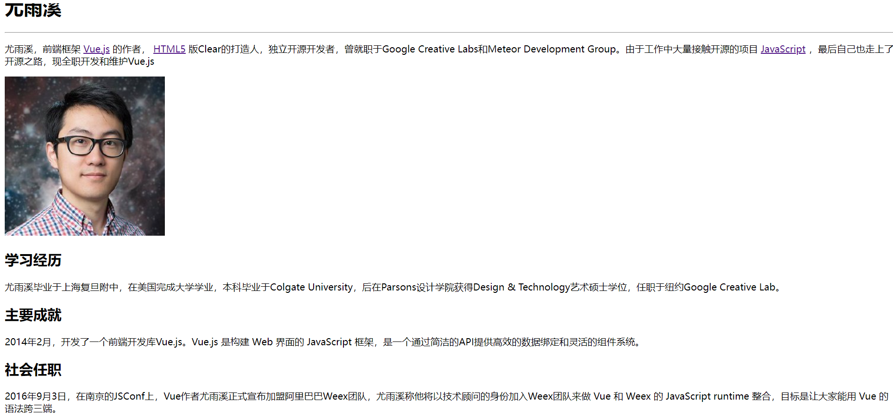
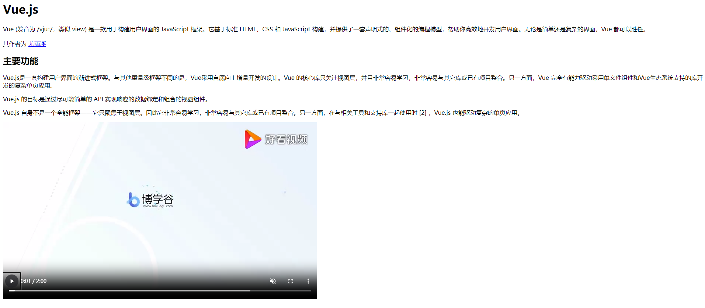
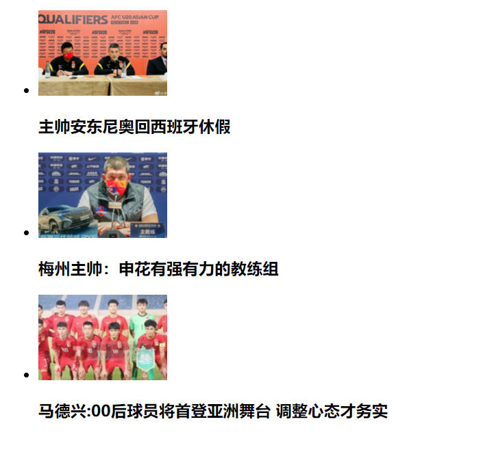
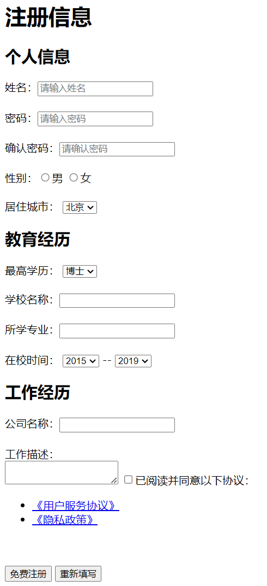

# 综合案例

## 综合案例一 - 个人简介

```html
<body>
  <h1>尤雨溪</h1>
  <hr />
  <p>
    尤雨溪，前端框架
    <a href="https://cn.vuejs.org/">Vue.js</a>
    的作者，
    <a href="https://www.w3school.com.cn/html/index.asp">HTML5</a>
    版Clear的打造人，独立开源开发者，曾就职于Google Creative Labs和Meteor
    Development Group。由于工作中大量接触开源的项目
    <a href="https://www.w3school.com.cn/js/index.asp">JavaScript</a>
    ，最后自己也走上了开源之路，现全职开发和维护Vue.js
  </p>
  
  <h2>学习经历</h2>
  <p>
    尤雨溪毕业于上海复旦附中，在美国完成大学学业，本科毕业于Colgate
    University，后在Parsons设计学院获得Design &
    Technology艺术硕士学位，任职于纽约Google Creative Lab。
  </p>
  <h2>主要成就</h2>
  <p>
    2014年2月，开发了一个前端开发库Vue.js。Vue.js 是构建 Web 界面的 JavaScript
    框架，是一个通过简洁的API提供高效的数据绑定和灵活的组件系统。
  </p>
  <h2>社会任职</h2>
  <p>
    2016年9月3日，在南京的JSConf上，Vue作者尤雨溪正式宣布加盟阿里巴巴Weex团队，尤雨溪称他将以技术顾问的身份加入Weex团队来做
    Vue 和 Weex 的 JavaScript runtime 整合，目标是让大家能用 Vue
    的语法跨三端。
  </p>
</body>
```



## 综合案例二 - Vue简介

```html
<body>
  <h1>Vue.js</h1>
  <p>
    Vue (发音为 /vjuː/，类似 view) 是一款用于构建用户界面的 JavaScript
    框架。它基于标准 HTML、CSS 和 JavaScript
    构建，并提供了一套声明式的、组件化的编程模型，帮助你高效地开发用户界面。无论是简单还是复杂的界面，Vue
    都可以胜任。
  </p>
  <p>
    其作者为
    <a href="#">尤雨溪</a>
  </p>
  <h2>主要功能</h2>
  <p>
    Vue.js是一套构建用户界面的渐进式框架。与其他重量级框架不同的是，Vue采用自底向上增量开发的设计。Vue
    的核心库只关注视图层，并且非常容易学习，非常容易与其它库或已有项目整合。另一方面，Vue
    完全有能力驱动采用单文件组件和Vue生态系统支持的库开发的复杂单页应用。
  </p>
  <p>
    Vue.js 的目标是通过尽可能简单的 API 实现响应的数据绑定和组合的视图组件。
  </p>
  <p>
    Vue.js
    自身不是一个全能框架——它只聚焦于视图层。因此它非常容易学习，非常容易与其它库或已有项目整合。另一方面，在与相关工具和支持库一起使用时
    [2] ，Vue.js 也能驱动复杂的单页应用。
  </p>
  <video src="./media/vue.mp4" controls muted></video>
</body>
```



## 综合案例三 - 体育新闻列表

```html
<body>
  <ul>
    <li>
      
      <h3>主帅安东尼奥回西班牙休假</h3>
    </li>
    <li>
      
      <h3>梅州主帅：申花有强有力的教练组</h3>
    </li>
    <li>
      
      <h3>马德兴:00后球员将首登亚洲舞台 调整心态才务实</h3>
    </li>
  </ul>
</body>
```



## 综合案例四 - 注册信息

```html
<body>
  <h1>注册信息</h1>
  <form action="">
    <h2>个人信息</h2>
    姓名：<input type="text" placeholder="请输入姓名" />
    <br />
    <br />
    密码：<input type="password" placeholder="请输入密码" />
    <br />
    <br />
    确认密码：<input type="password" placeholder="请确认密码" />
    <br />
    <br />
    性别：<input type="radio" />男 <input type="radio" />女
    <br />
    <br />
    居住城市：
    <select>
      <option value="1">北京</option>
      <option value="2">广州</option>
      <option value="3">深圳</option>
      <option value="4">上海</option>
    </select>
    <h2>教育经历</h2>
    最高学历：
    <select>
      <option value="1">博士</option>
      <option value="2">硕士</option>
      <option value="3">学士</option>
    </select>
    <br />
    <br />
    <label>学校名称：</label><input type="text" />
    <br />
    <br />
    <label>所学专业：</label><input type="text" />
    <br />
    <br />
    <label>在校时间：</label>
    <select>
      <option>2015</option>
      <option>2014</option>
      <option>2013</option>
      <option>2012</option>
    </select>
    --
    <select>
      <option>2019</option>
      <option>2018</option>
      <option>2017</option>
      <option>2016</option>
    </select>
    <h2>工作经历</h2>
    公司名称：<input type="text" />
    <br />
    <br />
    工作描述：
    <br />
    <textarea></textarea>
    <input type="checkbox" />已阅读并同意以下协议：
    <ul>
      <li><a href="#">《用户服务协议》</a></li>
      <li><a href="#">《隐私政策》</a></li>
    </ul>
    <br />
    <br />
    <button>免费注册</button>
    <button>重新填写</button>
  </form>
</body>
```

