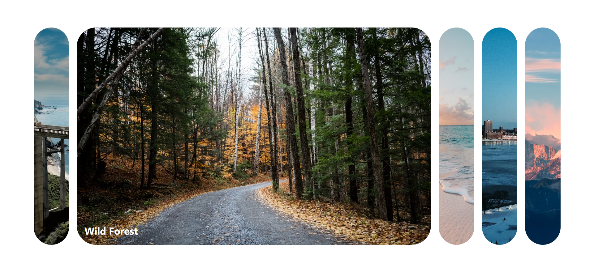

# 01 - Expanding Cards(扩展卡片)

## 效果



## 代码

```html
<link rel="stylesheet" href="./index.css" />

<div class="containers">
  <div class="panel active">
    <h3>Explore The World</h3>
  </div>
  <div class="panel">
    <h3>Wild Forest</h3>
  </div>
  <div class="panel">
    <h3>Sunny Beach</h3>
  </div>
  <div class="panel">
    <h3>City On Winter</h3>
  </div>
  <div class="panel">
    <h3>Mountains - Clouds</h3>
  </div>
</div>
</body>
<script src="./index.js"></script>
```

```css
* {
  margin: 0;
  padding: 0;
  box-sizing: border-box;
}

body {
  display: flex;
  align-items: center;
  justify-content: center;
  height: 100vh;
  margin: 0;
  overflow: hidden;
}

.containers {
  display: flex;
  width: 90vw;
}

.panel {
  background-size: cover;
  background-position: center;
  height: 80vh;
  border-radius: 50px;
  color: #fff;
  cursor: pointer;
  flex: 0.5;
  margin: 10px;
  position: relative;
  transition: all 700ms ease-in;
}

.panel:nth-child(1) {
  background-image: url('https://images.unsplash.com/photo-1558979158-65a1eaa08691?ixlib=rb-1.2.1&ixid=eyJhcHBfaWQiOjEyMDd9&auto=format&fit=crop&w=1350&q=80');
}
.panel:nth-child(2) {
  background-image: url('https://images.unsplash.com/photo-1572276596237-5db2c3e16c5d?ixlib=rb-1.2.1&ixid=eyJhcHBfaWQiOjEyMDd9&auto=format&fit=crop&w=1350&q=80');
}
.panel:nth-child(3) {
  background-image: url('https://images.unsplash.com/photo-1507525428034-b723cf961d3e?ixlib=rb-1.2.1&ixid=eyJhcHBfaWQiOjEyMDd9&auto=format&fit=crop&w=1353&q=80');
}
.panel:nth-child(4) {
  background-image: url('https://images.unsplash.com/photo-1551009175-8a68da93d5f9?ixlib=rb-1.2.1&ixid=eyJhcHBfaWQiOjEyMDd9&auto=format&fit=crop&w=1351&q=80');
}
.panel:nth-child(5) {
  background-image: url('https://images.unsplash.com/photo-1549880338-65ddcdfd017b?ixlib=rb-1.2.1&ixid=eyJhcHBfaWQiOjEyMDd9&auto=format&fit=crop&w=1350&q=80');
}

.panel h3 {
  font-size: 24px;
  position: absolute;
  bottom: 20px;
  left: 20px;
  margin: 0;
  opacity: 0;
}

.panel.active {
  flex: 5;
}
.panel.active h3 {
  opacity: 1;
  transition: opacity 0.3s ease-in 0.4s;
}
```

```js
const panels = document.querySelectorAll('.panel')

panels.forEach(panel => {
  panel.addEventListener('click', () => {
    removeActiveClass()
    panel.classList.add('active')
  })
})

function removeActiveClass() {
  panels.forEach(panel => {
    panel.classList.remove('active')
  })
}
```

