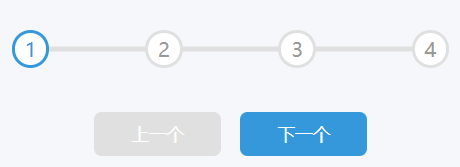

# 02 - Progress Steps(步骤器)

## 效果



## 代码

```html
<link rel="stylesheet" href="./style.css" />

<div class="container">
  <div class="progress_container">
    <!-- 进度条 -->
    <div class="progress" id="progress"></div>
    <!-- 圆形指示器里面的数字 -->
    <div class="circle active">1</div>
    <div class="circle">2</div>
    <div class="circle">3</div>
    <div class="circle">4</div>
  </div>
  <button class="btn" id="prev" disabled>上一个</button>
  <button class="btn" id="next">下一个</button>
</div>

<script src="./script.js"></script>
```

```css
/* 定义一个变量，这样后面用的时候不用重复打颜色 */
:root {
  --line-border-fill: #3498db;
  --line-border-empty: #e0e0e0;
}

* {
  padding: 0;
  margin: 0;
  box-sizing: border-box;
}

body {
  background-color: #f6f7fb;
  display: flex;
  justify-content: center;
  align-items: center;
  height: 100vh;
  overflow: hidden;
  margin: 0;
}

.container {
  text-align: center;
}

.progress_container {
  display: flex;
  justify-content: space-between;
  position: relative;
  margin-bottom: 30px;
  max-width: 100%;
  width: 350px;
}

.progress_container::before {
  content: '';
  background-color: var(--line-border-empty);
  position: absolute;
  top: 50%;
  left: 0;
  transform: translateY(-50%);
  height: 4px;
  width: 100%;
  z-index: -1;
}

.progress {
  background-color: var(--line-border-fill);
  position: absolute;
  top: 50%;
  left: 0;
  transform: translateY(-50%);
  height: 4px;
  width: 0%;
  z-index: -1;
  transition: 0.4s ease;
}

.circle {
  background-color: #fff;
  color: #999;
  border-radius: 50%;
  height: 30px;
  width: 30px;
  display: flex;
  justify-content: center;
  align-items: center;
  border: 3px solid var(--line-border-empty);
  transform: all 0.4s ease;
}

.circle.active {
  border-color: var(--line-border-fill);
  color: var(--line-border-fill);
}

.btn {
  margin: 5px;
  padding: 8px 30px;
  color: #fff;
  border: 0;
  border-radius: 6px;
  background-color: var(--line-border-fill);
  cursor: pointer;
  font-size: 14px;
}

.btn:active {
  transform: scale(0.98);
}

.btn:focus {
  outline: 0;
}

.btn:disabled {
  background-color: var(--line-border-empty);
  cursor: not-allowed;
}
```

```js
const progress = document.getElementById('progress')
const prev = document.getElementById('prev')
const next = document.getElementById('next')
const circles = document.querySelectorAll('.circle')

let currentActive = 1

next.addEventListener('click', () => {
  currentActive++
  if (currentActive > circles.length) {
    currentActive = circles.length
  }
  update()
})

prev.addEventListener('click', () => {
  currentActive--
  if (currentActive < 1) {
    currentActive = 1
  }
  update()
})

function update() {
  circles.forEach((circle, index) => {
    if (index < currentActive) {
      circle.classList.add('active')
    } else {
      circle.classList.remove('active')
    }
  })
  const actives = document.querySelectorAll('.active')
  progress.style.width = (actives.length - 1) / (circles.length - 1) * 100 + '%'
  if (currentActive === 1) {
    prev.disabled = true
  } else if (currentActive === circles.length) {
    next.disabled = true
  } else {
    prev.disabled = false
    next.disabled = false
  }
}
```

