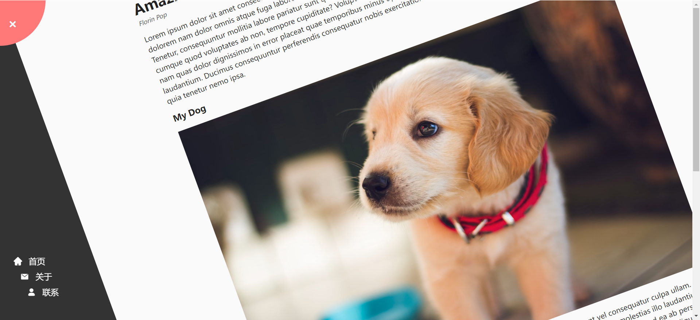

# 03 - Rotating Nav Animation(旋转导航)

## 效果



## 代码

```html
<link rel="stylesheet" href="./style.css" />
<link rel="stylesheet" href="//at.alicdn.com/t/c/font_4463536_pvrakvb2q8.css" />

<div class="container">
  <div class="circle-container">
    <div class="circle">
      <button id="close">
        <i class="iconfont icon-cuowu"></i>
      </button>
      <button id="open">
        <i class="iconfont icon-sanheng"></i>
      </button>
    </div>
  </div>
  <div class="content">
    <h1>Amazing Article</h1>
    <small>Florin Pop</small>
    <p>
      Lorem ipsum dolor sit amet consectetur adipisicing elit. Accusantium
      quia in ratione dolores cupiditate, maxime aliquid impedit dolorem nam
      dolor omnis atque fuga labore modi veritatis porro laborum minus,
      illo, maiores recusandae cumque ipsa quos. Tenetur, consequuntur
      mollitia labore pariatur sunt quia harum aut. Eum maxime dolorem
      provident natus veritatis molestiae cumque quod voluptates ab non,
      tempore cupiditate? Voluptatem, molestias culpa. Corrupti, laudantium
      iure aliquam rerum sint nam quas dolor dignissimos in error placeat
      quae temporibus minus optio eum soluta cupiditate! Cupiditate saepe
      voluptates laudantium. Ducimus consequuntur perferendis consequatur
      nobis exercitationem molestias fugiat commodi omnis. Asperiores quia
      tenetur nemo ipsa.
    </p>
    <h3>My Dog</h3>
    
    <p>
      Lorem, ipsum dolor sit amet consectetur adipisicing elit. Sit libero
      deleniti rerum quo, incidunt vel consequatur culpa ullam. Magnam
      facere earum unde harum. Ea culpa veritatis magnam at aliquid.
      Perferendis totam placeat molestias illo laudantium? Minus id minima
      doloribus dolorum fugit deserunt qui vero voluptas, ut quia cum amet
      temporibus veniam ad ea ab perspiciatis, enim accusamus asperiores
      explicabo provident. Voluptates sint, neque fuga cum illum, tempore
      autem maxime similique laborum odio, magnam esse. Aperiam?
    </p>
  </div>
</div>

<nav>
  <ul>
    <li>
      <i class="iconfont icon-shouye-shouye"></i>
      <a href="#"> 首页 </a>
    </li>
    <li>
      <i class="iconfont icon-xinjian"></i>
      <a href="#">关于</a>
    </li>
    <li>
      <i class="iconfont icon-yonghu"></i>
      <a href="#">联系</a>
    </li>
  </ul>
</nav>

<script src="./script.js"></script>
```

```css
* {
  margin: 0;
  padding: 0;
  box-sizing: border-box;
}

body {
  background-color: #333;
  color: #222;
  overflow-x: hidden;
  margin: 0;
}

li {
  list-style: none;
}

a {
  text-decoration: none;
}

.container {
  background-color: #fafafa;
  transform-origin: top left;
  transition: transform 0.5s linear;
  width: 100vw;
  min-height: 100vh;
  padding: 50px;
}

.container.show-nav {
  transform: rotate(-20deg);
}

.circle-container {
  position: fixed;
  top: -100px;
  left: -100px;
}

.circle {
  background: #ff7979;
  height: 200px;
  width: 200px;
  border-radius: 50%;
  position: relative;
  transition: transform 0.5s linear;
}

.container.show-nav .circle {
  transform: rotate(-70deg);
}

.circle button {
  cursor: pointer;
  position: absolute;
  top: 50%;
  left: 50%;
  height: 100px;
  background: transparent;
  border: 0;
  font-size: 26px;
  color: #fff;
}

.circle button:focus {
  outline: none;
}

.circle button#open {
  left: 60%;
}

.circle button#close {
  top: 60%;
  transform: rotate(90deg);
  transform-origin: top left;
}

.container.show-nav + nav li {
  transform: translateX(0);
  transition-delay: 0.3s;
}

nav {
  position: fixed;
  bottom: 40px;
  left: 0;
  z-index: 100;
}

nav ul {
  padding-left: 30px;
}

nav ul li {
  color: #fff;
  margin: 10px 0;
  transform: translateX(-100%);
}

nav ul li + li {
  margin-left: 15px;
  transform: translateX(-150%);
}

nav ul li + li + li {
  margin-left: 30px;
  transform: translateX(-200%);
}

nav ul li .iconfont {
  font-size: 18px;
  margin-right: 10px;
}

nav a {
  color: #fafafa;
  transition: all 0.3s;
  font-size: 18px;
}

nav a:hover {
  color: #ff7979;
  font-weight: bold;
}

.content {
  max-width: 1000px;
  margin: 50px auto;
}

.content img {
  max-width: 100%;
}

.content h1 {
  margin: 0;
}

.content h3 {
  margin-bottom: 18px;
}
.content small {
  color: #555;
  font-style: italic;
}

.content p {
  margin: 16px 0;
  color: #333;
  line-height: 1.5;
}
```

```js
const open = document.getElementById('open')
const close = document.getElementById('close')
const container = document.querySelector('.container')

open.addEventListener('click', () => {
  container.classList.add('show-nav')
})

close.addEventListener('click', () => {
  container.classList.remove('show-nav')
})
```

