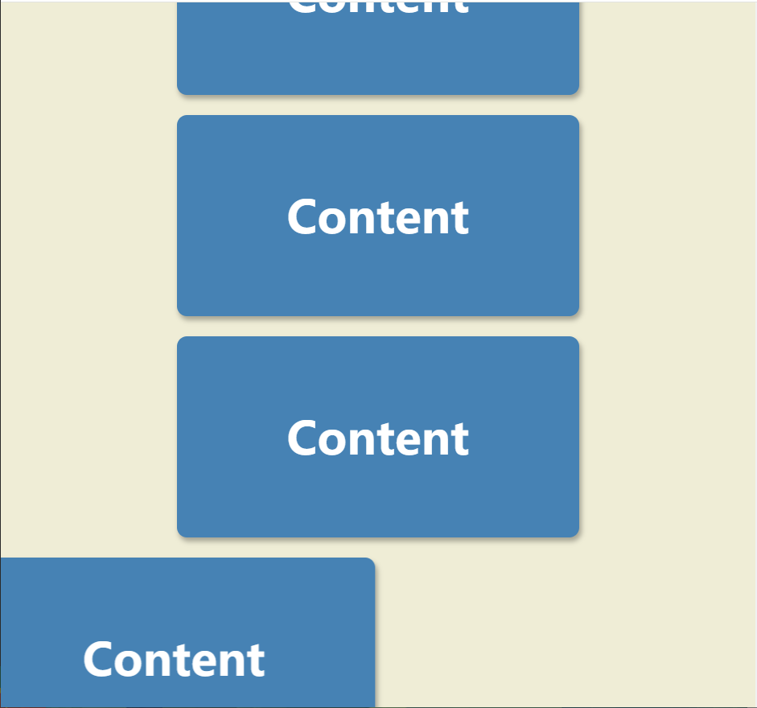

# 06-Scroll Animation(滚动动画)

## 效果



## 代码

```html
<h1>Scroll to see the animation</h1>
<div class="box"><h2>Content</h2></div>
<div class="box"><h2>Content</h2></div>
<div class="box"><h2>Content</h2></div>
<div class="box"><h2>Content</h2></div>
<div class="box"><h2>Content</h2></div>
<div class="box"><h2>Content</h2></div>
<div class="box"><h2>Content</h2></div>
<div class="box"><h2>Content</h2></div>
<div class="box"><h2>Content</h2></div>
<div class="box"><h2>Content</h2></div>
<div class="box"><h2>Content</h2></div>
<div class="box"><h2>Content</h2></div>
<div class="box"><h2>Content</h2></div>
<div class="box"><h2>Content</h2></div>
<div class="box"><h2>Content</h2></div>
<div class="box"><h2>Content</h2></div>
<div class="box"><h2>Content</h2></div>
<div class="box"><h2>Content</h2></div>
<div class="box"><h2>Content</h2></div>
<div class="box"><h2>Content</h2></div>
```

```css
* {
  margin: 0;
  padding: 0;
  box-sizing: border-box;
}

body {
  background-color: #efedd6;
  display: flex;
  flex-direction: column;
  align-items: center;
  justify-content: center;
  margin: 0;
  overflow-x: hidden;
}

h1 {
  margin: 10px;
}

.box {
  display: flex;
  background-color: steelblue;
  color: #fff;
  align-items: center;
  justify-content: center;
  width: 400px;
  height: 200px;
  margin: 10px;
  border-radius: 10px;
  box-shadow: 2px 4px 5px rgba(0, 0, 0, 0.3);
  transform: translateX(400%);
  transition: transform 0.4s ease;
}

.box:nth-of-type(2n + 1) {
  transform: translateX(-400%);
}

.box.show {
  transform: translateX(0);
}

.box h2 {
  font-size: 45px;
}
```

```js
const boxes = document.querySelectorAll('.box')

window.addEventListener('scroll', checkBox)

checkBox()

function checkBox() {
  const triggerBottom = window.innerHeight / 5 * 4
  boxes.forEach(box => {
    const boxTop = box.getBoundingClientRect().top
    if (boxTop < triggerBottom) {
      box.classList.add('show')
    } else {
      box.classList.remove('show')
    }
  })
}
```

## 解析

### :nth-of-type()

```css
.box:nth-of-type(2n + 1) {
  transform: translateX(-400%);
}
```

用来匹配属于其父元素的特定类型的第N个元素。例如：`p:nth-of-type(7)`会选择p元素所在的父元素下的第7个p元素，.box:nth-of-type(2n + 1)会选择box类所在的父元素下的奇数的box类元素。

#### :nth-of-type()与:nth-child()的区别

如果需要按照元素类型进行选择，那么`:nth-of-type`可能更合适；如果只需要按照位置选择，而不关心元素类型，那么`:nth-child`可能更为方便。

### checkBox的函数解析

#### triggerBottom

```css
const triggerBottom = window.innerHeight / 5 * 4
```

这行代码是计算一个触发底部位置。

`window.innerHeight` 获取的是浏览器窗口的视口高度（不包括工具栏和滚动条）。

`window.innerHeight / 5 * 4` 这个计算的意思是取视口高度的80%（因为4/5等于0.8）。换句话说，它设置了一个触发点，这个触发点位于视口底部的20%位置。

#### boxTop

```css
const boxTop = box.getBoundingClientRect().top
```

这段代码是在返回对象的一个属性，表示元素顶部距离视口顶部的距离（以像素为单位）。