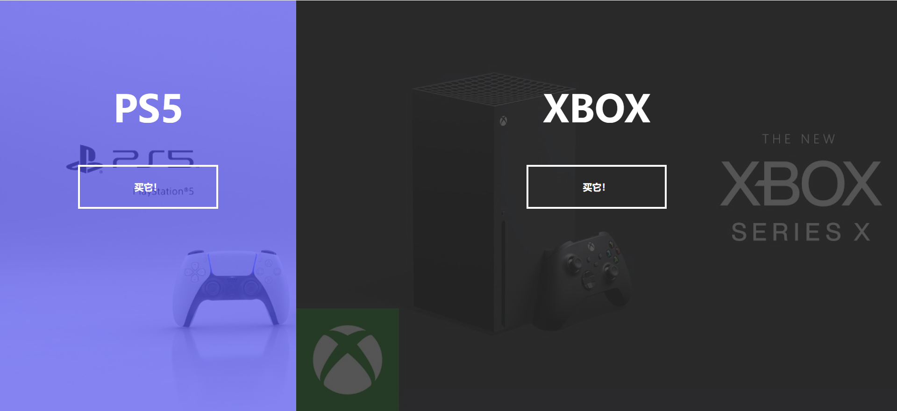

# 07-Split langding page(页面分裂)

## 效果



## 代码

```html
<div class="container">
  <div class="split left">
    <h1>PS5</h1>
    <a href="#" class="btn">买它！</a>
  </div>
  <div class="split right">
    <h1>XBOX</h1>
    <a href="#" class="btn">买它！</a>
  </div>
</div>
```

```css
:root {
  --left-bg-color: rgba(87, 84, 236, 0.7);
  --right-bg-color: rgba(43, 43, 43, 0.8);
  --left-btn-hover-color: rgba(87, 84, 236, 1);
  --right-btn-hover-color: rgba(28, 122, 28, 1);
  --hover-width: 75%;
  --other-width: 25%;
  --speed: 1000ms;
}

* {
  margin: 0;
  padding: 0;
  box-sizing: border-box;
}

body {
  height: 100vh;
  overflow: hidden;
  margin: 0;
}

.container {
  position: relative;
  width: 100%;
  height: 100%;
  background: #333;
}

.split {
  position: absolute;
  width: 50%;
  height: 100%;
  overflow: hidden;
}

h1 {
  font-size: 4rem;
  color: #fff;
  position: absolute;
  left: 50%;
  top: 20%;
  transform: translateX(-50%);
  white-space: nowrap;
}

.btn {
  position: absolute;
  display: flex;
  align-items: center;
  justify-content: center;
  left: 50%;
  top: 40%;
  text-decoration: none;
  transform: translate(-50%);
  color: #fff;
  border: 0.2rem solid #fff;
  font-size: 1rem;
  font-weight: bold;
  width: 15rem;
  padding: 1.5rem;
}

.split.left .btn:hover {
  background-color: var(--left-btn-hover-color);
  border-color: var(--left-btn-hover-color);
}

.split.right .btn:hover {
  background-color: var(--right-btn-hover-color);
  border-color: var(--right-btn-hover-color);
}

.split.left {
  left: 0;
  background: url('./ps.jpg') no-repeat;
  background-size: cover;
}

.split.left::before {
  content: '';
  position: absolute;
  width: 100%;
  height: 100%;
  background-color: var(--left-bg-color);
}

.split.right {
  right: 0;
  background: url('./xbox.jpg') no-repeat;
  background-size: cover;
}

.split.right::before {
  content: '';
  position: absolute;
  width: 100%;
  height: 100%;
  background-color: var(--right-bg-color);
}

.split.left,
.split.right,
.split.left::before,
.split.right::before {
  transition: all var(--speed) ease-in-out;
}

.hover-left .left {
  width: var(--hover-width);
}

.hover-left .right {
  width: var(--other-width);
}

.hover-right .left {
  width: var(--other-width);
}

.hover-right .right {
  width: var(--hover-width);
}

@media (max-width: 800px) {
  h1 {
    font-size: 2rem;
    top: 30%;
  }
  .btn {
    padding: 1.2rem;
    width: 12rem;
  }
}
```

```js
const left = document.querySelector('.left')
const right = document.querySelector('.right')
const container = document.querySelector('.container')

left.addEventListener('mouseenter', () => container.classList.add('hover-left'))
left.addEventListener('mouseleave', () => container.classList.remove('hover-left'))
right.addEventListener('mouseenter', () => container.classList.add('hover-right'))
right.addEventListener('mouseleave', () => container.classList.remove('hover-right'))
```

## 解析

### rem

`rem`是CSS中的一个相对单位，它是`root em`的缩写。与em单位类似，rem是相对于某个元素的字体尺寸进行计算的，但不同的是，rem总是相对于HTML根元素`<html>`的字体大小。这意味着，无论在哪个元素中使用rem单位，其值都会基于根元素的字体大小进行计算。

例如，如果HTML元素的字体大小设置为16px，那么1rem就等于16px。然后，如果你设置一个元素的宽度为2rem，那么该元素的宽度就会是32px。

