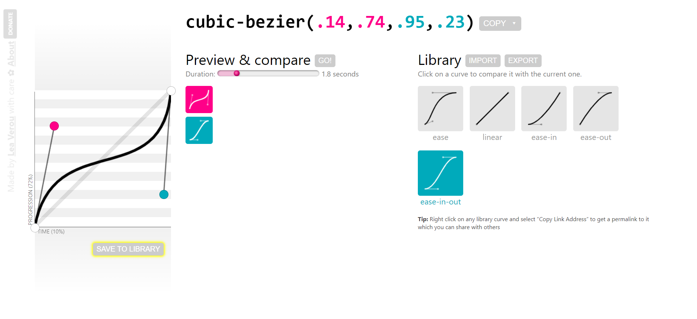

# 08-Form Input Wave(输入框波浪弹跳动画)

## 效果


## 代码

```html
<div class="container">
  <h1>请登录</h1>
  <form>
    <div class="form-control">
      <input type="text" required />
      <label>请输入账号/邮箱</label>
    </div>
    <div class="form-control">
      <input type="password" required />
      <label>请输入密码</label>
    </div>
    <button class="btn">登录</button>
    <p class="text">还没有账号?<a href="#">点击注册</a></p>
  </form>
</div>
```

```css
* {
  margin: 0;
  padding: 0;
  box-sizing: border-box;
}

body {
  background-color: steelblue;
  color: #fff;
  display: flex;
  flex-direction: column;
  align-items: center;
  justify-content: center;
  height: 100vh;
  overflow: hidden;
  margin: 0;
}

.container {
  width: 380px;
  background-color: rgba(0, 0, 0, 0.4);
  padding: 20px 40px;
  border-radius: 5px;
}

.container h1 {
  text-align: center;
  margin-bottom: 30px;
}

.container a {
  text-decoration: none;
  color: lightblue;
}

.btn {
  cursor: pointer;
  display: inline-block;
  width: 100%;
  background-color: lightblue;
  padding: 15px;
  font-size: 20px;
  border: 0;
  border-radius: 5px;
  font-weight: 600;
  color: rgb(42, 78, 108);
}

.btn:focus {
  outline: line;
}

.btn:active {
  transform: scale(0.98);
}

.text {
  margin-top: 30px;
}

.form-control {
  position: relative;
  margin: 20px 0 40px;
}

.form-control input {
  background-color: transparent;
  border: 0;
  border-bottom: 2px solid #fff;
  display: block;
  width: 100%;
  padding: 15px 0;
  font-size: 18px;
  color: #fff;
}

.form-control input:focus,
.form-control input:valid {
  outline: 0;
  border-bottom-color: lightblue;
}

.form-control label {
  position: absolute;
  top: 15px;
  left: 0;
  pointer-events: none;
  font-weight: 200;
}

.form-control label span {
  display: inline-block;
  font-size: 18px;
  min-width: 5px;
  transition: 0.3s cubic-bezier(0.68, -0.55, 0.265, 1.55);
}

.form-control input:focus + label span,
.form-control input:valid + label span {
  color: lightblue;
  transform: translateY(-30px);
}
```

```js
const labels = document.querySelectorAll('.form-control label')

labels.forEach((label) => {
  label.innerHTML = label.innerText
    .split('')
    .map(
      (letter, index) =>
        `<span style="transition-delay: ${index * 50}ms">${letter}</span>`
    )
    .join('')
})
```

## 解析

### cubic-bezier

```css {5}
.form-control label span {
  display: inline-block;
  font-size: 18px;
  min-width: 5px;
  transition: 0.3s cubic-bezier(0.68, -0.55, 0.265, 1.55);
}
```

cubic-bezier是三次方贝塞尔曲线函数，在CSS中用于控制动画或过渡的变化速度曲线。

类比的话，如果玩摄影的同学应该知道，很想调色的曲线，同样也是控制起点终点的曲线，已达到控制动画的速度。

[三次方贝塞尔曲线演示网站](https://cubic-bezier.com/#.14,.74,.95,.23)



