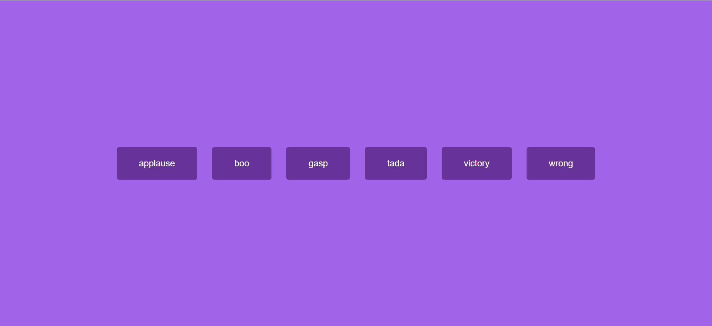

# 09-Sound Board(音板)

## 效果



## 代码

```html
<audio src="./sounds/applause.mp3" id="applause"></audio>
<audio src="./sounds/boo.mp3" id="boo"></audio>
<audio src="./sounds/gasp.mp3" id="gasp"></audio>
<audio src="./sounds/tada.mp3" id="tada"></audio>
<audio src="./sounds/victory.mp3" id="victory"></audio>
<audio src="./sounds/wrong.mp3" id="wrong"></audio>
<div id="buttons"></div>
```

```css
* {
  margin: 0;
  padding: 0;
  box-sizing: border-box;
}

body {
  background-color: rgb(161, 100, 233);
  display: flex;
  align-items: center;
  justify-content: center;
  height: 100vh;
  overflow: hidden;
  margin: 0;
}

.btn {
  background-color: rebeccapurple;
  border-radius: 5px;
  border: 0;
  color: #fff;
  margin: 1rem;
  padding: 1.5rem 3rem;
  font-size: 1.2rem;
  cursor: pointer;
}

.btn:hover {
  opacity: 0.9;
}

.btn-focus {
  outline: none;
}
```

```js
const sounds = ['applause', 'boo', 'gasp', 'tada', 'victory', 'wrong']

sounds.forEach((sound) => {
  const btn = document.createElement('button')
  btn.classList.add('btn')
  btn.innerText = sound

  btn.addEventListener('click', () => {
    stopSongs()
    document.getElementById(sound).play()
  })
  document.getElementById('buttons').appendChild(btn)
})

function stopSongs(params) {
  sounds.forEach((sound) => {
    const song = document.getElementById(sound)
    song.pause()
    song.currentTime = 0
  })
}
```

