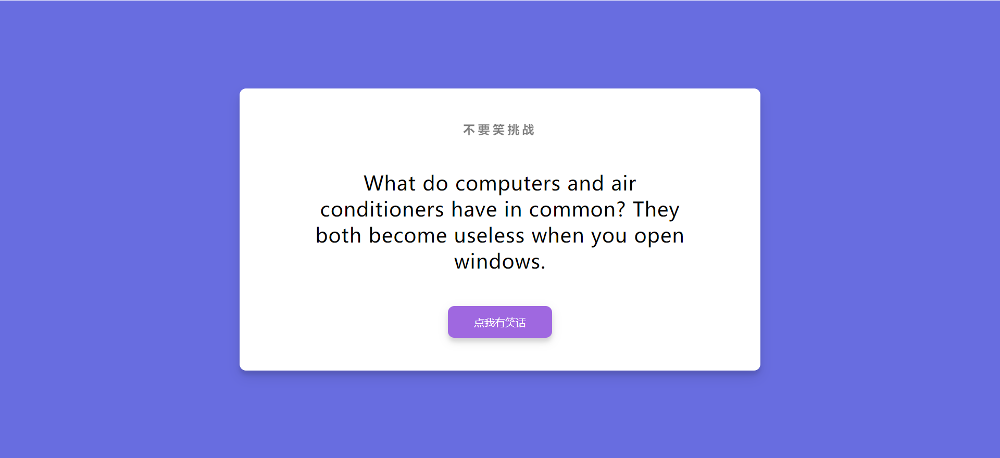

# 10-Random Jokes(随机笑话)

## 效果



## 代码

```html
<div class="container">
  <h3>不要笑挑战</h3>
  <div id="joke" class="joke">笑话真好笑哈哈哈</div>
  <button id="jokeBtn" class="btn">点我有笑话</button>
</div>
```

```css
* {
  margin: 0;
  padding: 0;
  box-sizing: border-box;
}

body {
  background-color: #686de0;
  display: flex;
  align-items: center;
  justify-content: center;
  flex-direction: column;
  height: 100vh;
  overflow: hidden;
  margin: 0;
  padding: 20px;
}

.container {
  background-color: #fff;
  border-radius: 10px;
  box-shadow: 0 10px 20px rgba(0, 0, 0, 0.1), 0 6px 6px rgba(0, 0, 0, 0.1);
  padding: 50px 20px;
  text-align: center;
  max-width: 100%;
  width: 800px;
}

h3 {
  margin: 0;
  opacity: 0.5;
  letter-spacing: 4px;
}

.joke {
  font-size: 30px;
  letter-spacing: 1px;
  line-height: 40px;
  margin: 50px auto;
  max-width: 600px;
}

.btn {
  background-color: #9f68e0;
  color: #fff;
  border: 0;
  border-radius: 10px;
  box-shadow: 0 5px 15px rgba(0, 0, 0, 0.1), 0 6px 6px rgba(0, 0, 0, 0.1);
  padding: 14px 40px;
  font-size: 16px;
  cursor: pointer;
}

.btn:active {
  transform: scale(0.98);
}

.btn:focus {
  outline: 0;
}
```

```js
const jokeEl = document.getElementById('joke')
const jokeBtn = document.getElementById('jokeBtn')

jokeBtn.addEventListener('click', getJoker)

getJoker()

async function getJoker() {
  const config = {
    headers: {
      Accept: 'application/json'
    }
  }

  const res = await fetch('https://icanhazdadjoke.com', config)
  const data = await res.json()
  console.log(data)
  jokeEl.innerHTML = data.joke
}
```

