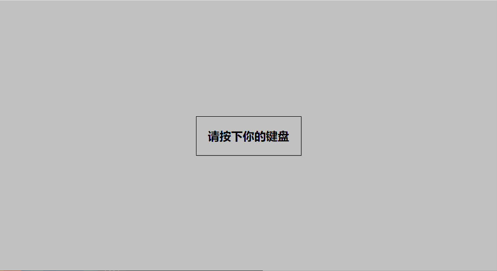
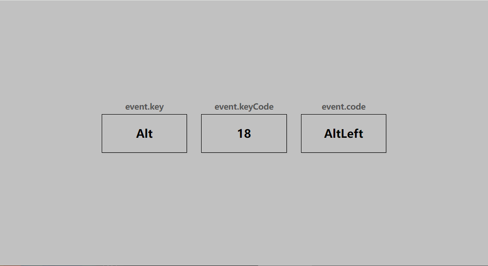
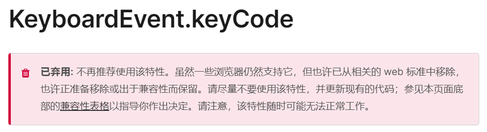

# 11-Event Keyborad(键盘事件)

## 效果





## 代码

```html
<div id="insert">
  <div class="key">请按下你的键盘</div>
</div>
```

```css
* {
  margin: 0;
  padding: 0;
  box-sizing: border-box;
}

body {
  background-color: #c1c1c1;
  display: flex;
  align-items: center;
  justify-content: center;
  text-align: center;
  height: 100vh;
  overflow: hidden;
  margin: 0;
}

.key {
  border: 1px solid #999;
  border-color: black;
  box-shadow: 1px 1px 1px rgba(0, 0, 0, 0.1);
  display: inline-flex;
  align-items: center;
  font-size: 20px;
  font-weight: bold;
  padding: 20px;
  flex-direction: column;
  margin: 10px;
  min-width: 150px;
  position: relative;
}

.key small {
  position: absolute;
  top: -24px;
  left: 0;
  text-align: center;
  width: 100%;
  color: #555;
  font-size: 14px;
}

@media (max-width: 768px) {
  .key {
    margin: 10px 0;
  }
}
```

```js
const insert = document.getElementById('insert')

window.addEventListener('keydown', (event) => {
  insert.innerHTML = `
    <div class="key">
      ${event.key === ' ' ? 'Space' : event.key}
      <small>event.key</small>
    </div>
    <div class="key">
      ${event.keyCode}
      <small>event.keyCode</small>
    </div>
    <div class="key">
      ${event.code}
      <small>event.code</small>
    </div>
  `
})
```

## 解析

### keyCode

```js {8}
window.addEventListener('keydown', (event) => {
  insert.innerHTML = `
    <div class="key">
      ${event.key === ' ' ? 'Space' : event.key}
      <small>event.key</small>
    </div>
    <div class="key">
      ${event.keyCode}
      <small>event.keyCode</small>
    </div>
    <div class="key">
      ${event.code}
      <small>event.code</small>
    </div>
  `
})
```

废话不多说，直接上[文档](https://developer.mozilla.org/zh-CN/docs/Web/API/KeyboardEvent/keyCode)



也就是说，单纯的用ASCⅡ码来标记键盘上的值已经不再合适，现在有两个代替的属性`KeyboardEvent.key` 和 `KeyboardEvent.code` 属性。

#### 1. KeyboardEvent.key

返回一个字符串，表示按下的键的标识符。例如，按下 'a' 键时，`key` 的值将是 'a'。

#### 2. KeyboardEvent.code

返回一个字符串，表示按下的键的物理位置。例如 "Digit1" 表示键盘上的1，而 "KeyA" 表示主键盘上的 'a' 键。