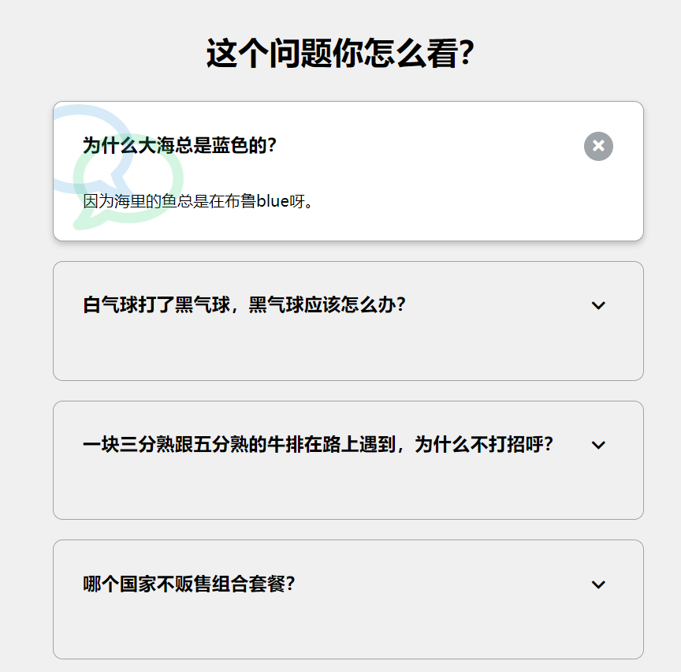

# 12-faq collapse(问题卡片)

## 效果



## 代码

```html
<h1>这个问题你怎么看？</h1>
<div class="faq-container">
  <div class="faq active">
    <h3 class="faq-title">为什么大海总是蓝色的？</h3>
    <p class="faq-text">因为海里的鱼总是在布鲁blue呀。</p>
    <button class="faq-toggle">
      <i class="fas fa-chevron-down"></i>
      <i class="fas fa-times"></i>
    </button>
  </div>
  <div class="faq">
    <h3 class="faq-title">白气球打了黑气球，黑气球应该怎么办？</h3>
    <p class="faq-text">告白气球</p>
    <button class="faq-toggle">
      <i class="fas fa-chevron-down"></i>
      <i class="fas fa-times"></i>
    </button>
  </div>
  <div class="faq">
    <h3 class="faq-title">
      一块三分熟跟五分熟的牛排在路上遇到，为什么不打招呼？
    </h3>
    <p class="faq-text">因为他们都不熟</p>
    <button class="faq-toggle">
      <i class="fas fa-chevron-down"></i>
      <i class="fas fa-times"></i>
    </button>
  </div>
  <div class="faq">
    <h3 class="faq-title">哪个国家不贩售组合套餐？</h3>
    <p class="faq-text">丹麦（单卖）</p>
    <button class="faq-toggle">
      <i class="fas fa-chevron-down"></i>
      <i class="fas fa-times"></i>
    </button>
  </div>
  <div class="faq">
    <h3 class="faq-title">一朵花为什么好笑？</h3>
    <p class="faq-text">因为它有梗</p>
    <button class="faq-toggle">
      <i class="fas fa-chevron-down"></i>
      <i class="fas fa-times"></i>
    </button>
  </div>
</div>
```

```css
* {
  margin: 0;
  padding: 0;
  box-sizing: border-box;
}

body {
  background-color: #f0f0f0;
}

h1 {
  margin: 50px 0 30px;
  text-align: center;
}

.faq-container {
  max-width: 600px;
  margin: 0 auto;
}

.faq {
  background-color: transparent;
  border: 1px solid #9fa4a8;
  border-radius: 10px;
  margin: 20px 0;
  padding: 30px;
  position: relative;
  overflow: hidden;
  transition: 0.3s ease;
}

.faq.active {
  background: #fff;
  box-shadow: 0 3px 6px rgba(0, 0, 0, 0.1), 0 3px 6px rgba(0, 0, 0, 0.1);
}

.faq.active::before,
.faq.active::after {
  content: '\f075';
  font-family: 'Font Awesome 5 free';
  color: #2ecc71;
  font-size: 7rem;
  position: absolute;
  opacity: 0.2;
  top: 20px;
  left: 20px;
  z-index: 0;
}

.faq.active::before {
  color: #3498db;
  top: -10px;
  left: -30px;
  transform: rotateY(180deg);
}

.faq-title {
  margin-bottom: 35px;
}

.faq-text {
  display: none;
  margin-top: 30px;
}

.faq.active .faq-text {
  display: block;
}

.faq-toggle {
  background-color: transparent;
  border: 0;
  border-radius: 50%;
  cursor: pointer;
  position: absolute;
  font-size: 16px;
  top: 30px;
  right: 30px;
  height: 30px;
  width: 30px;
  display: flex;
  align-items: center;
  justify-content: center;
}

.faq-toggle:focus {
  outline: none;
}

.faq-toggle .fa-times {
  display: none;
}

.faq.active .faq-toggle .fa-times {
  color: #fff;
  display: block;
}

.faq.active .faq-toggle {
  background-color: #9fa4a8;
}

.faq.active .faq-toggle .fa-chevron-down {
  display: none;
}
```

```js
const toggles = document.querySelectorAll('.faq-toggle')
const faqs = document.querySelectorAll('.faq')

toggles.forEach((toggle) => {
  toggle.addEventListener('click', () => {
    faqs.forEach((faq) => faq.classList.remove('active'))
    toggle.parentNode.classList.add('active')
  })
})
```

