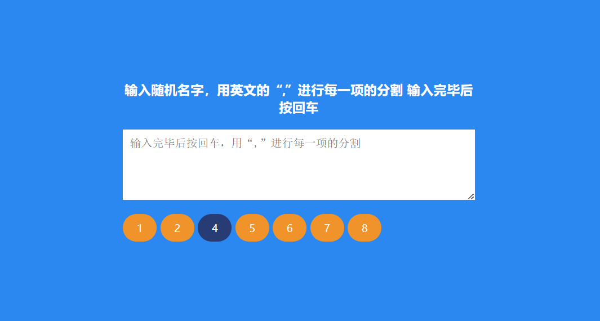

# 13-Random Choice Picker(随机选择)

## 效果



## 代码

```html
<div class="container">
  <h3>输入随机名字，用英文的“,”进行每一项的分割 输入完毕后按回车</h3>
  <textarea id="textarea" placeholder="输入完毕后按回车，用“,”进行每一项的分割"></textarea>
  <div id="tags"></div>
</div>
```

```css
* {
  margin: 0;
  padding: 0;
  box-sizing: border-box;
}

body {
  background-color: #2b88f0;
  display: flex;
  flex-direction: column;
  align-items: center;
  justify-content: center;
  height: 100vh;
  overflow: hidden;
  margin: 0;
}

h3 {
  color: #fff;
  margin: 10px 0 20px;
  text-align: center;
}

.container {
  width: 500px;
}

textarea {
  border: 0;
  display: block;
  width: 100%;
  height: 100px;
  padding: 10px;
  margin: 0 0 20px;
  font-size: 16px;
}

textarea:focus {
  outline: none;
}

.tag {
  background-color: #f0932b;
  color: #fff;
  border-radius: 50px;
  padding: 10px 20px;
  margin: 0 5px 10px 0;
  font-size: 14px;
  display: inline-block;
}

.tag.highlight {
  background-color: #273c75;
}
```

```js
const tagsEl = document.getElementById('tags')
const textarea = document.getElementById('textarea')

textarea.focus()

textarea.addEventListener('keyup', (e) => {
  createTags(e.target.value)
  if (e.key === 'Enter') {
    setTimeout(() => {
      e.target.value = ''
    }, 10)
    randomSelect()
  }
})

function createTags(input) {
  const tags = input
    .split(',')
    .filter((tag) => tag.trim() !== '')
    .map((tag) => tag.trim())
  tagsEl.innerHTML = ''
  tags.forEach((tag) => {
    const tagEl = document.createElement('span')
    tagEl.classList.add('tag')
    tagEl.innerText = tag
    tagsEl.appendChild(tagEl)
  })
}

function randomSelect() {
  const times = 30
  const interval = setInterval(() => {
    const randomTag = pickRandomTag()
    if (randomTag != undefined) {
      highlightTag(randomTag)
      setTimeout(() => {
        unHighlightTag(randomTag)
      }, 100)
    }
  }, 100)

  setTimeout(() => {
    clearInterval(interval)
    setTimeout(() => {
      const randomTag = pickRandomTag()
      highlightTag(randomTag)
    }, 100)
  }, 100 * times)
}

function pickRandomTag() {
  const tags = document.querySelectorAll('.tag')
  return tags[Math.floor(Math.random() * tags.length)]
}

function highlightTag(tag) {
  tag.classList.add('highlight')
}

function unHighlightTag(tag) {
  tag.classList.remove('highlight')
}
```

## 解析

### textarea.focus()

```js
textarea.focus()
```

将焦点设置到`textarea`上，意味着页面加载后，光标会自动出现在这个输入框中，方便用户直接开始输入。

### createTags()函数

```js
  const tags = input
    .split(',')
    .filter((tag) => tag.trim() !== '')
    .map((tag) => tag.trim())
```

+ `split(',')`方法将`input`字符串按照逗号`,`分割成一个数组

+ 使用`filter`方法遍历数组中的每个元素，里面的回调函数检查每个标签是否非空，如果标签非空（即`trim()`后的结果不等于空字符串`''`），则该标签会被保留在数组中。
+ 使用`map`方法遍历过滤后的标签数组，对每个标签再次调用`trim()`方法，确保所有标签字符串的前后都没有不必要的空白字符。
+ 清理后的标签数组存储在`tags`常量中。


```js
  tagsEl.innerHTML = ''
```

+ 清空`tagsEl`容器的当前内容，确保容器内不会残留旧的标签元素。


```js
  tags.forEach((tag) => {
    const tagEl = document.createElement('span')
    tagEl.classList.add('tag')
    tagEl.innerText = tag
    tagsEl.appendChild(tagEl)
  })
```

+ 创建一个新的`<span>`元素，这个元素将用来在页面上展示标签，存储在`tagEl`里面
+ 给新创建的`<span>`元素添加一个名为`tag`的CSS类。
+ 设置`<span>`元素的文本内容为当前遍历到的标签字符串。
+ 使用`appendChild`方法将新创建的`<span>`元素添加到`tagsEl`容器中。这样，用户输入的每个标签都会在页面上动态显示出来。

### randomSelect()函数

用于在一段时间内随机选择并高亮显示标签，然后一段时间后取消高亮，在30次高亮切换结束后（大约3秒后），再次随机选择一个标签并高亮它，然后结束整个流程。

```js
  const interval = setInterval(() => {
    const randomTag = pickRandomTag()
    if (randomTag != undefined) {
      highlightTag(randomTag)
      setTimeout(() => {
        unHighlightTag(randomTag)
      }, 100)
    }
  }, 100)
```

+ 使用 `setInterval` 函数定义了一个定时器，该定时器每隔100毫秒执行一次其内部的匿名函数。
+ 调用 `pickRandomTag` 函数随机选择一个标签，并将结果赋值给 `randomTag`。
+ 如果 `randomTag` 不是 `undefined`（即成功选择了一个标签），则执行以下操作：
  + 调用 `highlightTag(randomTag)` 来高亮显示选中的标签。
  + 使用 `setTimeout` 设置一个定时器，在100毫秒后调用 `unHighlightTag(randomTag)` 来取消选中标签的高亮状态。


```js
setTimeout(() => {  
  clearInterval(interval);  
  setTimeout(() => {  
    const randomTag = pickRandomTag();  
    highlightTag(randomTag);  
  }, 100);  
}, 100 * times);
```

+ 设置了另外一个`setTimeout` 定时器，这个定时器会在 `100 * times` 毫秒后执行（因为 `times` 是30，所以是3000毫秒，即3秒）。

- 当定时器触发时，首先通过 `clearInterval(interval)` 停止前面定义的 `setInterval` 定时器，从而停止标签的高亮切换。
- 然后，通过 `setTimeout` 再设置一个定时器，在100毫秒后再次调用 `pickRandomTag` 和 `highlightTag` 来随机选择一个标签并高亮显示它。

### pickRandomTag()函数

这个函数被用来随机选择一个标签，然后对这个标签进行高亮操作。

```js
  return tags[Math.floor(Math.random() * tags.length)]
```

+ 使用 `Math.random()` 函数生成一个介于 0（包含）和 1（不包含）之间的随机浮点数
+ 乘以 `tags.length`（标签数组的长度），得到一个介于 0 和 `tags.length - 1` 的随机数
+ 使用 `Math.floor()` 函数将结果向下取整，得到一个整数，这个整数就是随机索引，它对应于 `tags` 数组中的一个位置。