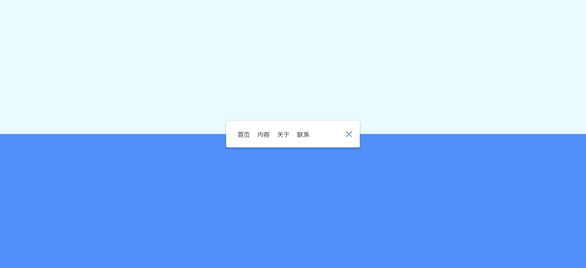

# 14-Animated Navigation(导航动画)

## 效果



## 代码

```html
<nav class="active" id="nav">
  <ul>
    <li><a href="#">首页</a></li>
    <li><a href="#">内容</a></li>
    <li><a href="#">关于</a></li>
    <li><a href="#">联系</a></li>
  </ul>
  <button class="icon" id="toggle">
    <div class="line line1"></div>
    <div class="line line2"></div>
  </button>
</nav>
```

```css
* {
  margin: 0;
  padding: 0;
  box-sizing: border-box;
}

body {
  background-color: #eafbff;
  background-image: linear-gradient(
    to bottom,
    #eafbff 0%,
    #eafbff 50%,
    #5290f9 50%,
    #5290f9 100%
  );
  display: flex;
  align-items: center;
  justify-content: center;
  height: 100vh;
  margin: 0;
}

nav {
  background-color: #fff;
  padding: 20px;
  width: 80px;
  display: flex;
  align-items: center;
  justify-content: center;
  border-radius: 3px;
  box-shadow: 0 2px 5px rgba(0, 0, 0, 0.3);
  transition: width 0.6s linear;
  overflow-x: hidden;
}

nav ul {
  display: flex;
  list-style: none;
  padding: 0;
  margin: 0;
  width: 0;
  transition: width 0.6s linear;
}

nav ul li {
  transform: rotateY(0deg);
  opacity: 0;
  transition: transform 0.6s linear, opacity 0.6s linear;
}

nav ul a {
  position: relative;
  color: #000;
  text-decoration: none;
  margin: 0 10px;
}

nav.active {
  width: 350px;
}

nav.active ul {
  width: 100%;
}

nav.active ul li {
  opacity: 1;
  transform: rotateY(360deg);
}

.icon {
  background-color: #fff;
  border: 0;
  cursor: pointer;
  padding: 0;
  position: relative;
  height: 30px;
  width: 30px;
}

.icon .line {
  background-color: #5290f9;
  width: 20px;
  height: 2px;
  position: absolute;
  top: 10px;
  left: 5px;
  transition: transform 0.6s linear;
}

.icon .line2 {
  top: auto;
  bottom: 10px;
}

nav.active .icon .line1 {
  transform: rotate(-765deg) translateY(5.5px);
}
nav.active .icon .line2 {
  transform: rotate(765deg) translateY(-5.5px);
}
```

```js
const toggle = document.getElementById('toggle')
const nav = document.getElementById('nav')

toggle.addEventListener('click', () => nav.classList.toggle('active'))
```

