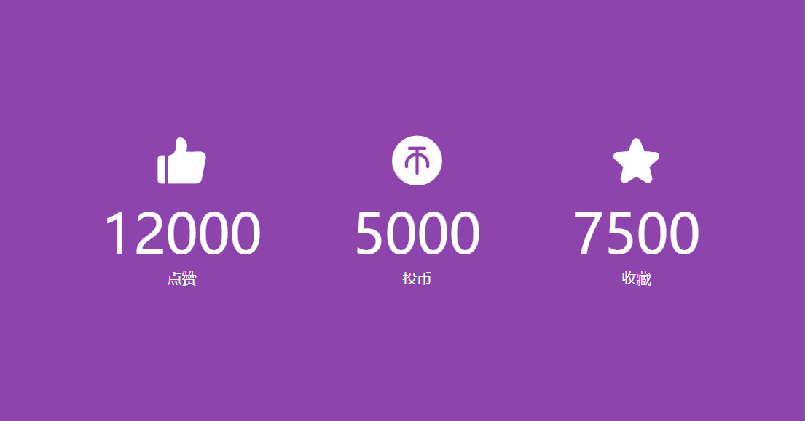

# 15-Increment Counter(计数器)

## 效果



## 代码

```html
<link rel="stylesheet" href="//at.alicdn.com/t/c/font_4463536_6jgq2rrebd.css" />

<div class="counter-container">
  <i class="iconfont icon-dianzan_kuai"></i>
  <div class="counter" data-target="12000"></div>
  <span>点赞</span>
</div>
<div class="counter-container">
  <i class="iconfont icon-toubix"></i>
  <div class="counter" data-target="5000"></div>
  <span>投币</span>
</div>
<div class="counter-container">
  <i class="iconfont icon-shoucang"></i>
  <div class="counter" data-target="7500"></div>
  <span>收藏</span>
</div>
```

```css
* {
  margin: 0;
  padding: 0;
  box-sizing: border-box;
}

body {
  background-color: #8e44ad;
  color: #fff;
  display: flex;
  align-items: center;
  justify-content: center;
  height: 100vh;
  overflow: hidden;
  margin: 0;
}

.counter-container {
  display: flex;
  flex-direction: column;
  justify-content: center;
  text-align: center;
  margin: 30px 50px;
}

.iconfont {
  font-size: 60px;
}

.counter {
  font-size: 60px;
  margin-top: 10px;
}

@media (max-width: 580px) {
  body {
    flex-direction: column;
  }
}
```

```js
const counters = document.querySelectorAll('.counter')

counters.forEach((counter) => {
  counter.innerText = '0'
  const updateCounters = () => {
    const target = +counter.getAttribute('data-target')
    const c = +counter.innerText

    const increment = target / 200

    if (c < target) {
      counter.innerText = `${Math.ceil(c + increment)}`
      setTimeout(updateCounters, 1)
    } else {
      counter.innerText = target
    }
  }
  updateCounters()
})
```

