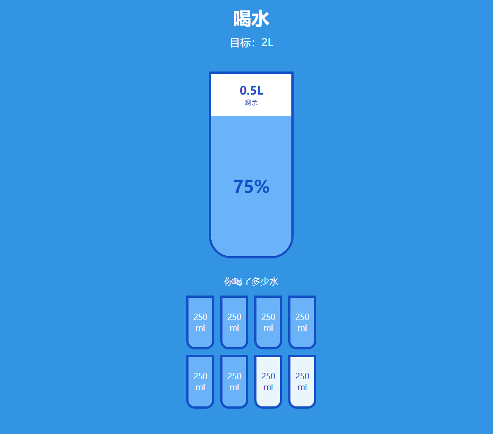

# 16-Drink Water(喝水动画)

## 效果



## 代码

```html
<h1>喝水</h1>
<h3>目标：2L</h3>
<div class="cup">
  <div class="remained">
    <span class="liters"></span>
    <small>剩余</small>
  </div>
  <div class="percentage">1%</div>
</div>
<p class="text">你喝了多少水</p>
<div class="cups">
  <div class="cup cup-small">250 ml</div>
  <div class="cup cup-small">250 ml</div>
  <div class="cup cup-small">250 ml</div>
  <div class="cup cup-small">250 ml</div>
  <div class="cup cup-small">250 ml</div>
  <div class="cup cup-small">250 ml</div>
  <div class="cup cup-small">250 ml</div>
  <div class="cup cup-small">250 ml</div>
</div>
```

```css
:root {
  --border-color: #144fc6;
  --fill-color: #6ab3f8;
}

* {
  margin: 0;
  padding: 0;
  box-sizing: border-box;
}

body {
  background-color: #3494e4;
  color: #fff;
  display: flex;
  flex-direction: column;
  align-items: center;
  margin-bottom: 40px;
}

h1 {
  margin-top: 10px;
}

h3 {
  font-weight: 400;
  margin: 10px 0;
}

.cup {
  background-color: #fff;
  border: 4px solid var(--border-color);
  color: var(--border-color);
  border-radius: 0 0 40px 40px;
  width: 150px;
  height: 330px;
  margin: 30px 0;
  display: flex;
  flex-direction: column;
  overflow: hidden;
}

.cup.cup-small {
  width: 50px;
  height: 95px;
  border-radius: 0 0 15px 15px;
  background-color: rgba(255, 255, 255, 0.9);
  cursor: pointer;
  font-size: 14px;
  align-items: center;
  justify-content: center;
  text-align: center;
  margin: 5px;
  transition: all 0.3s ease;
}

.cup.cup-small.full {
  background-color: var(--fill-color);
  color: #fff;
}

.cups {
  display: flex;
  flex-wrap: wrap;
  align-items: center;
  justify-content: center;
  width: 280px;
}

.remained {
  display: flex;
  flex-direction: column;
  align-items: center;
  justify-content: center;
  text-align: center;
  flex: 1;
  transition: all 0.3s ease;
}

.remained span {
  font-size: 20px;
  font-weight: bold;
}

.remained small {
  font-size: 12px;
}

.percentage {
  background-color: var(--fill-color);
  display: flex;
  align-items: center;
  justify-content: center;
  font-weight: bold;
  font-size: 30px;
  height: 0;
  transition: all 0.3s ease;
}

.text {
  text-align: center;
  margin-bottom: 10px;
}
```

```js
const smallCups = document.querySelectorAll('.cup-small')
const liters = document.querySelector('.liters')
const percentage = document.querySelector('.percentage')
const remained = document.querySelector('.remained')

updateBigCup()

smallCups.forEach((cup, index) => {
  cup.addEventListener('click', () => highlightCups(index))
})

function highlightCups(index) {
  if (index === 7 && smallCups[index].classList.contains('full')) {
    index--
  } else if (
    smallCups[index].classList.contains('full') &&
    !smallCups[index].nextElementSibling.classList.contains('full')
  ) {
    index--
  }

  smallCups.forEach((cup, ind) => {
    if (ind <= index) {
      cup.classList.add('full')
    } else {
      cup.classList.remove('full')
    }
  })

  updateBigCup()
}

function updateBigCup() {
  const fullCups = document.querySelectorAll('.cup-small.full').length
  const totalCups = smallCups.length

  if (fullCups === 0) {
    percentage.style.visibility = 'hidden'
    percentage.style.height = 0
  } else {
    percentage.style.visibility = 'visible'
    percentage.style.height = `${(fullCups / totalCups) * 330}px`
    percentage.innerText = `${(fullCups / totalCups) * 100}%`
  }

  if (fullCups === totalCups) {
    remained.style.visibility = 'hidden'
    remained.style.height = 0
  } else {
    remained.style.visibility = 'visible'
    liters.innerHTML = `${2 - (250 * fullCups) / 1000}L`
  }
}
```

## 解析

### highlightCups()函数

```js
  if (index === 7 && smallCups[index].classList.contains('full')) {
    index--
  } else if (
    smallCups[index].classList.contains('full') &&
    !smallCups[index].nextElementSibling.classList.contains('full')
  ) {
    index--
  }
```

+ 判断 ==被点击的杯子索引是否为7== 且 ==被点击的杯子是否包含 `full` 这个类名==，

+ 如果这两个条件都满足，那么 `index` 会减 1。这意味着，如果第 8 个杯子（索引为 7，因为数组索引从 0 开始）已经被高亮显示，那么实际上会处理第 7 个杯子。
+ 如果不满足，则判断 ==被点击的杯子是否包含 `full` 这个类名== 且 ==被点击的杯子的下一个兄弟元素（即相邻的下一个杯子）是否不包含 `full` 这个类名==
+ 如果这两个条件都满足，那么 `index` 也会减 1。这意味着，如果当前被点击的杯子已经高亮显示，并且它的下一个杯子没有高亮显示，那么实际上会处理当前杯子的前一个杯子。


```js
  smallCups.forEach((cup, ind) => {
    if (ind <= index) {
      cup.classList.add('full')
    } else {
      cup.classList.remove('full')
    }
  })
```

再次遍历 `smallCups` 数组，对于每一个杯子：

- 如果它的索引 `ind` 小于或等于当前处理的索引 `index`，那么给它添加 `full` 这个类名，使其高亮显示。
- 否则，移除它的 `full` 类名，取消其高亮显示。

### updateBigCup()函数

```js
if (fullCups === 0) {  
  percentage.style.visibility = 'hidden'  
  percentage.style.height = 0  
} else {  
  percentage.style.visibility = 'visible'  
  percentage.style.height = `${(fullCups / totalCups) * 330}px`  
  percentage.innerText = `${(fullCups / totalCups) * 100}%`  
}
```

这个代码片段目的是 ==更新百分比元素的显示状态== ，检查是否有任何已高亮的小杯子（即 `fullCups` 是否为 0）。

- 如果没有已高亮的小杯子（`fullCups === 0`），则设置 `percentage` 元素的 `visibility` 为 `hidden` 并将其 `height` 设置为 0，以隐藏这个元素。
- 如果有已高亮的小杯子，则设置 `percentage` 元素的 `visibility` 为 `visible`，并根据已高亮的小杯子数量占总小杯子数量的比例来计算一个高度值（乘以 330），然后设置 `percentage` 的 `height` 为这个计算得到的高度值。同时，还更新 `percentage` 的文本内容，显示这个比例乘以 100 的结果，以百分比的形式表示。


```js
if (fullCups === totalCups) {  
  remained.style.visibility = 'hidden'  
  remained.style.height = 0  
} else {  
  remained.style.visibility = 'visible'  
  liters.innerHTML = `${2 - (250 * fullCups) / 1000}L`  
}
```

这个代码片段目的是 ==更新剩余杯子的空白显示== ，检查是否所有的小杯子都已高亮（即 `fullCups` 是否等于 `totalCups`）。

- 如果所有的小杯子都已高亮，则设置 `remained` 元素的 `visibility` 为 `hidden` 并将其 `height` 设置为 0，以隐藏这个元素。
- 如果有任何小杯子没有高亮，则设置 `remained` 元素的 `visibility` 为 `visible`，并计算剩余容量。这里假设每个小杯子代表 250 毫升的容量，所以通过 `(250 * fullCups) / 1000` 计算已填充的容量（以升为单位），然后用 2 升减去这个值得到剩余容量，最后更新 `liters` 元素的 `innerHTML`，显示这个剩余容量。

