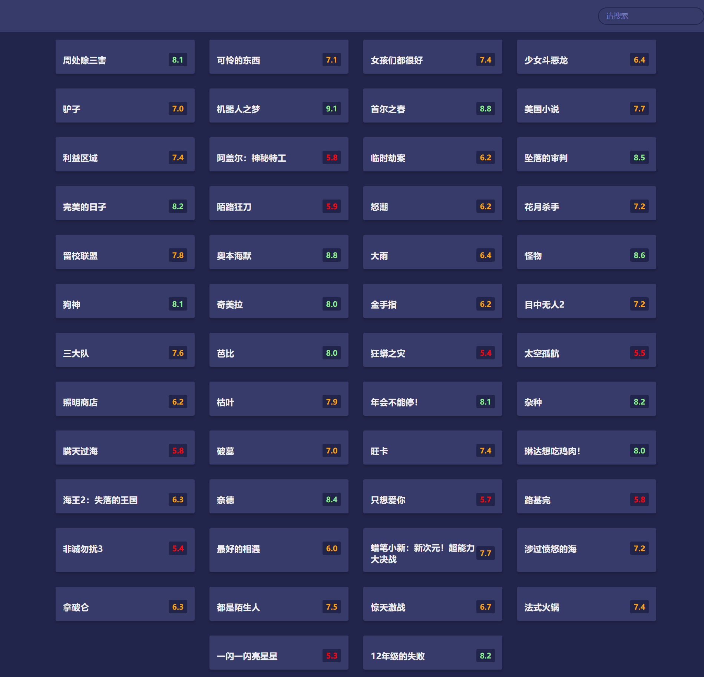

# 17-Movie App(电影页面)

## 效果



## 代码

```html
<header>
  <fomr class="form">
    <input type="text" class="search" placeholder="请搜索" />
  </fomr>
</header>
<div class="main"></div>
<script src="./axios.js"></script>
<script src="./script.js"></script>
```

```css
:root {
  --primary-color: #22254b;
  --secondary-color: #373b69;
}

* {
  margin: 0;
  padding: 0;
  box-sizing: border-box;
}

body {
  margin: 0;
  background-color: var(--primary-color);
}

header {
  padding: 1rem;
  display: flex;
  justify-content: flex-end;
  background-color: var(--secondary-color);
}

.search {
  background-color: transparent;
  border: 2px solid var(--primary-color);
  border-radius: 50px;
  font-size: 1rem;
  padding: 0.5rem 1rem;
  color: #fff;
}

.search::placeholder {
  color: #7378c5;
}

.search:focus {
  outline: none;
  background-color: var(--primary-color);
}

.main {
  display: flex;
  flex-wrap: wrap;
  justify-content: center;
}

.movie {
  width: 300px;
  margin: 1rem;
  background-color: var(--secondary-color);
  box-shadow: 0 4px 5px rgba(0, 0, 0, 0.2);
  position: relative;
  overflow: hidden;
  border-radius: 3px;
}

.movie img {
  width: 100%;
}

.movie-info {
  color: #eee;
  display: flex;
  align-items: center;
  justify-content: space-between;
  padding: 0.5rem 1rem 1rem;
}

.movie-info h3 {
  margin-top: 0;
}

.movie-info span {
  background-color: var(--primary-color);
  padding: 0.25rem 0.5rem;
  border-radius: 3px;
  font-weight: bold;
}

.movie-info span.green {
  color: lightgreen;
}

.movie-info span.orange {
  color: orange;
}

.movie-info span.red {
  color: red;
}

.overview {
  background-color: #fff;
  padding: 2rem;
  position: absolute;
  left: 0;
  bottom: 0;
  right: 0;
  max-height: 100%;
  transform: translateY(101%);
  overflow-y: auto;
  transition: transform 0.3s ease-in;
}

.movie:hover .overview {
  transform: translateY(0);
}
```

```js
const main = document.querySelector('.main')
const form = document.querySelector('.form')
const search = document.querySelector('.search')

const jsonURL = './data.json'

function showMovies() {
  main.innerHTML = ''

  axios({
    url: jsonURL,
    headers: {
      'User-Agent':
        'Mozilla/5.0 (Windows NT 10.0; Win64; x64) AppleWebKit/537.36 (KHTML, like Gecko) Chrome/121.0.0.0 Safari/537.36'
    }
  }).then((result) => {
    result.data.subjects.forEach((subject) => {
      const { title, cover, rate } = subject

      const movieEl = document.createElement('div')
      movieEl.classList.add('movie')
      movieEl.innerHTML = `
        
        <div class="movie-info">
          <h3>${title}</h3>
          <span class="${getClassByRate(rate)}">${rate}</span>
        </div>
      `
      main.appendChild(movieEl)
    })
  })
}

function getClassByRate(rate) {
  if (rate >= 8) {
    return 'green'
  } else if (rate >= 6) {
    return 'orange'
  } else {
    return 'red'
  }
}

showMovies()
```

## 解析

原本的demo的api也是已经不能使用的了，这个的api是我上网找到的一个豆瓣的api，但是涉及到请求头的问题，所以只能将api在浏览器里面打开，然后复制里面的数据存放到本地。但问题是，里面的图片也不给我访问。所以这只能是一个半成品，等后续找到办法再改改吧。