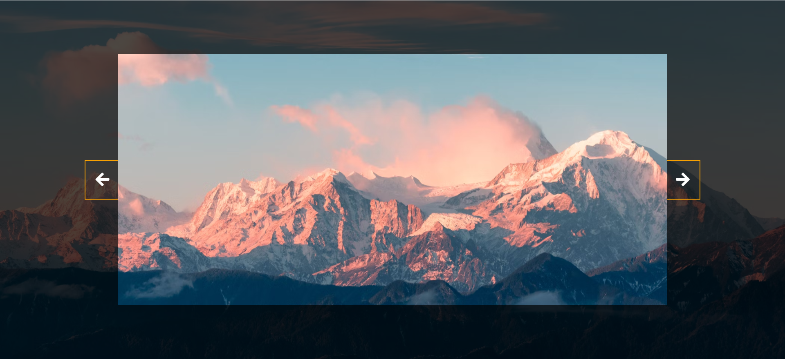

# 18-Background Slider(轮播图)

## 效果



## 代码

```html
<link
  rel="stylesheet"
  href="https://cdnjs.cloudflare.com/ajax/libs/font-awesome/5.14.0/css/all.min.css"
  integrity="sha512-1PKOgIY59xJ8Co8+NE6FZ+LOAZKjy+KY8iq0G4B3CyeY6wYHN3yt9PW0XpSriVlkMXe40PTKnXrLnZ9+fkDaog=="
  crossorigin="anonymous"
/>

<div class="slider-container">
  <div class="slide active"></div>
  <div class="slide"></div>
  <div class="slide"></div>
  <div class="slide"></div>
  <div class="slide"></div>
  <button class="arrow left-arrow">
    <i class="fas fa-arrow-left"></i>
  </button>
  <button class="arrow right-arrow">
    <i class="fas fa-arrow-right"></i>
  </button>
</div>
```

```css
* {
  margin: 0;
  padding: 0;
  box-sizing: border-box;
}

body {
  display: flex;
  flex-direction: column;
  align-items: center;
  justify-content: center;
  height: 100vh;
  overflow: hidden;
  margin: 0;
  background-position: center center;
  background-size: cover;
  transition: 0.4s;
}

body::before {
  content: '';
  position: absolute;
  top: 0;
  left: 0;
  width: 100%;
  height: 100vh;
  background-color: rgba(0, 0, 0, 0.7);
  z-index: -1;
}

.slider-container {
  box-shadow: 0 3px 6px rgba(0, 0, 0, 0.16) 0 3px 6px rgba(0, 0, 0, 0.23);
  height: 70vh;
  width: 70vw;
  position: relative;
  overflow: hidden;
}

.slide {
  opacity: 0;
  width: 100vw;
  height: 100vh;
  background-position: center center;
  background-size: cover;
  position: absolute;
  top: -15vh;
  left: -15vw;
  transition: 0.4s ease;
  z-index: 1;
}

.slide.active {
  opacity: 1;
}

.slide:nth-child(1) {
  background-image: url('https://images.unsplash.com/photo-1549880338-65ddcdfd017b?ixlib=rb-1.2.1&ixid=eyJhcHBfaWQiOjEyMDd9&auto=format&fit=crop&w=2100&q=80');
}

.slide:nth-child(2) {
  background-image: url('https://images.unsplash.com/photo-1511593358241-7eea1f3c84e5?ixlib=rb-1.2.1&ixid=eyJhcHBfaWQiOjEyMDd9&auto=format&fit=crop&w=1934&q=80');
}

.slide:nth-child(3) {
  background-image: url('https://images.unsplash.com/photo-1495467033336-2effd8753d51?ixlib=rb-1.2.1&ixid=eyJhcHBfaWQiOjEyMDd9&auto=format&fit=crop&w=2100&q=80');
}

.slide:nth-child(4) {
  background-image: url('https://images.unsplash.com/photo-1522735338363-cc7313be0ae0?ixlib=rb-1.2.1&ixid=eyJhcHBfaWQiOjEyMDd9&auto=format&fit=crop&w=2689&q=80');
}

.slide:nth-child(5) {
  background-image: url('https://images.unsplash.com/photo-1559087867-ce4c91325525?ixlib=rb-1.2.1&ixid=eyJhcHBfaWQiOjEyMDd9&auto=format&fit=crop&w=2100&q=80');
}

.arrow {
  position: fixed;
  background-color: transparent;
  color: #fff;
  padding: 20px;
  font-size: 30px;
  border: 2px solid orange;
  top: 50%;
  transform: translateY(-50%);
  cursor: pointer;
}

.arrow:focus {
  outline: 0;
}

.left-arrow {
  left: calc(15vw - 65px);
}

.right-arrow {
  right: calc(15vw - 65px);
}
```

```js
const body = document.body
const slides = document.querySelectorAll('.slide')
const leftBtn = document.querySelector('.left-arrow')
const rightBtn = document.querySelector('.right-arrow')

let activeSlide = 0
rightBtn.addEventListener('click', () => {
  activeSlide++
  if (activeSlide > slides.length - 1) {
    activeSlide = 0
  }
  setBgToBody()
  setActiveSlide()
})
leftBtn.addEventListener('click', () => {
  activeSlide--
  if (activeSlide < 0) {
    activeSlide = slides.length - 1
  }
  setBgToBody()
  setActiveSlide()
})
setBgToBody()

function setBgToBody() {
  // body.style.backgroundImage = slides[activeSlide].style.backgroundImage
  const computedStyle = window.getComputedStyle(slides[activeSlide])
  const bgImage = computedStyle.getPropertyValue('background-image')
  const bgImageUrl = bgImage.replace(
    /url\(["']?(.*?)["']?\)/i,
    function (match, url) {
      return url
    }
  )
  document.body.style.backgroundImage = 'url(' + bgImageUrl + ')'
}

function setActiveSlide() {
  slides.forEach((slide) => slide.classList.remove('active'))

  slides[activeSlide].classList.add('active')
}
```

## 解析

### setBgToBody()函数

```js
  const computedStyle = window.getComputedStyle(slides[activeSlide])
  const bgImage = computedStyle.getPropertyValue('background-image')
  const bgImageUrl = bgImage.replace(
    /url\(["']?(.*?)["']?\)/i,
    function (match, url) {
      return url
    }
  )
  document.body.style.backgroundImage = 'url(' + bgImageUrl + ')'
```

因为在CSS里面引用的背景图链接而不是直接在 `<div class="slide"></div>` 里面引用背景图片链接，因此就需要这样获取CSS的背景图片链接。

```js
const computedStyle = window.getComputedStyle(slides[activeSlide])
```

这行代码调用了`window.getComputedStyle()`方法，它接收`slides[activeSlide]`，当前激活的幻灯片元素。此时，`computedStyle`包含了该元素的计算样式。

```js
const bgImage = computedStyle.getPropertyValue('background-image')
```

这行代码调用`getPropertyValue()`方法，传入CSS属性名`background-image`，以获取该属性的值，此时，`bgImage`变量返回的是`url("https://images.unsplash.com/photo-1549880338-65ddcdfd017b?ixlib=rb-1.2.1&ixid=eyJhcHBfaWQiOjEyMDd9&auto=format&fit=crop&w=2100&q=80")`

```js
const bgImageUrl = bgImage.replace(
  /url\(["']?(.*?)["']?\)/i,
  function (match, url) {
    return url
  }
)
```

因为`bgImage`变量包含了一个完整的CSS `url()`函数，我们需要提取出实际的URL。这行代码使用`String.prototype.replace()`方法和一个正则表达式来匹配并替换掉`url()`函数，只保留URL本身。

`/url\(["']?(.*?)["']?\)/i` ，这个正则表达式的意思是：

- `url`：匹配文本`url`。
- `\(` 和 `\)`：匹配实际的括号字符`(` 和 `)`，因为在正则表达式中括号是特殊字符，所以需要使用反斜杠`\`进行转义。
- `["']?`：匹配可选的双引号`"`或单引号`'`。问号`?`表示前面的字符（即双引号或单引号）是可选的，可以出现0次或1次。
- `(.*?)`：这是一个捕获组，匹配任意数量的任意字符，但尽量少匹配（因为`*?`是非贪婪模式）。这部分用于捕获URL。
- `["']?`：再次匹配可选的双引号或单引号。
- `i`：正则表达式标志，表示不区分大小写。

替换函数接收匹配到的完整字符串`match`和捕获组中的URL`url`作为参数，并返回`url`。这样，`bgImageUrl`变量现在就只包含背景图片的URL，没有`url()`函数和其他任何额外字符。

```js
document.body.style.backgroundImage = 'url(' + bgImageUrl + ')'
```

最后，这行代码将`<body>`元素的背景图片设置为从幻灯片元素中提取出来的URL。通过给`document.body.style.backgroundImage`赋值，直接改变了`<body>`元素的内联样式。

::: info 更简单的方法？

当然，也有更加简单的方法，或许你已经发现了上面的代码一个注释

```js
body.style.backgroundImage = slides[activeSlide].style.backgroundImage
```

原作者是在`<div class="slide"></div>`里面直接加内联样式`style: ...`的方式给背景图加链接的，这样的话，`body.style.backgroundImage`就能直接读取到这里面的值，然后再进行替换，就可以很方便的实现背景图与中间图片的替换了。

:::