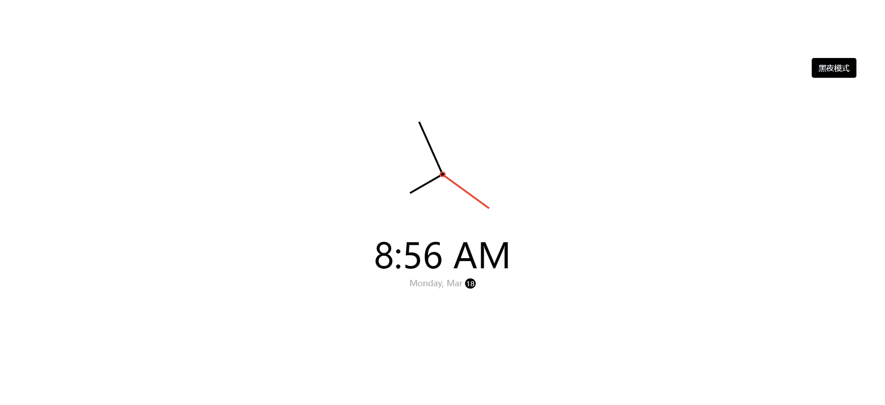

# 19-Theme Clock(主题时钟)

## 效果



## 代码

```html
<button class="toggle">黑夜模式</button>
<div class="clock-container">
  <div class="clock">
    <div class="needle hour"></div>
    <div class="needle minute"></div>
    <div class="needle second"></div>
    <div class="center-point"></div>
  </div>

  <div class="time">1</div>
  <div class="date"></div>
</div>
```

```css
:root {
  --primary-color: #000;
  --secondary-color: #fff;
}

* {
  margin: 0;
  padding: 0;
  box-sizing: border-box;
}

html {
  transition: all 0.5s ease-in;
}

html.dark {
  --primary-color: #fff;
  --secondary-color: #333;
  /* background-color: #111;
  color: var(--primary-color); */
}

html.dark {
  background-color: #111;
  color: var(--primary-color);
}

body {
  display: flex;
  align-items: center;
  justify-content: center;
  height: 100vh;
  overflow: hidden;
  margin: 0;
  position: relative;
}

.toggle {
  cursor: pointer;
  background-color: var(--primary-color);
  color: var(--secondary-color);
  border: 0;
  border-radius: 4px;
  padding: 8px 12px;
  position: absolute;
  top: 100px;
  right: 50px;
}

.toggle:focus {
  outline: none;
}

.clock-container {
  display: flex;
  flex-direction: column;
  justify-content: space-between;
  align-items: center;
}

.clock {
  position: relative;
  width: 200px;
  height: 200px;
}

.needle {
  background-color: var(--primary-color);
  position: absolute;
  top: 50%;
  left: 50%;
  height: 65px;
  width: 3px;
  transform-origin: bottom center;
  transition: all 0.5s ease-in linear;
}

.needle.hour {
  transform: translate(-50%, -100%) rotate(0deg);
}

.needle.minute {
  transform: translate(-50%, -100%) rotate(0deg);
  height: 100px;
}

.needle.second {
  transform: translate(-50%, -100%) rotate(0deg);
  height: 100px;
  background-color: #e74c3c;
}

.center-point {
  background-color: #e74c3c;
  width: 10px;
  height: 10px;
  position: absolute;
  top: 50%;
  left: 50%;
  transform: translate(-50%, -50%);
  border-radius: 50%;
}

.center-point::after {
  content: '';
  background-color: var(--primary-color);
  width: 5px;
  height: 5px;
  position: absolute;
  top: 50%;
  left: 50%;
  transform: translate(-50%, -50%);
  border-radius: 50%;
}

.time {
  font-size: 60px;
}

.date {
  color: #aaa;
  font-size: 14px;
  letter-spacing: 0.3px;
}

.date .circle {
  background-color: var(--primary-color);
  color: var(--secondary-color);
  border-radius: 50%;
  width: 18px;
  height: 18px;
  display: inline-block;
  text-align: center;
  align-items: center;
  justify-content: center;
  line-height: 18px;
  transition: all 0.5s ease-in;
  font-size: 12px;
}
```

```js
const hour = document.querySelector('.hour')
const minute = document.querySelector('.minute')
const second = document.querySelector('.second')
const times = document.querySelector('.time')
const dates = document.querySelector('.date')
const toggle = document.querySelector('.toggle')

const days = [
  'Sunday',
  'Monday',
  'Tuesday',
  'Wednesday',
  'Thursday',
  'Friday',
  'Saturday'
]
const months = [
  'Jan',
  'Feb',
  'Mar',
  'Apr',
  'May',
  'Jun',
  'Jul',
  'Aug',
  'Sep',
  'Oct',
  'Nov',
  'Dec'
]

toggle.addEventListener('click', (e) => {
  const html = document.querySelector('html')
  if (html.classList.contains('dark')) {
    html.classList.remove('dark')
    e.target.innerHTML = '黑夜模式'
  } else {
    html.classList.add('dark')
    e.target.innerHTML = '白天模式'
  }
})

const scale = (num, in_min, in_max, out_min, out_max) => {
  return ((num - in_min) * (out_max - out_min)) / (in_max - in_min) + out_min
}

function setTime() {
  const time = new Date()
  const month = time.getMonth()
  const day = time.getDay()
  const date = time.getDate()
  const hours = time.getHours()
  const hoursForClock = hours >= 13 ? hours % 12 : hours
  const minutes = time.getMinutes()
  const seconds = time.getSeconds()
  const ampm = hours >= 12 ? 'PM' : 'AM'

  hour.style.transform = ` translate(-50%, -100%) 
  rotate(${scale(hoursForClock, 0, 12, 0, 360)}deg)`

  minute.style.transform = `translate(-50%, -100%) 
  rotate(${scale(minutes, 0, 60, 0, 360)}deg)`

  second.style.transform = `translate(-50%, -100%) 
  rotate(${scale(seconds, 0, 60, 0, 360)}deg)`

  times.innerHTML = `${hoursForClock}:${ minutes < 10 ? `0${minutes}` : minutes } ${ampm}`

  dates.innerHTML = `${days[day]}, ${months[month]} <span class="circle">${date}</span>`
}
setTime()

setInterval(setTime, 1000)
```

