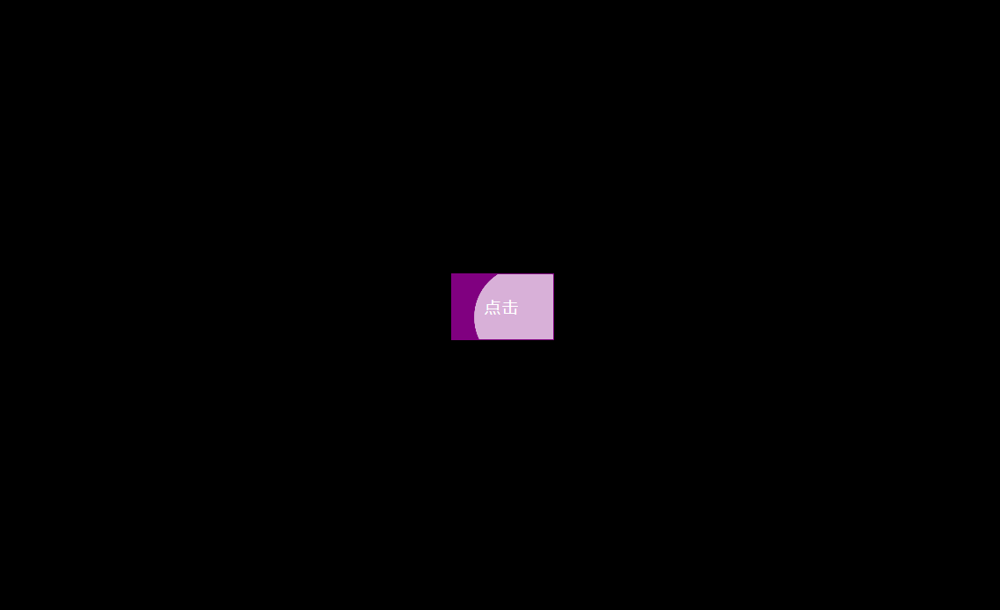

# 20-Button Ripple(动画按钮)

## 效果



## 代码

```html
<button class="ripple">点击</button>
```

```css
* {
  margin: 0;
  padding: 0;
  box-sizing: border-box;
}

body {
  background-color: #000;
  display: flex;
  flex-direction: column;
  align-items: center;
  justify-content: center;
  height: 100vh;
  overflow: hidden;
  margin: 0;
}

button {
  background-color: purple;
  color: #fff;
  border: 1px solid purple;
  font-size: 14px;
  letter-spacing: 2px;
  padding: 20px 30px;
  overflow: hidden;
  margin: 10px 0;
  position: relative;
}

button:focus {
  outline: none;
}

button .circle {
  position: absolute;
  background-color: #fff;
  width: 100px;
  height: 100px;
  border-radius: 50%;
  transform: translate(-50%, -50%) scale(0);
  animation: scale 0.5s ease-out;
}

@keyframes scale {
  to {
    transform: translate(-50%, -50%) scale(3);
    opacity: 0;
  }
}
```

```js
const buttons = document.querySelectorAll('.ripple')

buttons.forEach((button) => {
  button.addEventListener('click', function (e) {
    // 传递整个页面边缘的坐标
    const x = e.pageX
    const y = e.pageY

    // 按钮距离上、左的距离
    const buttonTop = e.target.offsetTop
    const buttonLeft = e.target.offsetLeft

    const xInside = x - buttonLeft
    const yInside = y - buttonTop

    const circle = document.createElement('span')
    circle.classList.add('circle')
    circle.style.top = yInside + 'px'
    circle.style.left = xInside + 'px'

    this.appendChild(circle)

    setTimeout(() => {
      circle.remove()
    }, 500)
  })
})
```

