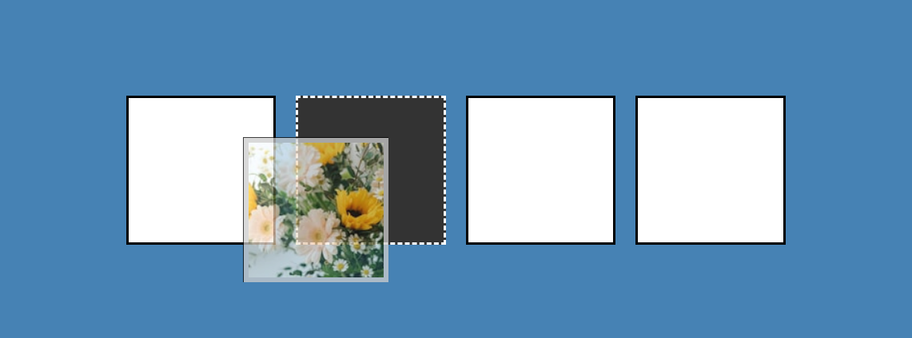

# 21-Drag And Drop(拖拽事件)

## 效果



## 代码

```html
<div class="empty">
  <div class="fill" draggable="true"></div>
</div>
<div class="empty"></div>
<div class="empty"></div>
<div class="empty"></div>
```

```css
* {
  margin: 0;
  padding: 0;
  box-sizing: border-box;
}

body {
  background-color: steelblue;
  display: flex;
  align-items: center;
  justify-content: center;
  height: 100vh;
  overflow: hidden;
  margin: 0;
}

.empty {
  width: 150px;
  height: 150px;
  margin: 10px;
  border: 3px solid #000;
  background-color: white;
}

.fill {
  background-image: url('https://source.unsplash.com/random/150x150');
  width: 145px;
  height: 145px;
  cursor: pointer;
}

.hold {
  border: 5px solid #ccc;
}

.hovered {
  background-color: #333;
  border-color: white;
  border-style: dashed;
}

@media (max-width: 800px) {
  body {
    flex-direction: column;
  }
}
```

```js
const fill = document.querySelector('.fill')
const empties = document.querySelectorAll('.empty')

fill.addEventListener('dragstart', dragStart)
fill.addEventListener('dragend', dragEnd)

for (const empty of empties) {
  empty.addEventListener('dragover', dragOver)
  empty.addEventListener('dragenter', dragEnter)
  empty.addEventListener('dragleave', dragLeave)
  empty.addEventListener('drop', dragDrop)
}

function dragStart() {
  this.className += ' hold'
  setTimeout(() => {
    this.className = 'invisible'
  }, 0)
}

function dragEnd() {
  this.className = 'fill'
}

function dragOver(e) {
  e.preventDefault()
}

function dragEnter(e) {
  e.preventDefault()
  this.className += ' hovered'
}

function dragLeave() {
  this.className = 'empty'
}

function dragDrop() {
  this.className = 'empty'
  this.append(fill)
}
```

## 解析

```js
for (const empty of empties) {
  empty.addEventListener('dragover', dragOver)
  empty.addEventListener('dragenter', dragEnter)
  empty.addEventListener('dragleave', dragLeave)
  empty.addEventListener('drop', dragDrop)
}
```

- `dragover`：当拖动的元素在目标元素上方移动时触发。
- `dragenter`：当拖动的元素进入目标元素时触发。
- `dragleave`：当拖动的元素离开目标元素时触发。
- `drop`：当在目标元素上释放拖动的元素时触发。