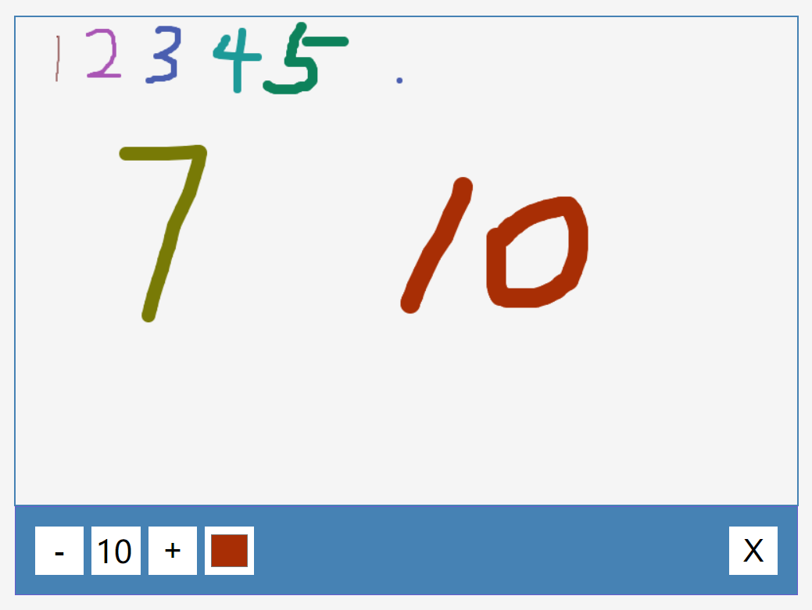

# 22-Drawing App(绘画板)

## 效果



## 代码

```html
<canvas class="canvas" width="800" height="500"></canvas>
<div class="toolbox">
  <button class="dec">-</button>
  <span class="size">10</span>
  <button class="inc">+</button>
  <input type="color" class="color" />
  <button class="clear">X</button>
</div>
```

```css
* {
  margin: 0;
  padding: 0;
  box-sizing: border-box;
}

body {
  background-color: #f5f5f5;
  display: flex;
  flex-direction: column;
  align-items: center;
  justify-content: center;
  height: 100vh;
  margin: 0;
}

.canvas {
  border: 2px solid steelblue;
}

.toolbox {
  background-color: steelblue;
  border: 1px solid slateblue;
  display: flex;
  width: 802px;
  padding: 1rem;
}

.toolbox > * {
  background-color: #fff;
  border: none;
  display: inline-block;
  align-items: center;
  justify-content: center;
  font-size: 2rem;
  width: 50px;
  height: 50px;
  margin: 0.25rem;
  padding: 0.25rem;
  cursor: pointer;
}

.toolbox > *:last-child {
  margin-left: auto;
}
```

```js
const canvas = document.querySelector('.canvas')
const incBtn = document.querySelector('.inc')
const decBtn = document.querySelector('.dec')
const sizeEl = document.querySelector('.size')
const colorEl = document.querySelector('.color')
const clearEl = document.querySelector('.clear')

// 获取2d的画板
const ctx = canvas.getContext('2d')

let sizes = 10
let isPressed = false
colorEl.value = 'black'
let color = colorEl.value
let x
let y

canvas.addEventListener('mousedown', (e) => {
  isPressed = true

  x = e.offsetX
  y = e.offsetY
})

document.addEventListener('mouseup', (e) => {
  isPressed = false
  x = undefined
  y = undefined
})

canvas.addEventListener('mousemove', (e) => {
  if (isPressed) {
    const x2 = e.offsetX
    const y2 = e.offsetY

    drawCircle(x2, y2)
    drawLine(x, y, x2, y2)

    x = x2
    y = y2
  }
})

function drawCircle(x, y) {
  ctx.beginPath()
  ctx.arc(x, y, sizes, 0, Math.PI * 2)
  ctx.fillStyle = color
  ctx.fill()
}

function drawLine(x1, y1, x2, y2) {
  ctx.beginPath()
  ctx.moveTo(x1, y1)
  ctx.lineTo(x2, y2)
  ctx.strokeStyle = color
  ctx.lineWidth = sizes * 2
  ctx.stroke()
}

function updateSizeOnScreen() {
  sizeEl.innerText = sizes
}

incBtn.addEventListener('click', () => {
  sizes += 1
  if (sizes > 50) {
    sizes = 50
  }
  updateSizeOnScreen()
})

decBtn.addEventListener('click', () => {
  sizes -= 1
  if (sizes < 1) {
    sizes = 1
  }
  updateSizeOnScreen()
})

colorEl.addEventListener('change', (e) => {
  color = e.target.value
  console.log(color)
})
clearEl.addEventListener('click', () => {
  ctx.clearRect(0, 0, canvas.width, canvas.height)
})
```

## 解析

```js
const ctx = canvas.getContext('2d')
```

获取2d面板用于绘图

### canvas mousedown监听事件

```js
canvas.addEventListener('mousedown', (e) => {
  isPressed = true

  x = e.offsetX
  y = e.offsetY
})
```

+ `e.offsetX`表示鼠标指针相对于触发事件的`<canvas>`元素的左边框的水平偏移量。这行代码将`x`变量设置为这个偏移量，这样你就知道鼠标按下时在`<canvas>`元素内的水平位置。

### drawCircle()函数

```js
function drawCircle(x, y) {
  ctx.beginPath()
  ctx.arc(x, y, sizes, 0, Math.PI * 2)
  ctx.fillStyle = color
  ctx.fill()
}
```

+ `ctx.beginPath()`：开始绘制新的路径
+ `ctx.arc(x, y, sizes, 0, Math.PI * 2)`：绘制一个圆，参数分别是圆心x坐标、圆心y坐标、半径、起始角度（0弧度）、结束角度（2π弧度）
+ `ctx.fillStyle = color`：设置填充颜色 
+ `ctx.fill()`：填充图形路径

### drawLine()函数

```js
function drawLine(x1, y1, x2, y2) {
  ctx.beginPath()
  ctx.moveTo(x1, y1)
  ctx.lineTo(x2, y2)
  ctx.strokeStyle = color
  ctx.lineWidth = sizes * 2
  ctx.stroke()
}
```

+ `ctx.moveTo(x1, y1)`：将绘图光标移动到指定的坐标 `(x1, y1)`，这将是直线的起点。
+ `ctx.lineTo(x2, y2)`：从当前位置（即 `moveTo` 指定的起点）绘制一条直线到指定的坐标 `(x2, y2)`，这将是直线的终点。
+ `ctx.strokeStyle = color`：设置线条的颜色。
+ `ctx.lineWidth = sizes * 2`：设置线条的宽度。
+ `ctx.stroke()`：使用 `stroke` 方法来实际绘制（描边）之前定义的路径，即绘制出直线。

### clearEl监听事件

```js
clearEl.addEventListener('click', () => {
  ctx.clearRect(0, 0, canvas.width, canvas.height)
})
```

+ `ctx.clearRect(0, 0, canvas.width, canvas.height)`：用于清除`<canvas>`上的矩形区域。它接受四个参数：矩形的左上角x坐标、左上角y坐标、矩形的宽度和矩形的高度。