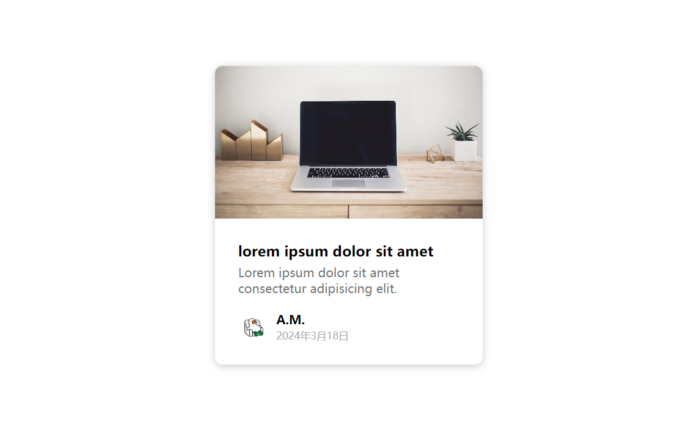

# 24-Content Placeholder(内容卡片)

## 效果



## 代码

```html
<div class="card">
  <div class="card-header animated-bg" id="header"></div>

  <div class="card-content">
    <h3 class="card-title animated-bg animated-bg-text" id="title"></h3>
    <p class="card-excerpt" id="excerpt">
      <span class="animated-bg animated-bg-text"></span>
      <span class="animated-bg animated-bg-text"></span>
      <span class="animated-bg animated-bg-text"></span>
    </p>

    <div class="author">
      <div class="profile-img animated-bg" id="profile_img"></div>
      <div class="author-info">
        <strong class="animated-bg animated-bg-text" id="name"></strong>
        <small class="animated-bg animated-bg-text" id="date"></small>
      </div>
    </div>
  </div>
</div>
```

```css
* {
  margin: 0;
  padding: 0;
  box-sizing: border-box;
}

body {
  display: flex;
  margin: 0;
  align-items: center;
  justify-content: center;
  height: 100vh;
  /* overflow: hidden; */
}

img {
  max-width: 100%;
}

.card {
  box-shadow: 0 2px 10px rgba(0, 0, 0, 0.2);
  border-radius: 10px;
  overflow: hidden;
  width: 350px;
}

.card-header {
  height: 200px;
}

.card-header img {
  object-fit: cover;
  width: 100%;
  height: 100%;
}

.card-content {
  background-color: #fff;
  padding: 30px;
}

.card-title {
  height: 20px;
  margin: 0;
}

.card-excerpt {
  color: #777;
  margin: 10px 0 20px;
}

.author {
  display: flex;
}

.profile-img {
  width: 40px;
  height: 40px;
  overflow: hidden;
  border-radius: 50%;
}

.author-info {
  display: flex;
  flex-direction: column;
  justify-content: space-between;
  margin-left: 10px;
  width: 100px;
}

.author-info small {
  color: #aaa;
}

.animated-bg {
  background-image: linear-gradient(
    to right,
    #f6f7f8 0%,
    #edeef1 10%,
    #f6f7f8 20%,
    #f6f7f8 100%
  );
  background-size: 200% 100%;
  animation: bgPos 1s linear infinite;
}

.animated-bg-text {
  display: inline-block;
  margin: 0;
  width: 100%;
  height: 10px;
  border-radius: 50px;
}

@keyframes bgPos {
  0% {
    background-position: 50% 0;
  }
  100% {
    background-position: -150% 0;
  }
}
```

```js
const header = document.getElementById('header')
const title = document.getElementById('title')
const excerpt = document.getElementById('excerpt')
const profile_img = document.getElementById('profile_img')
const names = document.getElementById('name')
const date = document.getElementById('date')

const animated_bgs = document.querySelectorAll('.animated-bg')
const animated_bg_texts = document.querySelectorAll('.animated-bg-text')

setTimeout(getData, 2500)

function getData() {
  header.innerHTML =
    ''
  title.innerHTML = 'lorem ipsum dolor sit amet'
  excerpt.innerHTML =
    'Lorem ipsum dolor sit amet consectetur adipisicing elit. '
  profile_img.innerHTML =
    ''
  names.innerHTML = 'A.M.'
  date.innerHTML = '2024年3月18日'

  animated_bgs.forEach((bg) => {
    bg.classList.remove('animated-bg')
  })

  animated_bg_texts.forEach((bg) => {
    bg.classList.remove('animated-bg-text')
  })
}
```

