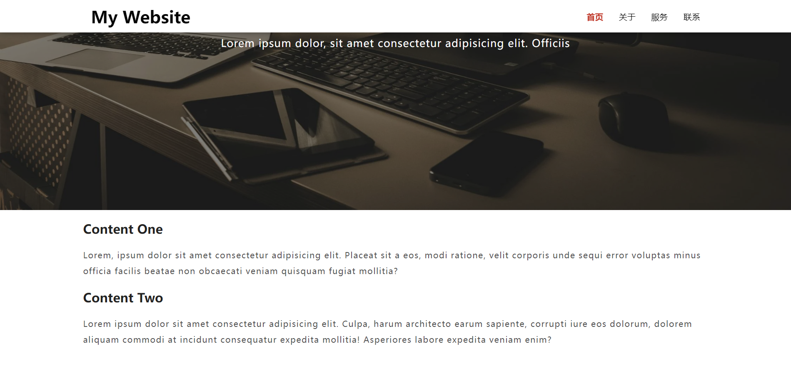

# 25-Sticky Navbar(动态导航栏)

## 效果



## 代码

```html
<div class="nav">
  <div class="wrapper">
    <h1 class="logo">
      <a href="#">My Website</a>
    </h1>
    <ul>
      <li><a href="#" class="nav-link current">首页</a></li>
      <li><a href="#" class="nav-link">关于</a></li>
      <li><a href="#" class="nav-link">服务</a></li>
      <li><a href="#" class="nav-link">联系</a></li>
    </ul>
  </div>
</div>

<div class="hero">
  <div class="wrapper">
    <h1>欢迎来到我的网站</h1>
    <p>
      Lorem ipsum dolor, sit amet consectetur adipisicing elit. Officiis
    </p>
  </div>
</div>

<div class="content wrapper">
  <h2>Content One</h2>
  <p>
    Lorem, ipsum dolor sit amet consectetur adipisicing elit. Placeat sit a
    eos, modi ratione, velit corporis unde sequi error voluptas minus
    officia facilis beatae non obcaecati veniam quisquam fugiat mollitia?
  </p>

  <h3>Content Two</h3>
  <p>
    Lorem ipsum dolor sit amet consectetur adipisicing elit. Culpa, harum
    architecto earum sapiente, corrupti iure eos dolorum, dolorem aliquam
    commodi at incidunt consequatur expedita mollitia! Asperiores labore
    expedita veniam enim?
  </p>
</div>
```

```css
* {
  margin: 0;
  padding: 0;
  box-sizing: border-box;
}

body {
  color: #222;
  padding-bottom: 50px;
}

.wrapper {
  max-width: 1200px;
  margin: 0 auto;
}

.nav {
  position: fixed;
  background-color: #222;
  top: 0;
  left: 0;
  right: 0;
  transition: all 0.3s ease-in-out;
}

.nav .wrapper {
  display: flex;
  justify-content: space-between;
  align-items: center;
  padding: 20px 0;
  transition: all 0.3s ease-in-out;
}

.nav ul {
  display: flex;
  list-style: none;
  align-items: center;
  justify-content: center;
}

.nav a {
  color: #fff;
  text-decoration: none;
  padding: 7px 15px;
  transition: all 0.3s ease-in-out;
}

.nav.active {
  background-color: #fff;
  box-shadow: 0 2px 10px rgba(0, 0, 0, 0.3);
}

.nav.active a {
  color: #000;
}

.nav.active .wrapper {
  padding: 10px 0;
}

.nav a.current,
.nav a:hover {
  color: #c0392b;
  font-weight: bold;
}

.hero {
  position: relative;
  display: flex;
  background-image: url('https://images.pexels.com/photos/450035/pexels-photo-450035.jpeg?auto=compress&cs=tinysrgb&dpr=2&h=750&w=1260');
  background-repeat: no-repeat;
  background-size: cover;
  background-position: bottom center;
  height: 100vh;
  color: #fff;
  justify-content: center;
  align-items: center;
  text-align: center;
  margin-bottom: 20px;
  z-index: -2;
}

.hero::before {
  content: '';
  position: absolute;
  top: 0;
  left: 0;
  width: 100%;
  height: 100%;
  background-color: rgba(0, 0, 0, 0.5);
  z-index: -1;
}

.hero h1 {
  font-size: 46px;
  margin: -20px 0 20px;
}

.hero p {
  font-size: 20px;
  letter-spacing: 1px;
}

.content h2,
.content h3 {
  font-size: 150%;
  margin: 20px 0;
}

.content p {
  color: #555;
  line-height: 30px;
  letter-spacing: 1.2px;
}
```

```js
const nav = document.querySelector('.nav')
const navLink = document.querySelectorAll('.nav-link')

window.addEventListener('scroll', fixNav)

function fixNav() {
  if (window.scrollY > nav.offsetHeight + 150) {
    nav.classList.add('active')
  } else {
    nav.classList.remove('active')
  }
}

navLink.forEach(function (link) {
  link.addEventListener('click', function (event) {
    event.preventDefault()
    const current = document.querySelectorAll('.nav-link.current')
    current.forEach(function (currentLink) {
      currentLink.classList.remove('current')
    })
    this.classList.add('current')
  })
})
```

