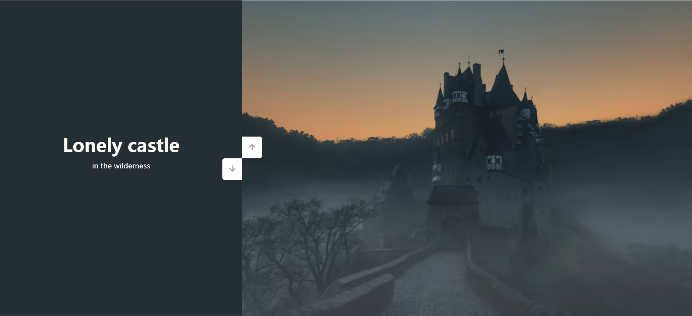

# 26-Vertical Slider(垂直滚动条)

## 效果



## 代码

```html
<link rel="stylesheet" href="https://cdnjs.cloudflare.com/ajax/libs/font-awesome/5.15.1/css/all.min.css" />

<div class="slider-container">
  <div class="left-slide">
    <div style="background-color: #fd3555">
      <h1>Nature flower</h1>
      <p>all in pink</p>
    </div>
    <div style="background-color: #2a86ba">
      <h1>Bluuuue Sky</h1>
      <p>with it's mountains</p>
    </div>
    <div style="background-color: #252e33">
      <h1>Lonely castle</h1>
      <p>in the wilderness</p>
    </div>
    <div style="background-color: #ffb866">
      <h1>Flying eagle</h1>
      <p>in the sunset</p>
    </div>
  </div>
  <div class="right-slide">
    <div
         style="
                background-image: url('https://images.unsplash.com/photo-1508768787810-6adc1f613514?ixlib=rb-0.3.5&ixid=eyJhcHBfaWQiOjEyMDd9&s=e27f6661df21ed17ab5355b28af8df4e&auto=format&fit=crop&w=1350&q=80');
                "
         ></div>
    <div
         style="
                background-image: url('https://images.unsplash.com/photo-1519981593452-666cf05569a9?ixlib=rb-0.3.5&ixid=eyJhcHBfaWQiOjEyMDd9&s=90ed8055f06493290dad8da9584a13f7&auto=format&fit=crop&w=715&q=80');
                "
         ></div>
    <div
         style="
                background-image: url('https://images.unsplash.com/photo-1486899430790-61dbf6f6d98b?ixlib=rb-0.3.5&ixid=eyJhcHBfaWQiOjEyMDd9&s=8ecdee5d1b3ed78ff16053b0227874a2&auto=format&fit=crop&w=1002&q=80');
                "
         ></div>
    <div
         style="
                background-image: url('https://images.unsplash.com/photo-1510942201312-84e7962f6dbb?ixlib=rb-0.3.5&ixid=eyJhcHBfaWQiOjEyMDd9&s=da4ca7a78004349f1b63f257e50e4360&auto=format&fit=crop&w=1050&q=80');
                "
         ></div>
  </div>
  <div class="action-buttons">
    <button class="down-button">
      <i class="fas fa-arrow-down"></i>
    </button>
    <button class="up-button">
      <i class="fas fa-arrow-up"></i>
    </button>
  </div>
</div>
```

```css
* {
  margin: 0;
  padding: 0;
  box-sizing: border-box;
}

body {
  height: 100vh;
}

.slider-container {
  position: relative;
  overflow: hidden;
  width: 100vw;
  height: 100vh;
}

.left-slide {
  width: 35%;
  height: 100%;
  position: absolute;
  top: 0;
  left: 0;
  transition: transform 0.5s ease-in-out;
}

.left-slide > div {
  width: 100%;
  height: 100%;
  display: flex;
  flex-direction: column;
  align-items: center;
  justify-content: center;
  color: #fff;
}

.left-slide h1 {
  font-size: 40px;
  margin-bottom: 10px;
  margin-top: -30px;
}

.right-slide {
  position: absolute;
  height: 100%;
  top: 0;
  left: 35%;
  width: 65%;
  transition: transform 0.5s ease-in-out;
}

.right-slide > div {
  background-repeat: no-repeat;
  background-size: cover;
  background-position: center center;
  width: 100%;
  height: 100%;
}

button {
  background-color: #fff;
  border: none;
  color: #aaa;
  cursor: pointer;
  font-size: 16px;
  padding: 15px;
}

button:hover {
  color: #222;
}

button:focus {
  outline: none;
}

.slider-container .action-buttons button {
  position: absolute;
  left: 35%;
  top: 50%;
  z-index: 100;
}

.slider-container .action-buttons .down-button {
  transform: translateX(-100%);
  border-top-left-radius: 5px;
  border-bottom-left-radius: 5px;
}

.slider-container .action-buttons .up-button {
  transform: translateY(-100%);
  border-top-right-radius: 5px;
  border-bottom-right-radius: 5px;
}
```

```js
const sliderContainer = document.querySelector('.slider-container')
const slideLeft = document.querySelector('.left-slide')
const slideRight = document.querySelector('.right-slide')
const upButton = document.querySelector('.up-button')
const downButton = document.querySelector('.down-button')
const slidesLength = slideRight.querySelectorAll('div').length

let activeSlideIndex = 0

slideLeft.style.top = `-${(slidesLength - 1) * 100}vh`

upButton.addEventListener('click', () => changeSlide('up'))
downButton.addEventListener('click', () => changeSlide('down'))

const changeSlide = (direction) => {
  const sliderHeight = sliderContainer.clientHeight
  if (direction === 'up') {
    activeSlideIndex++
    if (activeSlideIndex > slidesLength - 1) {
      activeSlideIndex = 0
    }
  } else if (direction === 'down') {
    activeSlideIndex--
    if (activeSlideIndex < 0) {
      activeSlideIndex = slidesLength - 1
    }
  }
  slideRight.style.transform = `translateY(-${activeSlideIndex * sliderHeight}px)`
  slideLeft.style.transform = `translateY(${activeSlideIndex * sliderHeight}px)`
}
```

## 解析

```js
slideLeft.style.top = `-${(slidesLength - 1) * 100}vh`
```

+ 设置`slideLeft`的初始位置,目的是让`slideLeft`一开始就在`slideRight`的底部下方，形成一个“堆栈”效果。

### changeSlide()函数

```js
if (activeSlideIndex > slidesLength - 1) {
  activeSlideIndex = 0
}
```

+ 向上滚动后，检查`activeSlideIndex`是否超过了幻灯片的总数量（`slidesLength`）。如果`activeSlideIndex`大于这个值，说明已经滚动到了幻灯片的末尾之外，就将`activeSlideIndex`重置为0，这样下一次显示的就是第一个幻灯片，实现了循环滚动的效果。