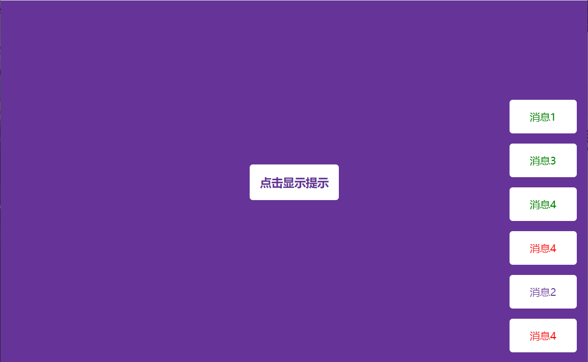

# 27-Toasts Notification(提示卡片)

## 效果



## 代码

```html
<div class="toasts"></div>
<button class="btn">点击显示提示</button>
<script src="./script.js"></script>
```

```css
* {
  margin: 0;
  padding: 0;
  box-sizing: border-box;
}

body {
  display: flex;
  flex-direction: column;
  background-color: rebeccapurple;
  align-items: center;
  justify-content: center;
  height: 100vh;
  margin: 0;
}

.btn {
  background-color: #fff;
  color: rebeccapurple;
  font-weight: bold;
  padding: 1rem;
  border-radius: 5px;
  border: none;
  cursor: pointer;
  font-size: 18px;
}

.btn:focus {
  outline: none;
}

.btn:active {
  transform: scale(0.98);
}

.toasts {
  position: fixed;
  bottom: 10px;
  right: 10px;
  display: flex;
  flex-direction: column;
  align-items: flex-end;
}

.toast {
  background-color: #fff;
  border-radius: 5px;
  padding: 1rem 2rem;
  margin: 0.5rem;
}

.toast.info {
  color: rebeccapurple;
}

.toast.success {
  color: green;
}

.toast.error {
  color: red;
}
```

```js
const btn = document.querySelector('.btn')
const toasts = document.querySelector('.toasts')

const message = ['消息1', '消息2', '消息3', '消息4']
const types = ['info', 'success', 'error']

btn.addEventListener('click', () => createNotification())

function createNotification(message = null, type = null) {
  const notif = document.createElement('div')
  notif.classList.add('toast')
  notif.classList.add(type ? type : getRandomType())

  notif.innerText = message ? message : getRandomMessage()

  toasts.appendChild(notif)

  setTimeout(() => {
    notif.remove()
  }, 3000)
}

function getRandomType() {
  return types[Math.floor(Math.random() * types.length)]
}

function getRandomMessage() {
  return message[Math.floor(Math.random() * message.length)]
}
```

