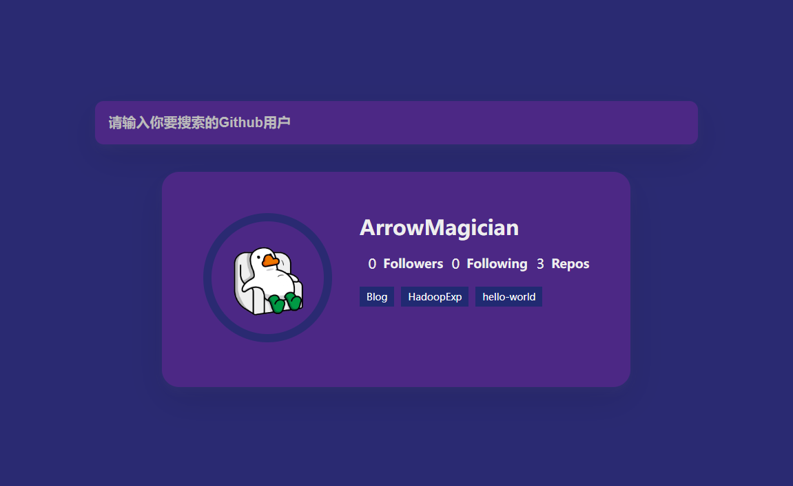

# 28-Github Profiles(Github卡片)

## 效果



## 代码

```html
<form class="user-form">
  <input type="text" placeholder="请输入你要搜索的Github用户" class="search" />
</form>
<main class="main"></main>

<script src="./script.js"></script>
<script src="https://cdnjs.cloudflare.com/ajax/libs/axios/0.21.0/axios.min.js" integrity="sha512-DZqqY3PiOvTP9HkjIWgjO6ouCbq+dxqWoJZ/Q+zPYNHmlnI2dQnbJ5bxAHpAMw+LXRm4D72EIRXzvcHQtE8/VQ==" crossorigin="anonymous"></script>
```

```css
* {
  margin: 0;
  padding: 0;
  box-sizing: border-box;
}

body {
  display: flex;
  align-items: center;
  justify-content: center;
  flex-direction: column;
  height: 100vh;
  margin: 0;
  background-color: #2a2a72;
}

.user-form {
  width: 100%;
  max-width: 700px;
}

.user-form input {
  width: 100%;
  display: block;
  background-color: #4c2885;
  border: none;
  border-radius: 10px;
  color: #fff;
  padding: 1rem;
  margin-bottom: 2rem;
  font-size: 1rem;
  font-weight: bold;
  box-shadow: 0 5px 10px rgba(154, 160, 185, 0.05),
    0 15px 40px rgba(0, 0, 0, 0.1);
}

.user-form input::placeholder {
  color: #bbb;
}

.user-form input:focus {
  outline: none;
}

.card {
  max-width: 800px;
  background-color: #4c2885;
  border-radius: 20px;
  box-shadow: 0 5px 10px rgba(154, 160, 185, 0.05),
    0 15px 40px rgba(0, 0, 0, 0.1);
  display: flex;
  padding: 3rem;
  margin: 0 1.5rem;
}

.avatar {
  border-radius: 50%;
  border: 10px solid #2a2a72;
  width: 150px;
  height: 150px;
}

.user-info {
  color: #eee;
  margin-left: 2rem;
}

.user-info h2 {
  margin-top: 0;
}

.user-info ul {
  display: flex;
  list-style: none;
  justify-content: space-between;
  padding: 0;
  max-width: 400px;
  margin: 16px 0;
}

.user-info ul li {
  display: flex;
  align-items: center;
  margin-left: 10px;
}

.user-info ul li strong {
  font-size: 0.9rem;
  margin-left: 0.5rem;
}

.repo {
  text-decoration: none;
  color: #fff;
  background-color: #212a72;
  font-size: 0.7rem;
  padding: 0.25rem 0.5rem;
  margin-right: 0.5rem;
  margin-bottom: 0.5rem;
  display: inline-block;
}

@media (max-width: 500px) {
  .card {
    flex-direction: column;
    align-items: center;
  }
  .user-form {
    max-width: 400px;
  }
}
```

```js
const APIURL = 'https://api.github.com/users/'

const main = document.querySelector('.main')
const form = document.querySelector('.user-form')
const search = document.querySelector('.search')

async function getUser(username) {
  try {
    const { data } = await axios(APIURL + username)
    createUserCard(data)
    getRepos(username)
  } catch (err) {
    if (err.response.status == 404) {
      createErrorCard('没有这个用户')
    }
  }
}

async function getRepos(username) {
  try {
    const { data } = await axios(APIURL + username + '/repos?sort=created')
    addResposToCard(data)
    console.log(data)
  } catch (err) {
    createErrorCard('找不到这个仓库')
  }
}

function createUserCard(user) {
  const userID = user.name || user.login
  const userBio = user.bio ? `<p>${user.bio}</p>` : ''
  const cardHTML = `
    <div class="card">
      <div>
        
      </div>
      <div class="user-info">
        <h2>${userID}</h2>
        ${userBio}
        <ul>
          <li>${user.followers}<strong>Followers</strong></li>
          <li>${user.following}<strong>Following</strong></li>
          <li>${user.public_repos}<strong>Repos</strong></li>
        </ul>
        <div class="repos"></div>
      </div>
    </div>
  `
  main.innerHTML = cardHTML
}

function createErrorCard(msg) {
  const cardHTML = `
    <div class="card>
      <h1>${msg}</h1>
    </div>
  `
  main.innerHTML = cardHTML
}

function addResposToCard(repos) {
  const reposEl = document.querySelector('.repos')
  repos.slice(0, 5).forEach((repo) => {
    const repoEl = document.createElement('a')
    repoEl.classList.add('repo')
    repoEl.href = repo.html_url
    repoEl.target = '_blank'
    repoEl.innerText = repo.name

    reposEl.appendChild(repoEl)
  })
}

form.addEventListener('submit', (e) => {
  e.preventDefault()
  const user = search.value

  if (user) {
    getUser(user)
    search.value = ''
  }
})
```

