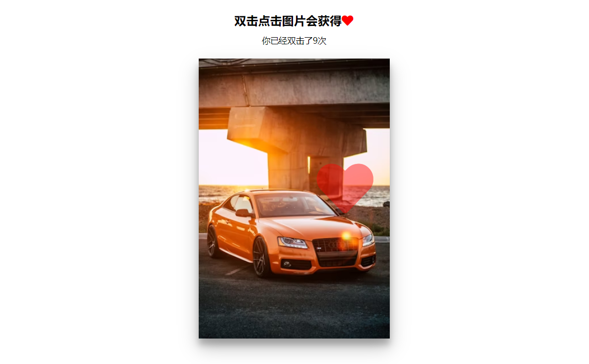

# 29-Double Click Heart(双击小红心)

## 效果



## 代码

```html
<link rel="stylesheet" href="https://cdnjs.cloudflare.com/ajax/libs/font-awesome/5.14.0/css/all.min.css" integrity="sha512-1PKOgIY59xJ8Co8+NE6FZ+LOAZKjy+KY8iq0G4B3CyeY6wYHN3yt9PW0XpSriVlkMXe40PTKnXrLnZ9+fkDaog==" crossorigin="anonymous" />

<h3>双击点击图片会获得<i class="fas fa-heart"></i></h3>
<small>你已经双击了<span class="times">0</span>次</small>

<div class="loveMe"></div>
```

```css
* {
  margin: 0;
  padding: 0;
  box-sizing: border-box;
}

body {
  text-align: center;
  margin: 0;
}

h3 {
  margin-top: 20px;
  margin-bottom: 10px;
  text-align: center;
}

small {
  display: block;
  margin-bottom: 20px;
  text-align: center;
}

.fa-heart {
  color: red;
}

.loveMe {
  width: 300px;
  height: 440px;
  background: url('https://images.unsplash.com/photo-1504215680853-026ed2a45def?ixlib=rb-1.2.1&ixid=eyJhcHBfaWQiOjEyMDd9&auto=format&fit=crop&w=334&q=80')
    no-repeat center center/cover;
  margin: auto;
  cursor: pointer;
  max-width: 100%;
  position: relative;
  box-shadow: 0 14px 28px rgba(0, 0, 0, 0.25), 0 10px 10px rgba(0, 0, 0, 0.22);
  overflow: hidden;
}

.loveMe .fa-heart {
  position: absolute;
  animation: grow 0.6s linear;
  transform: translate(-50%, -50%) scale(0);
}

@keyframes grow {
  to {
    transform: translate(-50%, -50%) scale(10);
    opacity: 0;
  }
}
```

```js
const img = document.querySelector('.loveMe')
const times = document.querySelector('.times')

let clickTime = 0
let timesCliked = 0

img.addEventListener('click', (e) => {
  let date = new Date().getTime()
  if (clickTime === 0) {
    clickTime = date
  } else {
    if (date - clickTime < 800) {
      createHeart(e)
      clickTime = 0
    } else {
      clickTime = date
    }
  }
})

const createHeart = (e) => {
  const heart = document.createElement('i')
  heart.classList.add('fas')
  heart.classList.add('fa-heart')

  const x = e.clientX
  const y = e.clientY

  const leftOffset = e.target.offsetLeft
  const topOffset = e.target.offsetTop

  const xInside = x - leftOffset
  const yInside = y - topOffset

  heart.style.top = `${yInside}px`
  heart.style.left = `${xInside}px`

  img.appendChild(heart)

  times.innerHTML = ++timesCliked

  setTimeout(() => {
    heart.remove()
  }, 1000)
}
```

## 解析

### createHeart函数

```js
const x = e.clientX;  
const y = e.clientY;  
  
const leftOffset = e.target.offsetLeft;  
const topOffset = e.target.offsetTop;  
  
const xInside = x - leftOffset;  
const yInside = y - topOffset;
```

+ `e.clientX` 和 `e.clientY`：获取鼠标点击事件在页面上的坐标。
+ `e.target.offsetLeft` 和 `e.target.offsetTop`：获取被点击元素（通常是图片）相对于其最近的定位父元素的左边距和上边距。
+ `xInside` 和 `yInside`：通过从鼠标点击的坐标中减去被点击元素的偏移量，得到心形图标在被点击元素内部的相对位置。


```js
times.innerHTML = ++timesCliked
```

+ `++timesCliked`：先对 `timesCliked` 变量进行自增操作，然后返回其新值。
+ `times.innerHTML = ...`：将更新后的 `timesCliked` 值设置为 `times` 元素（通常是一个显示点击次数的元素）的 `innerHTML`，从而在页面上显示新的点击次数。