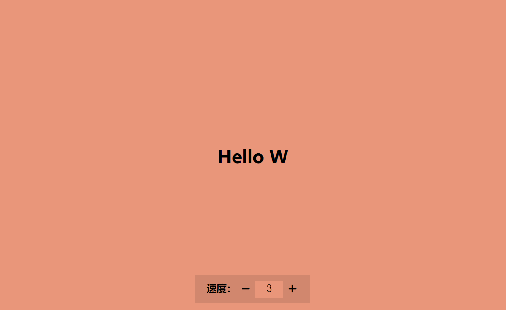

# 30-Auto text effect(文字浮现)

## 效果



## 代码

```html
<h1 class="text">准备......开始</h1>

<div>
  <label for="speed">速度：</label>
  <button class="btn prev"><i class="fas fa-minus"></i></button>
  <input type="number" class="speed" value="1" min="1" max="10" />
  <button class="btn next"><i class="fas fa-plus"></i></button>
</div>
<script src="./script.js"></script>
```

```css
* {
  margin: 0;
  padding: 0;
  box-sizing: border-box;
}

body {
  display: flex;
  margin: 0;
  height: 100vh;
  align-items: center;
  justify-content: center;
  flex-direction: column;
  background-color: darksalmon;
}

div {
  position: absolute;
  bottom: 20px;
  background-color: rgba(0, 0, 0, 0.1);
  padding: 10px 20px;
  font-size: 18px;
  font-weight: 700;
}

input {
  width: 50px;
  padding: 5px;
  font-size: 18px;
  background-color: darksalmon;
  border: none;
  text-align: center;
}

input:focus {
  outline: none;
}

input[type='number']::-webkit-inner-spin-button,
input[type='number']::-webkit-outer-spin-button {
  -webkit-appearance: none;
  margin: 0;
}

.btn {
  background-color: transparent;
  border: none;
  cursor: pointer;
  font-size: 16px;
  padding: 5px;
}
```

```js
const textEl = document.querySelector('.text')
const speedEl = document.querySelector('.speed')
const subBtn = document.querySelector('.prev')
const addBtn = document.querySelector('.next')

const text = 'Hello World'
let idx = 1
let speed = 300 / speedEl.value

writeText()
function writeText() {
  textEl.innerText = text.slice(0, idx)
  idx++
  if (idx > text.length) {
    idx = 1
  }
  setTimeout(writeText, speed)
}

speedEl.addEventListener('input', (e) => {
  speed = 300 / e.target.value
})

addBtn.addEventListener('click', () => {
  let speedValue = parseInt(speedEl.value, 10)
  speedValue++
  if (speedValue > 10) {
    speedValue = 10
  }
  speedEl.value = speedValue.toString()
  speedEl.dispatchEvent(new Event('input'))
})

subBtn.addEventListener('click', () => {
  let speedValue = parseInt(speedEl.value, 10)
  speedValue--
  if (speedValue < 1) {
    speedValue = 1
  }
  speedEl.value = speedValue.toString()
  speedEl.dispatchEvent(new Event('input'))
})
```

## 解析

原本的代码效果并不是这样，只是依靠用户在输入框内输入数字改变速度的。在这里，我增加了两个按钮，这样用户就可以通过点击按钮的方式进行速度的控制。

```js
speedEl.dispatchEvent(new Event('input'))
```

这行代码的主要作用就是为了能够让按钮增加或减少的值与文本框里面的值进行相互通信，从而达到按钮控制速度的效果。