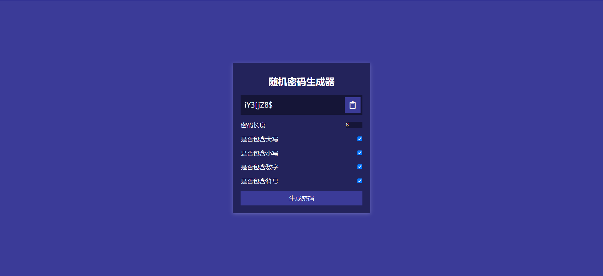

# 31-Password Generator(随机密码生成器)

## 效果



## 代码

```html
<div class="container">
  <h2>随机密码生成器</h2>

  <div class="result-container">
    <span class="result"></span>
    <button class="btn clipboard">
      <i class="far fa-clipboard"></i>
    </button>
  </div>

  <div class="settings">
    <div class="setting">
      <label>密码长度</label>
      <input type="number" id="length" min="4" max="20" value="8" />
    </div>

    <div class="setting">
      <label>是否包含大写</label>
      <input type="checkbox" id="uppercase" checked />
    </div>
    <div class="setting">
      <label>是否包含小写</label>
      <input type="checkbox" id="lowercase" checked />
    </div>
    <div class="setting">
      <label>是否包含数字</label>
      <input type="checkbox" id="numbers" checked />
    </div>
    <div class="setting">
      <label>是否包含符号</label>
      <input type="checkbox" id="symbols" checked />
    </div>
  </div>

  <button class="btn btn-large">生成密码</button>
```

```css
* {
  margin: 0;
  padding: 0;
  box-sizing: border-box;
}

body {
  display: flex;
  margin: 0;
  padding: 10px;
  height: 100vh;
  align-items: center;
  justify-content: center;
  flex-direction: column;
  background-color: #3b3b98;
  color: #fff;
}

.container {
  background-color: #23235b;
  box-shadow: 0px 2px 10px rgba(255, 255, 255, 0.2);
  padding: 20px;
  width: 350px;
  max-width: 100%;
}

h2 {
  margin: 10px 0 20px;
  text-align: center;
}

.result-container {
  display: flex;
  align-items: center;
  justify-content: flex-start;
  background-color: rgba(0, 0, 0, 0.4);
  position: relative;
  font-size: 18px;
  padding: 12px 10px;
  height: 50px;
  width: 100%;
}

.result-container .result {
  word-wrap: break-word;
  max-width: calc(100% - 40px);
  overflow-y: scroll;
  height: 100%;
}

.result::-webkit-scrollbar {
  width: 1rem;
}

.result-container .btn {
  position: absolute;
  top: 5px;
  right: 5px;
  width: 40px;
  height: 40px;
  font-size: 20px;
}

.btn {
  border: none;
  background-color: #3b3b98;
  color: #fff;
  font-size: 16px;
  padding: 8px 12px;
  cursor: pointer;
}

.btn-large {
  display: block;
  width: 100%;
}

.setting {
  display: flex;
  justify-content: space-between;
  align-items: center;
  margin: 15px 0;
}

input {
  border: none;
  background-color: rgba(0, 0, 0, 0.4);
  color: #fff;
}

input:focus {
  outline: none;
}

input[type='number']::-webkit-inner-spin-button,
input[type='number']::-webkit-outer-spin-button {
  -webkit-appearance: none;
  margin: 0;
}
```

```js
const result = document.querySelector('.result')
const lengths = document.getElementById('length')
const uppercase = document.getElementById('uppercase')
const lowercase = document.getElementById('lowercase')
const numbers = document.getElementById('numbers')
const symbols = document.getElementById('symbols')
const generate = document.querySelector('.btn-large')
const clipboard = document.querySelector('.clipboard')

const randomFunc = {
  lower: getRandomLower,
  upper: getRandomUpper,
  number: getRandowNumber,
  symbol: getRandomSymbol
}

clipboard.addEventListener('click', () => {
  const password = result.innerText
  if (!password) {
    return
  }
  navigator.clipboard.writeText(password)
  alert('已经复制到剪贴板')
})

generate.addEventListener('click', () => {
  const length = +lengths.value
  const hasLower = lowercase.checked
  const hasUppder = uppercase.checked
  const hasNumber = numbers.checked
  const hasSymbol = symbols.checked

  result.innerText = generatePassword(
    hasLower,
    hasUppder,
    hasNumber,
    hasSymbol,
    length
  )
})

function generatePassword(lower, upper, number, symbol, length) {
  let generatedPassword = ''
  const typesCount = lower + upper + number + symbol
  const typesArr = [{ lower }, { upper }, { number }, { symbol }].filter(
    (item) => Object.values(item)[0]
  )

  if (typesCount === 0) {
    return ''
  }
  for (let i = 0; i < length; i += typesCount) {
    typesArr.forEach((type) => {
      const funcName = Object.keys(type)[0]
      generatedPassword += randomFunc[funcName]()
    })
  }
  const finalPassword = generatedPassword.slice(0, length)
  return finalPassword
}

function getRandomLower() {
  return String.fromCharCode(Math.floor(Math.random() * 26) + 97)
}
function getRandomUpper() {
  return String.fromCharCode(Math.floor(Math.random() * 26) + 65)
}
function getRandowNumber() {
  return String.fromCharCode(Math.floor(Math.random() * 10) + 48)
}
function getRandomSymbol() {
  const symbols = '!@#$%^&*(){}[]=<>/,.'
  return symbols[Math.floor(Math.random() * symbols.length)]
}
```

## 解析

### randomFunc对象

```js
const randomFunc = {
  lower: getRandomLower,
  upper: getRandomUpper,
  number: getRandomNumber,
  symbol: getRandomSymbol
}
```

通过属性名映射的方式，用于生成随机的大小写字母等。


### clipboard监听事件

```js
clipboard.addEventListener('click', () => {
  const password = result.innerText
  if (!password) {
    return
  }
  navigator.clipboard.writeText(password)
  alert('已经复制到剪贴板')
})
```

+ 使用Web API的 `navigator.clipboard.writeText` 方法将 `password` 变量的内容复制到用户的剪贴板中。这是一个现代浏览器提供的特性，允许网页上的脚本与用户的剪贴板进行交互。


### generate监听事件

```js
result.innerText = generatePassword(  
  hasLower,  
  hasUppder,
  hasNumber,  
  hasSymbol,  
  length  
);
```

使用获取的长度和类型信息调用 `generatePassword` 函数生成密码。它根据传入的参数（是否包含小写字母、大写字母、数字和符号，以及密码的长度）来生成一个密码。生成的密码然后被赋值给 `result` 元素的 `innerText` 属性，这样密码就会显示在 `result` 元素中。


### generatePassword()函数

```js
const typesArr = [{ lower }, { upper }, { number }, { symbol }].filter(  
  (item) => Object.values(item)[0]  
);
```

+ 这里主要用于过滤类型数组，创建了一个包含四个对象的数组，每个对象都有一个属性（`lower`、`upper`、`number` 或 `symbol`），其值对应传入的布尔值参数。然后使用 `filter` 方法过滤出那些值为 `true` 的对象，形成一个新的数组 `typesArr`。


```js
for (let i = 0; i < length; i += typesCount) {  
  typesArr.forEach((type) => {  
    const funcName = Object.keys(type)[0];  
    generatedPassword += randomFunc[funcName]();  
  });  
}
```

+ 这个循环用于生成密码。它每次迭代增加 `typesCount`（即密码中应包含的不同类型的数量），确保每种类型至少被选中一次。在循环内部，对 `typesArr` 中的每个类型执行以下操作：
  + 使用 `Object.keys(type)[0]` 获取类型的名称（例如 `lower`、`upper` 等）。
  + 使用这个名称从 `randomFunc` 对象中调用相应的函数（例如 `randomFunc.lower()`、`randomFunc.upper()` 等），将生成的字符添加到 `generatedPassword` 中。


```js
const finalPassword = generatedPassword.slice(0, length);
```

+ 由于上一步中生成的密码可能超过指定的 `length`（特别是当 `typesCount` 大于 1 时），这里使用 `slice` 方法截取前 `length` 个字符，确保返回的密码长度符合要求。


### getRandomLower()函数

```js
Math.random() * 26
```

`Math.random()` 函数返回一个介于 0（包括）和 1（不包括）之间的伪随机数。乘以 26 是为了将这个范围扩展到 0 到 26（不包括 26）。


```js
Math.floor(Math.random() * 26)
```

`Math.floor()` 函数将传入的值向下取整到最接近的整数。这样，我们得到一个介于 0 到 25（包括）之间的随机整数。


```js
Math.floor(Math.random() * 26) + 97
```

小写字母 'a' 的 ASCII 值是 97，而 'z' 的 ASCII 值是 122。通过给随机整数加 97，我们将其转换为一个对应小写字母的 ASCII 值范围。


```js
String.fromCharCode(Math.floor(Math.random() * 26) + 97)
```

`String.fromCharCode()` 是一个静态方法，它接受一个或多个数字（ASCII 值）作为参数，并返回表示这些数字的字符的字符串。在这里，我们使用它来将上面得到的 ASCII 值转换为对应的小写字母。