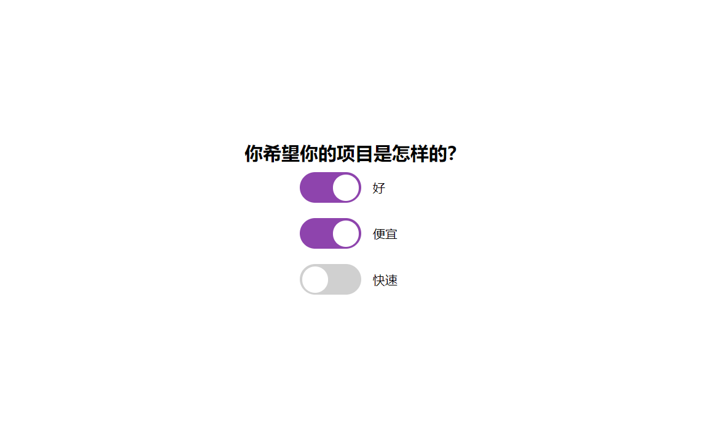

# 32-Good Cheap Fast(选择器)

## 效果



## 代码

```html
<div class="toggle-container">
  <input type="checkbox" class="toggle" id="good" />
  <label for="good" class="label">
    <div class="ball"></div>
  </label>
  <span>好</span>
</div>
<div class="toggle-container">
  <input type="checkbox" class="toggle" id="cheap" />
  <label for="cheap" class="label">
    <div class="ball"></div>
  </label>
  <span>便宜</span>
</div>
<div class="toggle-container">
  <input type="checkbox" class="toggle" id="fast" />
  <label for="fast" class="label">
    <div class="ball"></div>
  </label>
  <span>快速</span>
</div>
```

```css
* {
  margin: 0;
  padding: 0;
  box-sizing: border-box;
}

body {
  margin: 0;
  display: flex;
  align-items: center;
  justify-content: center;
  height: 100vh;
  flex-direction: column;
}

.toggle-container {
  display: flex;
  align-items: center;
  margin: 10px 0;
  width: 200px;
}

.toggle {
  visibility: hidden;
}

.label {
  position: relative;
  background-color: #d0d0d0;
  border-radius: 50px;
  cursor: pointer;
  display: inline-block;
  margin: 0 15px 0;
  width: 80px;
  height: 40px;
}

.toggle:checked + .label {
  background-color: #8e44ad;
}

.ball {
  background: #fff;
  width: 34px;
  height: 34px;
  border-radius: 50%;
  position: absolute;
  top: 3px;
  left: 3px;
  align-items: center;
  justify-content: center;
  animation: slideOff 0.3s linear forwards;
}

.toggle:checked + .label .ball {
  animation: slideOn 0.3s linear forwards;
}

@keyframes slideOn {
  0% {
    transform: translateX(0) scale(1);
  }
  50% {
    transform: translateX(20px) scale(1);
  }
  100% {
    transform: translateX(40px) scale(1);
  }
}

@keyframes slideOff {
  0% {
    transform: translateX(40px) scale(1);
  }
  50% {
    transform: translateX(20px) scale(1);
  }
  100% {
    transform: translateX(0) scale(1);
  }
}
```

```js
const toggles = document.querySelectorAll('.toggle')
const good = document.querySelector('#good')
const cheap = document.querySelector('#cheap')
const fast = document.querySelector('#fast')

toggles.forEach((toggle) => {
  toggle.addEventListener('change', (e) => {
    doTheTrick(e.target)
  })
})

function doTheTrick(theClickedOne) {
  if (good.checked && cheap.checked && fast.checked) {
    if (good === theClickedOne) {
      fast.checked = false
    }
    if (cheap === theClickedOne) {
      good.checked = false
    }
    if (fast === theClickedOne) {
      cheap.checked = false
    }
  }
}
```

