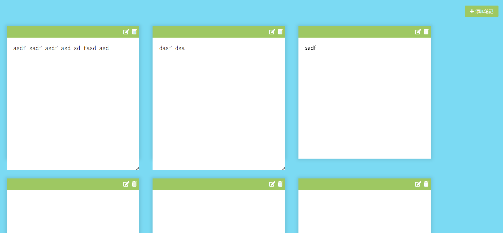

# 33-Notes App(笔记软件)

## 效果



## 代码

```html
<link rel="stylesheet" href="https://cdnjs.cloudflare.com/ajax/libs/font-awesome/5.14.0/css/all.min.css" integrity="sha512-1PKOgIY59xJ8Co8+NE6FZ+LOAZKjy+KY8iq0G4B3CyeY6wYHN3yt9PW0XpSriVlkMXe40PTKnXrLnZ9+fkDaog==" crossorigin="anonymous" />

<button class="add"><i class="fas fa-plus"></i>添加笔记</button>

<script src="https://cdnjs.cloudflare.com/ajax/libs/marked/1.2.2/marked.min.js"></script>
<script src="script.js"></script>
```

```css
* {
  margin: 0;
  padding: 0;
  box-sizing: border-box;
  outline: none;
}

body {
  display: flex;
  background-color: #7bdaf3;
  flex-wrap: wrap;
  margin: 0;
  padding-top: 3rem;
}

.add {
  position: fixed;
  top: 1rem;
  right: 1rem;
  color: #fff;
  background-color: #9ec862;
  border: none;
  border-radius: 3px;
  padding: 0.5rem 1rem;
  cursor: pointer;
}

.add:active {
  transform: scale(0.98);
}

.add i {
  margin-right: 5px;
}

.note {
  background-color: #fff;
  box-shadow: 0 0 10px 4px rgba(0, 0, 0, 0.1);
  margin: 30px 20px;
  width: 400px;
  height: 400px;
  /* overflow-y: scroll; */
}

.note .tools {
  display: flex;
  background-color: #9ec862;
  justify-content: flex-end;
  padding: 0.5rem;
}

.note .tools button {
  background-color: transparent;
  border: none;
  color: #fff;
  cursor: pointer;
  font-size: 1rem;
  margin-left: 0.5rem;
}

.note textarea {
  outline: none;
  font-size: 1.2rem;
  border: none;
  height: 400px;
  width: 100%;
  padding: 20px;
}

.main {
  padding: 20px;
}

.hidden {
  display: none;
}
```

```js
const addBtn = document.querySelector('.add')

const notes = JSON.parse(localStorage.getItem('notes'))

if (notes) {
  notes.forEach((note) => {
    addNewNote(note)
  })
}

addBtn.addEventListener('click', () => addNewNote())

function addNewNote(text = '') {
  const note = document.createElement('div')
  note.classList.add('note')
  note.innerHTML = `
    <div class="tools">
        <button class="edit"><i class="fas fa-edit"></i></button>
        <button class="delete"><i class="fas fa-trash-alt"></i></button>
      </div>
    <div class="main ${text ? '' : 'hidden'}"></div>
    <textarea class="${text ? 'hidden' : ''}"></textarea>
  `

  const editBtn = note.querySelector('.edit')
  const deleteBtn = note.querySelector('.delete')
  const main = note.querySelector('.main')
  const textArea = note.querySelector('textarea')

  textArea.value = text
  main.innerHTML = marked(text)

  deleteBtn.addEventListener('click', () => {
    note.remove()

    updateLS()
  })

  editBtn.addEventListener('click', () => {
    main.classList.toggle('hidden')
    textArea.classList.toggle('hidden')
  })

  textArea.addEventListener('input', (e) => {
    const { value } = e.target

    main.innerHTML = marked(value)
    updateLS()
  })
  document.body.appendChild(note)
}

function updateLS() {
  const notesText = document.querySelectorAll('textarea')

  const notes = []
  notesText.forEach((note) => notes.push(note.value))
  localStorage.setItem('notes', JSON.stringify(notes))
}
```

## 解析

```js
const notes = JSON.parse(localStorage.getItem('notes'))
```

+ 从localStorage中读取之前保存的笔记，并解析为JavaScript对象。


```js
if (notes) {
  notes.forEach((note) => {
    addNewNote(note)
  })
}
```

- 如果存在已保存的笔记，遍历这些笔记，并为每个笔记调用 `addNewNote(note)` 函数，将其添加到页面上。


### addNewNote()函数

```js
note.innerHTML = `
  <div class="tools">
  	<button class="edit"><i class="fas fa-edit"></i></button>
  	<button class="delete"><i class="fas fa-trash-alt"></i></button>
  </div>
  <div class="main ${text ? '' : 'hidden'}"></div>
  <textarea class="${text ? 'hidden' : ''}"></textarea>
`
```

- `text ? '' : 'hidden'`：这是一个三元表达式，用于根据 `text` 参数的值来决定是否给 `.main` 和 `textarea` 元素添加 `hidden` 类名。如果 `text` 不为空（即有值），则不显示 `hidden` 类，表示内容或文本区域应该是可见的；否则，它们应该被隐藏。


```js
main.innerHTML = marked(text)
```

- `main.innerHTML = marked(text)`：使用 `marked` 库将 `text` 转换为HTML格式，并设置为主内容区域的内容。这允许用户以Markdown格式输入笔记，并在页面上以格式化的方式显示。


```js
textArea.addEventListener('input', (e) => {  
  const { value } = e.target  
  main.innerHTML = marked(value)  
  updateLS()  
})
```

- `textArea` 的输入事件监听器：当文本区域的内容发生变化时，更新主内容区域的显示内容（通过 `marked(value)`），并调用 `updateLS` 函数来更新 `localStorage`。


### updateLS()函数

```js
notesText.forEach((note) => notes.push(note.value))
```

+ 使用 `forEach` 方法遍历 `notesText`（即所有 `textarea` 元素）。对于每个 `textarea` 元素，将其 `value`（即用户输入或编辑的文本）添加到 `notes` 数组中。


```js
localStorage.setItem('notes', JSON.stringify(notes))
```

+ 使用 `JSON.stringify` 方法将 `notes` 数组转换为一个JSON格式的字符串。这样做是因为 `localStorage` 只能存储字符串。然后，使用 `localStorage.setItem` 方法将这个JSON字符串存储在 `'notes'` 键下。