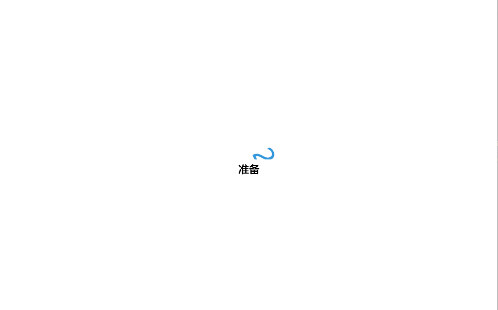

# 34-Animatied Countdown(倒计时动画)

## 效果



## 代码

```html
<div class="counter">
  <div class="nums">
    <span class="in">3</span>
    <span>2</span>
    <span>1</span>
    <span>0</span>
  </div>
  <h4>准备</h4>
</div>

<div class="final">
  <h1>开始</h1>
  <button id="replay">
    <span>重新开始</span>
  </button>
</div>
```

```css
* {
  margin: 0;
  padding: 0;
  box-sizing: border-box;
}

body {
  height: 100vh;
  margin: 0;
  overflow: hidden;
}

h4 {
  font-size: 20px;
  margin: 5px;
}

.counter {
  position: fixed;
  top: 50%;
  left: 50%;
  transform: translate(-50%, -50%);
  text-align: center;
}

.counter.hide {
  transform: translate(-50%, -50%) scale(0);
  animation: hide 0.2s ease-out;
}

@keyframes hide {
  0% {
    transform: translate(-50%, -50%) scale(1);
  }

  100% {
    transform: translate(-50%, -50%) scale(0);
  }
}

.final {
  position: fixed;
  top: 50%;
  left: 50%;
  transform: translate(-50%, -50%) scale(0);
  text-align: center;
}

.final.show {
  transform: translate(-50%, -50%) scale(1);
  animation: show 0.2s ease-out;
}

@keyframes show {
  0% {
    transform: translate(-50%, -50%) scale(0);
  }

  30% {
    transform: translate(-50%, -50%) scale(1.4);
  }

  100% {
    transform: translate(-50%, -50%) scale(1);
  }
}

.nums {
  color: #3498db;
  font-size: 50px;
  position: relative;
  overflow: hidden;
  width: 250px;
  height: 50px;
}

.nums span {
  position: absolute;
  top: 50%;
  left: 50%;
  transform: translate(-50%, -50%) rotate(120deg);
  transform-origin: bottom center;
}

.nums span.in {
  transform: translate(-50%, -50%) rotate(0deg);
  animation: goIn 0.5s ease-in-out;
}

.nums span.out {
  animation: goOut 0.5s ease-in-out;
}

@keyframes goIn {
  0% {
    transform: translate(-50%, -50%) rotate(120deg);
  }

  30% {
    transform: translate(-50%, -50%) rotate(-20deg);
  }
  60% {
    transform: translate(-50%, -50%) rotate(10deg);
  }
  100% {
    transform: translate(-50%, -50%) rotate(0deg);
  }
}
@keyframes goOut {
  0% {
    transform: translate(-50%, -50%) rotate(0deg);
  }

  60% {
    transform: translate(-50%, -50%) rotate(20deg);
  }

  100% {
    transform: translate(-50%, -50%) rotate(-120deg);
  }
}

#replay {
  background-color: #3498db;
  border-radius: 3px;
  border: none;
  color: aliceblue;
  padding: 5px;
  text-align: center;
  display: inline-block;
  cursor: pointer;
  transition: all 0.3s;
}

#replay span {
  cursor: pointer;
  display: inline-block;
  position: relative;
  transition: 0.3s;
}

#replay span:after {
  content: '\00bb';
  position: absolute;
  opacity: 0;
  top: 2px;
  right: -20px;
  transition: 0.5s;
}

#replay:hover span {
  padding-right: 25px;
}

#replay:hover span:after {
  opacity: 1;
  right: 0;
}
```

```js
const nums = document.querySelectorAll('.nums span')
const counter = document.querySelector('.counter')
const finalMessage = document.querySelector('.final')
const replay = document.querySelector('#replay')

runAnimation()

function runAnimation() {
  nums.forEach((num, idx) => {
    const nextToLast = nums.length - 1

    num.addEventListener('animationend', (e) => {
      if (e.animationName === 'goIn' && idx !== nextToLast) {
        num.classList.remove('in')
        num.classList.add('out')
      } else if (e.animationName === 'goOut' && num.nextElementSibling) {
        num.nextElementSibling.classList.add('in')
      } else {
        counter.classList.add('hide')
        finalMessage.classList.add('show')
      }
    })
  })
}

function resetDOM() {
  counter.classList.remove('hide')
  finalMessage.classList.remove('show')

  nums.forEach((num) => {
    num.classList.value = ''
  })
  nums[0].classList.add('in')
}

replay.addEventListener('click', () => {
  resetDOM()
  runAnimation()
})
```

## 解析

### runAnimation()函数

```js
const nextToLast = nums.length - 1
```

这行代码定义了一个变量 `nextToLast`，它存储了 `nums` 数组的长度减一的值，即最后一个元素的索引。


```js
if (e.animationName === 'goIn' && idx !== nextToLast) {
  num.classList.remove('in')
  num.classList.add('out')
} else if (e.animationName === 'goOut' && num.nextElementSibling) {
  num.nextElementSibling.classList.add('in')
} else {
  counter.classList.add('hide')
  finalMessage.classList.add('show')
}
```

+ 如果动画名称是`goIn`且不是最后一个元素的话，就移除`in`且添加`out`
+ 如果动画名称是`goOut`且当前元素的索引不是最后一个，如果满足这两个条件，就为下一个兄弟元素添加`in`类
+ 其他情况下，就给`counter` 元素和`finalMessage`元素分别添加`hide`和`show`


### resetDom()函数

```js
nums.forEach((num) => {
  num.classList.value = ''
})
```

使用 `forEach` 方法遍历 `nums` 数组中的每个元素（即 `.nums span` 元素）。对于每个元素，它使用 `classList.value = ''` 来清除该元素的所有类。这意味着所有先前添加的类（如 'in' 或 'out'）都会被移除，元素将回到一个没有特定类应用的初始状态。


```js
nums[0].classList.add('in')
```

`nums` 数组中的第一个元素（即第一个数字）添加 `'in'` 类。这通常是为了触发该元素的动画效果，开始新一轮的动画序列。根据 CSS 规则，带有 `'in'` 类的元素可能会开始一个进入动画（如 `goIn`）。