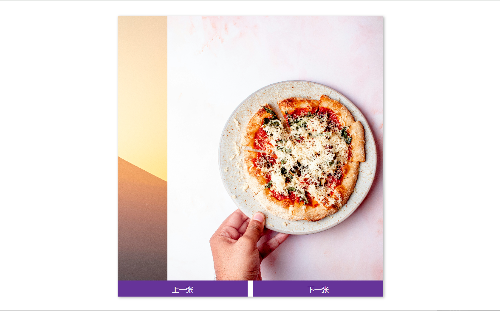

# 35-Image Carousel(图片轮播)

## 效果



## 代码

```html
<div class="carousel">
  <div class="image-container" id="imgs">
    
    
    
    
  </div>
  <div class="buttons-container">
    <button class="btn" id="left">上一张</button>
    <button class="btn" id="right">下一张</button>
  </div>
</div>
```

```css
* {
  margin: 0;
  padding: 0;
  box-sizing: border-box;
}

body {
  display: flex;
  align-items: center;
  justify-content: center;
  height: 100vh;
  margin: 0;
}

img {
  width: 500px;
  height: 500px;
  object-fit: cover;
}

.carousel {
  box-shadow: 2px 2px 5px rgba(0, 0, 0, 0.3);
  height: 530px;
  width: 500px;
  overflow: hidden;
}

.image-container {
  display: flex;
  transform: translateX(0);
  transition: transform 0.5s ease-in-out;
}

.buttons-container {
  display: flex;
  justify-content: space-between;
}

.btn {
  color: #fff;
  border: none;
  background-color: rebeccapurple;
  padding: 0.5rem;
  cursor: pointer;
  width: 49%;
}

.btn:hover {
  opacity: 0.9;
}

.btn:focus {
  outline: none;
}
```

```js
const imgs = document.getElementById('imgs')
const leftBtn = document.getElementById('left')
const rightBtn = document.getElementById('right')

const img = document.querySelectorAll('#imgs img')

let idx = 0
let interval = setInterval(run, 2000)

function run() {
  idx++
  changeImage()
}

function changeImage() {
  if (idx > img.length - 1) {
    idx = 0
  } else if (idx < 0) {
    idx = img.length - 1
  }
  imgs.style.transform = `translateX(${-idx * 500}px)`
}

function resetInterval() {
  clearInterval(interval)
  interval = setInterval(run, 2000)
}

rightBtn.addEventListener('click', () => {
  idx++
  changeImage()
  resetInterval()
})

leftBtn.addEventListener('click', () => {
  idx--
  changeImage()
  resetInterval()
})
```

## 解析

### changeImage()函数

```js
if (idx > img.length - 1) {
  idx = 0
} else if (idx < 0) {
  idx = img.length - 1
}
```

+ 如果 `idx` 大于图片数组的长度减 1（即数组的最大索引），那么将 `idx` 重置为 0，表示循环到第一张图片。
+ 如果 `idx` 小于 0，则将其设置为图片数组的最后一个索引，这样用户就可以从最后一张图片返回到第一张。