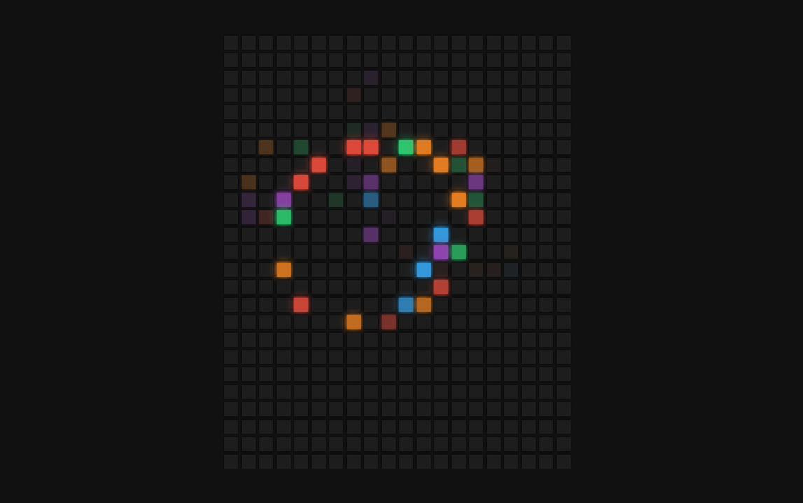

# 36-Hoverboard(悬浮画板)

## 效果



## 代码

```html
<div class="container"></div>
<script src="./script.js"></script>
```

```css
* {
  margin: 0;
  padding: 0;
  box-sizing: border-box;
}

body {
  display: flex;
  height: 100vh;
  background-color: #111;
  align-items: center;
  justify-content: center;
  overflow: hidden;
  margin: 0;
}

.container {
  display: flex;
  align-items: center;
  justify-content: center;
  flex-wrap: wrap;
  max-width: 400px;
}

.square {
  width: 16px;
  height: 16px;
  box-shadow: 0 0 2px #000;
  background-color: #1d1d1d;
  margin: 2px;
  transition: 2s ease;
}

.square:hover {
  transition-duration: 0s;
}
```

```js
const container = document.querySelector('.container')
const colors = ['#e74c3c', '#8e44ad', '#3498db', '#e67e22', '#2ecc71']
const squares = 500

for (let i = 0; i < squares; i++) {
  const square = document.createElement('div')
  square.classList.add('square')
  square.addEventListener('mouseover', () => setColor(square))
  square.addEventListener('mouseout', () => removeColor(square))
  container.appendChild(square)
}

function setColor(element) {
  const color = getRandomColor()
  element.style.background = color
  element.style.boxShadow = `0 0 2px ${color}, 0 0 10px ${color}`
}

function removeColor(element) {
  element.style.background = '#1d1d1d'
  element.style.boxShadow = '0 0 2px #000'
}

function getRandomColor() {
  return colors[Math.floor(Math.random() * colors.length)]
}
```

## 解析

### getRandomColor()函数

```js
return colors[Math.floor(Math.random() * colors.length)]
```

生成一个介于 0（包含）和 1（不包含）之间的随机浮点数。然后，通过乘以 `colors.length`（颜色数组的长度），得到一个范围在 0 到 `colors.length - 1` 之间的随机浮点数。`Math.floor()` 函数将这个浮点数向下取整，得到一个随机整数索引 `randomIndex`。