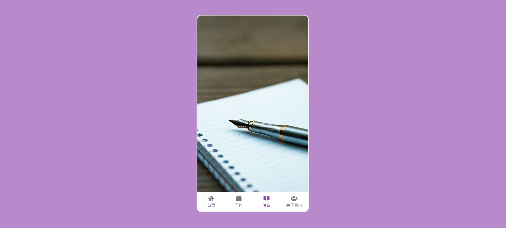

# 38-Mobile Tab Navigation(手机导航栏)

## 效果



## 代码

```html
<link rel="stylesheet" href="https://cdnjs.cloudflare.com/ajax/libs/font-awesome/5.14.0/css/all.min.css" integrity="sha512-1PKOgIY59xJ8Co8+NE6FZ+LOAZKjy+KY8iq0G4B3CyeY6wYHN3yt9PW0XpSriVlkMXe40PTKnXrLnZ9+fkDaog==" crossorigin="anonymous" />
<link rel="stylesheet" href="style.css" />

<div class="phone">
  
  
  
  
  <nav>
    <ul>
      <li class="active">
        <i class="fas fa-home"></i>
        <p>首页</p>
      </li>
      <li>
        <i class="fas fa-box"></i>
        <p>工作</p>
      </li>
      <li>
        <i class="fas fa-book-open"></i>
        <p>博客</p>
      </li>
      <li>
        <i class="fas fa-users"></i>
        <p>关于我们</p>
      </li>
    </ul>
  </nav>
</div>
```

```css
* {
  margin: 0;
  padding: 0;
  box-sizing: border-box;
}

body {
  margin: 0;
  height: 100vh;
  display: flex;
  align-items: center;
  justify-content: center;
  background-color: rgba(155, 89, 182, 0.7);
}

.phone {
  position: relative;
  overflow: hidden;
  border: 3px solid #eee;
  border-radius: 15px;
  width: 340px;
  height: 600px;
}

.phone .content {
  opacity: 0;
  object-fit: cover;
  position: absolute;
  top: 0;
  left: 0;
  height: calc(100% - 60px);
  width: 100%;
  transition: opacity 0.4s ease;
}

.phone .content.show {
  opacity: 1;
}

nav {
  position: absolute;
  bottom: 0;
  left: 0;
  margin-top: -5px;
  width: 100%;
}

nav ul {
  display: flex;
  background-color: #fff;
  list-style: none;
  padding: 0;
  margin: 0;
  height: 60px;
}

nav li {
  padding: 10px;
  color: #777;
  flex: 1;
  padding: 10px;
  text-align: center;
  cursor: pointer;
}

nav ul li p {
  font-size: 12px;
  margin: 2px 0;
}

nav ul li:hover,
nav ul li.active {
  color: #8e44ad;
}
```

```js
const contents = document.querySelectorAll('.content')
const listItems = document.querySelectorAll('nav ul li')

listItems.forEach((item, i) => {
  item.addEventListener('click', () => {
    hideAllContents()
    hideAllItems()

    item.classList.add('active')
    contents[i].classList.add('show')
  })
})

function hideAllContents() {
  contents.forEach((content) => content.classList.remove('show'))
}

function hideAllItems() {
  listItems.forEach((item) => item.classList.remove('active'))
}
```

