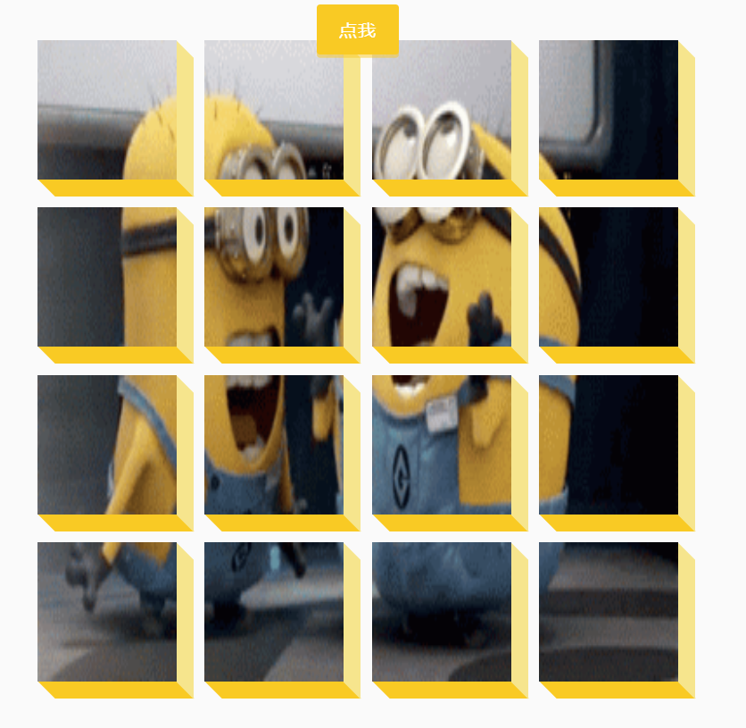

# 40-3d Background Boxes(3d背景盒子)

## 效果



## 代码

```html
<button id="btn" class="magic">点我</button>
<div class="boxes big" id="boxes"></div>
```

```css
* {
  margin: 0;
  padding: 0;
  box-sizing: border-box;
}

body {
  display: flex;
  height: 100vh;
  background-color: #fafafa;
  align-items: center;
  justify-content: center;
}

.magic {
  background-color: #f9ca24;
  color: #fff;
  border: 0;
  border-radius: 3px;
  font-size: 16px;
  padding: 12px 20px;
  cursor: pointer;
  position: fixed;
  top: 20px;
  letter-spacing: 1px;
  box-shadow: 0 3px rgba(249, 202, 36, 0.5);
  z-index: 100;
}

.magic:focus {
  outline: none;
}

.magic:active {
  box-shadow: none;
  transform: translateY(2px);
}

.boxes {
  display: flex;
  flex-wrap: wrap;
  justify-content: space-around;
  width: 500px;
  height: 500px;
  position: relative;
  transition: 0.4s ease;
}

.boxes.big {
  width: 600px;
  height: 600px;
}

.boxes.big .box {
  transform: rotateZ(360deg);
}

.box {
  background-image: url('https://media.giphy.com/media/EZqwsBSPlvSda/giphy.gif');
  background-repeat: no-repeat;
  background-size: 500px 500px;
  position: relative;
  width: 125px;
  height: 125px;
  transition: 0.4s ease;
}

.box::after {
  content: '';
  background-color: #f6e58d;
  position: absolute;
  top: 8px;
  right: -15px;
  height: 100%;
  width: 15px;
  transform: skewY(45deg);
}

.box::before {
  content: '';
  background-color: #f9ca24;
  position: absolute;
  bottom: -15px;
  left: 8px;
  height: 15px;
  width: 100%;
  transform: skewX(45deg);
}
```

```js
const boxesContainer = document.getElementById('boxes')
const btn = document.getElementById('btn')

btn.addEventListener('click', () => {
  boxesContainer.classList.toggle('big')
})

function createBoxes() {
  for (let i = 0; i < 4; i++) {
    for (let j = 0; j < 4; j++) {
      const box = document.createElement('div')
      box.classList.add('box')
      box.style.backgroundPosition = `${-j * 125}px ${-i * 125}px`
      boxesContainer.appendChild(box)
    }
  }
}

createBoxes()
```

