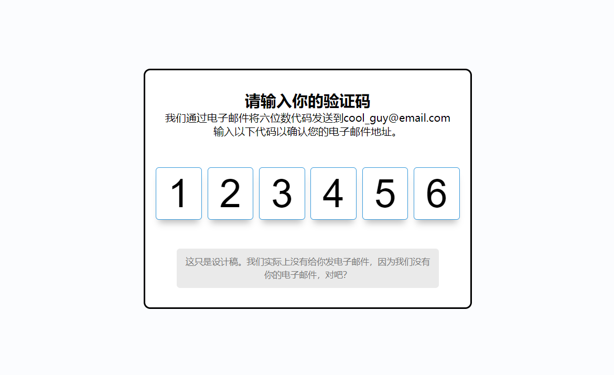

# 41-Verify Account UI(验证码UI)

## 效果



## 代码

```html
<div class="container">
  <h2>请输入你的验证码</h2>
  <p>
    我们通过电子邮件将六位数代码发送到cool_guy@email.com
    <br />
    输入以下代码以确认您的电子邮件地址。
  </p>
  <div class="code-container">
    <input type="number" class="code" placeholder="0" min="0" max="9" required />
    <input type="number" class="code" placeholder="0" min="0" max="9" required />
    <input type="number" class="code" placeholder="0" min="0" max="9" required />
    <input type="number" class="code" placeholder="0" min="0" max="9" required />
    <input type="number" class="code" placeholder="0" min="0" max="9" required />
    <input type="number" class="code" placeholder="0" min="0" max="9" required />
  </div>
  <small class="info">
    这只是设计稿。我们实际上没有给你发电子邮件，因为我们没有你的电子邮件，对吧？
  </small>
</div>
```

```css
* {
  margin: 0;
  padding: 0;
  box-sizing: border-box;
}

body {
  background-color: #fbfcfe;
  display: flex;
  align-items: center;
  justify-content: center;
  height: 100vh;
  margin: 0;
  overflow: hidden;
}

.container {
  background-color: #fff;
  border: 3px solid #000;
  border-radius: 10px;
  padding: 30px;
  max-width: 1000px;
  text-align: center;
}

.code-container {
  display: flex;
  align-items: center;
  justify-content: center;
  margin: 40px 0;
}

.code {
  caret-color: transparent;
  border-radius: 5px;
  font-size: 75px;
  height: 120px;
  width: 100px;
  border: 1px solid #eee;
  margin: 1%;
  text-align: center;
  font-weight: 300;
  appearance: textfield;
}

.code::-webkit-outer-spin-button,
.code::-webkit-inner-spin-button {
  appearance: none;
  margin: 0;
}

.code:valid {
  border-color: #3498db;
  box-shadow: 0 10px 10px -5px rgba(0, 0, 0, 0.25);
}

.info {
  display: inline-block;
  background-color: #eaeaea;
  padding: 10px;
  line-height: 20px;
  max-width: 400px;
  color: #777;
  border-radius: 5px;
}

@media (max-width: 600px) {
  .code-container {
    flex-wrap: wrap;
  }
}

.code {
  font-size: 60px;
  height: 80px;
  max-width: 70px;
}
```

```js
const codes = document.querySelectorAll('.code')

codes[0].focus()

codes.forEach((code, idx) => {
  code.addEventListener('keydown', (e) => {
    if (e.key >= 0 && e.key <= 9) {
      codes[idx].value = ''
      setTimeout(() => {
        codes[idx + 1].focus()
      }, 10)
    } else if (e.key === 'Backspace') {
      setTimeout(() => {
        codes[idx - 1].focus()
      }, 10)
    }
  })
})
```

## 解析

```js
codes[0].focus()
```

通过 `codes[0]` 获取 `codes` 列表中的第一个元素，并调用其 `focus` 方法，将焦点设置到这个元素上。这样，当页面加载时，用户可以直接在这个元素中输入。


```js
if (e.key >= 0 && e.key <= 9) {
  codes[idx].value = ''
  setTimeout(() => {
    codes[idx + 1].focus()
  }, 10)
} else if (e.key === 'Backspace') {
  setTimeout(() => {
    codes[idx - 1].focus()
  }, 10)
}
```

+ 如果按下的是数字键0-9，则清空当前元素的值，且在10毫秒后设置下一个元素的焦点
+ 如果按下的是`Backspace`键，则将焦点设置到前一个元素上