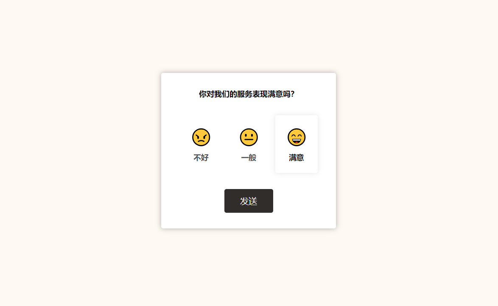
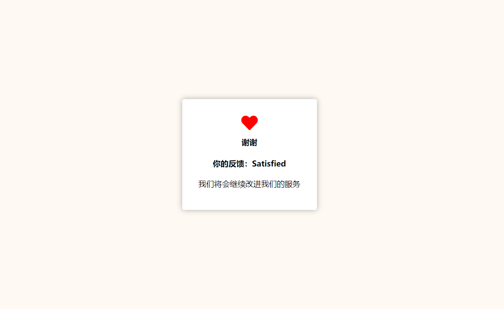

# 43-Feedback Ui Design(反馈UI设计)

## 效果





## 代码

```html
<div class="panel-container">
  <strong>你对我们的服务表现满意吗？</strong>
  <div class="ratings-container">
    <div class="rating">
      <div class="img">😠</div>
      <small>不好</small>
    </div>
    <div class="rating">
      <div class="img">😐</div>
      <small>一般</small>
    </div>
    <div class="rating">
      <div class="img">😄</div>
      <small>满意</small>
    </div>
  </div>
  <button class="btn">发送</button>
</div>
```

```css
* {
  margin: 0;
  padding: 0;
  box-sizing: border-box;
}

body {
  display: flex;
  align-items: center;
  justify-content: center;
  margin: 0;
  height: 100vh;
  background-color: #fef9f2;
}

.panel-container {
  display: flex;
  background-color: #fff;
  box-shadow: 0 0 10px rgba(0, 0, 0, 0.3);
  border-radius: 4px;
  font-size: 90%;
  flex-direction: column;
  justify-content: center;
  align-items: center;
  text-align: center;
  padding: 30px;
  max-width: 400px;
}

.panel-container strong {
  line-height: 20px;
  /* font-size: 20px; */
}

.panel-container p {
  line-height: 35px;
  margin-top: 10px;
}

.ratings-container {
  display: flex;
  margin: 20px 0;
}

.rating {
  flex: 1;
  cursor: pointer;
  padding: 20px;
  margin: 10px 5px;
}

.rating:hover,
.rating.active {
  border-radius: 4px;
  box-shadow: 0 0 10px rgba(0, 0, 0, 0.1);
}

.rating .img {
  width: 40px;
  font-size: 30px;
}

.rating small {
  color: #555;
  display: inline-block;
  margin: 10px 0 0;
  font-size: 14px;
  font-weight: 700;
}

.rating:hover small,
.rating.active small {
  color: #111;
}

.btn {
  background-color: #302d2b;
  color: #fff;
  border: none;
  border-radius: 4px;
  padding: 12px 30px;
  cursor: pointer;
  font-size: 16px;
}

.btn:focus {
  outline-color: 0;
}

.btn:active {
  transform: scale(0.98);
}

.fa-heart {
  color: red;
  font-size: 30px;
  margin-bottom: 10px;
}
```

```js
const ratings = document.querySelectorAll('.rating')
const ratingsContainer = document.querySelector('.ratings-container')
const sendBtn = document.querySelector('.btn')
const panel = document.querySelector('.panel-container')
let selectedRating = 'Satisfied'

ratingsContainer.addEventListener('click', (e) => {
  if (
    e.target.parentNode.classList.contains('rating') &&
    e.target.nextElementSibling
  ) {
    removeActive()
    e.target.parentNode.classList.add('active')
    selectedRating = e.target.nextElementSibling.innerHTML
  } else if (
    e.target.parentNode.classList.contains('rating') &&
    e.target.previousSibling &&
    e.target.previousElementSibling.nodeName === 'DIV'
  ) {
    removeActive()
    e.target.parentNode.classList.add('active')
    selectedRating = e.target.innerHTML
  }
})

sendBtn.addEventListener('click', (e) => {
  panel.innerHTML = `
    <i class="fas fa-heart"></i>
    <strong>谢谢</strong>
    <br />
    <strong>你的反馈：${selectedRating}</strong>
    <p>我们将会继续改进我们的服务</p>
  `
})

function removeActive() {
  for (let i = 0; i < ratings.length; i++) {
    ratings[i].classList.remove('active')
  }
}
```

## 解析

### ratingsContainer监听事件

```js
if (
  e.target.parentNode.classList.contains('rating') &&
  e.target.nextElementSibling
) {
  removeActive()
  e.target.parentNode.classList.add('active')
  selectedRating = e.target.nextElementSibling.innerHTML
}
```

+ 检查触发事件的元素的父节点是否包含名为 `'rating'` 的CSS类且点击目标的下一个同级元素（`e.target.nextElementSibling`）存在，则执行以下操作：
  + 调用`removeActive`函数，该函数遍历所有带有`rating`类的元素，并移除它们的`active`类。
  + 给当前点击目标的父节点（即带有`rating`类的元素）添加`active`类，表示它被选中。
  + 将`selectedRating`变量设置为当前点击目标的下一个同级元素的内部HTML内容。

```js
else if (
  e.target.parentNode.classList.contains('rating') &&
  e.target.previousSibling &&
  e.target.previousElementSibling.nodeName === 'DIV'
) {
  removeActive()
  e.target.parentNode.classList.add('active')
  selectedRating = e.target.innerHTML
}
```

+ 这个条件检查点击目标的父节点是否包含类`rating`，并且点击目标有前一个同级元素（`e.target.previousSibling`），并且这个前一个同级元素是一个`DIV`元素。如果满足这些条件，那么执行以下操作：
  + 同样调用`removeActive`函数移除所有`rating`元素的`active`类。
  + 给当前点击目标的父节点（带有`rating`类的元素）添加`active`类。
  + 将`selectedRating`变量设置为当前点击目标自己的内部HTML内容。