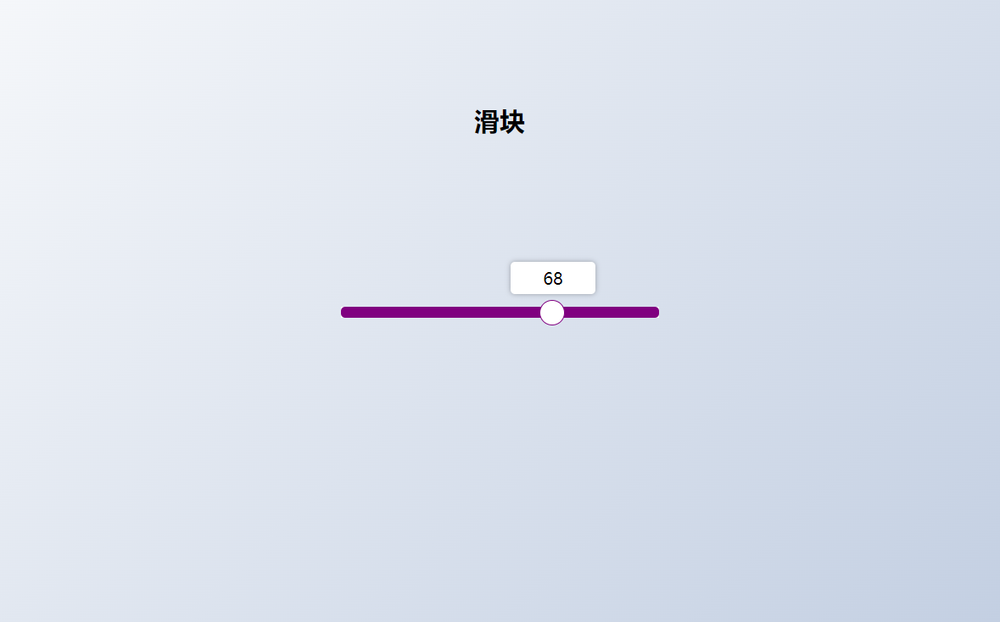

# 44-Custom Range Slider(滑块) 

## 效果



## 代码

```html
<h2>滑块</h2>
<div class="range-container">
  <input type="range" id="range" min="0" max="100" />
  <label for="range">50</label>
</div>
```

```css
* {
  margin: 0;
  padding: 0;
  box-sizing: border-box;
}

body {
  display: flex;
  height: 100vh;
  align-items: center;
  justify-content: center;
  overflow: hidden;
  flex-direction: column;
  background-image: linear-gradient(135deg, #f5f7fa 0%, #c3cfe2 100%);
}

h2 {
  position: absolute;
  top: 100px;
}

.range-container {
  position: relative;
}

#range {
  width: 300px;
  margin: 18px 0;
  appearance: none;
}

#range:focus {
  outline: none;
}

#range + label {
  background-color: #fff;
  position: absolute;
  top: -25px;
  left: 110px;
  width: 80px;
  padding: 5px 0;
  text-align: center;
  border-radius: 4px;
  box-shadow: 0 0 5px rgba(0, 0, 0, 0.3);
}

#range::-webkit-slider-runnable-track {
  background-color: purple;
  border-radius: 4px;
  width: 100%;
  height: 10px;
  cursor: pointer;
}

#range::-webkit-slider-thumb {
  appearance: none;
  width: 24px;
  height: 24px;
  background-color: #fff;
  border-radius: 50%;
  border: 1px solid purple;
  margin-top: -7px;
  cursor: pointer;
}
```

```js
const range = document.getElementById('range')

range.addEventListener('input', (e) => {
  const value = +e.target.value
  const label = e.target.nextElementSibling

  const range_width = getComputedStyle(e.target).getPropertyValue('width')
  const label_width = getComputedStyle(label).getPropertyValue('width')

  const num_width = +range_width.substring(0, range_width.length - 2)
  const num_label_width = +label_width.substring(0, label_width.length - 2)

  const max = +e.target.max
  const min = +e.target.min

  const left =
    value * (num_width / max) -
    num_label_width / 2 +
    scale(value, min, max, 10, -10)

  label.style.left = `${left}px`
  label.innerHTML = value
})

const scale = (num, in_min, in_max, out_min, out_max) => {
  return ((num - in_min) * (out_max - out_min)) / (in_max - in_min) + out_min
}
```

## 解析

### range监听事件

```js
const label = e.target.nextElementSibling
```

获取`range`元素的下一个同级元素。


```js
const range_width = getComputedStyle(e.target).getPropertyValue('width')
const label_width = getComputedStyle(label).getPropertyValue('width')
```

使用`getComputedStyle`方法获取`range`元素和`label`的计算样式，并提取其`width`属性值。


```js
const num_width = +range_width.substring(0, range_width.length - 2)
const num_label_width = +label_width.substring(0, label_width.length - 2)
```

从`range`和`label`的`width`属性值中去除单位，并将其转换为数字。


```js
const max = +e.target.max  
const min = +e.target.min
```

获取`range`元素的`max`和`min`属性值，并将它们转换为数字。


```js
const left = value * (num_width / max) - num_label_width / 2 + scale(value, min, max, 10, -10)
```

这部分代码计算标签应该基于滑动条当前值`value`移动到的位置。

- `value * (num_width / max)`：`num_width`是滑动条的总宽度（不包括单位），`max`是滑动条的最大值。通过将当前值`value`乘以滑动条宽度与最大值的比例，我们可以得到一个与滑动条当前值成比例的标签位置。
- `num_label_width / 2`：由于我们想要标签的中心与滑动条上的当前值对齐，而不是标签的左边缘，我们需要从计算出的位置中减去标签宽度的一半。这样，标签的中心就会位于与滑动条当前值相对应的位置。
- `scale(value, min, max, 10, -10)`：根据输入值`value`在`min`和`max`之间的位置，返回一个介于`out_min`和`out_max`之间的缩放或偏移值。在这里，输入范围是滑动条的最小值到最大值，输出范围是-10到10。


### scale函数

```js
const scale = (num, in_min, in_max, out_min, out_max) => {  
  return ((num - in_min) * (out_max - out_min)) / (in_max - in_min) + out_min;  
}
```

这个公式首先计算`num`与`in_min`的差值，然后乘以输出范围的大小（`out_max - out_min`），再除以输入范围的大小（`in_max - in_min`），最后加上输出范围的最小值`out_min`。这样，输入值`num`在输入范围内的位置会被映射到输出范围内的一个对应值。