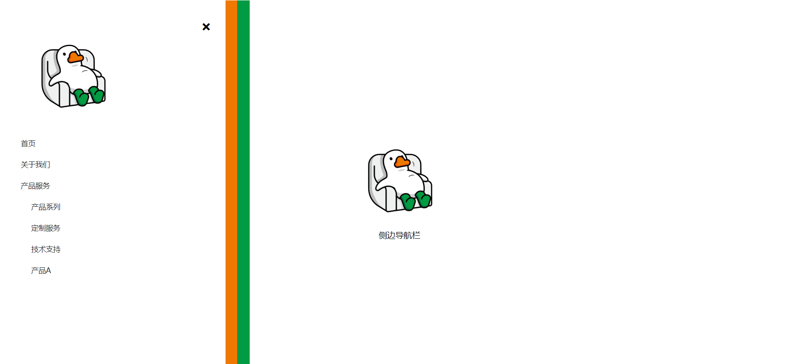

# 45-Mobile Navigation(侧边导航栏)

## 效果



## 代码

```html
<link
      rel="stylesheet"
      href="https://cdnjs.cloudflare.com/ajax/libs/font-awesome/5.14.0/css/all.min.css"
      integrity="sha512-1PKOgIY59xJ8Co8+NE6FZ+LOAZKjy+KY8iq0G4B3CyeY6wYHN3yt9PW0XpSriVlkMXe40PTKnXrLnZ9+fkDaog=="
      crossorigin="anonymous"
      />

<button class="nav-btn open-btn">
  <i class="fas fa-bars"></i>
</button>


<p class="text">侧边导航栏</p>

<div class="nav nav-black">
  <div class="nav nav-red">
    <div class="nav nav-white">
      <button class="nav-btn close-btn">
        <i class="fas fa-times"></i>
      </button>

      

      <ul class="list">
        <li><a href="#">首页</a></li>
        <li><a href="#">关于我们</a></li>
        <li><a href="#">产品服务</a></li>
        <li>
          <ul>
            <li><a href="#">产品系列</a></li>
            <li><a href="#">定制服务</a></li>
            <li><a href="#">技术支持</a></li>
            <li><a href="#">产品A</a></li>
          </ul>
        </li>
      </ul>
    </div>
  </div>
</div>
```

```css
* {
  margin: 0;
  padding: 0;
  box-sizing: border-box;
}

body {
  display: flex;
  flex-direction: column;
  align-items: center;
  justify-content: center;
  height: 100vh;
}

.logo {
  width: 200px;
}

.nav-btn {
  border: none;
  background-color: transparent;
  cursor: pointer;
  font-size: 20px;
}

.open-btn {
  position: fixed;
  top: 10px;
  left: 10px;
}

.nav {
  position: fixed;
  top: 0;
  left: 0;
  height: 100vh;
  transform: translateX(-100%);
  transition: transform 0.3s ease-in-out;
}

.nav.visible {
  transform: translateX(0);
}

.nav-black {
  background-color: rgb(0, 155, 66);
  width: 60%;
  max-width: 480px;
  min-width: 320px;
  transition-delay: 0.4s;
}

.nav-black.nav.visible {
  transition-delay: 0s;
}

.nav-red {
  background-color: rgb(239, 120, 0);
  width: 95%;
  transition-delay: 0.2s;
}

.nav-red.visible {
  transition-delay: 0.2s;
}

.nav-white {
  background-color: #fff;
  width: 95%;
  padding: 40px;
  position: relative;
  transition-delay: 0s;
}

.nav-white.visible {
  transition-delay: 0.4s;
}

.close-btn {
  opacity: 0.3s;
  position: absolute;
  top: 40px;
  right: 30px;
}

.list {
  list-style-type: none;
  padding: 0;
}

.list li {
  margin: 20px 0;
}

.list li a {
  color: rgb(34, 31, 31);
  font-size: 14px;
  text-decoration: none;
}

.list ul {
  list-style: none;
  padding-left: 20px;
}
```

```js
const open_btn = document.querySelector('.open-btn')
const close_btn = document.querySelector('.close-btn')
const nav = document.querySelectorAll('.nav')

open_btn.addEventListener('click', () => {
  nav.forEach((nav_el) => {
    nav_el.classList.add('visible')
  })
})

close_btn.addEventListener('click', () => {
  nav.forEach((nav_el) => {
    nav_el.classList.remove('visible')
  })
})
```

